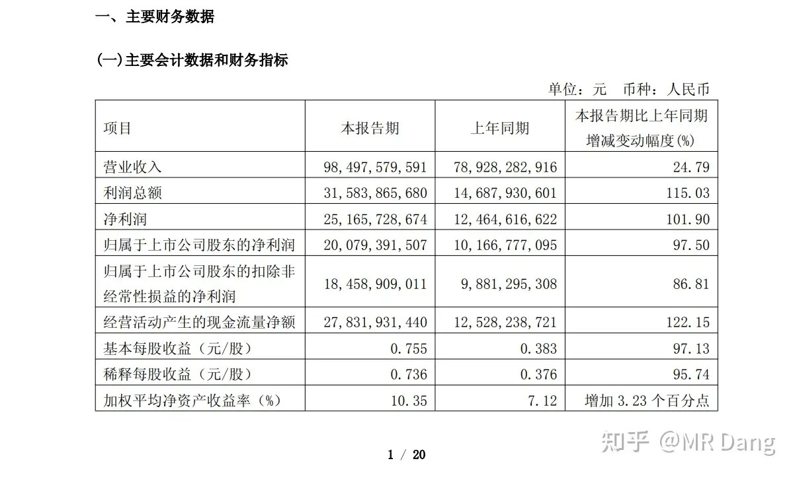
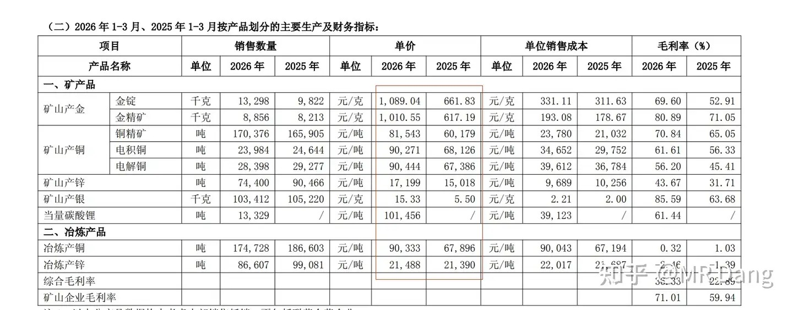
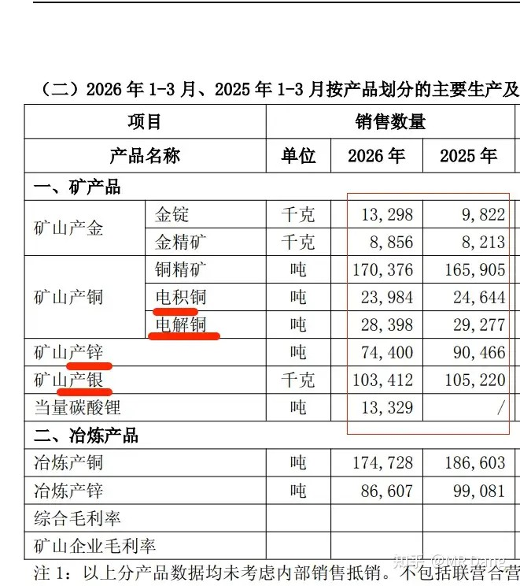
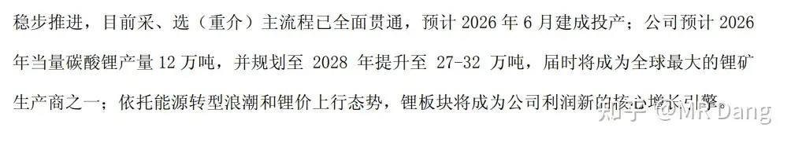
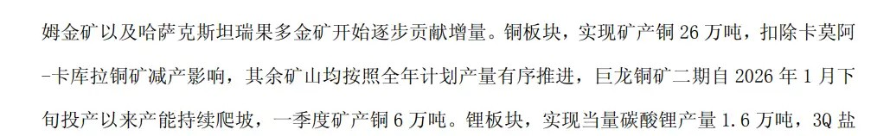
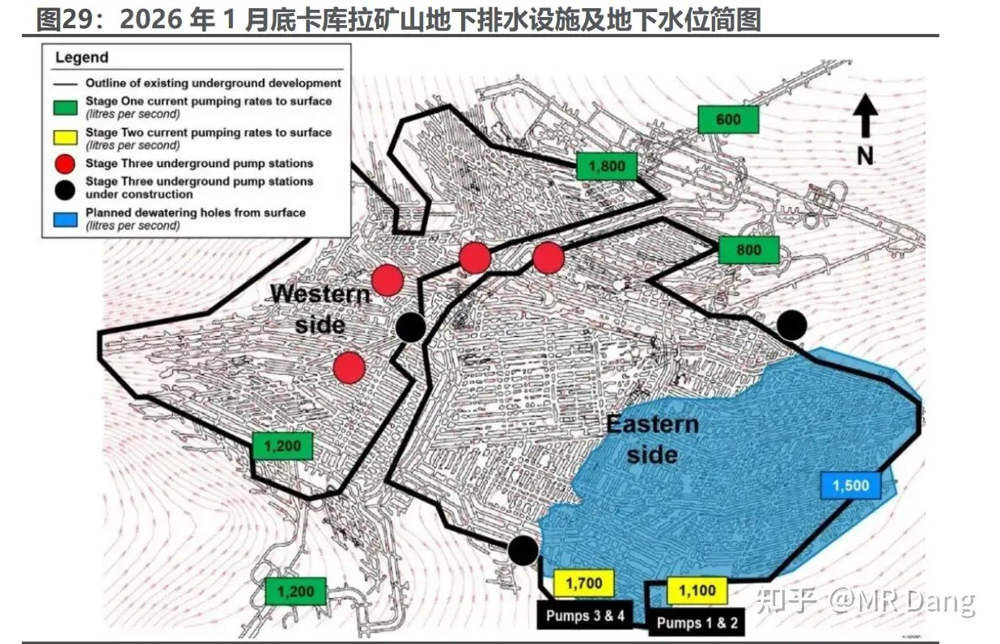
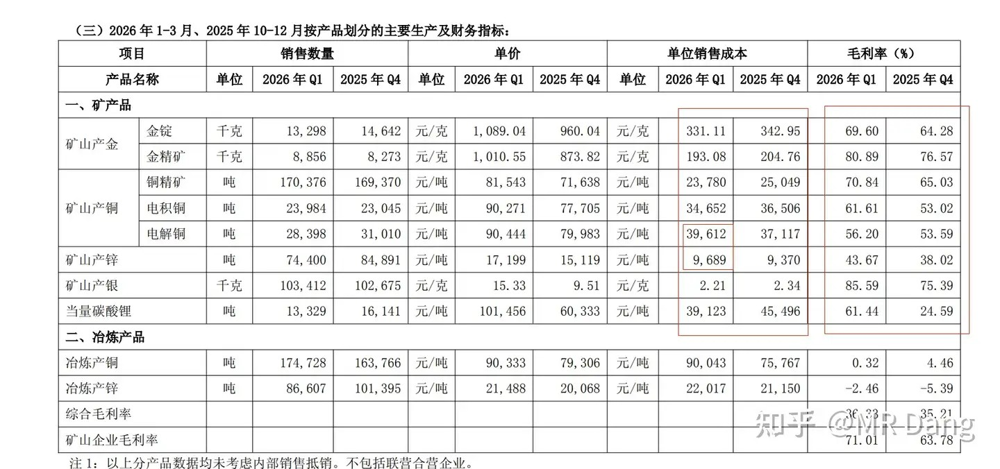
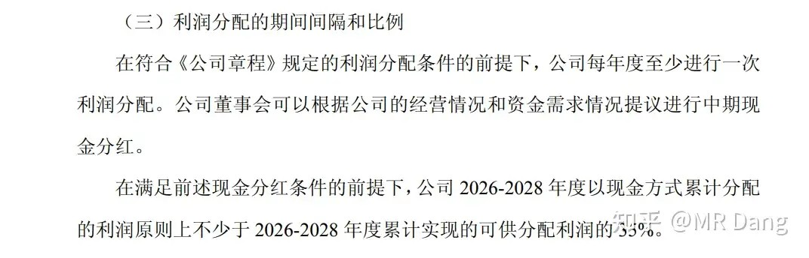

# 紫金矿业一季报实现净利润 200.79 亿元，同比大幅增长 97.50%，如何解读「矿茅」的Q1财报？

---

**发布时间**: 2026-04-22 19:14  |  **原文链接**: https://www.zhihu.com/question/2030336920857702845/answer/2030363778353738789  |  **点赞数**: 358 人赞同

**作者信息**: MR Dang​​​知势榜经济与管理领域影响力榜答主

---

## 正文内容

今日加更一条知乎专属，圆桌内容欠了好几条了，得补补了。

紫金算是一家大开门的公司，虽然财报昨天就发了，虽然今天也跌了，但是依然阻挡不了我对他的喜爱。

第一页的财务数据就令人产生愉悦的感觉，哪里愉悦了？

足足20页的一季报！！！

一般上市公司的一季报大家可以去翻阅一下，超过20页的不多，一般都是敷衍了事，认真披露的公司数量并不多。

回到财报数据，再吸一口凉气：

归母净利润200亿！！

这可是一季报，区区90天，200亿，算下来一天两亿多，一小时接近1000万，一分钟16万，一秒钟超过2500，你读完这句话的时候，1万到手了。

就是这么夸张的印钞速度。

而且他这个净利润不是什么高明的财务技巧，就是单纯的力大砖飞，靠现金堆出来的。

2025年一季报归母净利润101亿，经营性净现流125亿，基本上是归母净利润的额1.25倍。

到了2026年一季报，归母净利润200亿，经营性净现流278亿，这一比值来到了1.39倍。

很离谱的数据了。

凭什么呢？

一言以蔽之，天时+地利+人和！

天时：有色价格同比上涨

所有的产品，是所有，价格都在上涨。

从边际变化来看，黄金贡献的边际变量是最大的，毛利占比也是最高的，所以现在紫金的金属性暂时的超过了铜属性。

地利：有色产量继续爬坡

除了铜，锌，银销量有小幅回落，金和锂都有大幅度提升。

金自不必多说，是紫金矿业目前的边际改善最大来源。

锂的规划也是非常有胆魄。

今年直接就是12万吨，大概是半个锂企龙头的量，到了2028年，直接跻身全球最大之一。

这可是从0做起来的，相当于通过内生增长，直接孵化出一个锂企巨头，了不起。

好的说完了，那为什么重要的铜销量下滑了呢？

主要还是出在卡莫阿-卡库拉铜矿减产了：

这个矿主要受积水影响，客观条件限制。

但是有研究认为目前的水位图相对乐观，影响可控，也许后期可以超预期贯通：

至于银的话，就更简单了，银是铜的伴生矿，铜产量降低，自然会制约银的产量。

但是总体上，除了金锂外的其他矿种都可以基本保持以前的水平，金和锂就是未来的增量所在。

人和：管理在线

很多投资者觉得管理水平是一个比较难以量化的指标，所以遇到需要比较管理水平的时候，往往很难直观感受。

我个人觉得，作为股东，我看管理层主要看两点：

1.成本管控如何？

2.分给股东多少？

对，就是这么现实，管理层给股东省钱，股东就承认你优秀。

管理层给股东钱多，股东自然替你辩解。

那紫金的成本管控如何呢？

看环比的话，几乎所有矿产的单位销售成本环比都在降低！！

售价都在涨，而成本在往下降。

这。。。你受得了么？

唯二成本没降低的产品我圈出来了。

这么一来，造成的结果就是所有产品的毛利率都在提高。

数据摆在这里了，管理水平如何，需要多言么？

那赚了这么多，打算分给股东多少呢？

说的很直白，未来三年，不少于35%。

没有玩什么年均可实现净利润的文字游戏。

800*0.35=280亿

现在算下来股息率接近3%了，算不上特别有吸引力，但是已经不能算鸡肋那一档了。

可以看出来，以后随着发展到成熟期，也许增速不再凌厉，不过现金回报反而会增加。

作为股东，担心的不就是公司挣不了钱，或者挣了钱不愿和股东分享成果么？

这样的管理层，既有远期发展规划，又有近期股东回报，不能要求再多了。

最后说回股票。

我经常挂在嘴边的一句话是模糊的正确远胜精准的错误。

在这里我觉得紫金就是所谓的模糊的正确。

资本市场表现受多种因素影响，未来一定还有反复，股价还有波动。

但是随着时间的延长，价值的回归，企业的发展，紫金一定不会止步于此。

它配得上更高的舞台。

所有认真经营，科学经营，愿意和股东分享胜利果实的企业，都值得投资者更认真的剖析！

> [!comment]- 点击展开评论
>
> | 用户 | 时间 | 内容 |
> | :--- | :--- | :--- |
> | 南圭 | 4 小时前 | 管理水平比某锡高出好几层楼了 |
> | 烫烫烫烫 | 4 小时前 | 架不住挖矿行业没想象力pe低，今天还绿了呢 |
> | momo | 4 小时前 | 紫金现在散户数量第一，哪天要是涨起来了，也算是实现共同富裕了 |
> | &nbsp;&nbsp;&nbsp;&nbsp;Aecced | 3 小时前 | 散户只是钱少，不是傻福 |
> | &nbsp;&nbsp;&nbsp;&nbsp;青亭岛伯爵 | 3 小时前 | 紫金股价至少得把股东数的零头给洗掉才会拉，机构不是来做慈善的 |
> | &nbsp;&nbsp;&nbsp;&nbsp;灌汤包 | 2 小时前 | 机构不是来做慈善的，会一直磨到散户受不了的 |
> | &nbsp;&nbsp;&nbsp;&nbsp;Aecced | 2 小时前 | 紫金有港股，外资可不会管那么多。价值总会回归，可能迟到但不会缺席 |
> | &nbsp;&nbsp;&nbsp;&nbsp;远行 | 1 小时前 | 对，有的磨了。我埋伏过业绩好的股，明牌不好打，机构时间，资金。耐心，不是我们能抗衡的，真的磨你崩溃。好比现在的cpo，一直涨，一群散户在老登股里等拉升，极限拉扯。 |
> | 候风海 | 4 小时前 | 今天梭紫金，下周一梭绿桥，我们都有光明的未来 |
> | &nbsp;&nbsp;&nbsp;&nbsp;Sprite | 2 小时前 | 哈哈 |
> | 耨镈柢 | 3 小时前 | 周期股，说变就变。赣锋锂业前车之鉴。 |
> | 可会至道 | 4 小时前 | 自从加入小红圈，好久没刷Dang的知乎动态，没想到今天一刷就有知乎专属 |
> | Expanda | 4 小时前 | 比某些稀有金属管理层高了好几个level！！！另外我发了个龙虾版本的年报分析，大佬方便移步帮忙指导下问题么，在我主页唯一的一篇文章 |
> | &nbsp;&nbsp;&nbsp;&nbsp;拉不拉猪 | 3 小时前 | 管理层虽不给力，但是不妨碍我们在他们家吃肉你就说这两周开不开心吧 |
> | &nbsp;&nbsp;&nbsp;&nbsp;Expanda | 1 小时前 | 天天吃饭骂厨子 这样不好对吧 |
> | 共你历年寻新诗 | 2 小时前 | Lbx盗刷被查了，前段时间也有dsl个别店被处罚，药店这块是不是很难起来了，即使是创新药，未来更规范的医保政策和电商买药都会冲击实体药房吧🤔 |
> | 毛毛 | 4 小时前 | 确实，基本相当于茅台这种现金奶牛了 |
> | 乐妈 | 3 小时前 | 点赞点赞 |

---

*本文件从MR Dang知乎页面转载*

---

**作者**: MR Dang
**链接**: https://www.zhihu.com/question/2030336920857702845/answer/2030363778353738789
**来源**: 知乎

*著作权归作者所有。商业转载请联系作者获得授权，非商业转载请注明出处。*
