# 如何分步骤快速看懂上市公司年报？

---

**发布时间**: 2026-04-04 08:06  |  **原文链接**: https://www.zhihu.com/question/381804940/answer/2023672802448778282  |  **点赞数**: 551 人赞同

**作者信息**: MR Dang​​独立投资人，小红圈同名，无其他小号。

---

## 正文内容

受官方邀请参加此次圆桌活动，非常惊喜，我也是可以自称大V的博主了。

在众多议题里选了这个我觉得有点小心得的问题，也算是为社区建设增砖添瓦吧。

在写小心得前，还是重复我对年报的看法：

看年报不可不会，但是不可全信。

年报是用来排除错误选项的，而不是用来确认正确答案的。

不要对看年报这一技能有过高的预期，也不要有太深的滤镜，他只是投资的一项技能，仅此而已。

好了，言归正传，对于普通投资者来说，如何分步骤快速读懂年报呢，大体分这么几步：

一，找到正规年报网站。

可不要小瞧了这一步，想要获得准确可靠的财务公告，需要一家正规的年报网站。

因为这是投资决策的基础，权威性必须拉满，在这里我个人推荐巨潮资讯网：

巨潮资讯网点这里

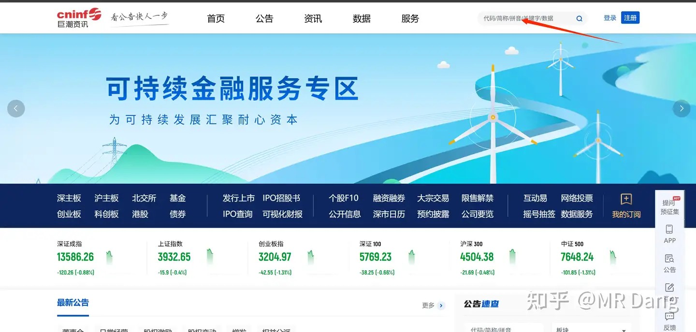

找到以后在搜索栏里输入需要查询的股票，以某散户大本营的有色企业为例：

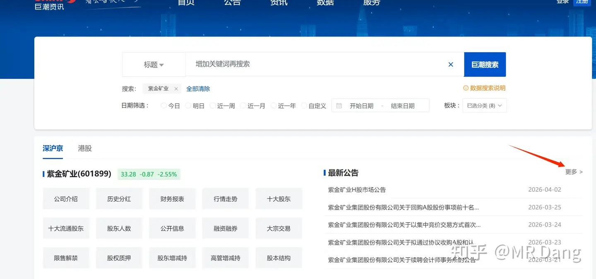

找到相应位置，点击箭头指向的“更多”

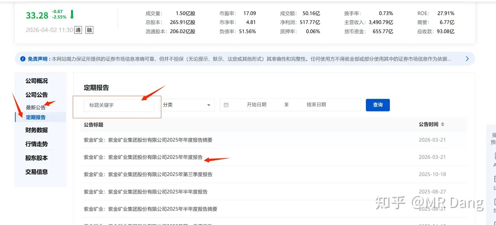

这个页面的话，左侧的最新公告和定期报告可以来回切换。

如果找年报或者季报什么的，就点击定期报告，更容易找到。

年报指的是《年度报告》，所以不要去找那个摘要。

还有一个很好用的功能，就是红色框框的搜索栏。

如果你想找个特定事件，比如可转债，定向增发之类的，输入关键字眼即可，然后海量的公告就被筛选出了有用的信息。

到这一步为止，恭喜你找到了正规权威的年报，可以开始阅读了。

二.年报的结构：

年报的目录长这样：

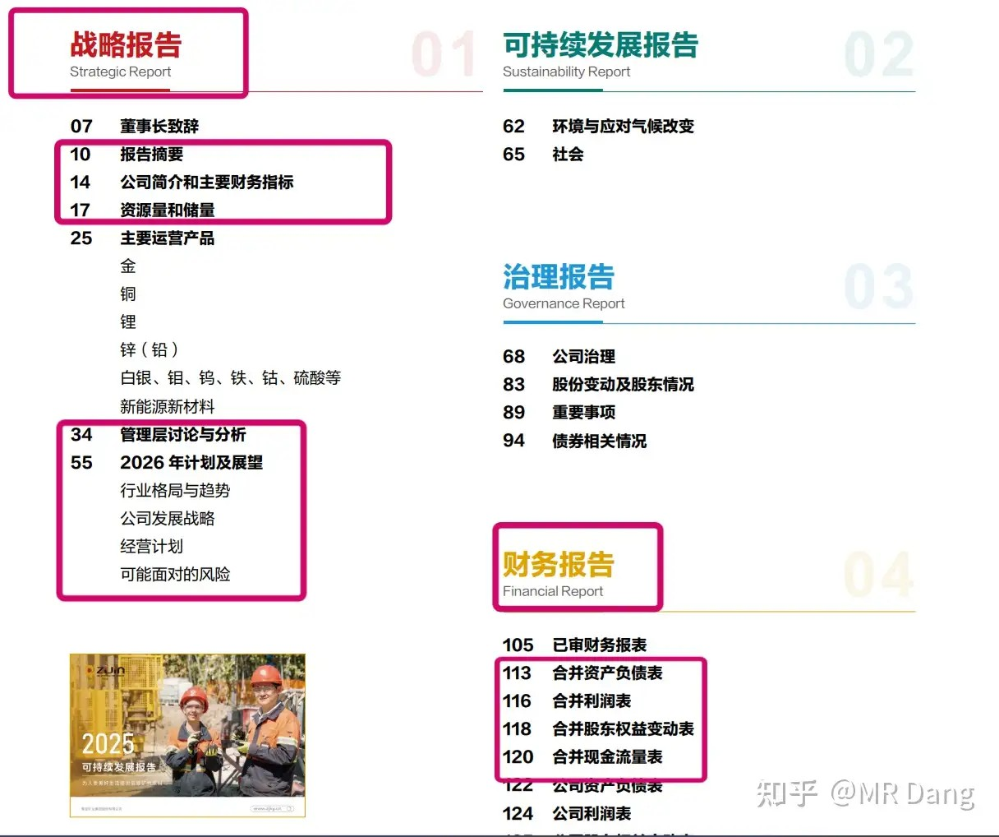

一份年报350多页，想要快速过一遍，不可能一个字一个字的看，所以就需要熟悉年报的结构，迅速地找到信息密度大的部分。

总共350多页，前面130页相对来说，信息密度要比后面220多页要大，也更重要。

后面220多页是财务附注，主要的作用是让你用来检索查询具体情况的。

比如你对某公司的固定资产折旧感兴趣，想知道它的固定资产是怎么折旧的，折旧年限是多少，残值率多少。

那你就可以使用搜索，或者查看内容，在年报里搜关键词“固定资产”，一个一个往后翻，最后就会在后面的200多页中找到你需要的信息。

所以这200多页，不是那么重要，不需要齐齐看一遍，只用挑选重要的部分，比如营业收入，资产减值，投资收益，其他综合收益这些科目，看对投资影响最直接的部分。

对于新手来说，不看也不是不行，新手可能也看不懂。

那哪些部分是重点呢？是必须要看的部分呢？

我把最重要的部分在目录里圈出来了，简单地说就是第一部分的战略报告和第四部分的财务报告。

三，怎么看战略报告？

首先致辞什么的，可以略过，一般都是些场面话。

1.摘要是精华，必看！！！

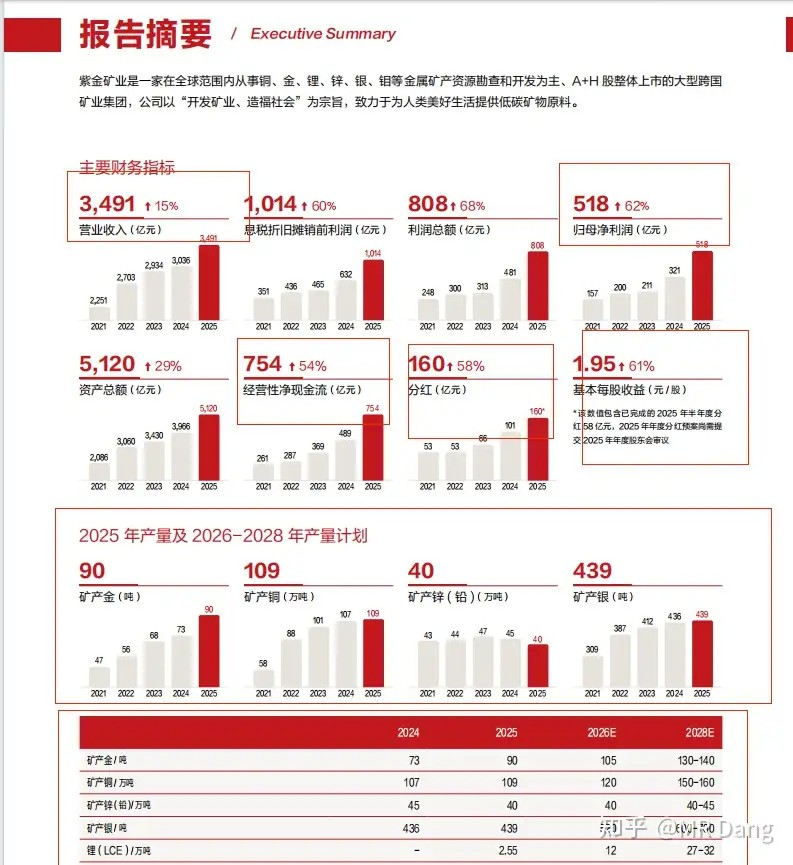

整个第10页都是重点，圈起来的是重点中的重点。

2.再往下就是公司简介，跳过，然后到第15页财务指标：

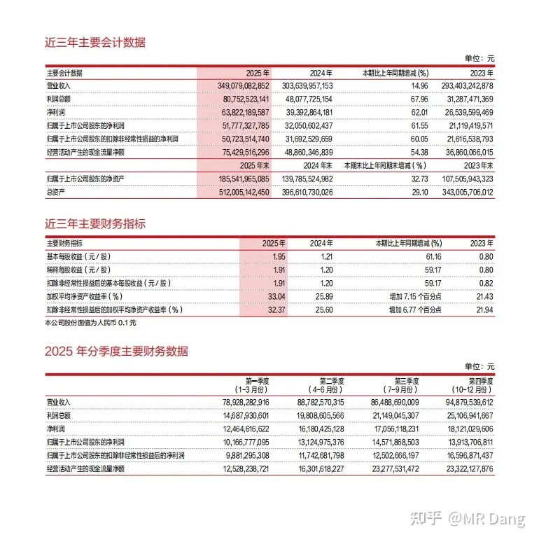

数字会比较乱，普通投资者的话，看个增速，再重点看个第四季度就行了。

因为前三季度是明牌，出年报前的价格已经PRICE IN，所以为了短期投资考虑的话，重点看下第四季度。

长期价值投资的话，那就不能偷懒，每个数字都要抠。

3.资源量和储量，对有色企业来说十分重要的一个指标：

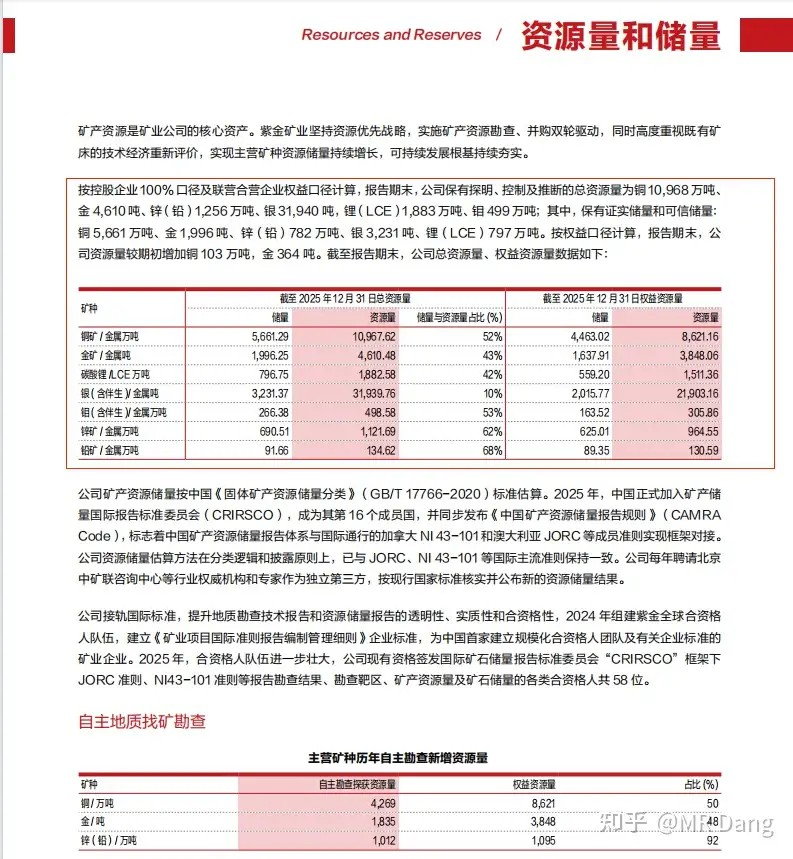

找到了以后怎么用呢？

如何知道数据好还是不好呢？

其实所谓的好或者不好，要和其他企业进行横向对比，只看一份年报是看不出来的，所以这些数据可以摘抄下来，留待后用。

4.直接跳过一些场面话，到43页的经营情况：

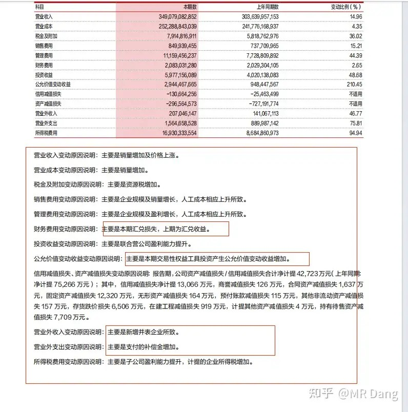

这一页里很多数据前面也披露过了，所以主要是盯着表格下面变动大的报表科目里一些非常规的变化，我圈起来了。

其他公司也是类似，这里一定一定要仔细看，非常重要！！！

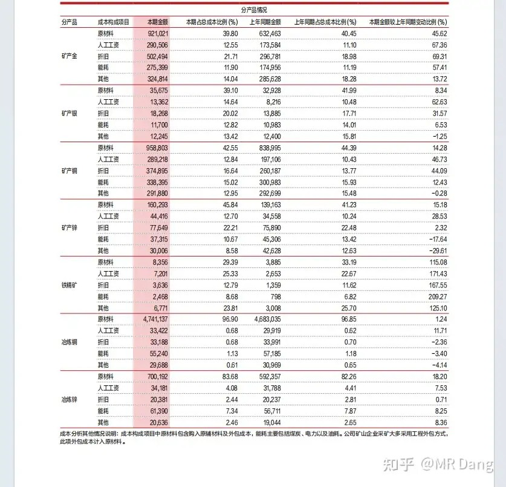

46也还有个成本分析，这个和前面的一样，不是单独看的，要和其他企业横向对比。

5.直接跳到57页，看经营计划

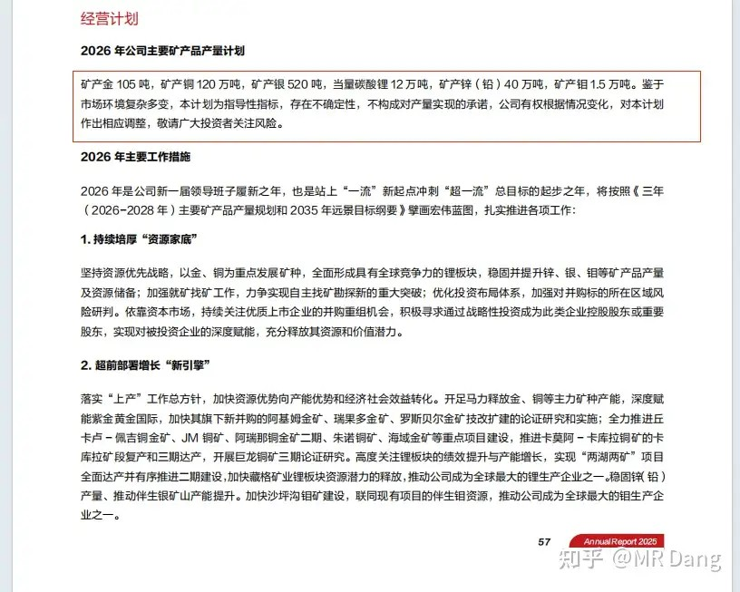

场面话直接跳过，看数字就行，和2025年的对比，就知道大概的增长情况了。

看到这里，最重要的战略报告就看完了，大体上知道了营收，净利润，成本结构，这是过去发生的事情。

另外还知道了经营计划，这是对未来的预期。

四，怎么看财务报告？

看完57页，跳过中间的内容，直接到109页看一眼审计报告：

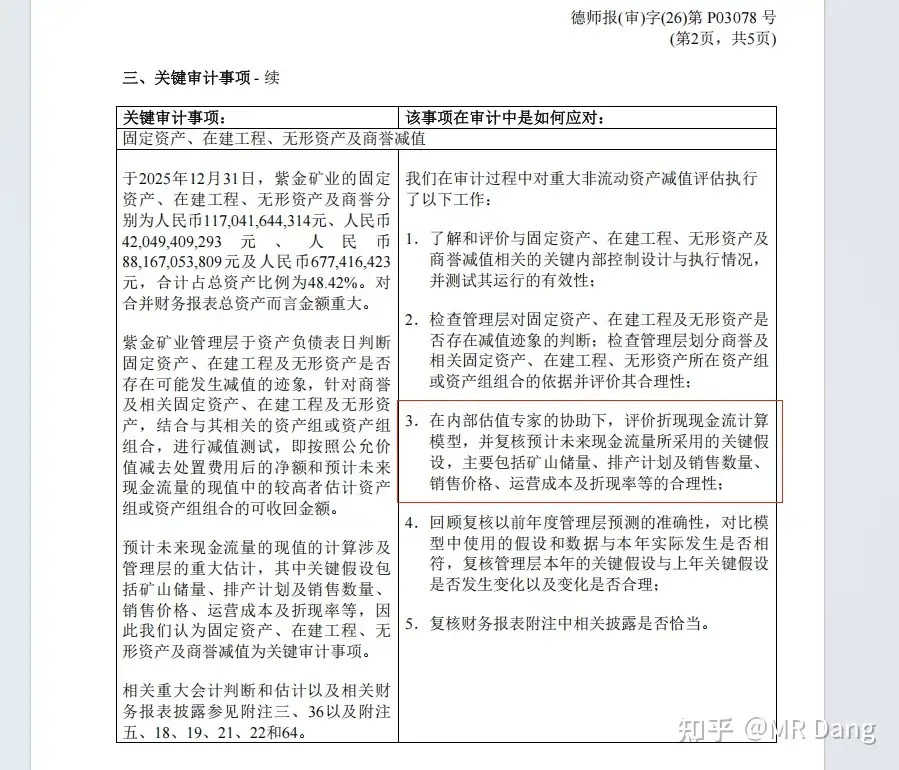

审计报告看什么呢？看关键审计事项。

看公司用的什么模型，用的什么参数。

这相当于手把手教你如何估值，是很有用的数据。

然后就可以看三大表了，利润表，资产负债表，现金流量表。

注意，这三大表，一定要看合并的，不要看公司的，没用。

首先出场的是资产负债表：

资产负债表的底层逻辑是 资产=负债+权益（净资产）

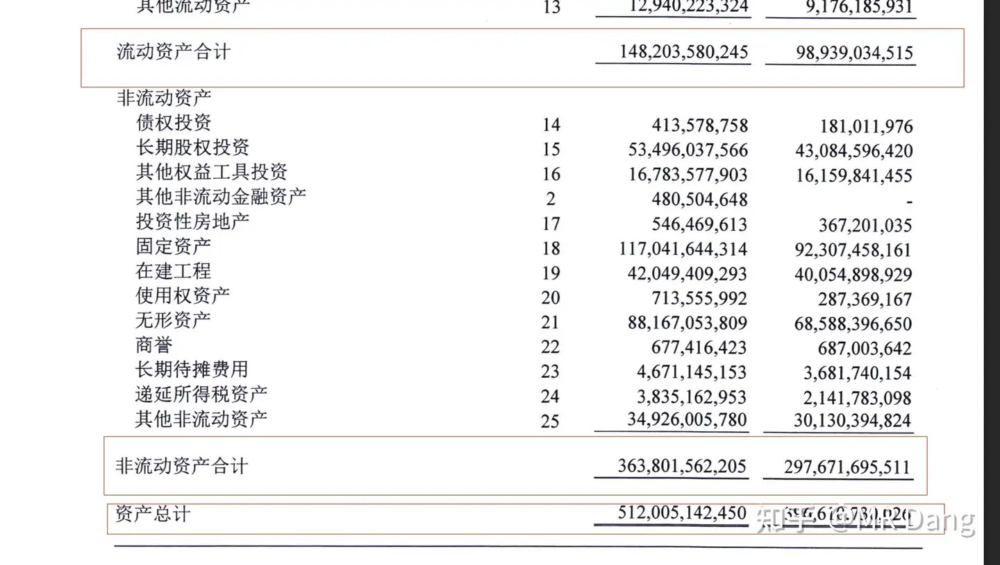

这个页面讲的是资产，把资产分成流动资产和非流动资产两类，加起来就是公司的全部家当。

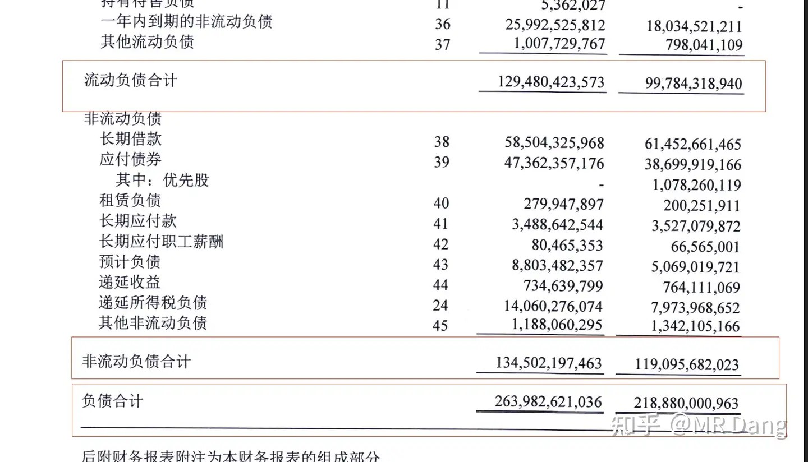

同理，这个页面讲的是负债，也是分成两类。

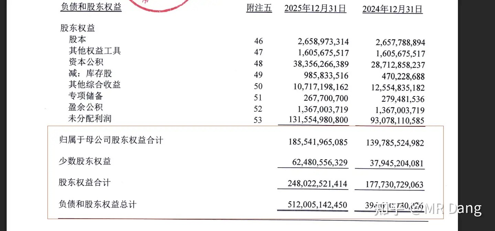

最后这个页面讲的是权益，权益这个词不太好理解，理解成净资产就就简单多了。

他们之间的关系永远是资产=负债+权益，这个也叫会计的基本恒等式。

权益类里有一个科目比较重要，这个科目叫其他综合收益。

它的特殊性在哪里呢？

本来可以计入利润表的东西，经过某些合理的分类和会计处理，是可以计入其他综合收益的。

也就是说，本来亏了/赚了，但是我不想把利润表搞的太显眼，让市场反应太激烈。

在满足某些分类前提的情况下，可以直接计入其他综合收益。

所以想要知道真实的经营情况，可以结合这个科目去看。

比如之前提到的套保，不是这家公司哈，是别的公司，亏了以后直接从这个科目里扣钱。

像小狗一样，拉了一坨，感觉不雅观，赶紧找个土坑把拉的便便藏起来。

这个土坑就叫“其他综合收益”。

第二个出场的是利润表：

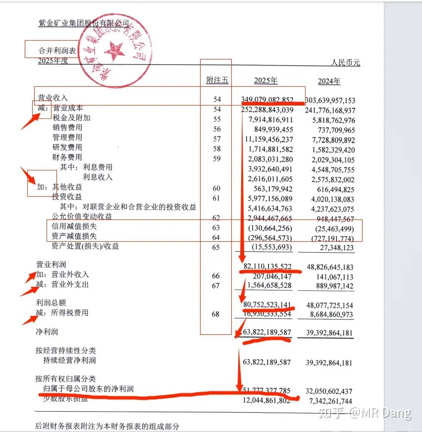

利润表是有逻辑的，整张表其实就讲了一件事：

从最上面的3490亿营业收入是如何算出来最后的517亿的净利润的。

什么逻辑呢？

第一步：3490亿营业收入→821亿营业利润。中间哪些前面写着减的，就代表用减法，写着加的，就代表用加法，整个表都是如此，下面就不重复了。

第二步：821亿营业利润→807亿利润总额

第三步：807亿利润总额→638亿净利润

第四步：638亿净利润→517亿归母净利润

有了整体的逻辑之后，就要看具体的数字了：

比如聪明的你发现信用减值损失和资产减值损失变化特别大，想搞清楚原因，它后面是不是有个附注？

你去找相应的附注：附注五-63和附注五-64

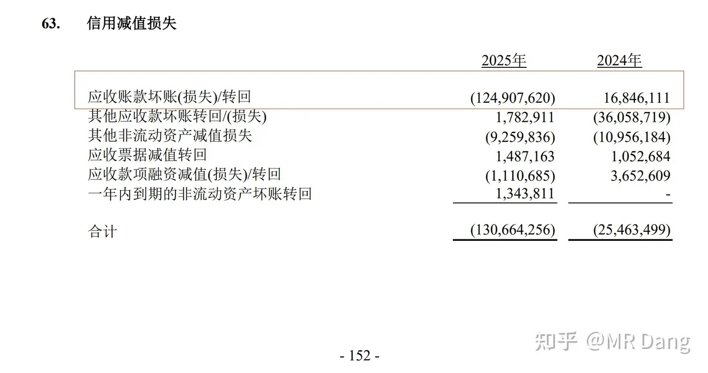

找到后一对比，发现是应收账款这里出问题了，计提了1.2个小目标.

当然你要是对这个应收账款有兴趣，可以在年报里搜索“应收账款”几个字，找到具体的问题所在。

最后出场的是现金流量表：

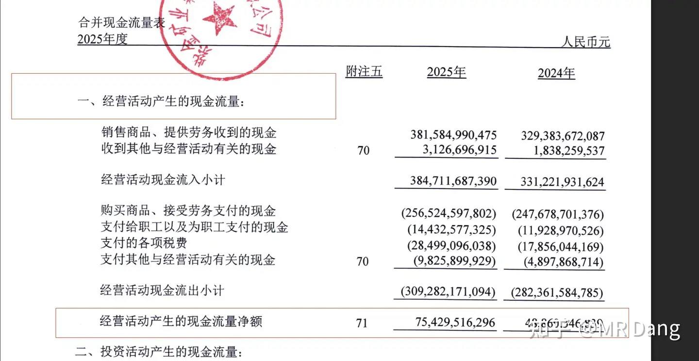

现金流量表分三部分，一个叫经营活动，一个叫投资活动，一个叫筹资活动。

可以简单的理解成，赚的钱，花的钱和借的钱。

三个加起来就是手里的钱的总体变化。

作为新手，就看下面那个“经营活动产的现金流量净额”。

完全够用的，不需要那么多花里胡哨，这一个数据占整个现金流量表的权重90%都不夸张。

最后还是那句话，年报是用来做排除法的，不是用来做确定的。

投资的本质还是商业模式，是生意，是公司，而不是财务数据。

年报需要看，但不能迷信。

一个喜欢保护韭菜的博主，希望大家少少踩坑，多多赚钱！！！

> [!comment]- 点击展开评论
>
> | 用户 | 时间 | 内容 |
> | :--- | :--- | :--- |
> | 九鼎记 | 6 小时前 | 支持，年报只是排雷器。年报反映的是过去一年的经营成果，而股票市场的定价永远是向前看的。一份漂亮的年报公布时，市场的预期往往早已在股价中兑现（即所谓的“利好出尽”）。过去的辉煌不能自动推导未来的高增长。 |
> | vamonos | 5 小时前 | 学习了，谢谢 |
> | Luo卜 | 6 小时前 | 我加圈了，这竟然是免费就能看到的 |
> | &nbsp;&nbsp;&nbsp;&nbsp;MR Dang | 6 小时前 | 这明显是阉割版的啊 |
> | &nbsp;&nbsp;&nbsp;&nbsp;苏志燮 | 4 小时前 | 核心还是干货部分 |
> | &nbsp;&nbsp;&nbsp;&nbsp;HAOzj | 2 小时前 | 打开知乎发现怎么也有更新，扫一眼后奇怪怎么少了 超市举例少数股东权益的部分，原来是阉割版～ |
> | 青峰 | 31 分钟前 | 手上的票年财报都是增长的，不影响下跌， |
> | 大橘为重 | 1 小时前 | 感谢 |
> | 如来熊掌 | 50 分钟前 | ，知乎粉丝这次吃的真好，不过记得存下来。 |
> | 僭主即是罪恶 | 2 小时前 | 看得我头都晕了，还是等D大研究好把结果喂给我。 |
> | S·沉冰 | 3 小时前 | 给圈外的兄弟萌通个风，这篇就是地阶10。什么你问地阶9？还没写出来，圈里也没有 |
> | &nbsp;&nbsp;&nbsp;&nbsp;资本主义必将消亡 | 2 小时前 | 哈哈 说地阶9是给大宗商品留的，还没写呢 |

---

*本文件从MR Dang知乎页面转载*

---

**作者**: MR Dang
**链接**: https://www.zhihu.com/question/381804940/answer/2023672802448778282
**来源**: 知乎

*著作权归作者所有。商业转载请联系作者获得授权，非商业转载请注明出处。*

---

## 相关阅读

**📘 财报入门与公告解读：**
- [[20260401-读懂财报，看清基本面|读懂财报]] - 先建立整体框架，再回来看这篇拆解会更顺手。
- [[20260102-如何看待盐湖股份2025年业绩预报？以此为例，我们该如何分析上市公司公告？|公告解读范例]] - 从业绩预告切入，练习抓重点和核对口径。
- [[20251024-怎么全面的分析一支股票？|系统分析框架]] - 把财报放回行业、商业模式和竞争格局里看。
- [[20251026-如何对企业进行估值？|估值入门]] - 财报读完之后，下一步就是估值与定价。

**📊 关键指标拆解：**
- [[20251124-《地阶功法卷六》每股收益知多少|每股收益]] - 进一步理解利润口径与 EPS 的含义。
- [[20251207-《地阶功法卷七》分红的可持续性与净利润的关系|分红持续性]] - 用现金流和净利润的匹配度判断分红质量。
- [[20251031-你是怎么计算股息率的？ 关注股息率的哪些点？|股息率计算]] - 把利润、分红和收益率串起来看。
- [[20251118-新手投资者避坑指南之分红和除权|分红避坑]] - 避开只看分红数字、不看实际收益的常见误区。

**🧠 投资方法与心态：**
- [[20251020-交易策略只是第一步，重要的是仓位管理？如何科学设置仓位？|仓位管理]] - 再好的分析，也需要仓位和风险控制配合。
- [[20251013-什么是投资思维？普通散户该如何培养？|投资思维]] - 建立比“会看报表”更重要的决策框架。
- [[20251103-高学历的人炒股，痛苦的根源是什么？|认知误区]] - 提醒自己别把信息密度误当成确定性。
