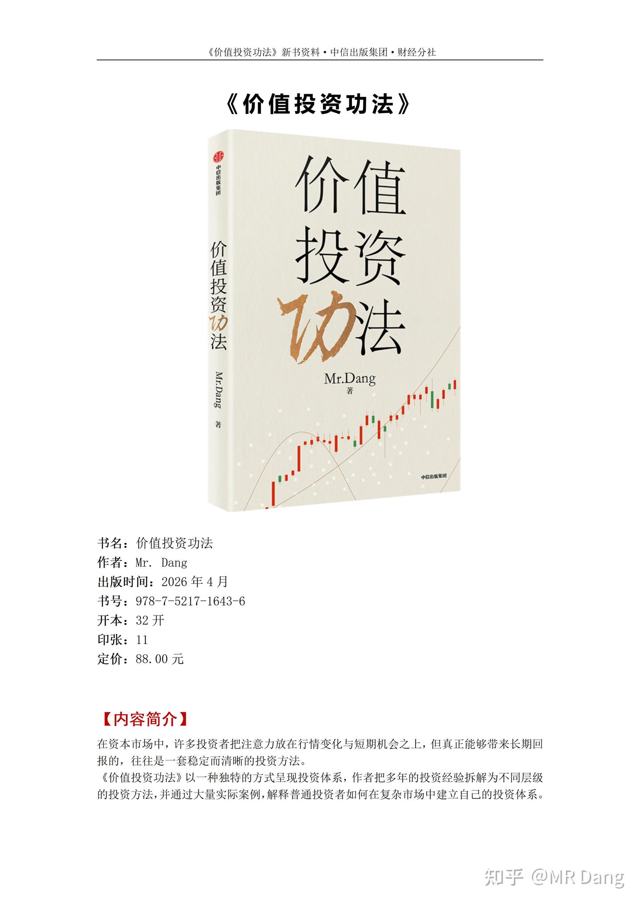
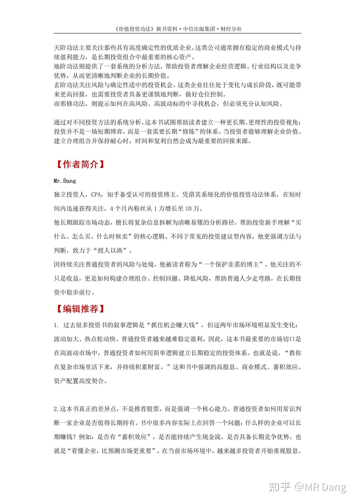
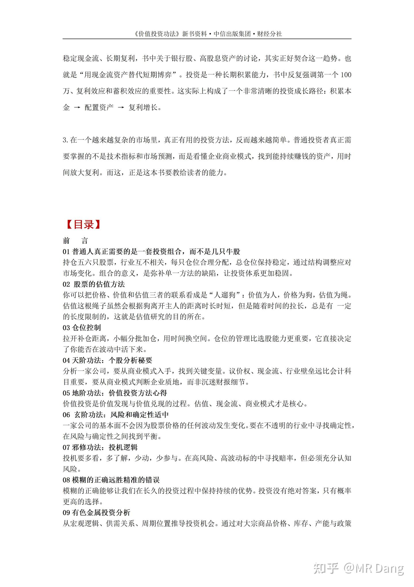
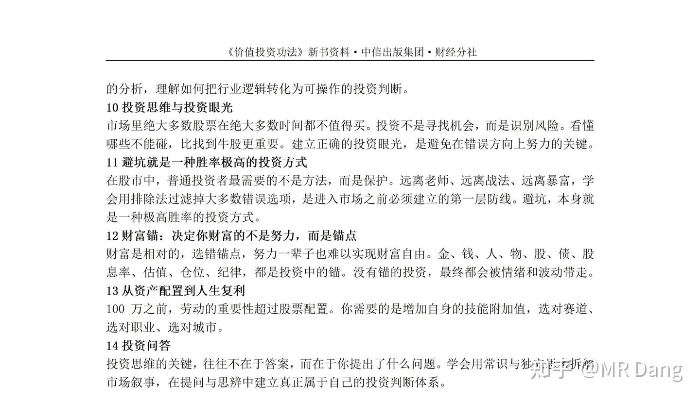
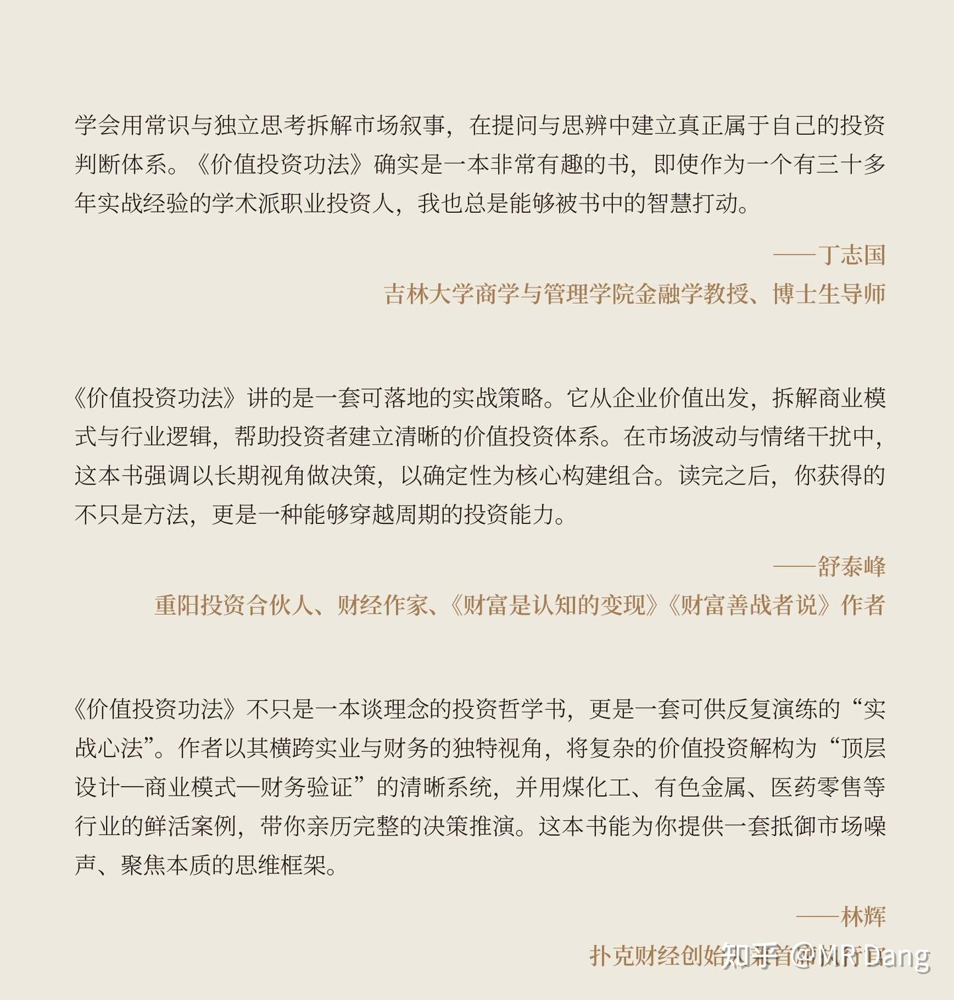

# 置顶《价值投资功法》新书简介&自荐书

---

**发布时间**: 2026-04-08 15:00  |  **原文链接**: https://zhuanlan.zhihu.com/p/2024924990450021290  |  **点赞数**: 474 人赞同

**作者信息**: MR Dang​​​知势榜经济与管理领域影响力榜答主

---

## 正文内容

今天终于到了新书的预售环节，书名《价值投资功法》，简单粗暴，包含了天地玄邪的大部分重要内容以及日报和周末闲聊里的精华部分，另有少量增补和工具类的补充。

新书简介的官方版本如下：

书的封底长这样：

定价88元/本

新书预售期间有折扣，目前到手大概是60元左右。

很多读者已经在各大平台自行购买，在此感谢诸位的大力支持。

还没购买的读者，这里有一封自荐书，以示诚意。

诸君子台鉴：

盖闻市道沉浮，如江海翻澜，逐利者熙熙，而持恒者寥寥；

投机之术纷若春草，而价值之道晦若晨星。

余半生戮力于投资之域，亲历数轮牛熊更迭，遍览中外前贤典要，遍尝市场冷暖甘苦。终悟得：投资之胜，非胜在朝夕之巧，而胜在长远之道；非胜在逐浪之勇，而胜在守心之定。

遂倾毕生所践、所悟、所证，删繁就简，凝为一帙，名曰《价值投资功法》。

世之论投资者，多以奇技淫巧为能，以追涨杀跌为勇，犹习武者徒求招式之花哨，而废内功之根本，一遇风浪，便溃不成军。

此书所谓“功法”者，非旁门左道之秘术，非哗众取宠之空谈，乃价值投资之正宗心法、可践之行也。

上溯本源，明企业价值之核心内核；中立法度，立估值研判之准绳规矩；下修心性，破贪婪恐惧之迷障执念。

层层递进，内外兼修，既授以可落地之技法，亦传以可安身之大道，不为一时涨跌所惑，而为终身复利筑基。

诸君若得此书，大可于晴窗净几之侧，煮泉烹茗，焚香展卷。

捧此帙于掌心，启卷帙于指尖，茶烟袅袅，墨香盈盈，目游字句之间，便如与笔者对坐，与同道晤言。

不必劳神于K线之纷纭扰攘，不必惶惑于消息之杂乱喧嚣，一卷在手，便可澄心定虑，明辨市场之真伪，洞见投资之本质。

此开卷之一益也：定心。

或遇夜雨连窗，尘嚣俱寂，一灯如豆，半盏清茶，重读此篇。于牛熊轮回之中，见不变之正道；于市场狂热之内，守清醒之本心；于众人恐慌之际，持坚定之定力。

开卷之益，不止于习得投资之技法，更在于修得处世之格局。

此开卷之二益也：明智。

即便是案牍劳形之余，通勤舟车之暇，随手展读，片言解疑，只语破局，扫去心中之惑，厘清前行之路。此书虽薄，而意理甚深；字句虽简，而践履甚笃。

捧于手心，便如持投资之罗盘，行于江海而不迷方向；藏于案头，便如得良师之相伴，临于变局而不慌方寸。

此开卷之三益也：行远。

余作此书，非为沽名钓誉，乃愿以半生心血所悟，与天下同道者共勉。

深知投资之路，孤行则易迷，结伴则行远。

此书今日预售，愿以此一帙，奉于诸君案前。

愿得此书者，皆能悟价值之真谛，修投资之真功，于波谲云诡之市场，行稳致远，终有所成。

区区寸心，尽在卷中。

谨此自荐，伏惟垂鉴。

最后321，上链接！：

希望这本书可以帮助到更多的读者，也希望大家可以给身边的对资本市场感兴趣的亲朋好友安利一番，壮大价值投资的队伍！

> [!comment]- 点击展开评论
>
> | 用户 | 时间 | 内容 |
> | :--- | :--- | :--- |
> | 奶片 |  | 是时候出现一下 |
> | &nbsp;&nbsp;&nbsp;&nbsp;MR Dang |  | 感谢支持 |
> | 王子晋 |  | 我刚才去pdd买到了低估版本 |
> | 矿泉胡桃 |  | 太幸运了能在知乎认识Mr Dang老师，这本书一定完全认真学习消化 |
> | &nbsp;&nbsp;&nbsp;&nbsp;MR Dang |  | 感谢老粉支持 |
> | 莫碧蓉 |  | 去拼多多抄底了 |
> | 我是一只猫 |  | 无敌了 |
> | 知了也睡了 |  | 第二 |
> | 知了也睡了 |  | 我在他这就从来没抢到板凳过 第一次 |
> | MR Sun |  | 预售日期是怎么判断的 |
> | &nbsp;&nbsp;&nbsp;&nbsp;MR Dang |  | 凑巧 |
> | keith |  | 已下单但更期待电子版 |
> | 化石的岁月 |  | 小入两手，建立个底仓，随后得重仓持有。简直是日常伴手礼的首选呀。 |
> | &nbsp;&nbsp;&nbsp;&nbsp;知乎用户wc8w5 | 20 小时前 | 能升值啊 那我是不是买少了 |

---

*本文件从MR Dang知乎页面转载*

---

**作者**: MR Dang
**链接**: https://zhuanlan.zhihu.com/p/2024924990450021290
**来源**: 知乎

*著作权归作者所有。商业转载请联系作者获得授权，非商业转载请注明出处。*

---

## 相关阅读

**📘 方法论入门：**
- [[20260306-小红圈说明书|小红圈说明书]] - 先了解圈内内容结构，再决定怎么配合阅读。
- [[20260404-如何分步骤快速看懂上市公司年报？|看懂年报]] - 从财报阅读开始打基础，和“功法”主线很契合。
- [[20260401-读懂财报，看清基本面|读懂财报]] - 把报表、基本面和投资判断串起来。
- [[20251024-怎么全面的分析一支股票？|系统分析框架]] - 从行业、公司到财报的完整分析路径。
- [[20251026-如何对企业进行估值？|估值入门]] - 读懂公司之后，下一步就是定价与估值。
- [[20251020-交易策略只是第一步，重要的是仓位管理？如何科学设置仓位？|仓位管理]] - 方法之外，还要有仓位和风险控制。
- [[20251013-什么是投资思维？普通散户该如何培养？|投资思维]] - 把技巧沉淀成长期可复用的框架。

**📚 功法延伸：**
- [[20251124-《地阶功法卷六》每股收益知多少|每股收益]] - 从利润口径切入理解企业质量。
- [[20251207-《地阶功法卷七》分红的可持续性与净利润的关系|分红持续性]] - 把净利润、现金流和分红质量放在一起看。
- [[20251118-新手投资者避坑指南之分红和除权|分红避坑]] - 补上分红与除权的常见误区。
- [[20260207-周末唠嗑（2月7）|周末唠嗑]] - 轻松一点地看市场、仓位和心态。
- [[20260214-春节特辑（年二十七）|春节特辑]] - 适合顺着读一遍，感受他的完整投资表达。
