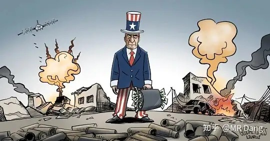
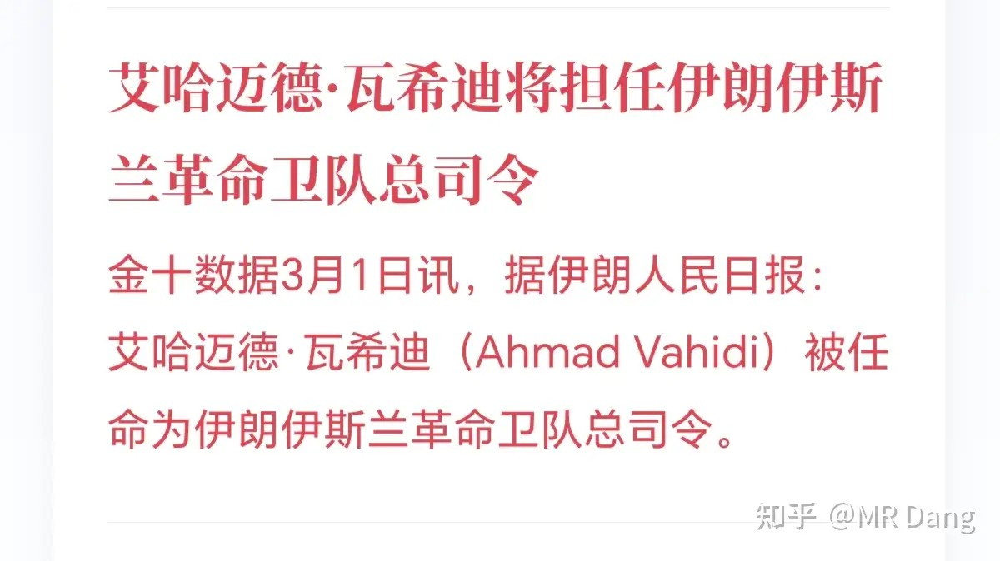
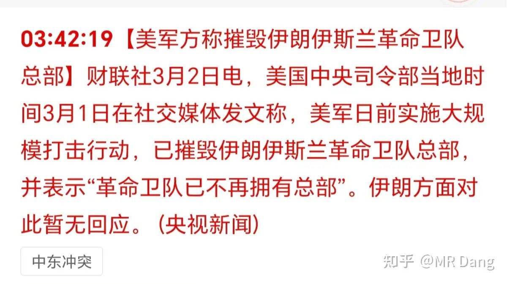
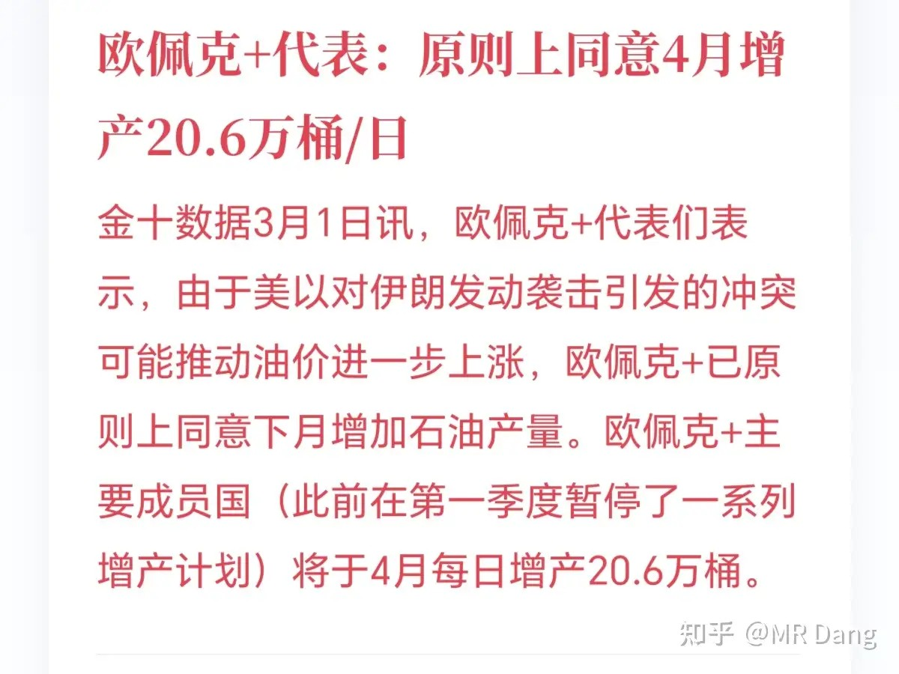
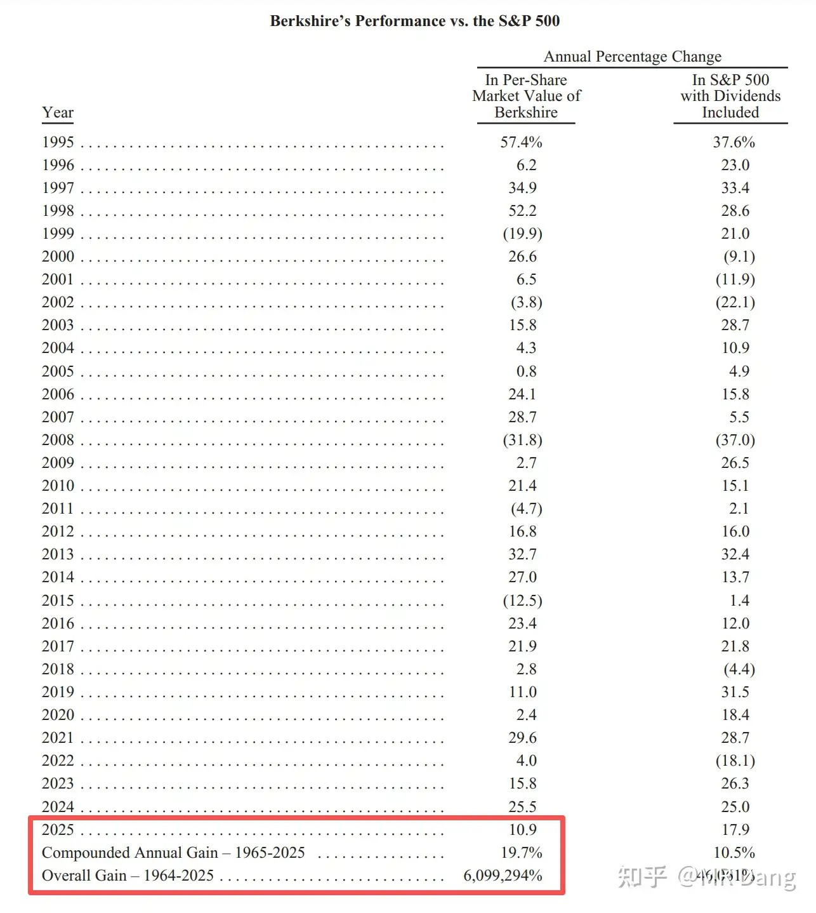
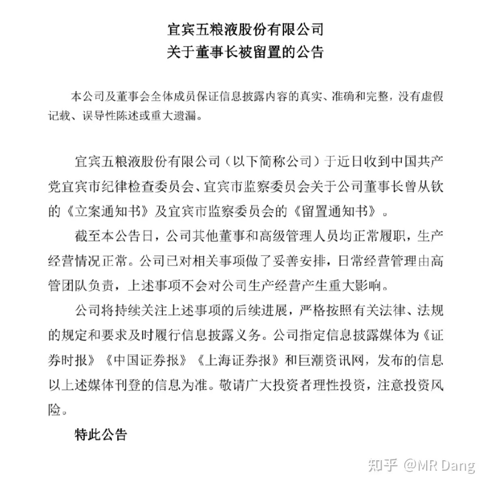
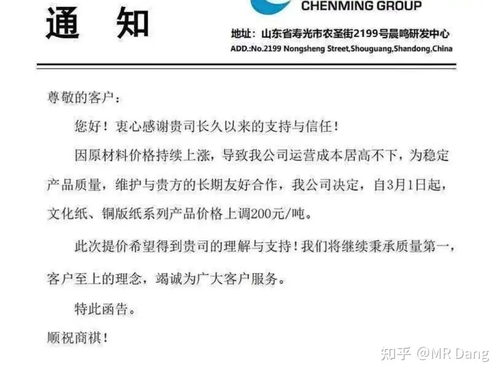

# 怎么看待2026年3月2日A股行情？

---

**发布时间**: 2026-03-02 07:00  |  **原文链接**: https://www.zhihu.com/question/2010744109896315855/answer/2011712634752352439  |  **点赞数**: 1899 人赞同

**作者信息**: MR Dang​​独立投资人，不接广不卖课，无任何其他平台，无小号。

---

## 正文内容

今天注定是不平凡的一天。

头条只能是伊朗局势。

具体的实时情况在小圈子发了一份，复盘了历次战争对资本市场的影响。

后来又发生了内衣的事情，目前态势比较严峻。

上来的是个鹰派，不知道能不能活到明天早报。

但是高烈度意味着短时间，目前没有地面大规模战争，我个人猜测持续时间远远不如俄乌。

在说影响之前，我得提个醒，影响有三个层次：

分别是：

1.利好

2.涨跌

3.赚钱

利好≠上涨

因为交易的是预期，有些事情确实是利好，但是预期变了，交易的就是更远的预期。

利好反而下跌的案例数不胜数。

上涨≠赚钱

如果已经提前布局的，上涨可以赚钱。

但是如果你没布局，一开盘冲进去，有可能高开就是七八个点，收盘三四个点。

当天涨了么？

当天赚了么？

这里分析的仅限于利好这个层面，涨跌无法预测，至于赚钱与否更是不牵扯。

1，利好黄金等有色：情绪主导

黄金目前5400附近，涨幅三个点。

白银96美元，也是三个点。

2，利好石油：来自伊朗的石油加上转口间接影响大约占国内表观消费量的10％左右。

虽然中东王爷已经磨刀霍霍了：

但是20万桶不算什么，还得看未来增产规模。

布油目前79美元附近，涨幅8个点。

参与相关板块的股票风险还算可控，期货千万别碰。

3，利好LPG: 同口径占比是11％左右

4，利好PE：同口径占比是2.5％左右，相对小一些。

5，利好海运：要改变线路，绕远路，价格大幅度上升。

以上这些算是主流共识，大家在别的地方也能看到，就不多赘述了。

我再补充点其他的：

1，利好甲醇，乙二醇和煤化工。

中国60％左右甲醇进口来自伊朗，占国内消费量的11％。

这种情况下不但有涨价的预期，而且可能以前因为担心产能过剩而搁置的新增产能也有更大的落地预期。

同时，在目前能源安全受到影响的情况下，能源安全就被摆到了台面上。

有些投资者会认为速战速决后，影响会降到最低。

但是假设一个不那么亲近咱们的班子上台，还会以比较优惠的价格持续保障咱们的能源供应么？

就算他肯卖，咱们要不要摆脱依赖？

2，利好硫磺。这个知道的人不多，自伊朗进口的硫磺每年是50万吨级的。

3，利好锶。

天青石又叫硫酸锶。

从伊朗进口的天青石占进口总量的60％以上。

高端的锶盐严重依赖进口天青石。

4，利好AI+军事。这次行动中西大使用了一系列来自暗黑版AI的部署方案，多线并行，效率提升数倍，远超人类军事家。

5，利好开心果，自伊朗进口的开心果占30％以上。

这个没标的，嘴馋的赶紧囤两包，说不定要涨价了。

动作要快，来不及解释了。

风险提示：必看！

按照以前多次的历史经验，战争开打后对以上提及的利好板块会有一定的提振效应。

但随着时间延长，会越来越倾向于战后逻辑的预期交易。

黄金石油反而下跌。

所以还是那句话，要么早信，要么不信，半路追进去，风险很大。

股神巴菲特交出最后一份成绩单：

有一点小遗憾，最后的复合增长率定格在了年化19.7％，没超过20％。

股神有了量化标准：19.7％复合收益率连续61年即可。

对普通投资者来说，先别管前面那个19.7％，后面那个61年投资经验已经可以挡住99％以上的人了。

股神到退休都拿着OXY不放手，抄股神的作业不是只有买他的股票一个选项，配置他的持仓也是可行的。

至于继任者的公开信，有空可以了解下，我不认为他能重现巴菲特的神迹。

酒老二董事长被留置：

参考茅子之前的案例，影响有限。

国企不是民企，一个职位的影响不大，随便换个人来，都不会太差。

如果是民企的话，需要分析董事长是不是实控人，如果是实控人+董事长，那影响会很大。

如果只是董事长，不是实控人，影响就一般。

纸业涨价：

纸业目前在周期底部，一般底部区域能涨价是反转的标志之一。

纸业也有剪刀差逻辑，之前多次提及，不再重复。（参见[[20260227-如何评价2026年2月27日A股行情？|2月27日行情]]）

有关小红圈的一些事：

1，会不会涨价？老用户受不受影响？

价格分为入圈价和续费价。

入圈价会一直涨，随着内容的增加，这个价格大约以每个月增加50元左右的速度上涨。

老用户不受影响。

续费价每年调整一次，会低于当时的入圈价，也就是明年这个时候的续费价格大约是1599以内。

2，人数还有限制么？

没有，通过涨价限制自动筛选，按照目前的形式，应该很长一段时间内都不会大幅增加了。

明年续费时人数会逐步自然减少，体验会进一步提升。

3，怎么保证质量？

疯狂的投入。

未来会把之前的内容重新编辑，修整，再加复盘，全新升级后重新投放。

会有专业的编辑按我的要求排版。

所有内容都是我本人100％生产，其他所有人全部是辅助工作。

做到这一步，其实已经不算副业了，占用精力几乎和投资对半开了，不过好在目前的前期人数已经够我覆盖运营成本还有的赚了。

目前已经换上苹果手机了，之前的安卓老闪退，评论区很难回，咬咬牙买了个苹果，安慰自己这是生产资料。。。。。

4，拼好圈怎么办？

有办法的。但是过两天说应对对策。我的态度是，熟人之间，比如亲朋好友，你拼就拼了，能省一分是一分，谁的钱也不是大风刮来的，我都理解。

手头不宽裕的陌生人，看知乎完全可以，没必要拼那个。

你一拼，他万一睡个懒觉，更新的还未必有知乎快。或者只是单纯的利用72小时退款，收了钱就跑路，你这钱花的很不值。

5，现阶段计划？

3月3日调整入圈价到1049，并且开启新用户阅读限制，新用户可浏览7日内内容，其他内容需要过退款期后才可以。

核心运营策略就是保证老用户，欢迎新用户，尊重付费读者体验，兼顾免费读者避坑，拒绝薅羊毛及炒作。

6，支付有问题？

下个小红圈app，搜我的名字，走zf宝即可。

本周前瞻：

1，今天起远期售汇准备金从20％下调到0。

2，周三公布2月pmi，苹果发布会。

3，周末东大公布外汇数据

4，周五西大公布非农，市场预期6万。

上周五个人净值小幅创新高，银行和锡等带飞。

其他涨的就不说了，有一个跌了的逆子问的人多。

讲道理，这种行业的大周期不会因为一两天的涨跌发生变化的，现在一季报和派息政策不明朗，投资者要做的就是控制仓位然后等待逻辑兑现。

兑现什么逻辑呢？电力出口的逻辑。

现在很火的算力概念，token出口，实际出口的就是电力。

算力这方面逻辑其实特别简单，我一说你就知道了。

铝也是，只要定价权还在我们手里，未来铝的出口就是电力的出口。

作为我们唯一取得定价权的大宗有色品种，投资者要有耐心和定力。

如果看到波动，感觉慌张，或者难受，那可能是仓位太重了，以后涨了的时候别太兴奋，记得把仓位调整到合理地位。

一个喜欢保护韭菜的博主，希望大家少少踩坑，多多赚钱！！！

一个喜欢保护韭菜的博主，希望大家少少踩坑，多多赚钱！！！

> [!comment]- 点击展开评论
>
> | 用户 | 时间 | 内容 |
> | :--- | :--- | :--- |
> | 南辰 |  | 拼团哥的经典左右脑互搏 |
> | ia霖 |  | 各位拼团的，其实没有必要，我开通了小红圈，知乎上的内容，仅今天内容而言，可能也就几个标点符号的区别，小心被人诈骗，而且私人荐股属于违法行为，支持D老师的，在知乎点点赞同和收藏就挺好。希望D老师身体健康，能够带领我们一直学习。 |
> | 钱包鼓鼓 |  | 每日总结第四天一、头条是伊朗局势周末最大的事是伊朗那边有变动。他们的革命卫队换了总司令，美国那边也说摧毁了相关总部。这种事一出来，市场首先想到的就是避险和资源涨价。直接利好黄金、石油这些避险和战略资源。跟石油相关的化工品，比如LPG、PE、甲醇，可能也会跟着动。海运板块也可能受影响，因为局势紧张会影响航道。二、其他几条市场消息纸业发了涨价通知，这对相关公司算是利好。有家白酒企业（酒老二wly）的董事长被留置了。不过参考之前类似案例，如果是国企，换个人影响可能有限。这事还得观察。电力出口、算力、铝出口这些长期投资逻辑，认为是有潜力的方向。市场最近其实在缩量，炒作风格已经从AI切换到了上游周期板块（比如资源、材料）。市场整体是横盘震荡，板块轮动很快，钱就在几个地方来回跑。所以，现在的情况是周末出了伊朗这个突发事件，肯定会刺激黄金、原油这些板块周一高开。但根据之前的分析，市场整体资金并不充裕，还是震荡轮动的格局。所以很可能出现高开后，其他板块跟不上，指数又回落的情况。总结一下周末消息面主要被地缘事件主导，对资源类和避险资产是直接利好。但咱们得冷静，市场整体还是存量资金在博弈，风格轮动很快。别一看到利好就追高，很容易被套。对于咱们普通投资者，看看热闹就好，真想参与也得等回调，别急着周一开盘就冲进去。 |
> | 啊呜呜呜 |  | 审核这小子最精了，自己先看一小时，再放出来给大家看 |
> | &nbsp;&nbsp;&nbsp;&nbsp;彼岸花开 |  | 你成心故意的吧 |
> | 阿bean |  | 幸好幸好，虽然利好的股没有布局上，我妈年前倒是买了不少开心果。 |
> | 乌获 |  | 原来是这个漫画图 哈哈！这局势动荡的～我都没睡好！但我不是焦虑 而是鸡冻 早呀老师！三月开门红（越看这个花花越顺眼～果然不易得才更珍惜） |
> | &nbsp;&nbsp;&nbsp;&nbsp;大大咧咧123 |  | 哇你两朵花 |
> | 揸fit路人 |  | 别说投资61年了，按现在的生活环境，工作压力，能不能活到61都是个问题。 |
> | &nbsp;&nbsp;&nbsp;&nbsp;知了也睡了 |  | 我觉得大D能 有可能超过巴菲特的收益率 |
> | &nbsp;&nbsp;&nbsp;&nbsp;李二麻子 |  | 不能赞同更多 |
> | &nbsp;&nbsp;&nbsp;&nbsp;taiyue furen |  | 而且党大心态好心态强大，应该没问题 |
> | 竹子 |  | 党大，谢谢你，我今天和最近，都赚到钱了。不管是买了锡，还是听你的做价值投资，还是学习你的炒股思维。你是我全网唯一关注的博主。你真的很无私大方。我买不起你的小圈课程。就一直蹲你的帖子咯。祝党大身体健康，天天开心哦~ |
> | 好高妙绝牛棒嗨 |  | 还是我乎的界面好一点 |
> | &nbsp;&nbsp;&nbsp;&nbsp;夏天 |  | 比较起来这里阅读体验太棒啦 |
> | &nbsp;&nbsp;&nbsp;&nbsp;牛教授 |  | 确实 |
> | &nbsp;&nbsp;&nbsp;&nbsp;顺其自然 |  | 对，那小红圈翻阅评论时老是闪退。很烦人 |
> | &nbsp;&nbsp;&nbsp;&nbsp;打倒浩克的毛毛虫 |  | 小红圈阅读体验太差了，总是闪退提示出问题。排版也像一坨 |
> | 秋葵 |  | 坚持拿的锡王塑料王布王和铝王平替今天太猛了，创单日最大收益了，感谢dang老师 |

---

*本文件由自动脚本从MR Dang知乎页面提取生成*

---

**作者**: MR Dang
**链接**: https://www.zhihu.com/question/2010744109896315855/answer/2011712634752352439
**来源**: 知乎

*著作权归作者所有。商业转载请联系作者获得授权，非商业转载请注明出处。*

---

## 相关阅读

**📈 每日行情评价系列：**
- [[20260303-对于2026年3月3日A股市场行情，大家有什么预测和看法？|3月3日行情]] - 欧洲天然气暴涨35%、锡回调风险提示、暗金查询方法
- [[20260304-如何评价2026年3月4日A股行情？|3月4日行情]] - 伊朗新领袖、铝大幅拉升、强美元逻辑
- [[20260227-如何评价2026年2月27日A股行情？|2月27日行情]] - 李超人UK电网资产出售、央行跨境人民币批发渠道
- [[20260226-如何看待2026年2月26日A股市场行情？|2月26日行情]] - 懂王国情咨文、达子财报、指数调仓
- [[20260225-如何评价2026年2月25日A股行情？|2月25日行情]] - 老马月球基地、港股通退通风险、有色金属储采比

**⚔️ 有色金属投资系列：**
- [[20251030-《天阶功法卷三》NSLY投资价值浅析|天阶功法卷三]] - 低价铝投资价值分析
- [[20251104-《天阶功法卷五》DSL投资价值分析|天阶功法卷五]] - 磷化工投资价值分析
- [[20251106-《天阶功法卷六》银行股投资原理详解|天阶功法卷六]] - 银行股投资逻辑

**💰 投资方法论：**
- [[20251022-《地阶功法卷一》投资者必须斩杀的三个妄念|地阶功法卷一]] - 投资者必须斩杀的三个妄念
- [[20251020-投资新手避坑指南之仓位控制|仓位控制]] - 仓位太重让你睡不着觉？看这篇
- [[20251031-新手投资者避坑指南之测算股息率|测算股息率]] - 股息率怎么算才准确
