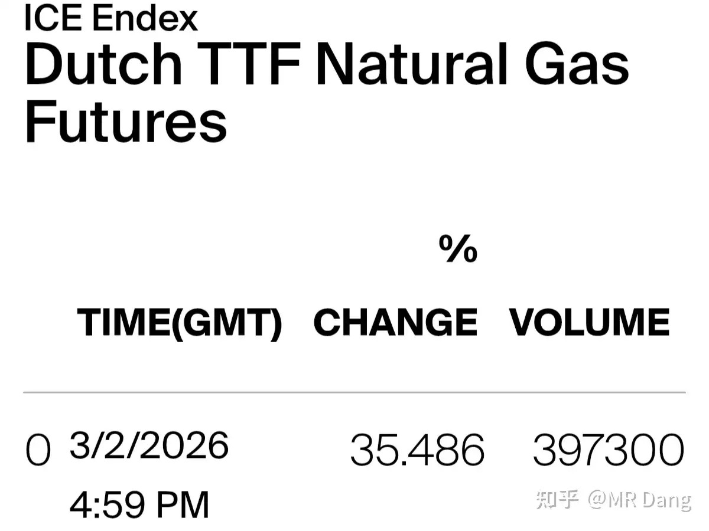
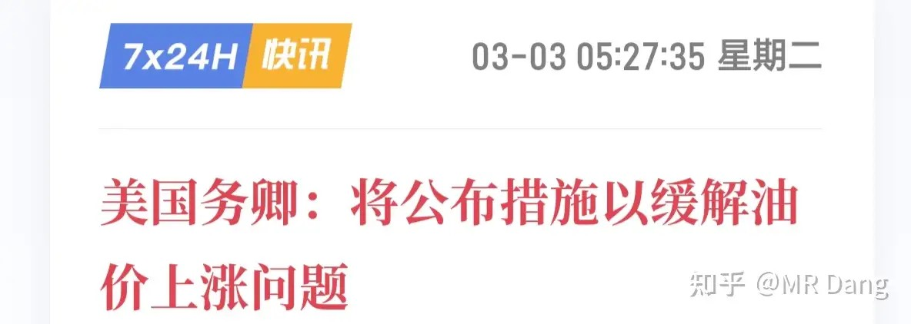
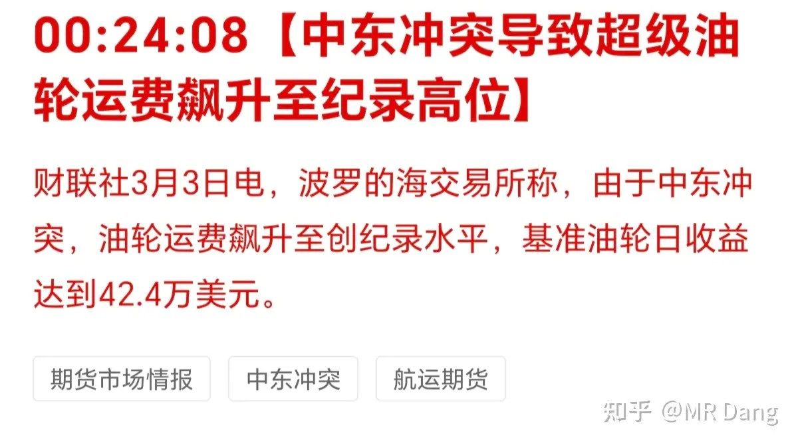
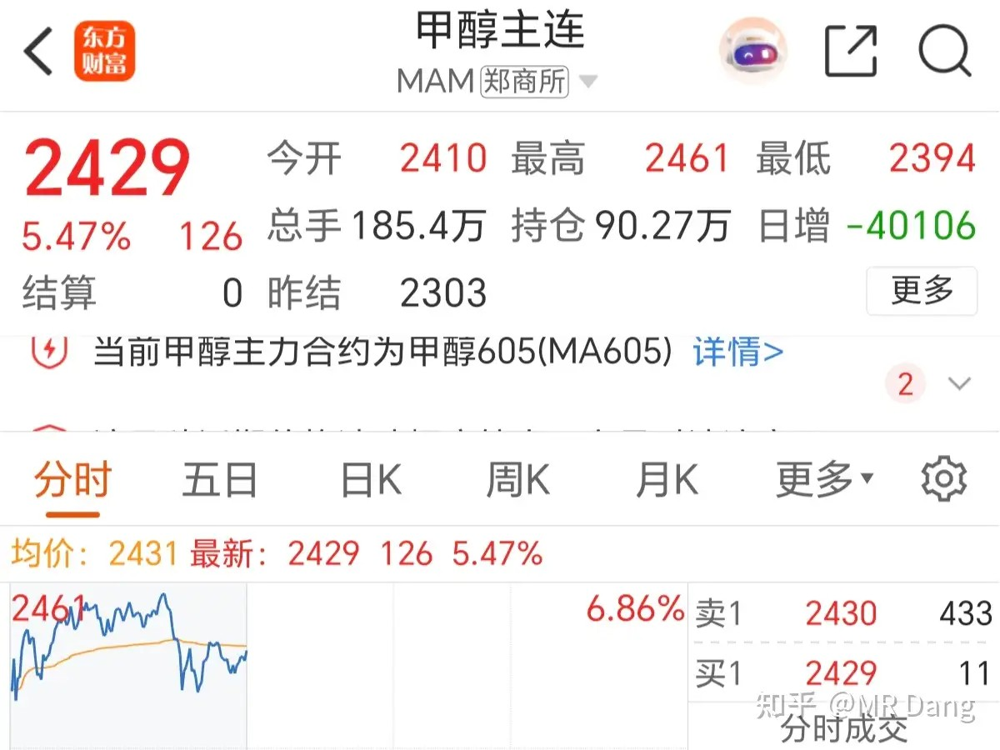
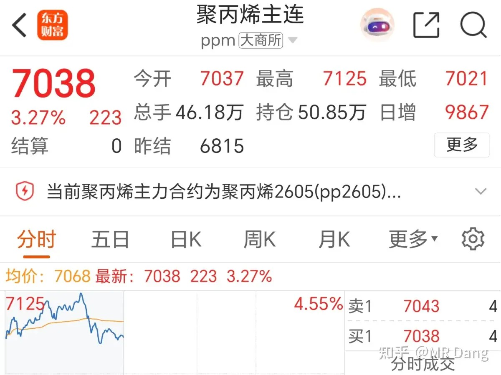
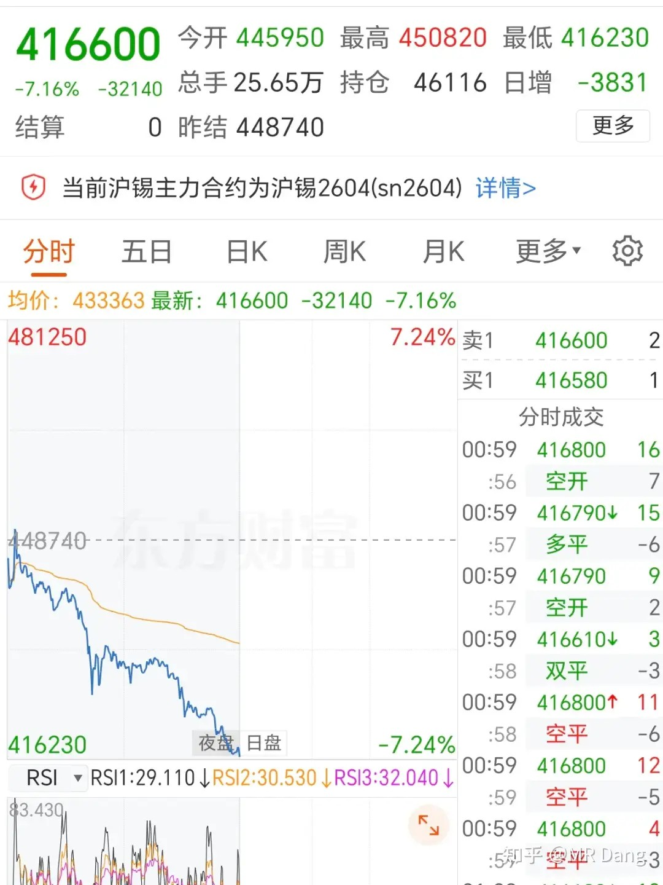
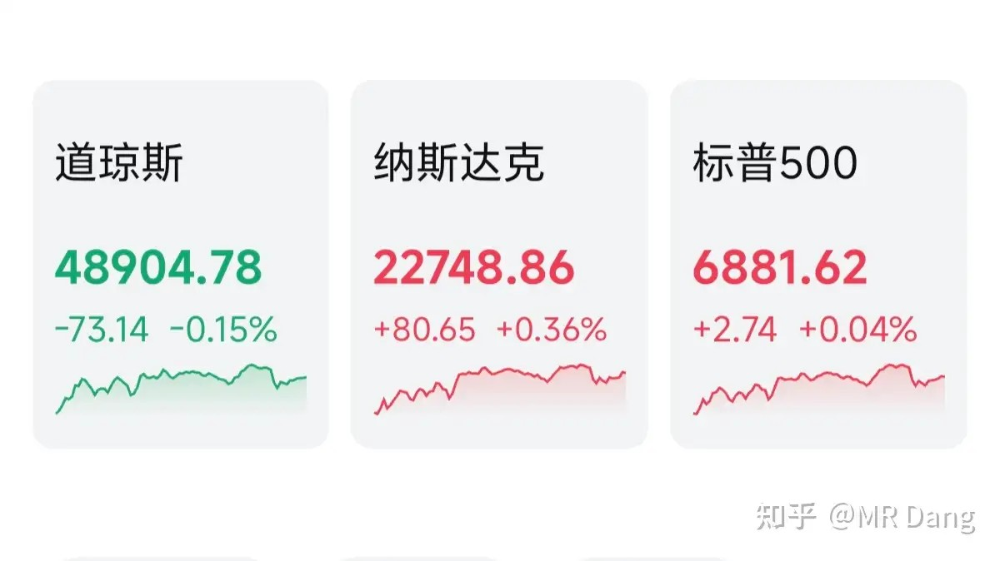
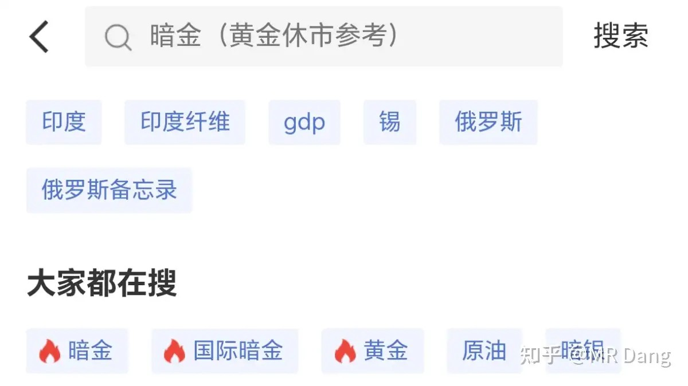

# 对于2026年3月3日A股市场行情，大家有什么预测和看法？

---

**发布时间**: 2026-03-03 07:00  |  **原文链接**: https://www.zhihu.com/question/2011804058873243032/answer/2012074670703277407  |  **点赞数**: 1445 人赞同

**作者信息**: MR Dang​​独立投资人，不接广不卖课，无任何其他平台，无小号。

---

## 正文内容

今天的头条给欧洲天然气：

涨了35％，全球最大天然气生产商卡塔尔能源（QatarEnergy）宣布旗下能源设施遭到袭击后停产液化天然气。

不过需要提醒大家的是，天然气具有很强的地域性，所以A股这边。。。不要一听35％就无脑冲锋，还是要衡量一下风险的。

西大：

现在什么情况呢？

大概意思就是伊朗用推高油价来威胁懂王，他们的逻辑是高油价会推高物价，从而暂缓降息，影响股市，最后影响懂王的选票。

所以灯塔国需要安抚选民，从而出台各种相对应的政策。

但是就国家利益而言，西大可是石油出口国。

要不是看在选票的面子上，懂王还真不怕这个。

油运：

大宗商品：

甲醇：在昨天白天涨停的基础上夜盘继续上涨3个点。

塑料：在昨天涨停的基础上夜盘上涨1个点

锡：回调7个点

锡属于小金属，长期价格走势看储采比，短期价格走势看库存和消息面，比如缅甸之类的供应情况。（储采比逻辑详见[[20260225-如何评价2026年2月25日A股行情？|2月25日行情]]）

昨天在圈子盘中提示了相关风险，我倒是很想说是自己对大宗商品研究透彻，早已预见到这些。

很可惜，坦诚的讲，这不是真相，真相是按照原则来，30％。就这么简单，我怕有些人一涨就没原则了。

因为我不止盈是基于长期看好的逻辑，但是你们大部分人还是想的赚一把就跑，所以还是按照原则来。

黄金，原油和铝相对昨天收盘下跌1个点，白银回调6个点，铂回调3个点，铜回调2个点，其他有色品种也都有下跌。

外围市场：

美股表现平平，股神的公司跌了四五个点，其实业绩还算符合预期，但是很多投资者相信的是巴菲特，而不是别的什么人。

科技股开始有走强的迹象。

昨天圈里有人问暗金是什么，怎么看。

黄金的交易是有时效性的，一般都是工作日交易。

但是碰到突发事件，恰好黄金没开盘，又想知道黄金的价格是多少，提前做出决策的时候，就需要看“暗金”的价格了。

啥是暗金呢？简单的说就是有个专门的机构采集数据，做成一个API 让各种应用接入，抓取放假时场外交易的零星的数据。

你说它准不准？那指定不准。

但是有总比没有强。

最简单的看暗金价格的办法就是下个“金十数据”（广告费结一下谢谢），然后搜“国际暗金”四个字就出来了：

昨天个人净值又大幅刷新历史新高。银行与资源起飞，电网与消费共舞。其他的几个涨停倒不足为奇，资源类在风口。但神奇的是某个啤酒，整个板块重挫，它也扛了下来。

这种正常波动不能归因到能力，我自己几斤几两我自己清楚。只能归因到玄学了，可能是小红圈名字起的大吉大利，哈哈。

现在有点危机感，一般来说，如果人感觉挣钱比较容易的时候，往往是风险比较大的时候。

越开心越要警惕，越沮丧越要坚定。

很多读者在对比小红圈和知乎的区别。

也有读者表示没有区别。

其实肯定有区别的，我的工作流程是知乎写一遍毛胚，这个毛胚大概和前的内容差不多。

然后复制粘贴到小红圈，修改，补充部分高阶内容（大概5％到10％），这部分内容怎么说呢，就是如果你很纠结这个一千多块钱要不要花，那说明这部分内容对你用处不大。

小红圈发布后，一边回复，一边修改一些实时数据，然后知乎再发布。

这个工作强度一般人顶不住的，需要考虑受众区别，颗粒度区别和监管强度，所以没有看起来那么轻松。

另外有个小建议：大家可以沉稳些，不要太看重涨跌了，盯着k线图能做好投资的人万中无一，不要给自己上难度。

每次看到几个点的波动有投资者反应那么激烈，还是建议这部分同学去学习学习底层逻辑，成竹在胸才能做到处变不惊。

风险提示：

昨天说了，要么不信，要么早信。（参见[[20260302-怎么看待2026年3月2日A股行情？|3月2日行情]]）

所谓的早，我是在周日上午的小红圈提示的。

现在已经不早了，事件驱动的投资方向具有很强的不确定性。

没有一手消息的散户是很被动的，内贾德死了又活，航母被攻击了又复原，海峡开了又关，连基本的事实都无法确认，如何做出投资决策？

所以我的思路就是从危机感，能源安全，煤化工的替代需求中寻找一定的确定性。

哪怕海峡又开了，战争结束了，油价下跌了。

但是从咱们自身的能源安全需要来说，有些事情是不得不做的。

还有就是，战争对电网的破坏是确定性的，伊朗电网的复建是很难的。

电=铝，电解铝的总供给是确定性的减少，需求反而会增加。

如果，我是说如果，有一些铝标的因为短期资金博弈而造成低估，那从补票的角度来说，性价比还不错，是比较优秀的补票标的。

还有恒科，不要再问了，我的态度没有变过，聪明的投资者不打逆风局。

多说一嘴，小红⭕️不是小红📖，在小程序里可以找到，或者应用中心去下wered，然后搜我的名字就行，头像和这边一样，支付的时候用支付宝就行。

或者有认识的在圈里的，让他买礼品卡送给你，价格一样，权益一样。

一个喜欢保护韭菜的博主，希望大家少少踩坑，多多赚钱！！！

一个喜欢保护韭菜的博主，希望大家少少踩坑，多多赚钱！！！

> [!comment]- 点击展开评论
>
> | 用户 | 时间 | 内容 |
> | :--- | :--- | :--- |
> | 钱包鼓鼓 |  | 每日总结打卡第五天看好： 煤化工（能源安全自主）、电解铝（战争减少供给+重建增加需求）、电网设备（战后重建）。逻辑是战争改变了长期产业格局，这些需求是确定的。​看空： 已经暴涨的战争题材股（油、气）、恒生科技股、所有期货。​操作策略： ​对于战争题材，如果你没有提前布局，现在就只看戏，坚决不追高。​可以深入研究煤化工、电解铝这些有长期逻辑的板块，寻找估值还没完全飞天的公司，作为“补票”选择。​严格执行纪律，设好止盈止损点（比如他提到的30%），别贪心。​调整心态，别被短期波动牵着鼻子走，多花时间理解行业底层逻辑。 |
> | 毓美 |  | 越开心越要警惕，越沮丧越要坚定。 |
> | &nbsp;&nbsp;&nbsp;&nbsp;下弦说 |  | 党老师早  老粉反馈 : 小红圈有bug， 评论再返回主页后，主页页面直接乱码了，全是字母 需要反复刷新页面  app功能待完善[酷 |
> | &nbsp;&nbsp;&nbsp;&nbsp;独枫 | 22 小时前 | 今天才意识到这句话的含义。 |
> | &nbsp;&nbsp;&nbsp;&nbsp;承一 | 20 小时前 | 跌麻了 |
> | 银宸 |  | 愚蠢的投资者来了。恒科已经被深套了20个点了。还好仓位不重不到1/10。再拿一拿吧，我还有21年上车的生物医药，目前亏损50%还在拿感觉出来换地方挨打 |
> | 云若繁星 |  | 看到大佬分享的每早的工作流程，除了佩服，就是感叹，如果只是单纯个人投资，各方面的工作相对来说怎么都好安排，但现在除了要做好个人的投资安排以外，还要考虑着十几万粉丝的情况，因为这不是开玩笑过家家，而是牵扯到这么多忠粉真金白银的资产波动，不得不说，没有个强大的心脏和抗压能力，这个活真不是一般人能干的，感谢大佬，吾辈楷模，向你学习！！ |
> | 如来熊掌 |  | 我只能说加老师圈子还是太便宜了，让人错判老师的含金量。 |
> | 瑞布克 |  | 在圈圈学习，在乎乎赠花 |
> | &nbsp;&nbsp;&nbsp;&nbsp;赛佛 | 3 小时前 | 怎么入圈啊？ |
> | 悠悠 |  | 冰火两重天啊❗️本来以为再也看不到DD的文章了，万念俱灰了两天，结果大佬就是大佬，格局不一般！ |
> | &nbsp;&nbsp;&nbsp;&nbsp;MR Dang |  | 给大家充分的选择权 |
> | 诸睚 | 23 小时前 | 还是知乎的评论区看着舒服，也能倒序，盘中还能来吐槽吹牛逼看情绪 |
> | &nbsp;&nbsp;&nbsp;&nbsp;败絮丶 | 23 小时前 | 红圈App做的太烂 |
> | &nbsp;&nbsp;&nbsp;&nbsp;之栀 | 19 小时前 | 我都想冲过去给它做一个新的，为了dang老师 |
> | 长虹 |  | 哇，前排，小红圈点赞，乎乎评论，大D哥注意休息哦，最近工作强度太大了 |
> | 我是一颗桃子吖 | 23 小时前 | 送出一个礼物～ |

---

*本文件从MR Dang知乎页面转载*

---

**作者**: MR Dang
**链接**: https://www.zhihu.com/question/2011804058873243032/answer/2012074670703277407
**来源**: 知乎

*著作权归作者所有。商业转载请联系作者获得授权，非商业转载请注明出处。*

---

## 相关阅读

**📈 每日行情评价系列：**
- [[20260302-怎么看待2026年3月2日A股行情？|3月2日行情]] - 伊朗局势全面分析、巴菲特最后成绩单、本周前瞻
- [[20260304-如何评价2026年3月4日A股行情？|3月4日行情]] - 伊朗新领袖、铝大幅拉升、强美元逻辑
- [[20260227-如何评价2026年2月27日A股行情？|2月27日行情]] - 李超人UK电网资产出售、央行跨境人民币批发渠道
- [[20260226-如何看待2026年2月26日A股市场行情？|2月26日行情]] - 懂王国情咨文、达子财报、指数调仓
- [[20260225-如何评价2026年2月25日A股行情？|2月25日行情]] - 老马月球基地、港股通退通风险、有色金属储采比

**⚔️ 有色金属投资系列：**
- [[20251030-《天阶功法卷三》NSLY投资价值浅析|天阶功法卷三]] - 低价铝投资价值分析
- [[20251104-《天阶功法卷五》DSL投资价值分析|天阶功法卷五]] - 磷化工投资价值分析
- [[20251106-《天阶功法卷六》银行股投资原理详解|天阶功法卷六]] - 银行股投资逻辑

**💰 投资方法论：**
- [[20251022-《地阶功法卷一》投资者必须斩杀的三个妄念|地阶功法卷一]] - 投资者必须斩杀的三个妄念
- [[20251020-投资新手避坑指南之仓位控制|仓位控制]] - 越开心越要警惕，仓位管理是关键
- [[20251031-新手投资者避坑指南之测算股息率|测算股息率]] - 股息率怎么算才准确
