# 如何评价2026年3月24日A股行情？

---

**发布时间**: 2026-03-24 07:32  |  **原文链接**: https://www.zhihu.com/question/2019346329378240402/answer/2019677998803067566  |  **点赞数**: 583 人赞同

**作者信息**: MR Dang​​独立投资人，小红圈同名，无其他小号。

---

## 正文内容

今天的头条只能是赢学大战：

首先是懂王赢学：5天内或达成协议。

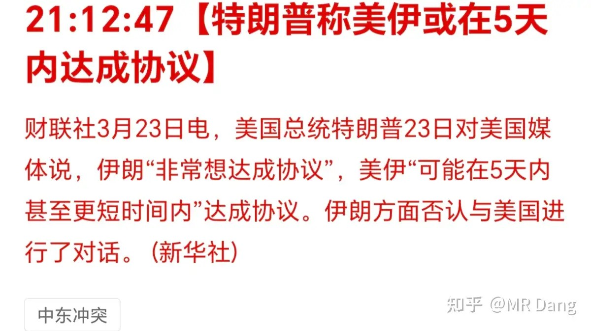

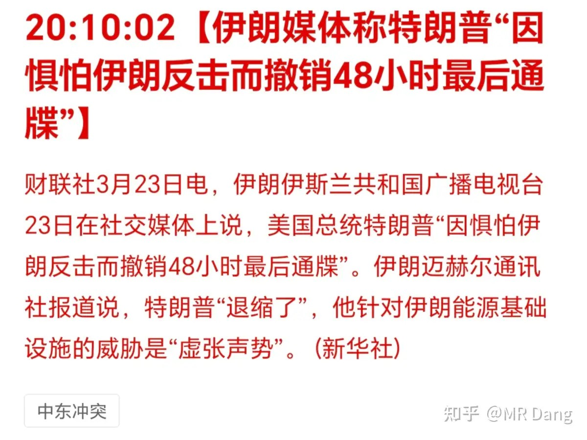

大赢特赢，赢麻了。

然后是伊朗赢学：伊朗称懂王因惧怕反击撤销最后通牒。

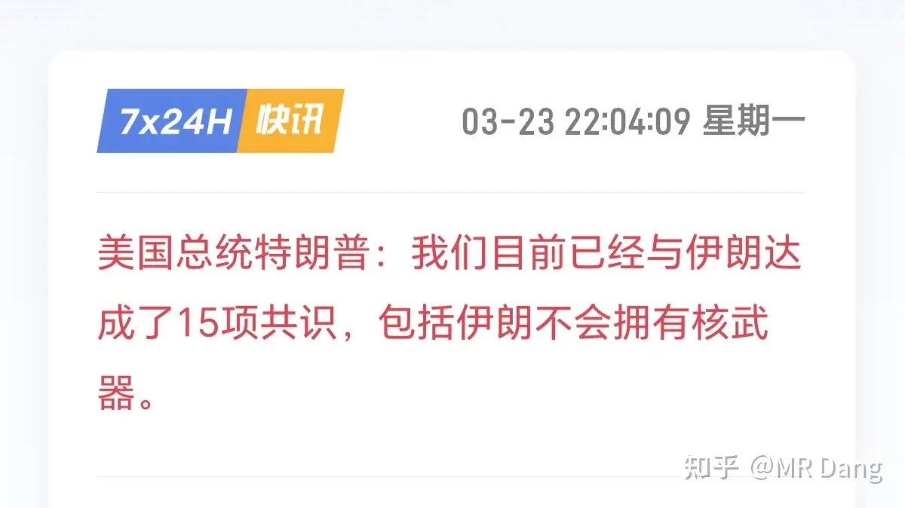

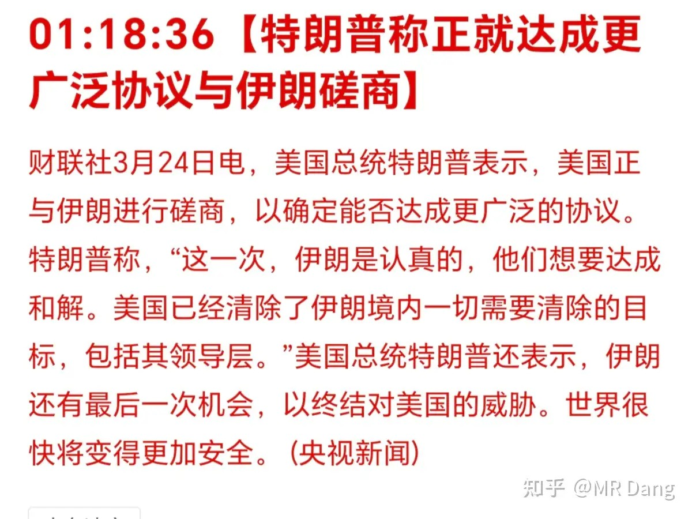

也是大赢特赢，赢疯了。

魔法对轰，赢学大战。

这场纷争只要能结束，我就承认他们都是winner。

再打下去投资者就快变loser。

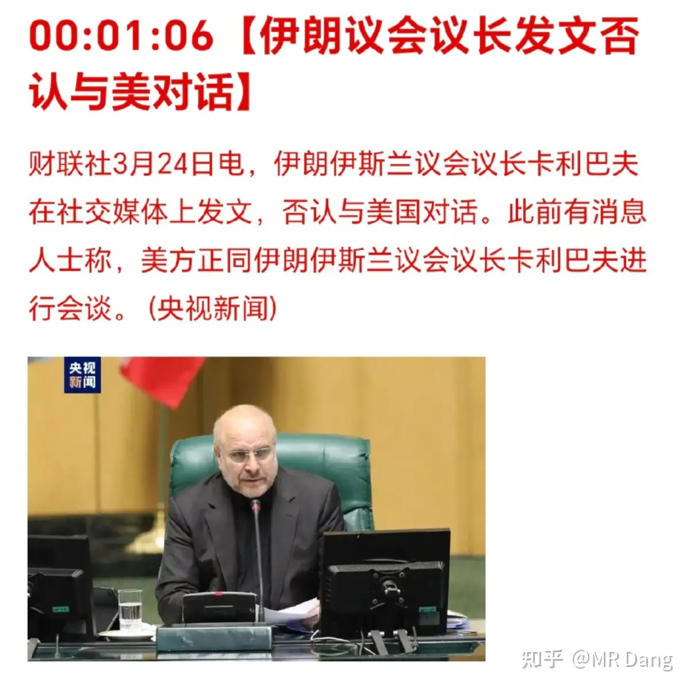

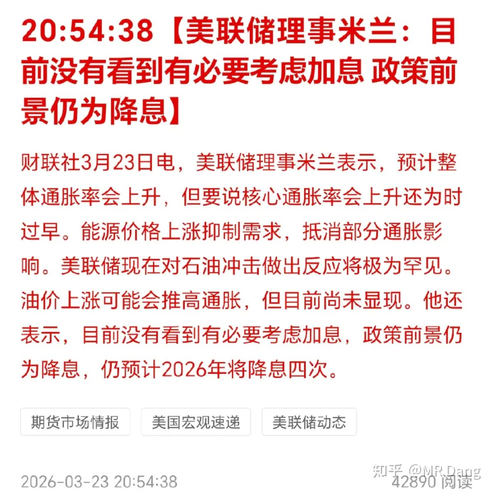

后续是懂王称又达成了15项共识，这算是连赢15局？

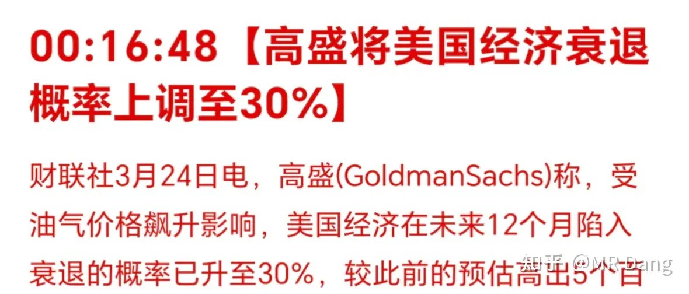

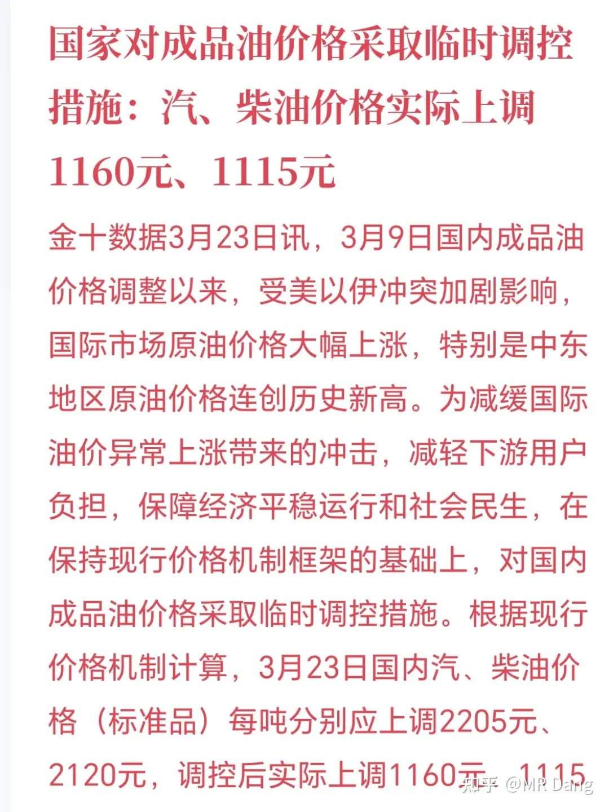

懂王又称与伊朗进行更广泛的协议。

有意思的是伊朗对懂王的话都进行了否认：

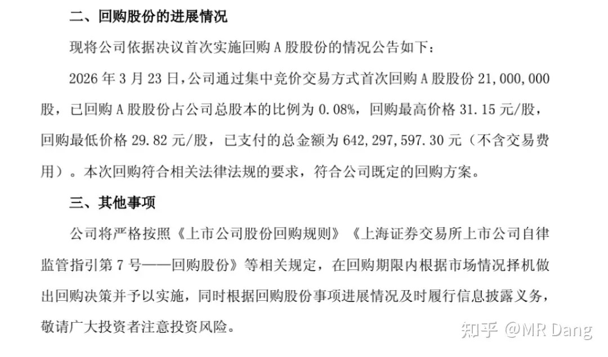

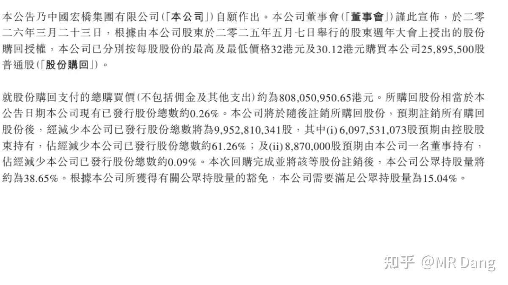

可以理解，毕竟刚经历战火，而且新上来的人根基不稳，这个时候如果不展示强硬，恐怕会面对内部的怒火。

就各种大宗商品的价格走势和资本市场的态势，大家还是更关注懂王的表态。

话说就原油期货这振幅和成交量，但凡懂王提前做空，恐怕这次的军费就有了。

想进步的米兰：2026年降四次息

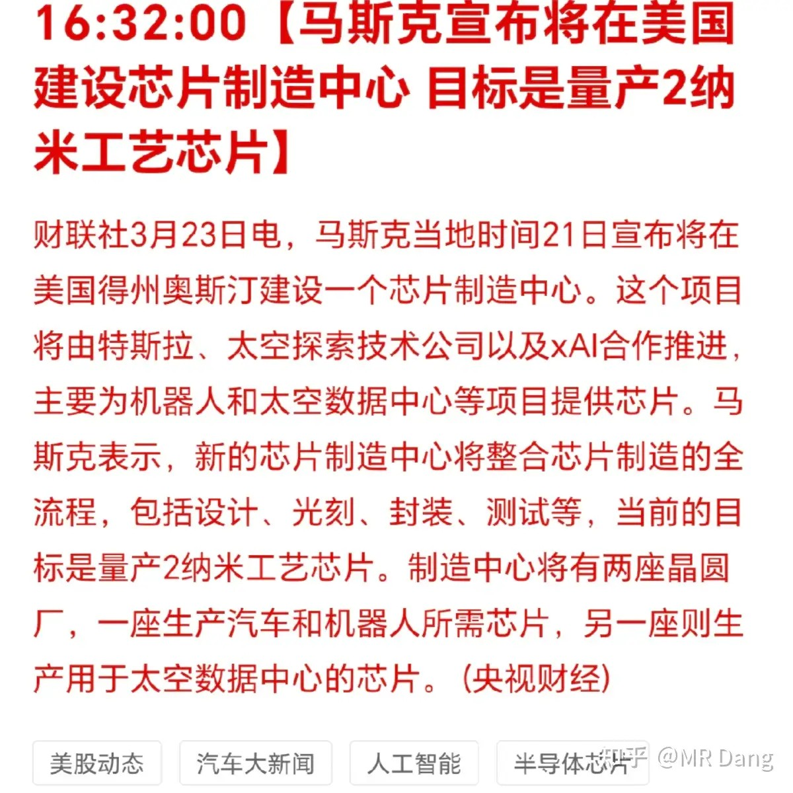

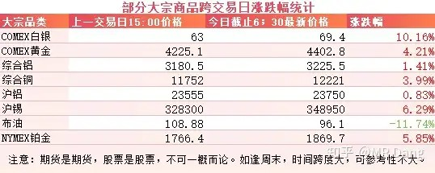

他真的太想进步了，这可能也是沃什都快板上钉钉了还没有被正式任命的原因之一吧。

我好奇米兰说降四次的时候不知道他自己笑了没有。

高盛认为西大衰退概率30%：

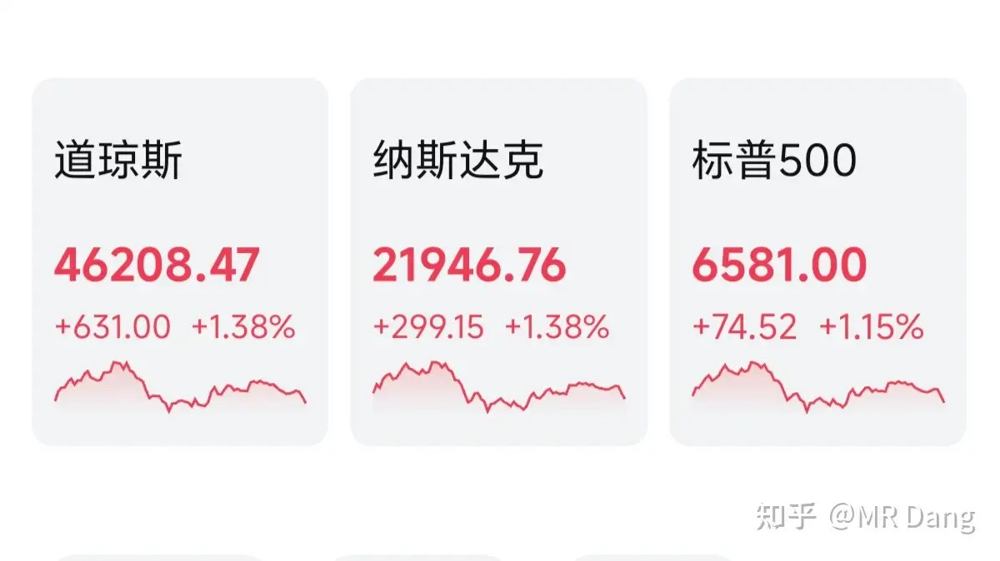

这些顶级投行的话看看就行了，之前预测金价6500美元的也是这批人。

汽油涨价：

本来应该涨价2000多的，实际只涨价了一半左右，这是为了降低油价上涨对经济的影响，用心良苦，感谢制度优势。

话说我前两天就看见准备调价了，当时还特意抽了个空把8成满的油箱加满了，花了75块。

加油小妹本来屁颠屁颠的去抱一大箱抽纸去了，一听见75块，翻了个白眼，放下抽纸，递过来一张洗车卡翩然离去。

某头部铜企回购：

6.4亿回购了2100万股。

效率这块儿，管理这块儿，不得不服。

都说百万散户扎堆，但这又何尝不是口碑带来的共识呢？

某头部铝企回购：

8亿回购2589万股

回购+注销，良心大大的有。

不同的行业，同样的动作 。

在我看来，差企业的坏毛病千奇百怪，而优秀企业的管理，大有英雄所见略同的感觉。

老马又画新饼：

这饼是真的大，老马是真能画。

老马这人吧，能干是真能干，能吹也是真能吹。

我对能否落地持有一点点的怀疑。

大宗商品：

有色整体不错，原油重挫。

外围市场：

暖风频吹，市场复苏。

昨天又是被暴打的一天，三个多点，很疼了，银行三个多，消费四个多，电网两个多，资源三个多。

只能安慰自己好歹勉强跑赢指数了，之前创新高的时候老喊着不踏实，现在是相当踏实了。

很多投资者会问，是不是xx逻辑又变了？

这种时候没人谈逻辑，都是情绪。

既然是情绪，那肯定有被错杀的，所以对于捡漏王来说，这种时候的资本市场是有机会的。

但是有机会归有机会，哪些是陷阱，哪些是馅饼，就需要好好分清楚。

想起来之前蹲的好多东西都没蹲到，一飞冲天不见影子了，这才多久，又快蹲到啦。

今天目前截止现在来看，消息面还是比较乐观的。

大A但凡今天争点气，也要让投资者吃点甜头吧，天天挨打也不是个事啊。

至于昨天清仓的投资者，只能看开点啦，懂王这种性格的人，很难预料到他在什么时间点说什么话，干什么事。

也许过个几天又有什么反转也说不来的，不能以常理度之。

对于大多数坚守到现在的投资者来说，这是大家应得的，但是也不要被利好冲昏头脑，仓位控制和风险管理还是要走在前头，防患于未然才能行稳致远。

一个喜欢保护韭菜的博主，希望大家少少踩坑，多多赚钱！！！

（以上仅为时事搬运，不够成投资建议，投资有风险，盈亏需自负！）

> [!comment]- 点击展开评论
>
> | 用户 | 时间 | 内容 |
> | :--- | :--- | :--- |
> | 只会中投的中锋拉文 | 2 小时前 | 哎，开了圈子以来越来越没东西看了，没意思 |
> | 钱包鼓鼓 | 2 小时前 | 每日打卡第20天可以关注的：正在实施大额回购（尤其注销式）的行业龙头。之前看好但嫌贵没买的。制定计划，分批捡漏。坚决不做的：听到任何利好风声就急于满仓追高。过分在意短期的净值回撤，陷入懊悔或恐慌的情绪中。 |
> | 资本主义必将消亡 | 2 小时前 | 我很感谢你的哦dang老师，不要被别的烂事影响心情，开开心心的比股市里涨涨跌跌更重要我从您这里学到了太多太多，怎么感谢您都不为过 |
> | &nbsp;&nbsp;&nbsp;&nbsp;CoCo 慢慢变富 | 1 小时前 | 饭圈发言 |
> | &nbsp;&nbsp;&nbsp;&nbsp;资本主义必将消亡 | 1 分钟前 | 这也算饭圈发言？我就是从他这里学到了很多知识，所以很感谢他 |
> | mwhaea11 | 2 小时前 | 这要是提前做空，那就是拿投资者的钱充军费啊 |
> | &nbsp;&nbsp;&nbsp;&nbsp;萤火与萤火虫 | 1 小时前 | 想多了是充私人账户 |
> | 掘金工作者 | 2 小时前 | 以前被印度的赢学震惊，现在看了特朗普和伊朗的赢学，才知道天外有天人外有人，佩服。 |
> | Melody Chan | 2 小时前 | 懂王堪称股神，自己画K线 |
> | &nbsp;&nbsp;&nbsp;&nbsp;桔梗 | 1 小时前 | 先开空再发言 |
> | 山石李 | 1 小时前 | 有个博主说的，你跟着荐股老师买股票，老师的流量越大死的越惨。老师，这句话您怎么看？ |
> | &nbsp;&nbsp;&nbsp;&nbsp;如意 | 50 分钟前 | 现在量化时代，各种网络爬虫，确实也是流量越大越容易被检测到。量化收割的就是投机，如果不是量化的对手，唯一的应对就是老师的价值投资，长期主义。这是个人浅见，不一定正确哦。 |
> | &nbsp;&nbsp;&nbsp;&nbsp;如意 | 54 分钟前 | 老师不负责别人的账号哦，每个人都应该对自己账户负责，老师只是分享，将心比心，隔着网络，还能遇到真诚把自己的经验和心血，拿出来分享的人中龙凤，大家遇到了还请珍惜易位而处，如果我有老师的水平，大概率偷着自己发财，潇洒人生得了，自己找不痛快，图个啥子呐～～ |
> | 金多多 | 2 小时前 | 麦子熟了千万次，自己划K线自己炒股第一次 |
> | ST先富带厚富 | 2 小时前 | 之前在新手须知提到过啊各位，发公告回购股份是利好利空？是利空啊各位，这是属于内部消息 |
> | 我不是AI | 2 小时前 | 竟然坐上了沙发懂王在撒谎，市场会反映情绪，但是情绪是随时在变的。 |

---

*本文件从MR Dang知乎页面转载*

---

**作者**: MR Dang
**链接**: https://www.zhihu.com/question/2019346329378240402/answer/2019677998803067566
**来源**: 知乎

*著作权归作者所有。商业转载请联系作者获得授权，非商业转载请注明出处。*

---

## 相关阅读

**📈 每日行情评价系列：**
- [[20260323-如何评价2026年3月23日A股行情？|3月23日行情]] - 周末大事件：央行宏观审慎调节、伊朗战事、偿二代之争、宇树机器人上市
- [[20260320-如何评价2026年3月20日A股行情？|3月20日行情]] - 个人净值三点回撤、银行压舱、资源板块惨烈
- [[20260319-怎么看待2026年3月19日A股股市行情？|3月19日行情]] - 美联储按兵不动、点阵图收敛、鹅厂财报分析
- [[20260318-如何看待2026年3月18日A股市场行情？|3月18日行情]] - 拉里贾尼被刺、几内亚铝土矿限制出口、银行理财资质
- [[20260317-如何看待2026年3月17日A股市场行情？|3月17日行情]] - 骡子快跑vs小龙虾、社零数据、银行调仓逻辑
- [[20260316-对2026年3月16日A股市场行情，大家有什么看法？|3月16日行情]] - 315晚会曝光、哈尔克岛局势、PX逼近历史新高

**📅 周末闲聊系列：**
- [[20260214-春节特辑（年二十七）|春节特辑]] - 春节期间市场展望与投资思考
- [[20260207-周末唠嗑（2月7）|周末唠嗑]] - 市场情绪与仓位管理讨论

**🌱 韭菜保护系列：**
- [[20260303-对于2026年3月3日A股市场行情，大家有什么预测和看法？|3月3日行情]] - 两会期间行情特征分析
- [[20260302-怎么看待2026年3月2日A股行情？|3月2日行情]] - 关税博弈下的市场应对策略
