# 如何评价2026年3月27日A股行情？

---

**发布时间**: 2026-03-27 07:08  |  **原文链接**: https://www.zhihu.com/question/2020258925853824846/answer/2020759110715540779  |  **点赞数**: 680 人赞同

**作者信息**: MR Dang​​独立投资人，小红圈同名，无其他小号。

---

## 正文内容

每天的新闻从伊朗开始：

西大被爆出针对伊朗的“最后一击”：

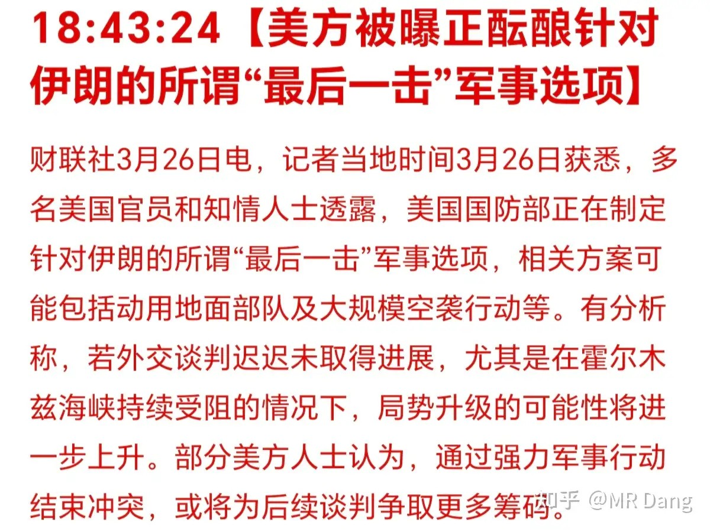

讲道理，能让我知道的消息能是什么军事机密？这明摆着是极限施压和谈判筹码。

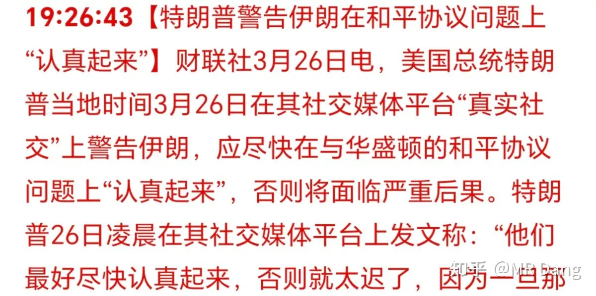

也不是说就没这回事，而是说若真有行动，和爆出来的内容一定有出入。

与此同时，巴铁认为两边正在谈：

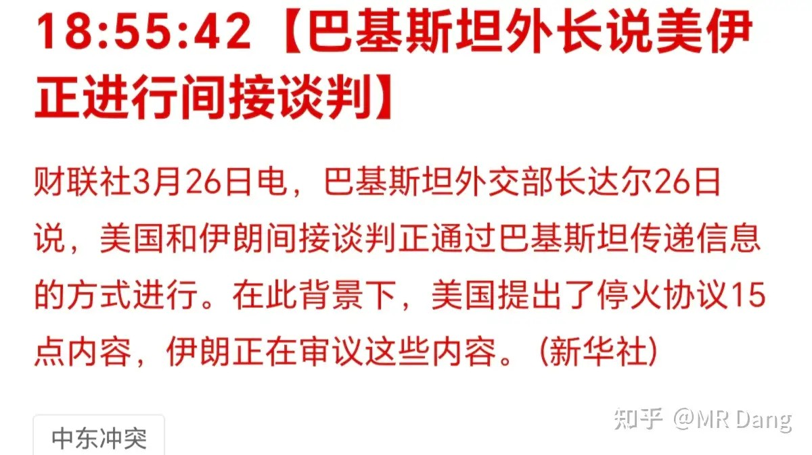

怎么说呢，我个人还是比较相信巴铁的说法的，打成这个样子，一点都不谈图啥呢？

伊朗可能还是想保持强硬形象，所以一直说没谈。

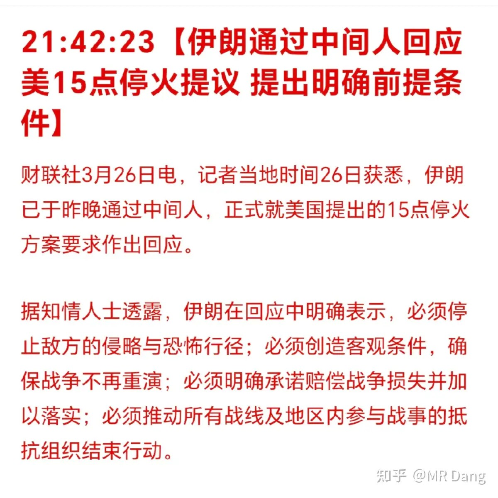

伊朗提出的前提条件和懂王开出来的价码，二者之间好像没有交集地带。

懂王又在自说自话，一会儿海峡会开放：

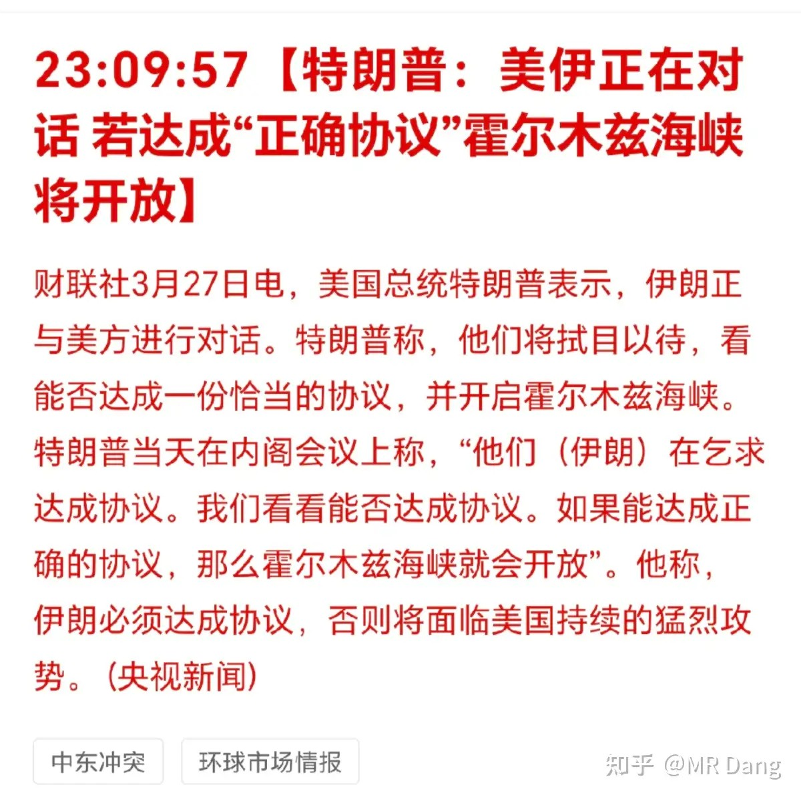

一会儿又过了10艘油轮，是送给他的礼物：

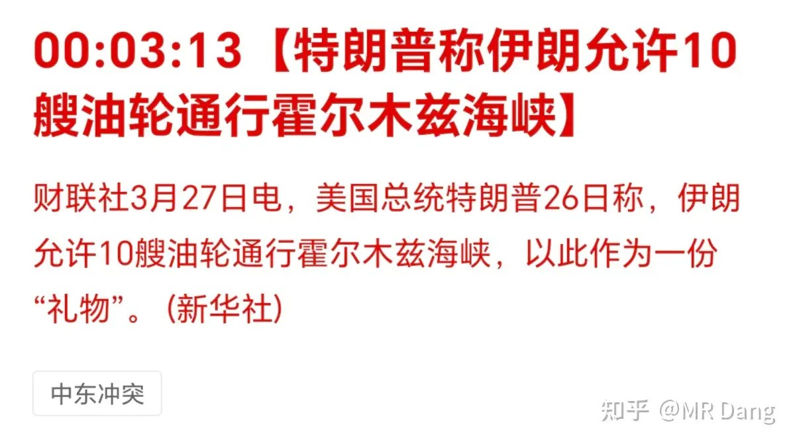

这个礼物我得讲两句，懂王自述他看了福克斯新闻，才知道昨天过了十艘船过去，他就自己脑补成这十艘船都是油轮，而且是朗子送给他的礼物，真是独属于懂王的浪漫。

以目前的公开数据查询，3月26一共过了9艘船，其中两个油轮。

一会儿又是推迟10天：

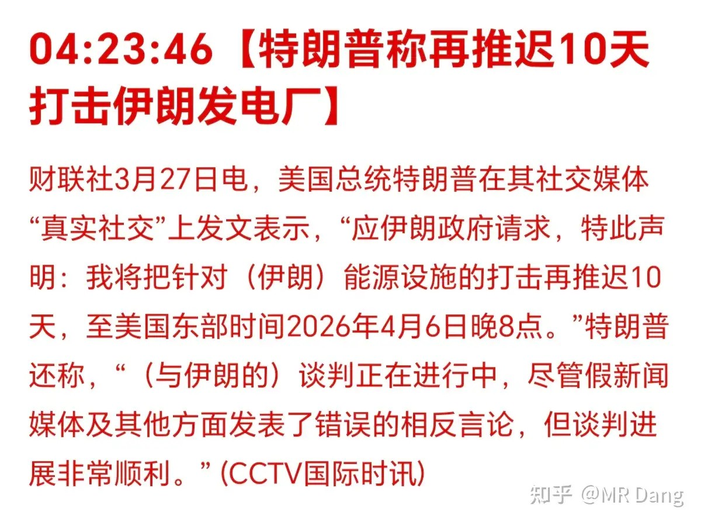

伊朗统计学：

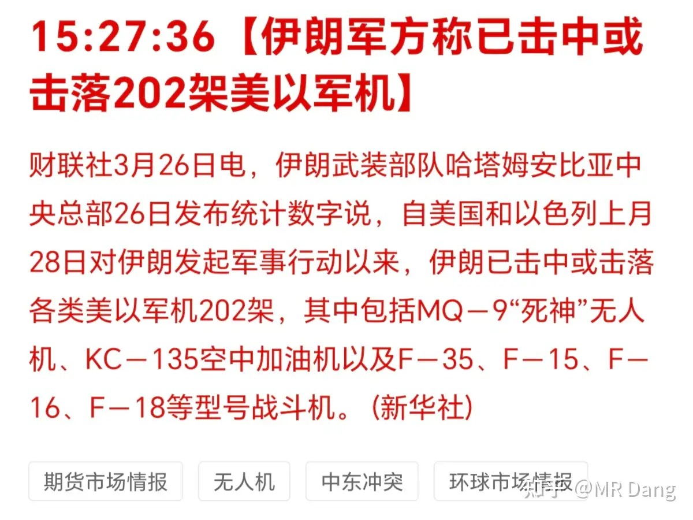

伊朗是懂统计学的，把击中或击落的各种型号单列出来，然后再加上大部分死神无人机，就凑成了这种F35等两百架飞机。

不过这也从侧面说明西大的军事统治力正在快速下滑，起码开战前我是没想到能打成回合制游戏。而且这都不是亮血条了，这起码打掉了半格血是有的。

懂王自称5月来东大走红毯：

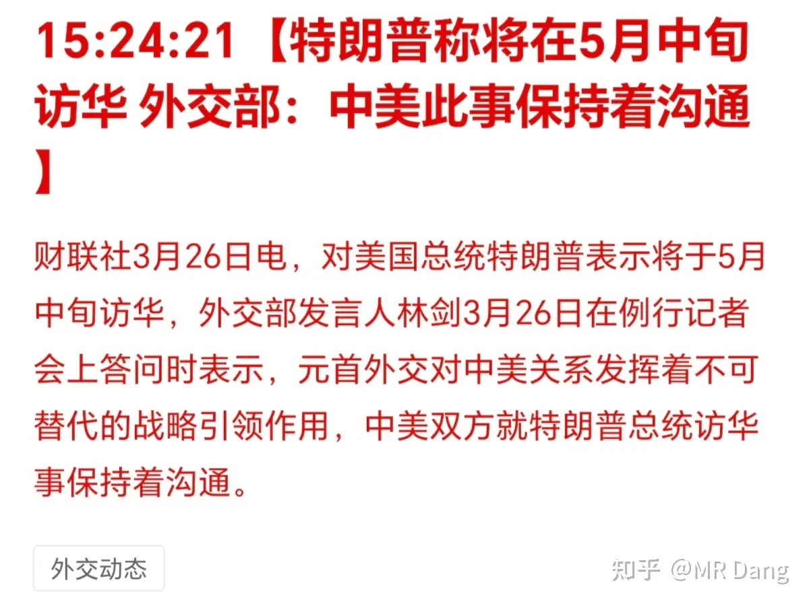

这个相信官方口径，跟着官方口径来。

黄马甲出财报了：全年亏损233亿，预告是亏233—243亿。

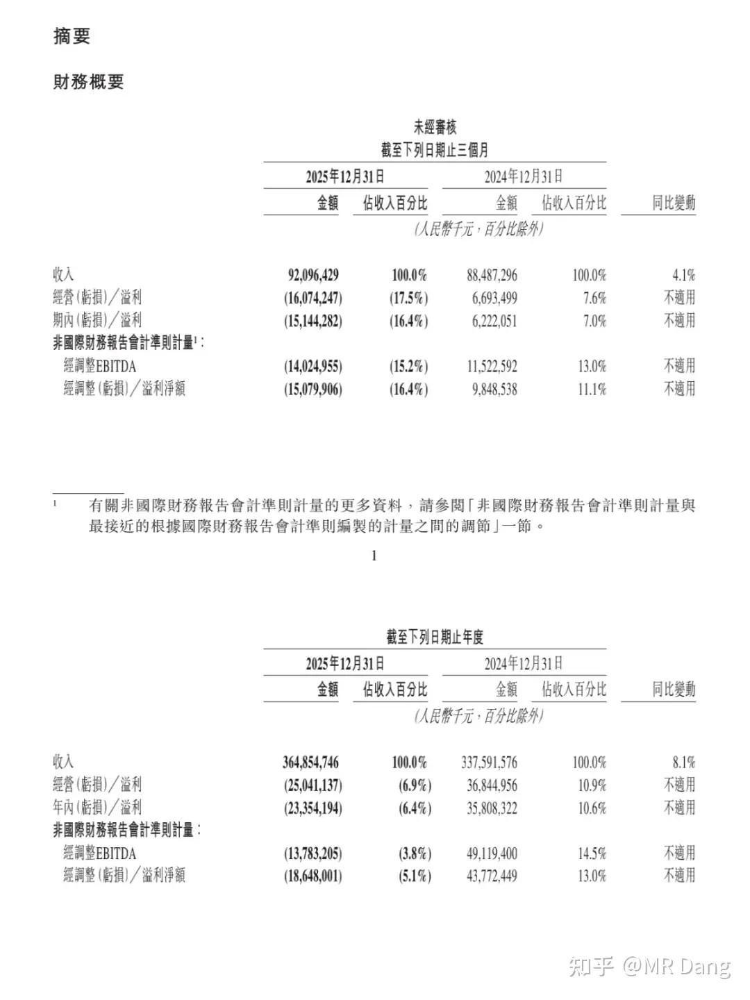

虽然亏了很多，但是仅看净利润是符合预期的。

不及预期的地方主要是资产负债表里负债太多了，另一方面把资产换成了现金，看架势是做好了和蓝马甲决一死战的准备。

另外战略上，国内业务还没搞好，就在海外攻城掠地，这是赌性很大的决策，步子大了容易扯到蛋。

当然也有一些好的地方，根据一些电话沟通内容，表明黄马甲是想利用海量的数据和投资，打造线下数据➕机器人➕ai大脑的商业帝国，野心还是很大的。

公司认为自己掌握的海量物理世界数据是最大的竞争优势。

昨天开了个反内卷的会议，把这几家卷的比较厉害的叫过去开会了：

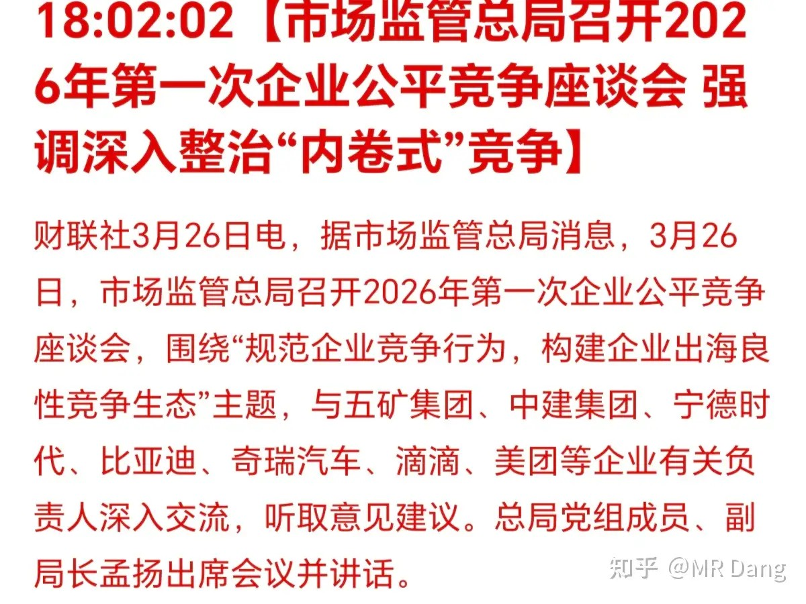

沐王财报：

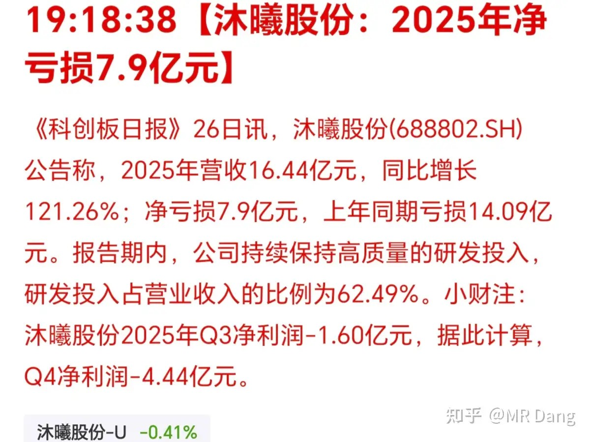

还好还好，还在亏，可以保持核心竞争力，继续使用市梦率估值。

一旦盈利就麻烦了，只要一按计算器，梦想就破灭了。

大宗商品：

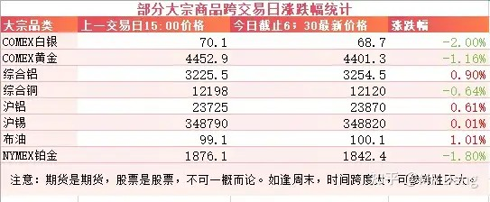

大宗商品整体上呈现原油走强，有色走弱的趋势，反应了资本市场对一系列消息的押注。

有色内部也有一定的分化，金银铜走弱，锡基本没动，铝走强。

外围市场：

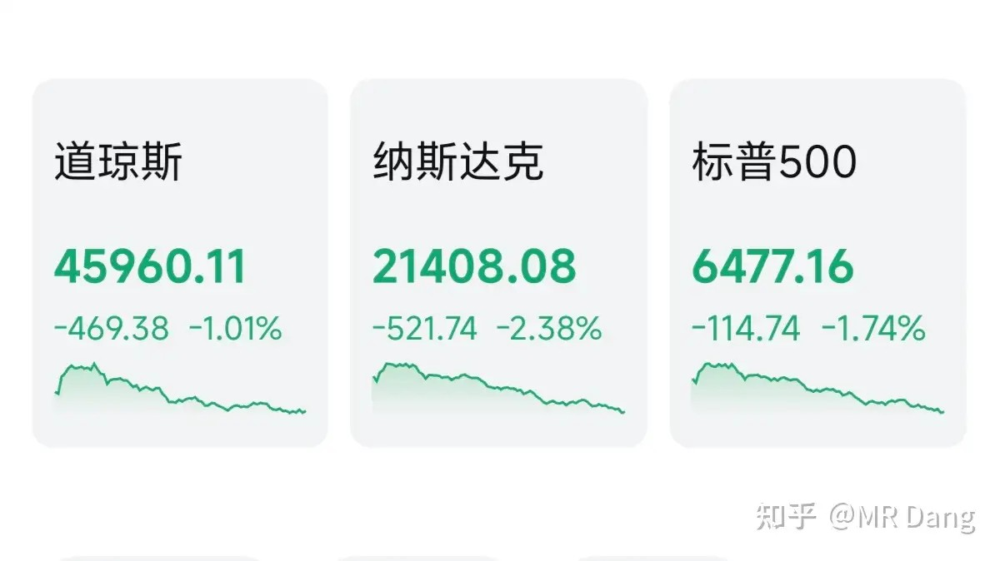

情绪不佳，对纳指来说，两个多点的回调算的上是重挫了。

谷歌发明了一种算法，可以节省大量内存，引起了市场对于存储需求的担忧，科技板块回调不少。

昨天个人净值回撤近一个点，银行半个点不到，资源一个半点，消费半个点，电网两个。

还好吧，基本和上证一个水平，半斤八两，强的有限，一起抱头挨打。

怎么说呢，现在这个时间点很尴尬，你要说便宜吧，市场里确实也有很多便宜货。

但是这些便宜货的便宜程度还不足以吸引投资者宁可冒着懂王的不确定性风险也要去捡。

要用一个词来形容现在的情绪的话，我觉得这个词可能是“疲惫”。

作为投资者来说，这段时间真的很累，一边要盯着伊朗那边的那点破事，一边还要盯着自己的账户不被导弹袭击。

伊朗那边反复拉扯，一会儿谈了，一会儿又没谈。一会儿打了，一会儿又停了。一个海峡，一会儿开了，一会儿关了，一会儿又收费了。

原油一会儿涨了，一会儿跌了，黄金一会儿跌了，一会儿又反弹了。

多头心里是虚的，空头又何尝不是？

而普通投资者的信息又是最后一手的，更是被耍的找不着北。

投资最需要的是确定性，面临不确定的态势，大家的交易热情也在被迅速磨灭。

所以现在的首要任务已经不是找潜在的机会了，而是调整自己的资产比例，增强投资组合抗风险的能力，同时省下的时间和精力去看一些经济学书籍，给自己充电，或者锻炼身体，打持久战。

市场总有回归繁荣的时候，投资者要做的就是在下一次市场恢复热闹景象的时候，手里有钱，脑子里有思路，手脑配合，合理致富。

最后希望今天挨打的时候可以轻一点，少亏当赢。周末最好也别出什么大事件了，有一句话叫周末的懂王格外危险。

补一张圈里的图：

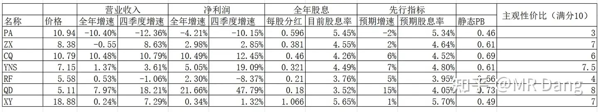

一个喜欢保护韭菜的博主，希望大家少少踩坑，多多赚钱！！！

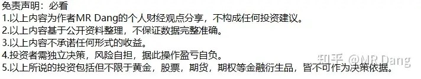

> [!comment]- 点击展开评论
>
> | 用户 | 时间 | 内容 |
> | :--- | :--- | :--- |
> | 钱包鼓鼓 | 4 小时前 | 每日打卡第23天今天估计又要挨打了，大家提前做好预期，这样被打的时候不会觉得那么疼应该做的事：调整的资产比例，增强投资组合抗风险能力多看少动，降低交易频率系统性地学习，坚持锻炼，保证睡眠 |
> | &nbsp;&nbsp;&nbsp;&nbsp;暖暖 | 2 小时前 | 哈哈 保证睡眠 |
> | 白羽 | 4 小时前 | 总结，轻仓看戏，不浪费时间，继续锻炼学习。 |
> | &nbsp;&nbsp;&nbsp;&nbsp;嗯哼 | 2 小时前 | 老哥，我在沈同学那边看过你，是同一个人嘛？ |
> | 曹星星帮主 | 3 小时前 | 辞职炒股的现在赶快回去工作，做多家务ETF |
> | &nbsp;&nbsp;&nbsp;&nbsp;MR Dang | 3 小时前 | 哈哈哈哈 |
> | 雪雪雪y | 4 小时前 | 俺也想要老师的回关 |
> | 子午线 | 3 小时前 | 党佬意思是，买个电瓶车，跑跑外卖吧 |
> | &nbsp;&nbsp;&nbsp;&nbsp;MR Dang | 3 小时前 | 还得是你 |
> | 厉飞雨 | 3 小时前 | 老师，这段时间辛苦啦！每天被懂王搞的天天要安抚我们。 |
> | &nbsp;&nbsp;&nbsp;&nbsp;洗洗睡吧123 | 2 小时前 | 杀人放火厉飞雨 |
> | &nbsp;&nbsp;&nbsp;&nbsp;在人间 | 3 小时前 | 韩老魔？ |
> | 揸fit路人 | 3 小时前 | 如果不能忍受30%的微跌，那就无法享受1%的大涨。 |
> | &nbsp;&nbsp;&nbsp;&nbsp;夏天的风 | 2 小时前 | 30的不算微跌，50才算 |
> | &nbsp;&nbsp;&nbsp;&nbsp;爱美的丫 | 3 小时前 | 太残酷了 |
> | 如来熊掌 | 4 小时前 | 来这里看图图，老师居然给我回关了，开心程度不亚于一个满仓涨停 |
> | momo | 4 小时前 | 最近的策略就躺着看账户绿的发光 |
> | Max233 | 4 小时前 | QD 银行过去的数据确实好，可是这么高的增速，26年又能继续保持吗？他优秀的数据已经体现在当前价格了吧，怎么对他的未来进行估值呢 |
> | &nbsp;&nbsp;&nbsp;&nbsp;带薪休假 | 1 小时前 | 不能 不要考虑了。 |

---

*本文件从MR Dang知乎页面转载*

---

**作者**: MR Dang
**链接**: https://www.zhihu.com/question/2020258925853824846/answer/2020759110715540779
**来源**: 知乎

*著作权归作者所有。商业转载请联系作者获得授权，非商业转载请注明出处。*
