# 如何评价2026年3月31日A股行情？

---

**发布时间**: 2026-03-31 07:15  |  **原文链接**: https://www.zhihu.com/question/2020788693821076510/answer/2022210453414192598  |  **点赞数**: 737 人赞同

**作者信息**: MR Dang​​独立投资人，小红圈同名，无其他小号。

---

## 正文内容

头条给到酱香科技：

53度飞天茅台涨了100块。

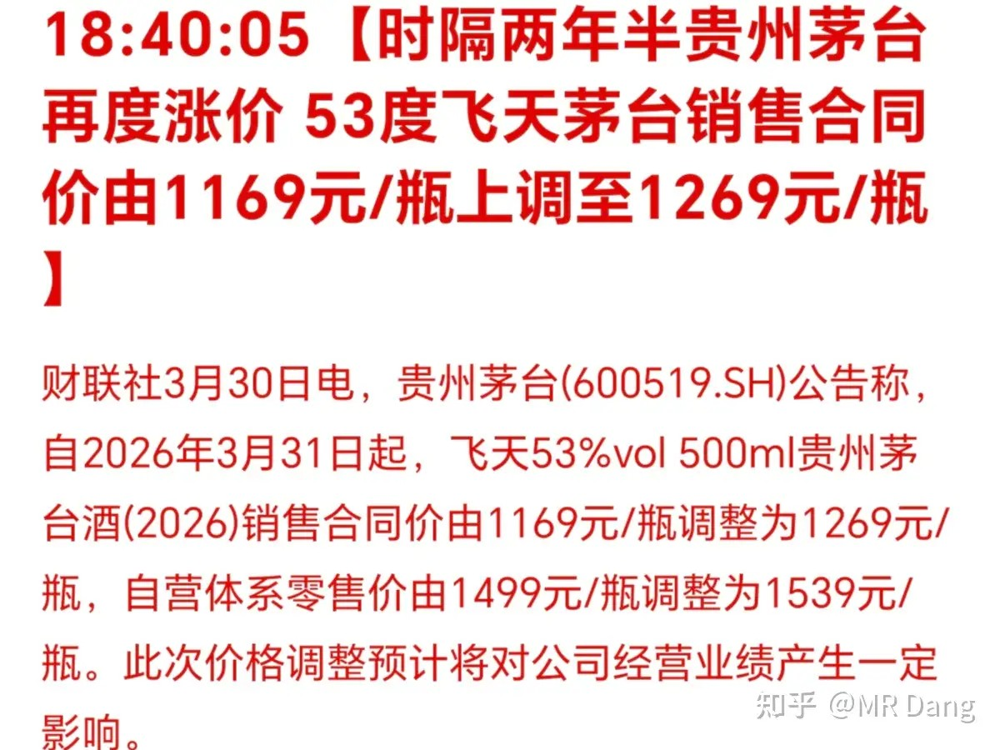

这个价格不是零售价，而是给经销商的价格。

茅子的经销商承平日久，之前赚的属实不少，现在行业不景气，也要出点血了。

至于自营的零售价，则是涨了40块。

这对整个高端白酒都是利好，茅子不涨价，跟个大boss一样站在那里，其他高端白酒都会承压。

目前从统计数据来说，白酒在短期内是有点边际改善的趋势在里面的。

而年轻人到底喝不喝白酒则是长期悬在整个行业头上的一把利剑。

某些媒体报道的央企提高上缴比例：

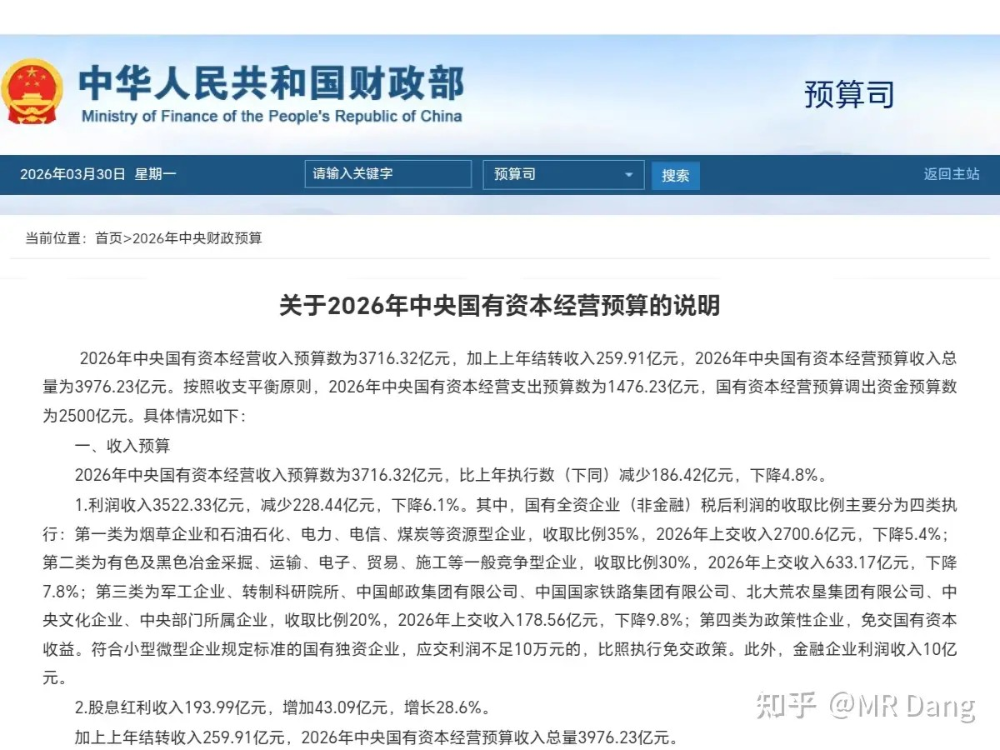

很多报道其实都是捕风捉影，所以我贴的是原文。

市场很多人误解成“国家多拿了，散户就少分了”。

其实上缴主体是央企集团母公司，不是上市公司。

要求的利润上缴，针对的是央企集团母公司的税后净利润，以及国有大股东从上市公司拿到的分红收入，不是直接从上市公司的利润里扣钱，更不会动散户应得的分红。

​所以传导逻辑是反向倒逼分红，说起来还算是利好呢。

不要被一些小作文带节奏。

当然也有一些负面信号：

提高上缴比例说明存在资金缺口，所以个别利润丰厚的垄断性行业可能面临税收政策变动的预期。。。

祖国母亲手头紧了，平时赚那么多，多孝敬孝敬也是应该的。

科威特海水淡化设施遭遇袭击：

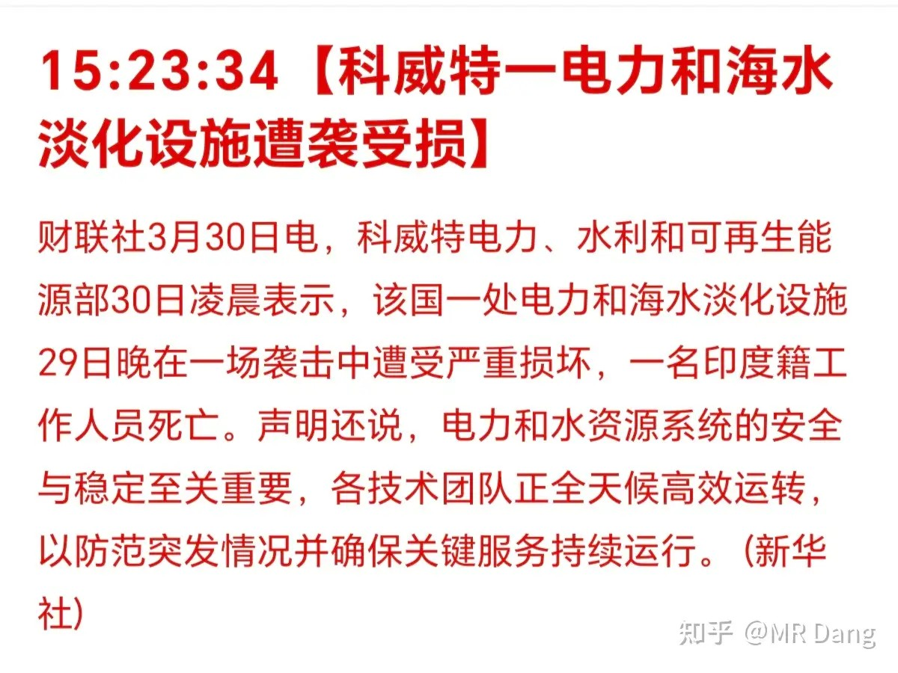

西大在中东的很多盟友都非常依赖海水淡化设施。

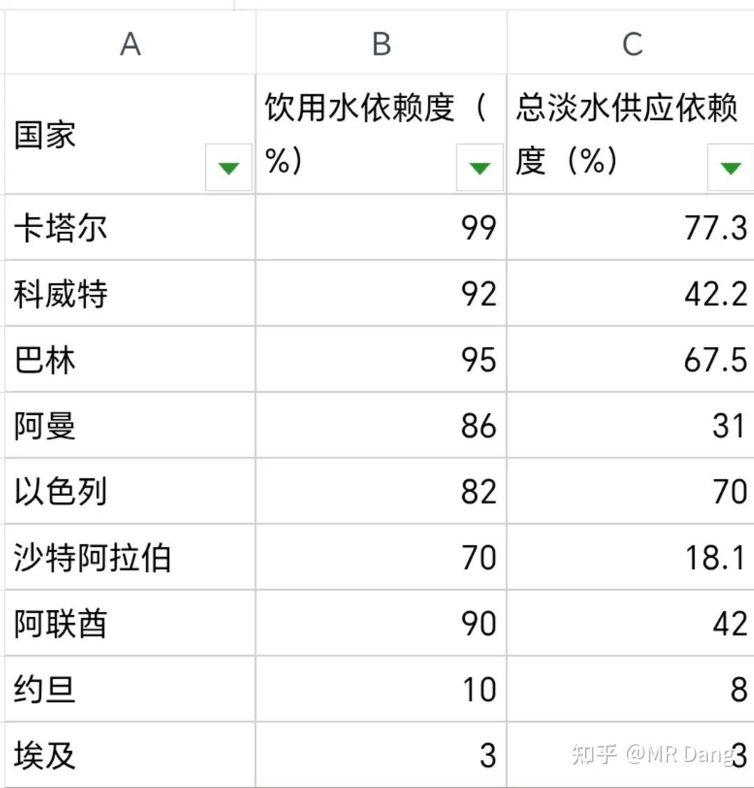

科威特属于非常依赖的一个国家，饮用水依赖度92％，这紧迫程度比原油还紧张，没油了最多影响经济，没饮用水了是会出大事的。

唉，只要打仗，不管谁赢谁输，买单的总是平头老百姓。

这类海水淡化设施的核心就是ro反渗透膜，可能会利好国内相关企业，需要观察接下来会不会有更多的淡化设施被攻击。

伊朗准备把霍尔木兹海峡建成海上收费站：

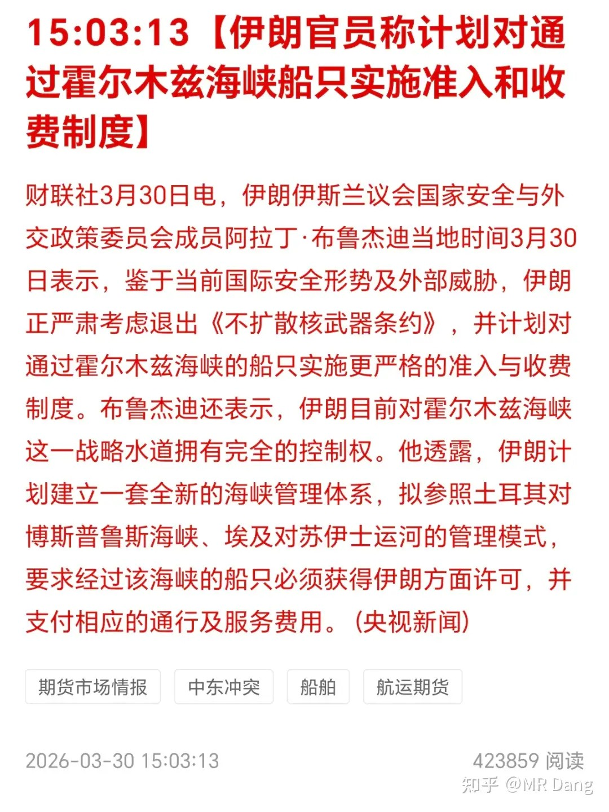

伊朗把霍尔木兹拿来和苏伊士运河进行对比，也准备收费了。

总觉得哪里不对劲，人家辛辛苦苦光挖就挖了十多年，运营了一个半世纪，属于是赌上了国运的投资。

霍尔木兹海峡可是天然海峡，你这整个收费站多少有点吃相难看了。

不过话又说回来了，事已至此，只要能过，就收的那点费用，算到全球通胀里面也是九牛一毛，危害比现在堵着不让过要小几个数量级。

伊朗和西大日常放狠话环节：

懂王恼羞成怒：

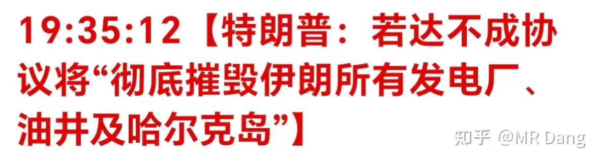

伊朗继续头铁：

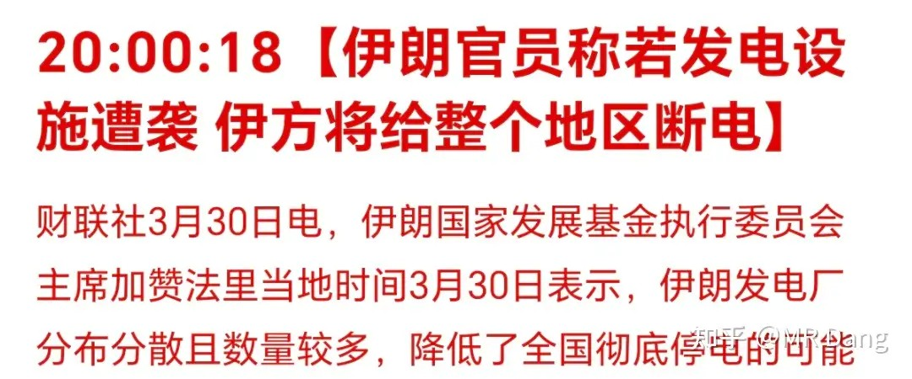

给个痛快话吧，一天天的看的心累。

杭州：公积金可以缴纳物业费

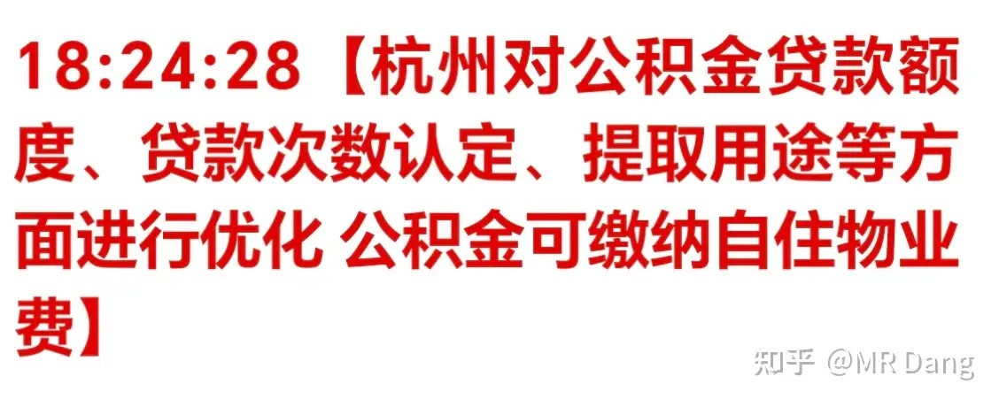

怎么说呢，相关行业牙膏早就挤爆了，现在挤的这点作用很有限。

有报道称内存崩了：

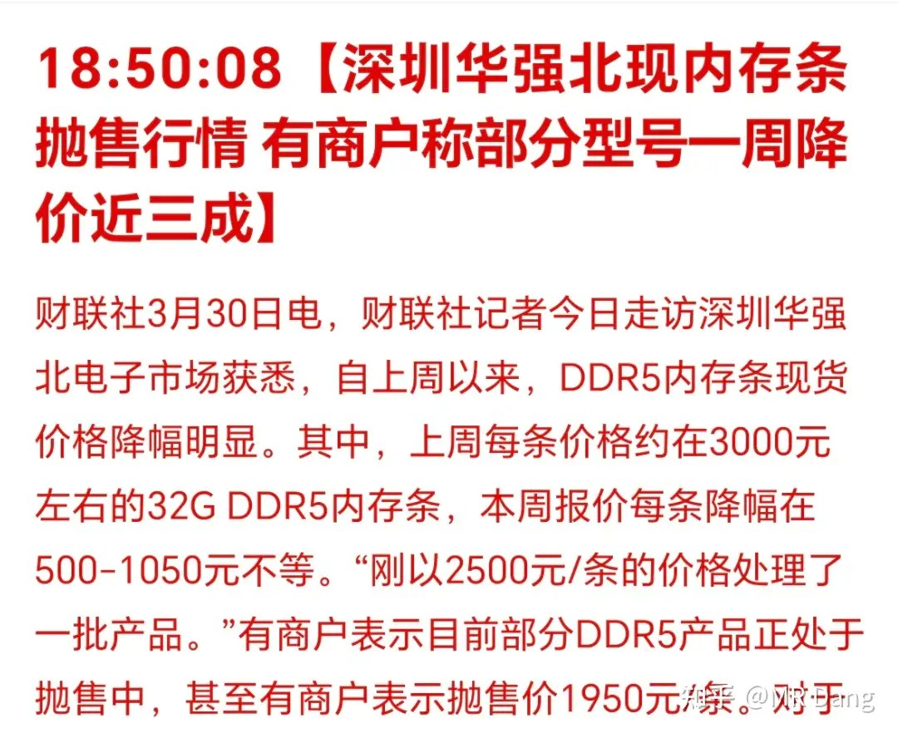

内存主要分为ddr5和hbm两种。

现在算力还有ai需求比较大的是hbm，ddr5属于消费级，咱们用的主要是这类。

之前内存荒的时候，指的也是hbm，不过也有资金趁机去炒ddr5。

现在内存鬼故事来了，ddr5有点像是跟涨的杂毛股，价格就崩了。

至于什么鬼故事，除了前几天的新技术可以减少内存的需求。

更直接的是open ai之前下的几百亿美元订单也黄了，屋漏偏逢连夜雨。

某龙头投行券商发布业绩：

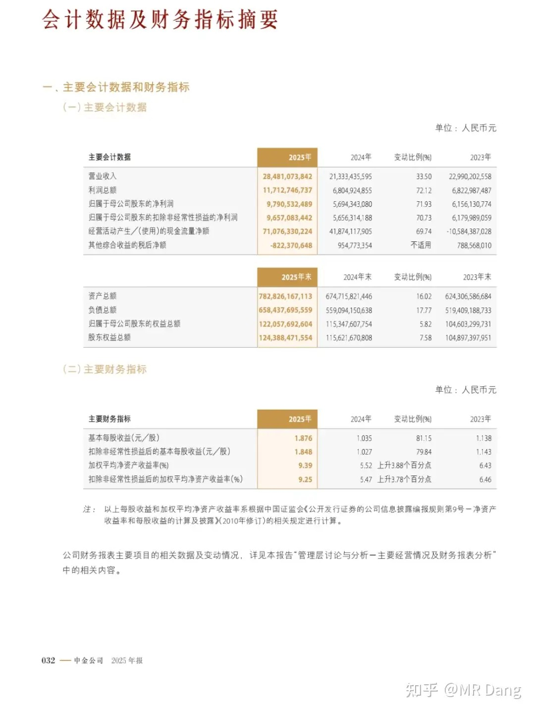

还记得之前说过么，券商业绩如何，和证券印花税增速比一比就行了，那是把尺子。

所以按照这把尺子来的话，它的业绩是很不错的。

估值也不贵，还有现金选择权，当成一份便宜的看涨期权是没毛病的。

大宗商品：

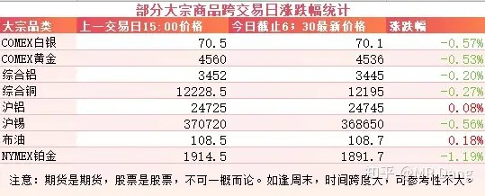

隔夜变化不大，都在正常波动范围内。

外围市场：

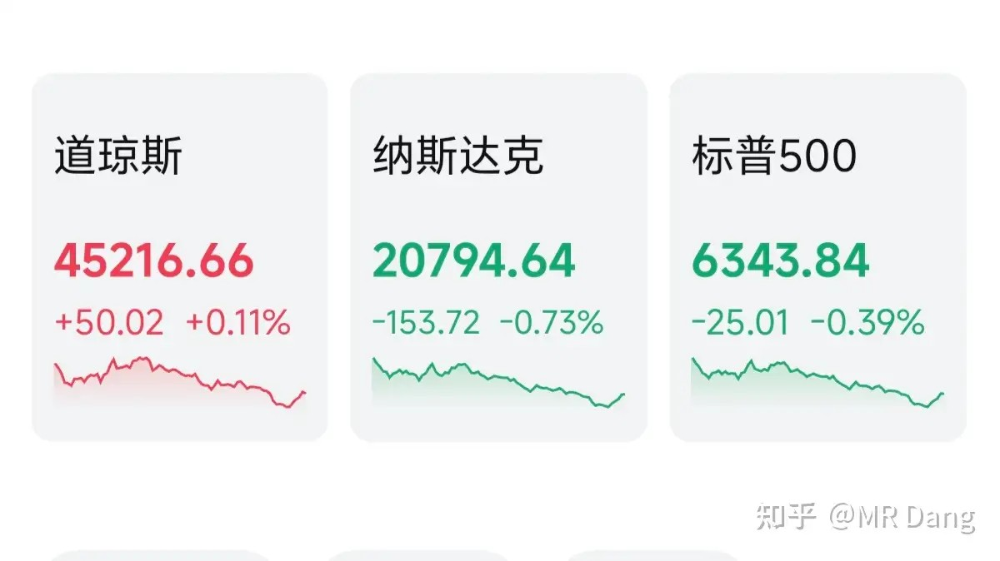

美三大股指涨跌不一，由于前面所说的内存鬼故事，导致内存厂商股价大跌，带动科技股整体回调，纳指承压。

昨天个人组合净值回血半个多点，银行达到平均水平，资源两个点，消费原地不动，电网绿了半个点，又被捆在电椅上一顿摩擦。

小幅跑赢指数，非常安逸的一个交易日了，要是天天都有这幅好光景，做梦都能笑醒。

做投资就需要自己给自己缓解压力。

投资的痛苦很多时候来自想要的太多，而能得到的又太少。

要是还觉得不满意，不妨看看角落里无人问津的恒科，又创新低了，对比一下的话，其实挣得少是最微不足道的“痛苦”。

最近披露年报的银行又陆陆续续多了好几家，我也把更新情况放在圈里了。

总的来说，银行的边际改善情况呈现分化，除了个别几家银行有点恶化，大多数银行的经营处于L形探底的趋势，还有个别银行处于V形探底的趋势。

烂银行派息超预期，涨了这么多，股息率还有5.8％

之前发过一篇测算股息率的文章，最后一步就是修正：

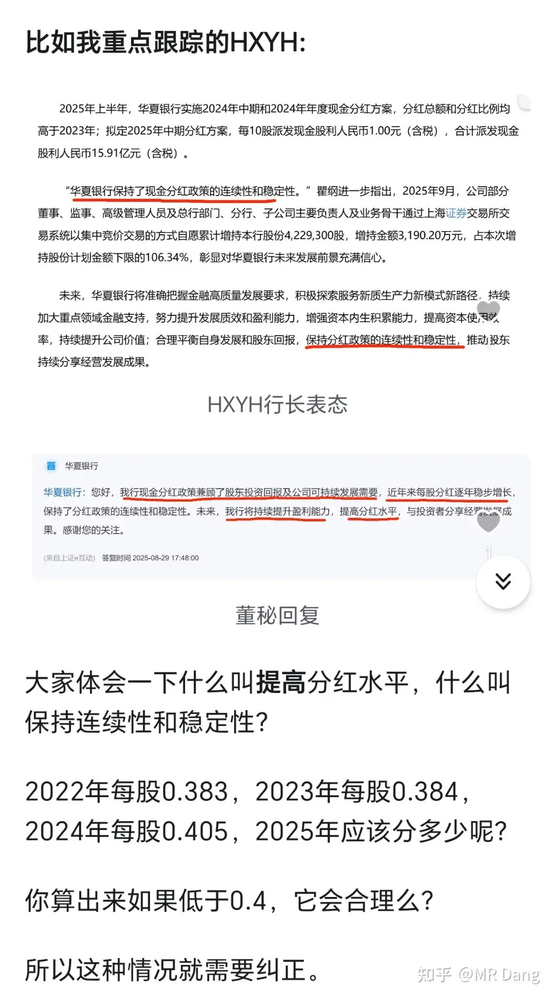

当时给出的结论是不低于0.4，现在这一预测已经实现，并且还超预期完成。

一个喜欢保护韭菜的博主，希望大家少少踩坑，多多赚钱！！！

> [!comment]- 点击展开评论
>
> | 用户 | 时间 | 内容 |
> | :--- | :--- | :--- |
> | 钱包鼓鼓 | 13 小时前 | 每日打卡第25天行业利好：央企红利上缴是利好（倒逼分红，关注高分红央企蓝筹）茅台提价是改革信号（关注高端白酒板块的整体机会）可以关注的：海水淡化产业链（若冲突持续，RO反渗透膜等相关技术企业可能存在机会）银行股的分化机会（经营改善、分红超预期的） |
> | &nbsp;&nbsp;&nbsp;&nbsp;广智救我 | 53 分钟前 | 这个海水淡化，有大佬了解吗？重建海水淡化厂，时间久否？ |
> | 知识荒原 | 13 小时前 | 现在每天早上七点，儿子早读，我在一边看圈子文章。今早他突然来了一句，他说错了怎么办。我回答他，我肯定得有自己的思考啊，理解才行，尽信书还不如无书呢。说到这里， 希望只会要代码无脑冲，拿不住割肉的再多点，不然我们怎么赚钱。 |
> | &nbsp;&nbsp;&nbsp;&nbsp;麦大林 | 13 小时前 | 你没有怼他一句好好看他的书而是教会他独立思考，我觉得你也是个好爸爸 |
> | 如来熊掌 | 13 小时前 | 笨拙但勤奋的吊车尾来顶顶， |
> | 端午zombie | 14 小时前 | 烂银行的拨备问题隐患不小啊，提了40亿拨备出来稳住利润，拨备覆盖率低到143%了。这样竭泽而渔，后面能不能发出股息是不是都要打个问号？ |
> | 揸fit路人 | 13 小时前 | 我身边的20出头的小伙伴，几乎没人愿意主动喝白酒，大多数不喝酒或者喝小甜酒，低度果酒。我对白酒未来持悲观态度。 |
> | Breaking Bad | 11 小时前 | D哥早，最近都在沉默看乎看圈。最近的行情起伏不定，看评论里的网友红了开心，绿了伤心。个人持仓美股港股A股都有，但涨跌对我影响不大，心态也很少受影响。不知道是我仓位管理优秀，还是真的懒的动。（ps：D哥之前说过懒人不适合投资）。最近家里有喜事，新添福宝小棉袄。希望她来到这个家能开心幸福 |
> | &nbsp;&nbsp;&nbsp;&nbsp;MR Dang | 11 小时前 | 恭喜恭喜，羡慕哭了 |
> | &nbsp;&nbsp;&nbsp;&nbsp;一白先生 | 11 小时前 | D哥家的公子是不是正是“老登，看剑！”的年纪 |
> | 铝洲牧 | 13 小时前 | Dang大评论区数量指数处于低位，那大盘应该不用担心 |
> | &nbsp;&nbsp;&nbsp;&nbsp;逆天唯我 | 7 小时前 | 尾市跳水是人气上来了吗 |
> | &nbsp;&nbsp;&nbsp;&nbsp;铝洲牧 | 5 小时前 | 不按套路出牌呀 |
> | 芒果咬人 | 11 小时前 | 奇怪，昨天铝那么大利好，平替昨天微涨今天又跌了回去，有点看不懂，有大佬解读吗？ |
> | 张春辉 | 13 小时前 | 性价比的银行越来越多了，挑花了眼了，我还是抱着烂银行不撒手了 |
> | 小彭 | 14 小时前 | 昨天刷到今年蚊子迎来史诗级加强，相关价位在低位，老师觉得这是不是这个很不错的赛道 |

---

*本文件从MR Dang知乎页面转载*

---

**作者**: MR Dang
**链接**: https://www.zhihu.com/question/2020788693821076510/answer/2022210453414192598
**来源**: 知乎

*著作权归作者所有。商业转载请联系作者获得授权，非商业转载请注明出处。*

---

## 相关阅读

**📈 每日行情评价系列：**
- [[20260330-如何评价2026年3月30日A股行情？|3月30日行情]] - 非农预期、央企红利上缴、海水淡化机会、银行分化
- [[20260327-如何评价2026年3月27日A股行情？|3月27日行情]] - 懂王谈判反复、黄马甲财报、市场情绪疲惫期
- [[20260326-如何评价2026年3月26日A股行情？|3月26日行情]] - 中远海运恢复订舱、伊朗否认弃核、SpaceX上市机会
- [[20260325-如何评价2026年3月25日A股行情？|3月25日行情]] - 懂王画线赢学、伊朗六条变三条、停火传言
- [[20260324-如何评价2026年3月24日A股行情？|3月24日行情]] - 懂王赢学大战、伊朗否认谈判、米兰喊降息四次
- [[20260323-如何评价2026年3月23日A股行情？|3月23日行情]] - 央行宏观审慎调节、红票子升值、宇树机器人上市
- [[20260320-如何评价2026年3月20日A股行情？|3月20日行情]] - 个人净值三点回撤、银行压舱、资源板块惨烈

**📅 周末闲聊系列：**
- [[20260214-春节特辑（年二十七）|春节特辑]] - 春节期间市场展望与投资思考
- [[20260207-周末唠嗑（2月7）|周末唠嗑]] - 市场情绪与仓位管理讨论

**🌱 韭菜保护系列：**
- [[20260303-对于2026年3月3日A股市场行情，大家有什么预测和看法？|3月3日行情]] - 两会期间行情特征分析
- [[20260302-怎么看待2026年3月2日A股行情？|3月2日行情]] - 关税博弈下的市场应对策略
