# 如何看待 2026 年 4月 1日 A 股市场行情？

---

**发布时间**: 2026-04-01 07:35  |  **原文链接**: https://www.zhihu.com/question/2021974107185579029/answer/2022577691325407918  |  **点赞数**: 489 人赞同

**作者信息**: MR Dang​​独立投资人，小红圈同名，无其他小号。

---

## 正文内容

一觉醒来，终于等来了好消息，伊朗表示在某些前提下愿意结束战争：

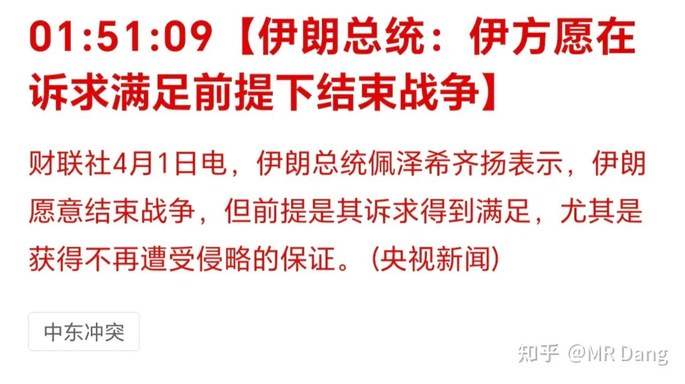

其实昨天懂王也表示了可能会在霍尔木兹不开的情况下结束。

还阴阳了两句盟友，让他们想要油就自己去抢。

他们肯定都没输，朗子打着打着多了个海峡，懂王的原油期货不知道赚了几位数。

输的是那些中东王爷，还有咱们周边的这些邻居。

大毛赢麻了，躺赢那种。

那相对应的，二毛属于躺枪。

东大的话，其实多少有影响，但是咱们忍耐力强，忍一忍就过去了，问题不大。

最惨的还是老百姓，不管哪边的。

希望世界早日恢复和平。

股神：

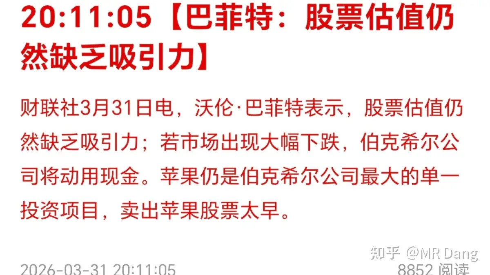

巴菲特很久以前就手握巨量现金了，他拿着现金肯定不是单纯的因为喜欢现金，那肯定是有别的心思在里面的。

股神的表态可以适当参考，但是也不要迷信。

巴菲特一直表态航空股不能投，是价值毁灭。结果2020年一头就冲了进去，后来半年不到亏了几十亿美元。

所以咯。。。投资者的话不要太当真，哪怕是股神也会有“最后一次”的侥幸心理。

又一海水淡化厂受损，不过这次应该是伊朗的：

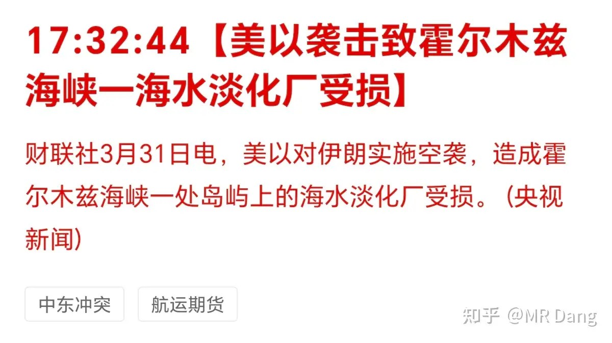

两边都是眦纠必报，趁着没结束多炸一炸。

东大有三艘船通过了霍尔木兹海峡：

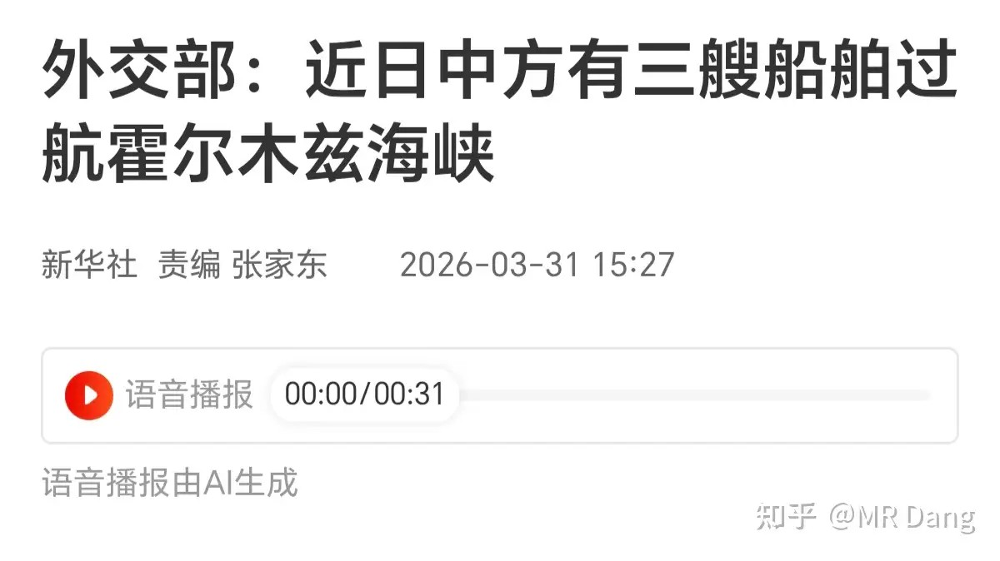

事实是可以确认的，至于影响的话，象征意义大于实际意义，就咱们这个经济体量，还需要更多的船。

统计局公布3月制造业pmi指数50.4，小超预期，重返扩张区间。

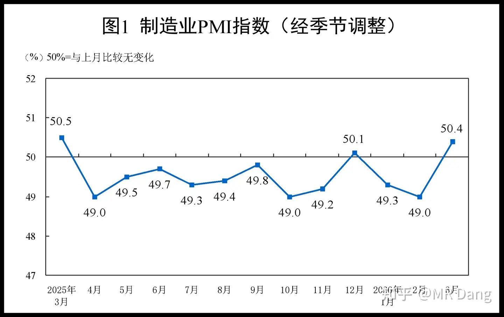

这个PMI指数是最适合普通人看的宏观数据之一，50以上代表好，50以内代表一般，简单易懂。

某商业航天龙头ipo中止：

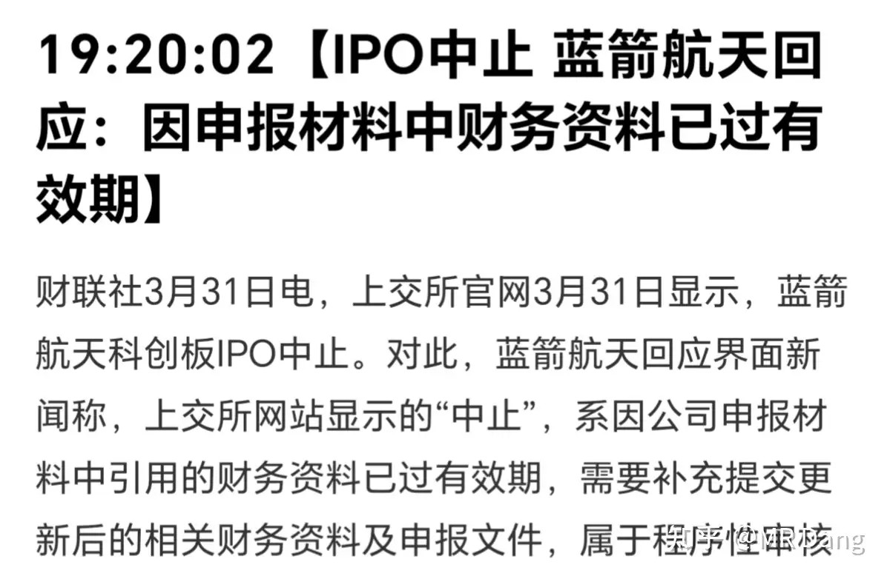

是中止，不是终止，意味着还会开启。

不过这活干的不漂亮，这么重要的事情还有这么低级的失误，属实有点草台班子了。

某明星储能股业绩不及预期：

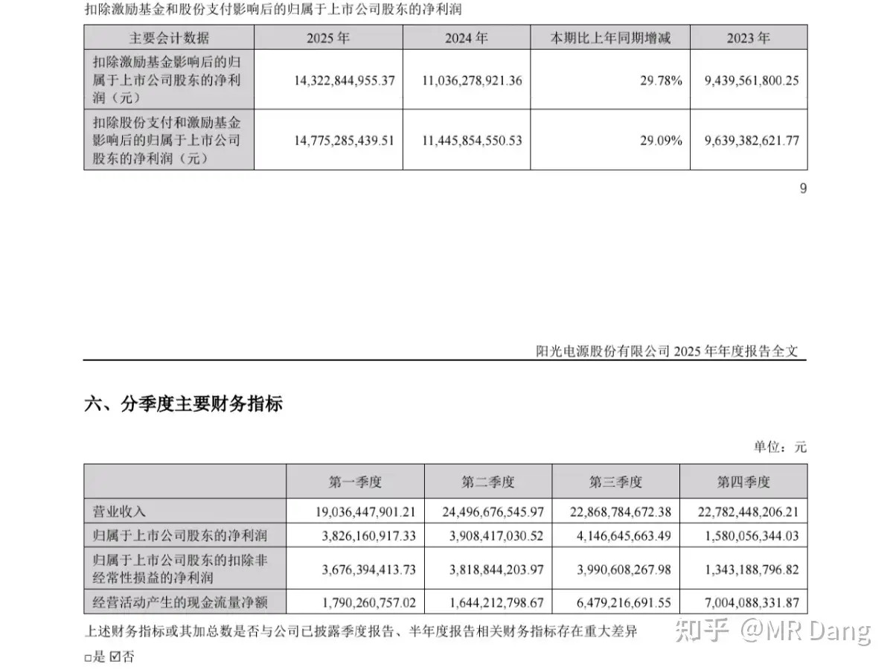

四季度业绩炸了，不太好，持有相关标的的投资者注意风险。

很多人问的比较多的某钾肥公司：

其实全在预料内，这是出预告时候我的预测：

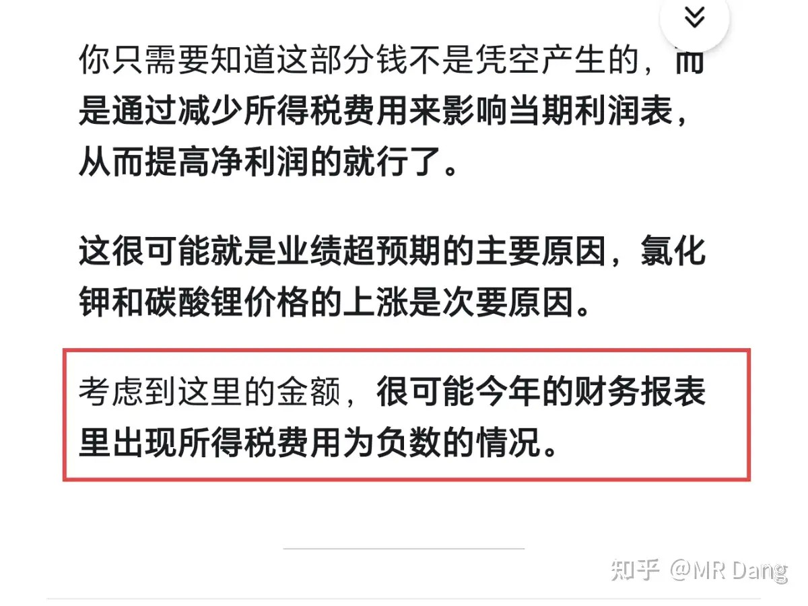

这是正式财报：

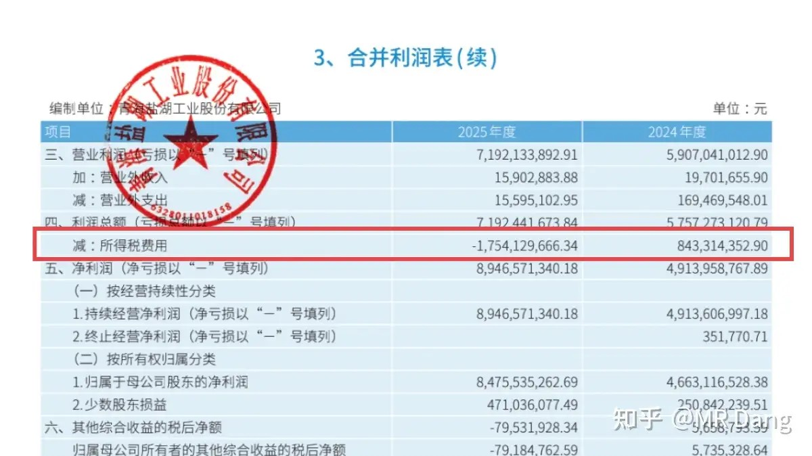

说句不那么谦虚的话，看那篇回答就够了，和年报里的实际情况完全一致。

也就是说，这是一个不太符合市场预期，但是完全符合我个人预期的年报，净利润的超预期增长几乎来自所得税费用的处理。

公司基本面其实还可以，但是净利润增长没有业绩预告里那么炸裂，所以2026年的业绩预期不要打太高。

之前我说做职业的价值投资，最好需要CPA的能力打底，很多投资者觉得门槛太高了，认为我是故意夸大投资的难度。

但事实就是，如果碰到这种硬仗，没有缜密的分析能力和牢靠的财务知识是很难得出具有前瞻性的结论的，即使得到了，因为对能力的不自信，也很难对投资实践活动有现实指导意义。

投资是一件很有成就感的事情，特别是当你抽丝剥茧，从公开信息中窥见真相的一鳞半爪，又在未来的某天得到证实。

赚不赚钱的先放一边，那一刻的成就感反正是直冲天灵盖的，学霸应该知道我要表达的啥意思，类似于解开了一道高考压轴题的快感。

大宗商品：

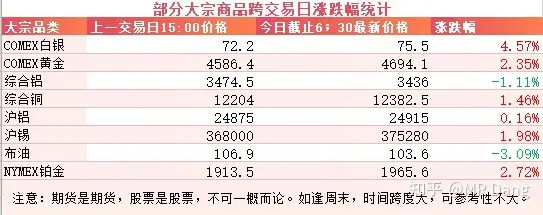

受到战事缓和预期影响，原油下跌，金银等有色金属价格上涨，弹性最大的白银涨幅最多，有四个多点。

黄金也逼近4700大关，我前几天网格买的实物小金条也开始浮盈啦。

外围市场：

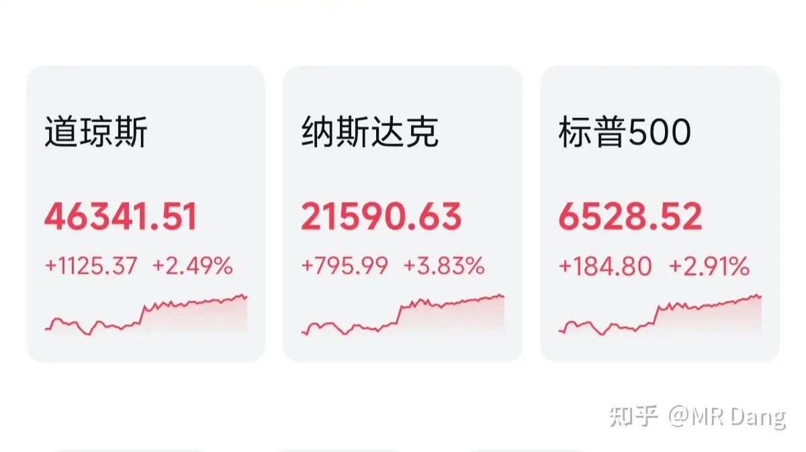

美股收复失地的一天，三大股指都有不错的涨幅，前期回调最多的纳指反弹了接近四个点。

作为A股风向标的A50股指期货也涨了一个多点。

就情绪来说，今天的盘前情绪是比较积极的。

昨天个人组合净值回血半个点，银行一个半点，资源绿了一个，电网绿了一个，消费红了半个点。

比较难评吧，属于是体验感分化比较严重的行情，拿着的东西不同，主观感受会大不一样。

如果不是资源类和电网拖后腿，以银行的走势，这会儿本可以创新高的。

不过大盘指数也不好，这属于系统性风险，能红已经捂嘴笑了，要还嫌弃肉少就多少有点矫情了。

仓位控制和分散配置这样的车轱辘话天天念叨，希望大家听进去，不要觉得烦。

特别是有反弹的时候，投资者容易被胜利冲昏头脑，一看红彤彤的，心痒难耐，偶尔把持不住，就会犯下投资者最容易犯的错误。

一个喜欢保护韭菜的博主，希望大家少少踩坑，多多赚钱！！！

> [!comment]- 点击展开评论
>
> | 用户 | 时间 | 内容 |
> | :--- | :--- | :--- |
> | 九鼎记 | 3 小时前 | 愚人节的消息能信吗，高开减仓，等下波下杀 |
> | 钱包鼓鼓 | 2 小时前 | 每日总结第25天PMI数据50.4是一个积极信号，关注顺周期板块（银行）。储能业绩不及预期的要注意风险。多学习CPA相关知识，学会自己看财报。 |
> | &nbsp;&nbsp;&nbsp;&nbsp;豆子 | 2 小时前 | 可能美股跌了那么多天，确实需要反弹一下了，各种消息，有用的就拿来当个理由用。 |
> | &nbsp;&nbsp;&nbsp;&nbsp;小鹏飞机 | 2 小时前 | 对啊，和开始接触时的条件差不多啊？而且我也不信黄毛真的taco |
> | 长白山人参 | 2 小时前 | 之前说埋伏世界杯 结果现在苏超都开始成热点了 |
> | 鬼大 | 2 小时前 | 烂银行是真好啊，好银行是真烂啊 |
> | &nbsp;&nbsp;&nbsp;&nbsp;小庄sail | 49 分钟前 | 好银行今天涨的还行 |
> | 青峰 | 2 小时前 | 三月中位数亏损10%以上，四月第一天是回血还是愚人节？ |
> | Niki | 2 小时前 | 哈哈哈哈“但是咱们忍耐力强，忍一忍就过去了，问题不大” 说对了 |
> | 明明明之 | 2 小时前 | 战争停不了 |
> | &nbsp;&nbsp;&nbsp;&nbsp;MR Dang | 2 小时前 | 希望世界早日恢复和平 |
> | KJAY | 2 小时前 | 最近能在主页上刷到您了，好事情。 |
> | &nbsp;&nbsp;&nbsp;&nbsp;MR Dang | 2 小时前 | 哈哈 |
> | 大明1521 | 2 小时前 | 大毛赢了？多看看信息吧。安全生产很重要！不少俄工人在炼油厂港口抽烟，3月份多少厂炸了？波罗的海石油港口到现在还燃烧呢。 |
> | &nbsp;&nbsp;&nbsp;&nbsp;monnneyyy | 2 小时前 | 说的是一回事吗 |

---

*本文件从MR Dang知乎页面转载*

---

**作者**: MR Dang
**链接**: https://www.zhihu.com/question/2021974107185579029/answer/2022577691325407918
**来源**: 知乎

*著作权归作者所有。商业转载请联系作者获得授权，非商业转载请注明出处。*

---

## 相关阅读

**📈 每日行情评价系列：**
- [[20260331-如何评价2026年3月31日A股行情？|3月31日行情]] - 央企红利上缴与海水淡化话题延续、银行分化观察
- [[20260330-如何评价2026年3月30日A股行情？|3月30日行情]] - 非农预期、央企红利上缴、海水淡化机会、银行分化
- [[20260327-如何评价2026年3月27日A股行情？|3月27日行情]] - 懂王谈判反复、黄马甲财报、市场情绪疲惫期
- [[20260326-如何评价2026年3月26日A股行情？|3月26日行情]] - 中远海运恢复订舱、伊朗否认弃核、SpaceX上市机会
- [[20260325-如何评价2026年3月25日A股行情？|3月25日行情]] - 懂王画线赢学、伊朗六条变三条、停火传言
- [[20260324-如何评价2026年3月24日A股行情？|3月24日行情]] - 懂王赢学大战、伊朗否认谈判、米兰喊降息四次
- [[20260323-如何评价2026年3月23日A股行情？|3月23日行情]] - 央行宏观审慎调节、红票子升值、宇树机器人上市

**📅 周末闲聊系列：**
- [[20260214-春节特辑（年二十七）|春节特辑]] - 春节期间市场展望与投资思考
- [[20260207-周末唠嗑（2月7）|周末唠嗑]] - 市场情绪与仓位管理讨论

**🌱 韭菜保护系列：**
- [[20260303-对于2026年3月3日A股市场行情，大家有什么预测和看法？|3月3日行情]] - 两会期间行情特征分析
- [[20260302-怎么看待2026年3月2日A股行情？|3月2日行情]] - 关税博弈下的市场应对策略
