# 如何评价2026年4月2日A股行情？

---

**发布时间**: 2026-04-02 07:31  |  **原文链接**: https://www.zhihu.com/question/2021640281150243871/answer/2022939304561846131  |  **点赞数**: 513 人赞同

**作者信息**: MR Dang​​独立投资人，小红圈同名，无其他小号。

---

## 正文内容

头条是懂王又威胁退群了：

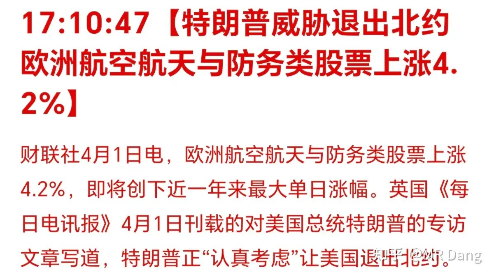

懂王还说北约是“纸老虎”，我怎么记得纸老虎这词发明的时候不是这么用的吧，哈哈。

讲真的，懂王也就是吓唬吓唬盟友，真要退群的话得走参议院的程序的，对选票要求不低，大概率是通过不了的。

盟友也知道这一点，所以表态还是一如既往的不愿掺和：

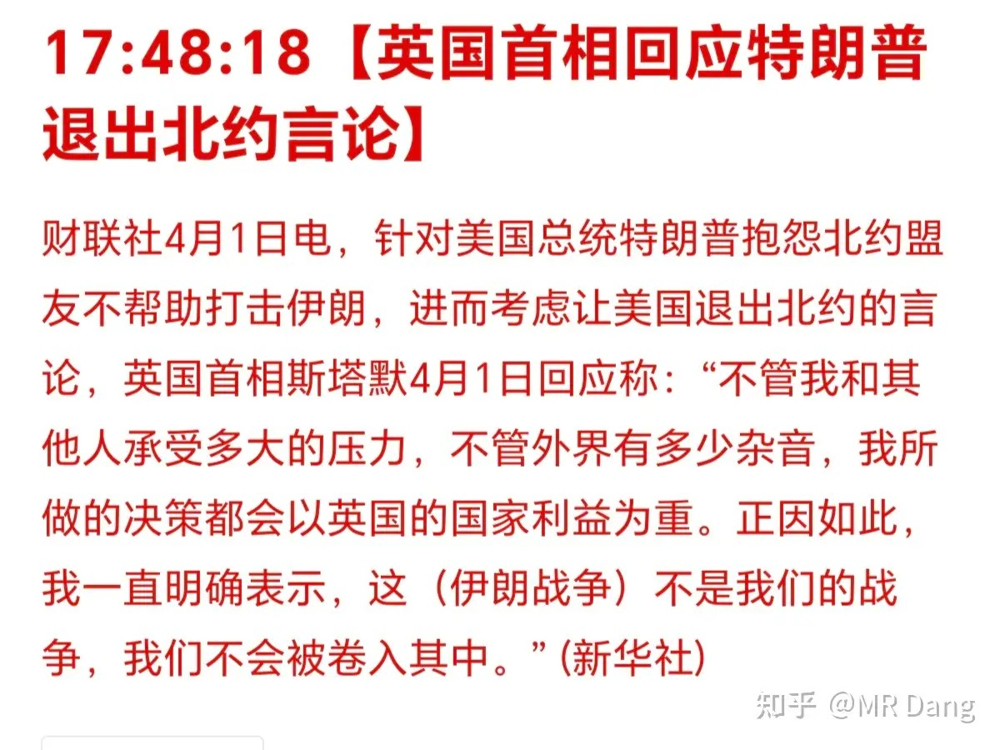

懂王又称朗子求饶：

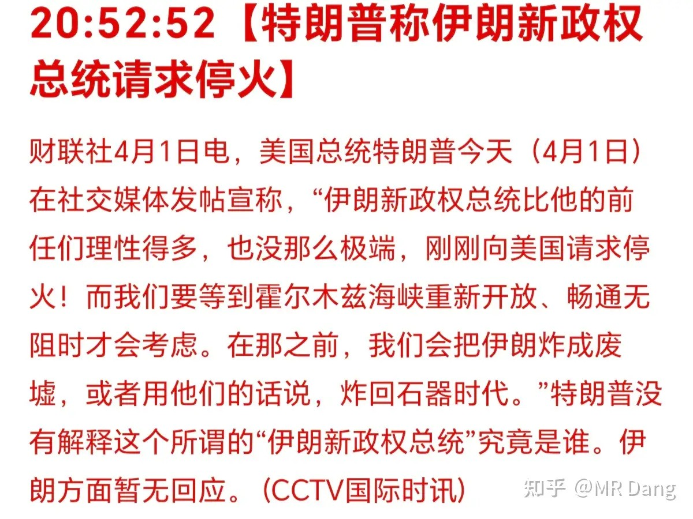

不知道朗子知不知道自己求饶了这回事。

以遭遇开战以来最大规模袭击：

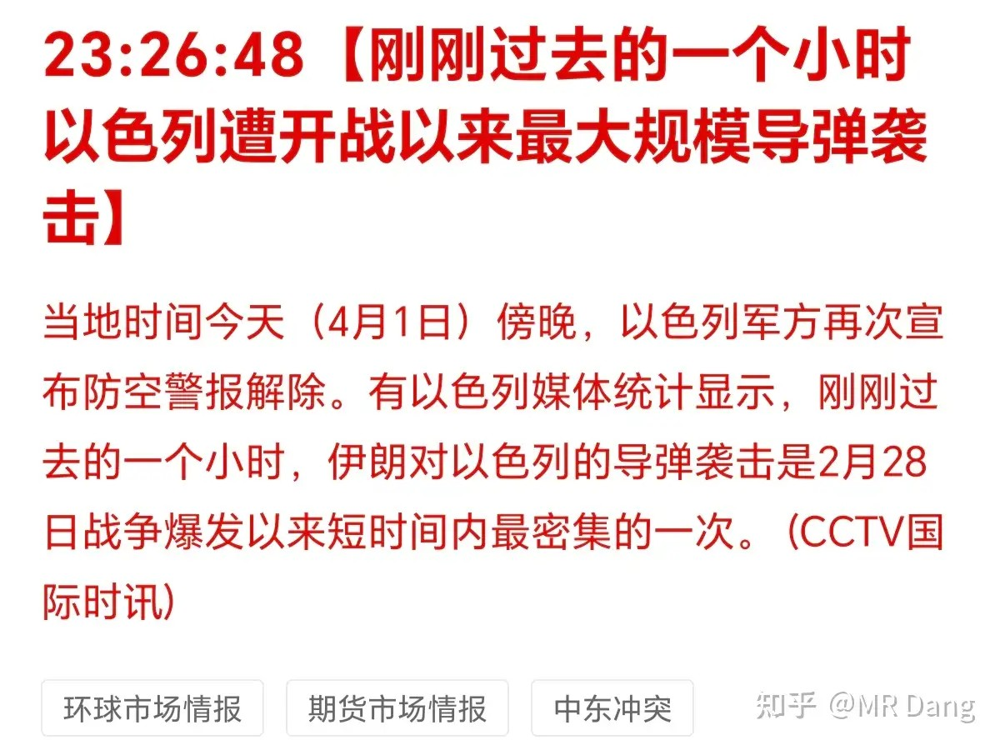

伊朗发布了对美的公开信：

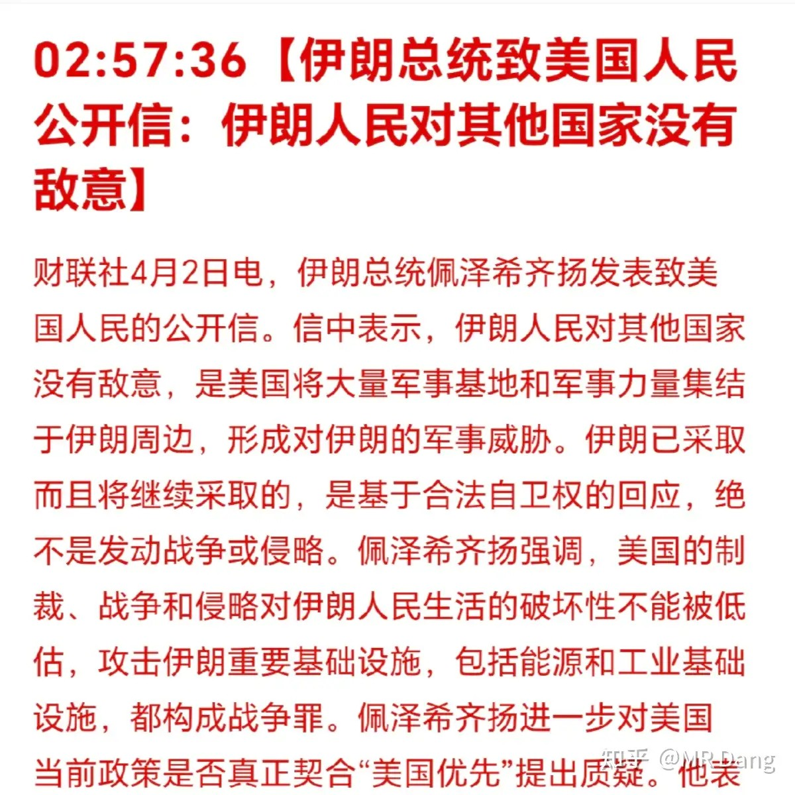

在信里比较诛心的是把懂王开除了“MAGA”籍，这个确实会对他造成一定舆论压力，最近西大国内反对战争的声音还挺大的。

最后伊朗还是表达了核心诉求：

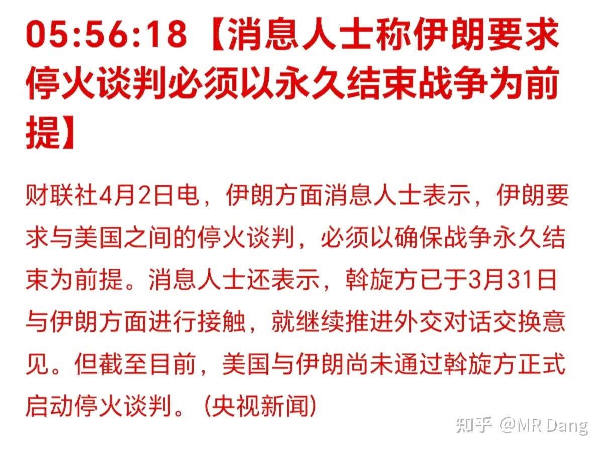

“永久结束战争”，这个提法非常好，但是怎么落实呢。

西大的承诺很显然不靠谱，到时候后悔了找谁说理去？

需要一个靠得住的机构或者国家去背书可能才有点用，落地难度很高。

美发布ADP就业数据：

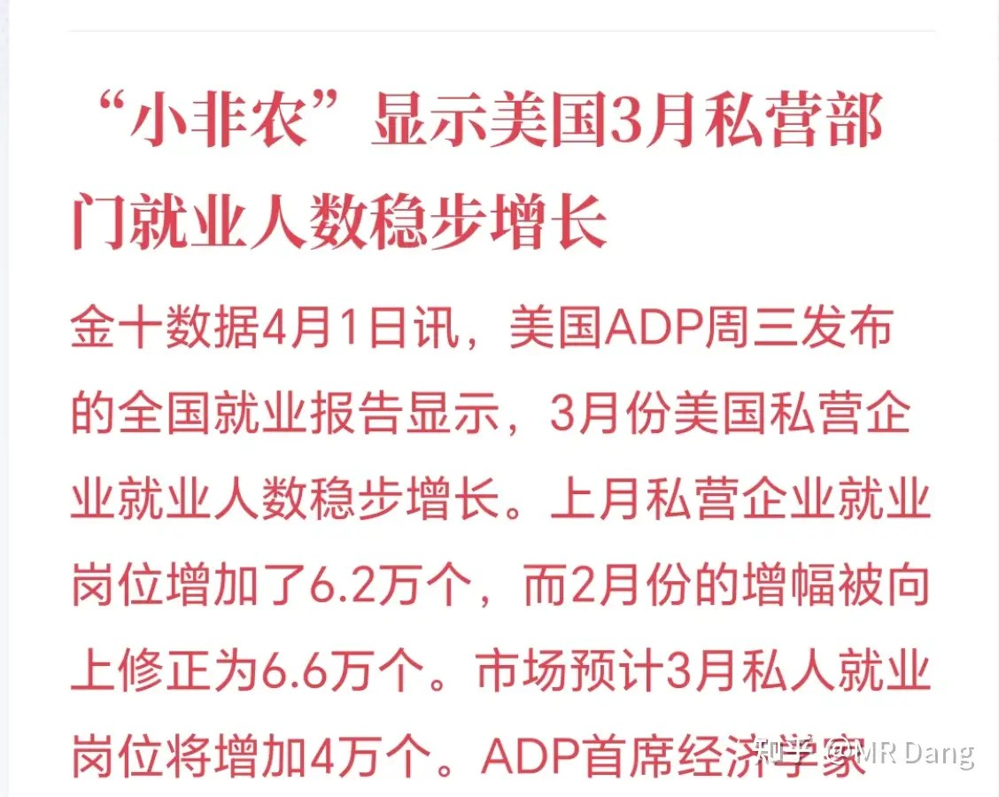

所谓的ADP也被称为小非农，可以简单的理解成发布的数据是不包含编制的就业数据。

它是大非农的风向标，在一般情况下会对资本市场有一定影响。

但是现在，此时此刻，明显不属于“一般情况”，资本市场都在被美伊态势牵着鼻子走，ADP数据的影响就变得无足轻重了。

铝：环球铝业的电解铝在电解槽内凝固，对运营造成重大破坏。

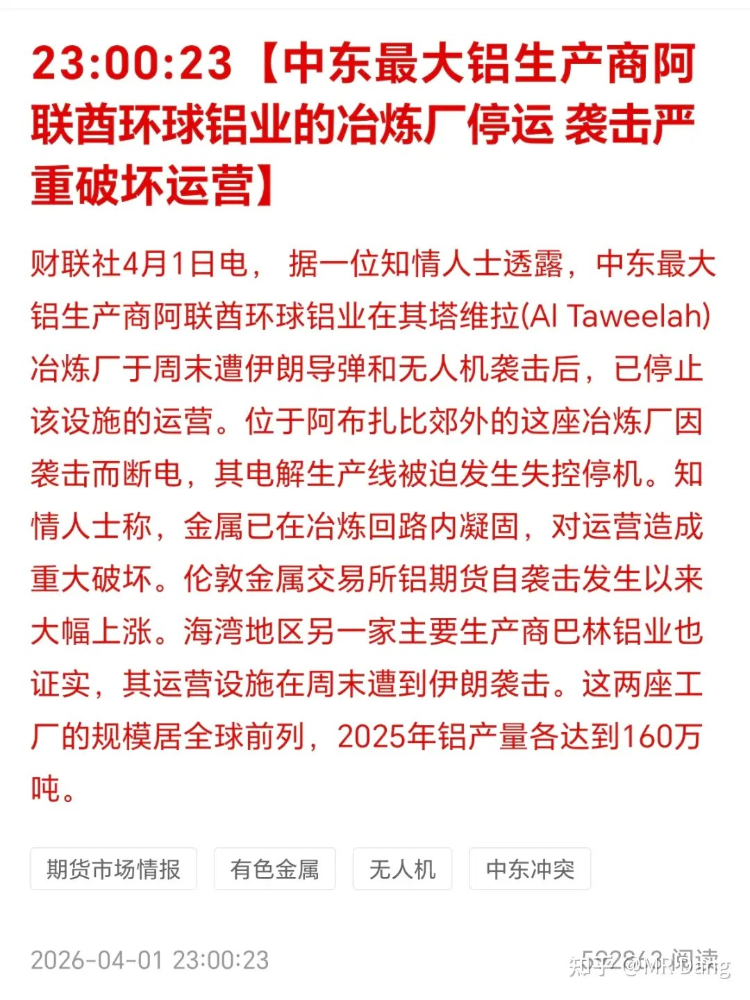

一般来说，如果槽内高达960℃左右的铝液和电解质完全凝固，体积变化会导致阴极内衬、碳块、母线等核心结构大面积报废，属于不可逆的结构性损毁。

这种情况下需要全槽大修甚至重建 ，周期一般在6个月到一年左右，极端情况下甚至长达一年以上，会造成长期的产能缺口。

受此消息影响，伦铝期货走强，美股铝企也走强。

另有小道消息称懂王将对进口钢铝制成成品征收25％关税：

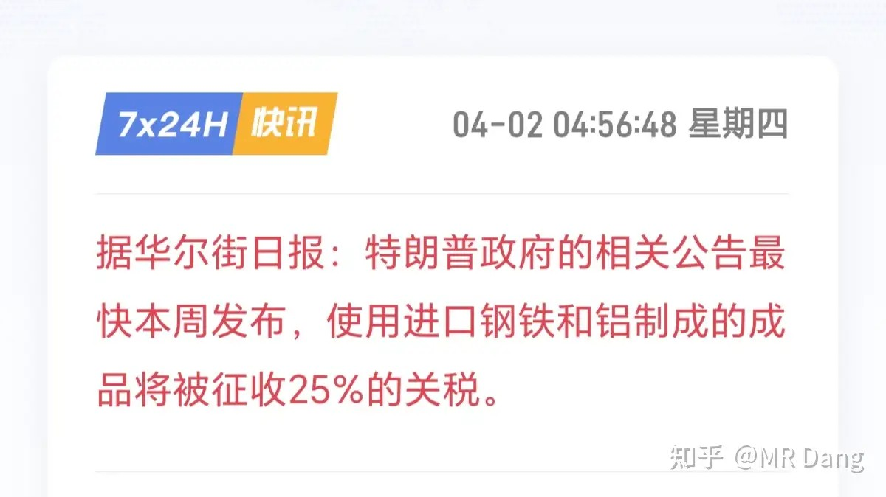

这个消息置信度不是特别高，仅供参考吧。

油：西大原油库存超预期增加了四百多万桶。

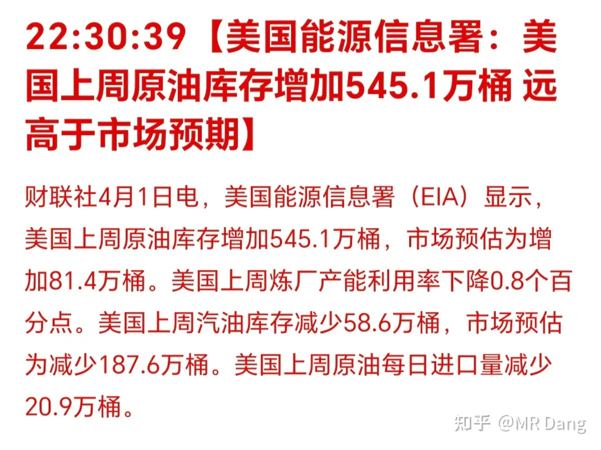

也有个别投资者认为该数据存在水分，是为了调控油价刻意为之。

辩证着看吧，一般EIA的数据还是比较准确的。

大宗商品：

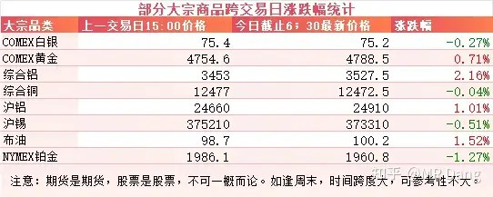

主要还是铝的涨幅比较大，盘后有两个多点，原因前文已经提及。

其他有色表现比较分化，黄金强势，白银等稍弱。

原油受各种消息影响，波动较大，目前是略微上涨。

外围市场：

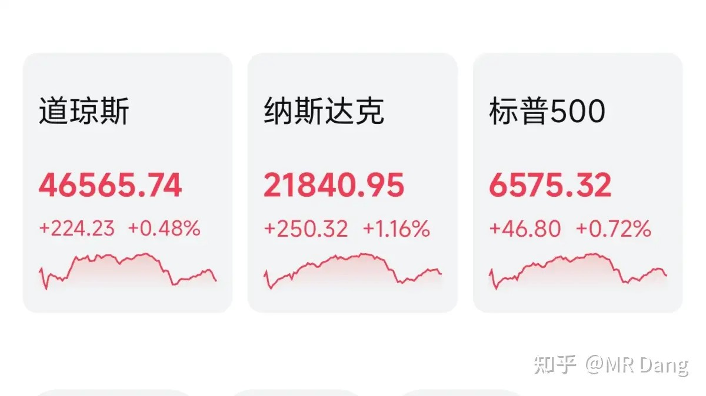

美三大股指都有一定涨幅，纳指反弹最多，科技股走强，刚经历过鬼故事的存储企业开始回暖。

盘前整体情绪比较偏积极。

昨天个人组合净值回血一个半点不到，资源3个点，电网2个点，消费1个点，银行不到1个点，整体几乎和指数一样。

现在距离新高不到1个点了，感觉也许今天运气好就能满血复活了。

不过还没到高兴的时候，盲目乐观容易挨打，所以随缘吧，这种事情不能刻意强求。

美伊除了新闻里那些来来回回的口水仗，西大增兵的动作可一直没停。

作为旁观者说不好是威胁还是真的要动手，所以也不能盲目乐观。

风险管理，仓位控制一定一定要落到实处，紧盯事态的进一步发展，做出应对。

越开心越要警惕，越沮丧越要坚定。

这会儿到了警惕的时候啦。

另外开盘前，也就是九点左右，懂王要发表全国讲话，自称要对伊朗问题发表“重要更新”。

等着吧，看他又要如何画线。

一个喜欢保护韭菜的博主，希望大家少少踩坑，多多赚钱！！！

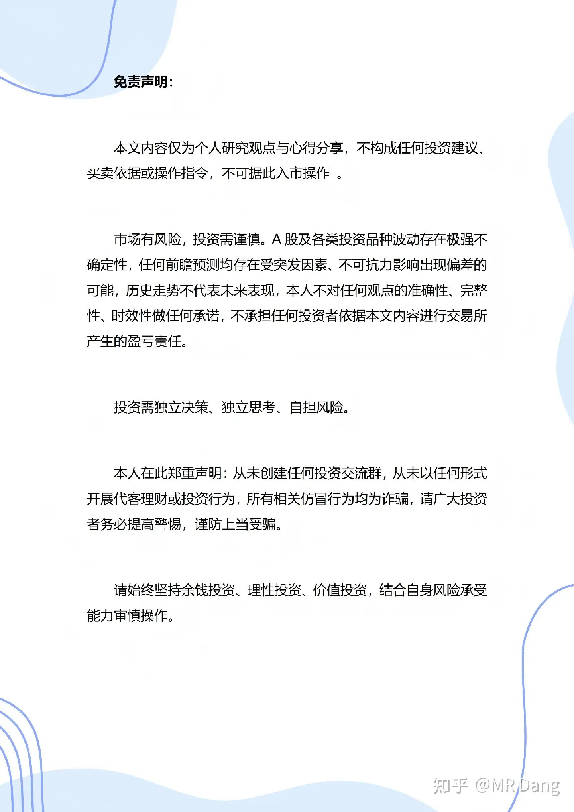

> [!comment]- 点击展开评论
>
> | 用户 | 时间 | 内容 |
> | :--- | :--- | :--- |
> | 钱包鼓鼓 | 5 小时前 | 每日打卡第27天可以关注的：电解铝产能的物理性毁灭 |
> | 张春辉 | 5 小时前 | 之前减仓减早了，不然现在都快回本了，现在真的体会到大佬为什么总说不预测，只应对了。资本市场变幻莫测，真的没法预测啊。不过既然选择了清仓观望，我还是保持耐心，等待机会吧，要时常告诫自己市场不缺机会，切莫追高。 |
> | 如来熊掌 | 5 小时前 | 在圈子学习完最大的收获是要学会写短篇小说 |
> | &nbsp;&nbsp;&nbsp;&nbsp;MR Dang | 5 小时前 | 哈哈哈 |
> | 出自典故 | 5 小时前 | 越开心越要警惕，越沮丧越要坚定！！！说得好 |
> | 流尘 | 5 小时前 | 早上做了个梦，梦见买的所有股票全涨停了，然后高兴醒了 |
> | 红领巾的红 | 4 小时前 | 电解铝设备：由槽体、阳极系统、母系系统组成，预培阳极炭块在顶部、阴极炭块在槽底。核心原材料：氧化铝、冰晶石、氟化铝。核心原理：电解槽内以碳块材料为阴阳极，通入大电流，在高温下，氧化铝溶解冰晶石熔盐中，发生电化学反应，析出液态铝。突然断电导致铝液凝固维修难点，拆除固体铝，拆除重建内衬、重新焙烧启动电解槽。 |
> | 三角篓子 | 3 小时前 | 之前29.5左右1成仓的宏桥，分别在27和25加了0.5成仓，成本27.5左右，我觉得我宏桥做的还挺标准的。有点可惜的是加仓的钱是割了其他卫星仓加进来的，非常后悔没有买银行，也确实比较理解了银行为什么特殊。 |
> | &nbsp;&nbsp;&nbsp;&nbsp;小特 | 1 小时前 | 你就好啦，桥控制得好好啊 |
> | 黄小斗 | 3 小时前 | 决定每天早上先看D大的每日行情，小资金小白先学习学习本日重点：电解铝+懂王又在两面三刀。不要看一个人说什么，更要看一个人做什么 |
> | 瞭望 | 5 小时前 | 今天让我红一天吧，红了中午就搞碗臊子面 |
> | &nbsp;&nbsp;&nbsp;&nbsp;下一季再说 | 5 小时前 | 红了才吃上臊子面，不红的时候都是吃的啥 |
> | &nbsp;&nbsp;&nbsp;&nbsp;牵牛 | 3 小时前 | 山西臊子面，蛮好吃的 |
> | 空白辞章 | 4 小时前 | 总问猪肉能不能行了？看看这个有行的大手！ |

---

*本文件从MR Dang知乎页面转载*

---

**作者**: MR Dang
**链接**: https://www.zhihu.com/question/2021640281150243871/answer/2022939304561846131
**来源**: 知乎

*著作权归作者所有。商业转载请联系作者获得授权，非商业转载请注明出处。*

---

## 相关阅读

**📈 每日行情评价系列：**
- [[20260401-如何看待 2026 年 4月 1日 A 股市场行情？|4月1日行情]] - PMI数据与银行分化、愚人节情绪扰动
- [[20260331-如何评价2026年3月31日A股行情？|3月31日行情]] - 央企红利上缴与海水淡化话题延续、银行分化观察
- [[20260330-如何评价2026年3月30日A股行情？|3月30日行情]] - 非农预期、央企红利上缴、海水淡化机会、银行分化
- [[20260327-如何评价2026年3月27日A股行情？|3月27日行情]] - 懂王谈判反复、黄马甲财报、市场情绪疲惫期
- [[20260326-如何评价2026年3月26日A股行情？|3月26日行情]] - 中远海运恢复订舱、伊朗否认弃核、SpaceX上市机会
- [[20260325-如何评价2026年3月25日A股行情？|3月25日行情]] - 懂王画线赢学、伊朗六条变三条、停火传言
- [[20260324-如何评价2026年3月24日A股行情？|3月24日行情]] - 懂王赢学大战、伊朗否认谈判、米兰喊降息四次

**📅 周末闲聊系列：**
- [[20260214-春节特辑（年二十七）|春节特辑]] - 春节期间市场展望与投资思考
- [[20260207-周末唠嗑（2月7）|周末唠嗑]] - 市场情绪与仓位管理讨论

**🌱 韭菜保护系列：**
- [[20260303-对于2026年3月3日A股市场行情，大家有什么预测和看法？|3月3日行情]] - 两会期间行情特征分析
- [[20260302-怎么看待2026年3月2日A股行情？|3月2日行情]] - 关税博弈下的市场应对策略
