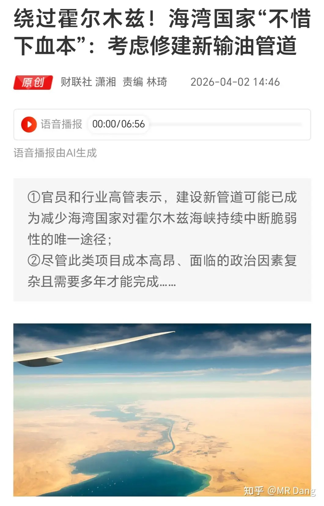
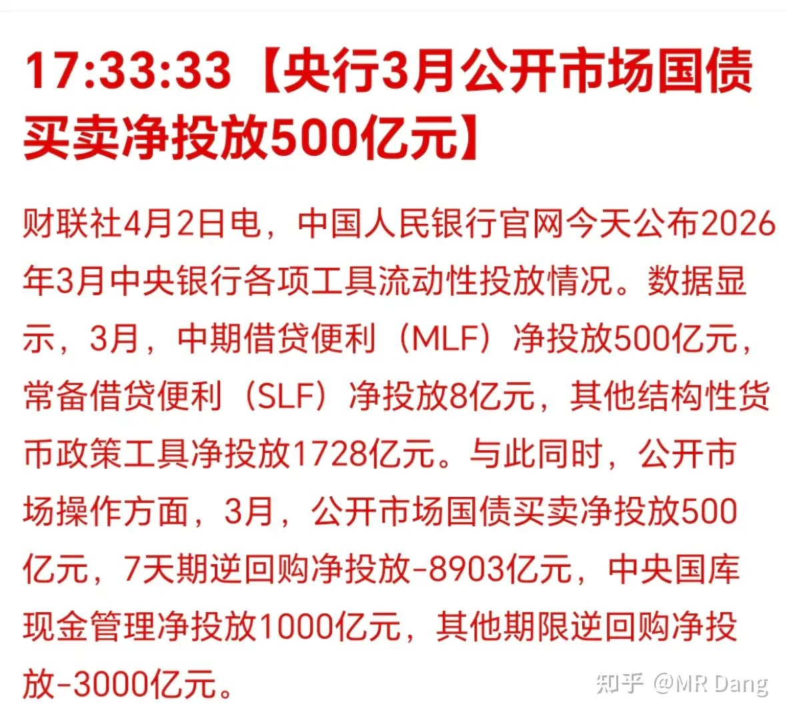
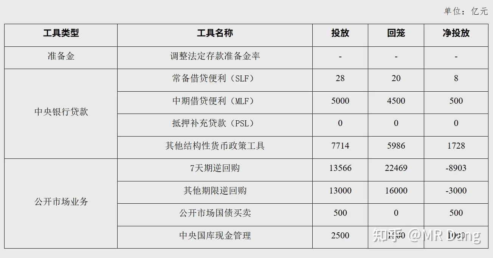
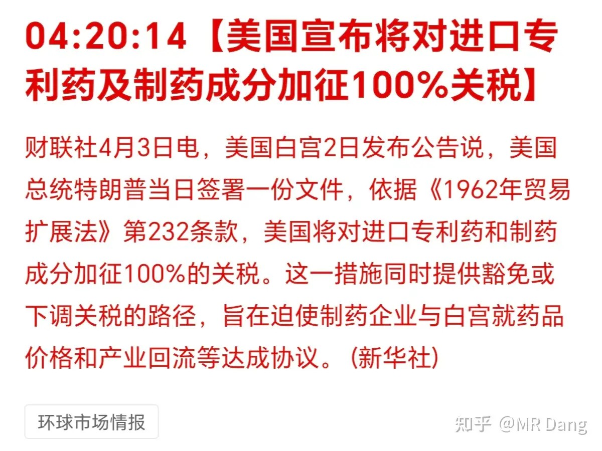
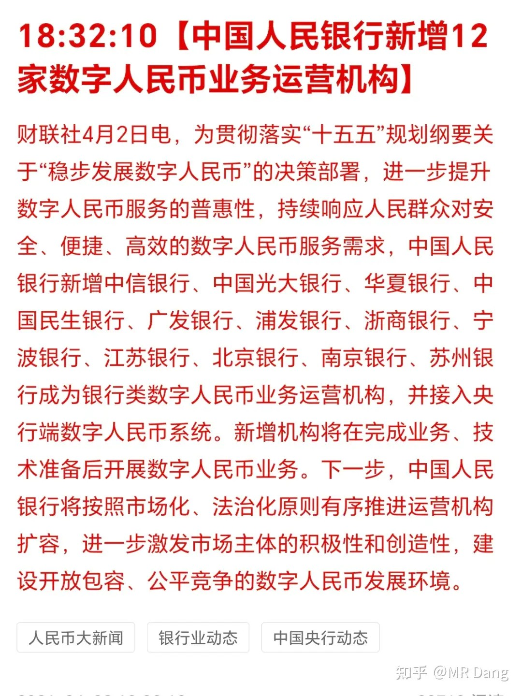
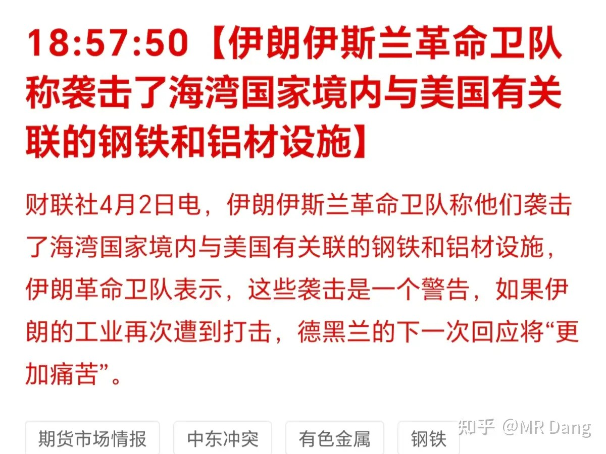
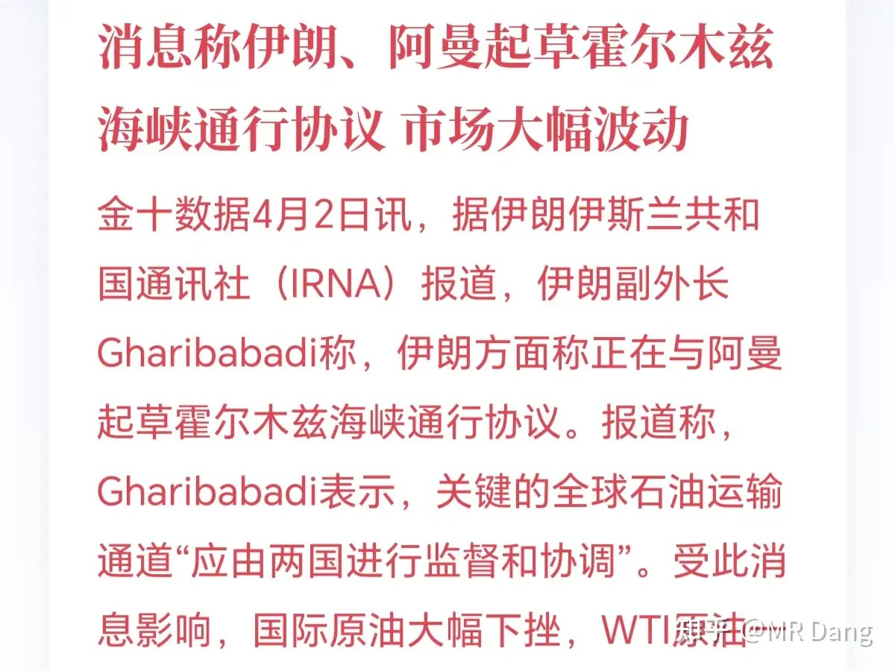
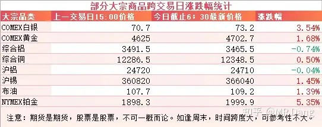
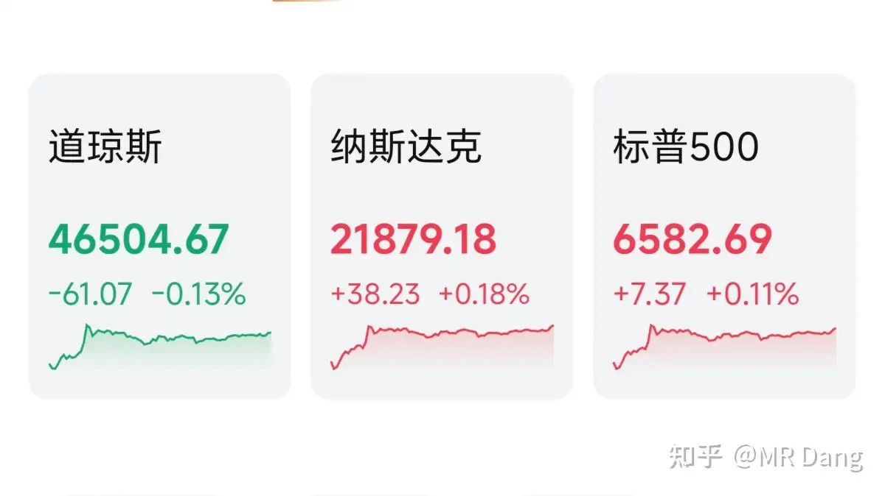

# 如何评价2026年4月3日A股行情？

---

**发布时间**: 2026-04-03 07:30  |  **原文链接**: https://www.zhihu.com/question/2021894721337861448/answer/2023301282530697894  |  **点赞数**: 597 人赞同

**作者信息**: MR Dang​​独立投资人，小红圈同名，无其他小号。

---

## 正文内容

今天的头条是一条管道：

海湾国家考虑修一条输油管道，以绕开霍尔木兹海峡。

很多投资者看到这个消息，会觉得是不是有希望了，是利好消息。

其实冷静下来思考的话，海湾国家如果都决定修管道了，那说明对海峡开放已经不存在奢望了，这可算不上什么好消息。

另外先不说什么远水解不了近渴，建设管道得消耗几年的时间成本。

就算建起来了，只要伊朗军事打击能力还在，想给你炸一下还不是轻轻松松，那可是绵延几百公里的管道，破坏起来不要太容易。

所以总的算下来，这不是个好主意，海湾国家能出此下策，说明真的是黔驴技穷了。

央行公布三月流动性：

相对来说流动性给的不是那么充裕，特别是逆回购。

从数字上来说是有那么一点点偏紧的，基本上从资本市场也能感受出来。

创新药：西大对进口专利药加100％关税

这两天比较火的一个板块，涨幅不小。不过我一直对这个行业有点偏见，不确定性有些高，行业整体不确定，政策层面不确定，公司层面也不确定，连具体的管线都不确定。

对新手投资者特别不友好的一个行当。

产品难懂，账难算，估值难给，消息难获取，非相关专业的人士谨慎参与。

数字人民币再添12员虎将：

之前数字人民币是没利息的，以后是有利息的，所以吸引力会增加，对银行来说属于变相揽储。

不过最终能有多大帮助，还看不太清，就目前来看，我看不出数字人民币的特别优势在哪里，缺乏一个广泛使用的理由。

伊朗：

这还是前几天的旧事重提。

其实朗子的钢铁厂也被炸的挺惨，上千万吨的产能受到影响。

伊朗天然气多，所以炼钢方法和咱们不一样，咱们这边长流程多。

伊朗那边都是短流程，用的气基还原法，直接用天然气还原铁矿石，发明了属于自己的“波斯还原”。

这次钢厂受损严重，所以伊朗反应才那么大，威胁对周边的钢厂铝厂实施打击。

另有消息称伊朗和阿曼一起起草霍尔木兹海峡通行协议。

这个属于利好，能过就行，收点钱问题不大，我已经多次表达过类似观点。

问题是现在投资者对这类消息不知道该不该相信了。

自从伊朗被斩首后，头就说不了话了。

所以手在说话，腿在说话，肚挤眼在说话，现在连脚后跟也开始说话了，大家分辨不出来哪句话好使。

大宗商品：

大宗商品里除了铝，有色整体在盘后有所反弹，其中铂和银的弹性较大，分别涨了5个和3个多点。

原油并没有和有色形成跷跷板效应，也有所上涨。

外围市场：

美三大股指走的还行，主要是受益于前面那个伊朗和阿曼合作收费的消息，担忧情绪有所缓解。

昨天A股刚要开盘懂王就开始放利空，美股刚要开盘就开始放利好，这时间点把控的，绝了。

昨天个人组合净值微微回血，银行红一个半点，资源绿一个点，电网绿两个，消费原地不动，距离新高还有半个点。

给银行磕一个呗，还能说啥，其他都在跌，银行在涨，仓位占比越来越高了。

最近的行情其实非常容易亏钱，特别是对那种喜欢操作的投资者来说。

一天一个风向，一天一个预期。

别说普通投资者择时能力基本为0，就算有一定的择时能力，也会在频繁的摩擦交易中被量化逐渐收割。

所以我反复强调多看少动，不预测只应对。

而且最近画线的玩家好像多了一个，不单单是懂王画，朗子那边也在画。

他俩还不是说琴瑟和鸣，一起画线。

是那种你一笔我一笔，你往上我往下，你往下我就往上地画。

体验真的挺糟糕的，别说对新手投资者了，就算对投资老手这也属于地狱难度级别的副本。

投资要的是确定性，这种不确定的市场属于垃圾时间，真的很希望把这段时间快进掉。

但这是不现实的，所以也只能是强身健体，修身养性，磨练技能，学习知识，做做这类基础工作。

今天是周五，现在每到周末，我脑子里就会想起“周末的懂王十分危险”这句话，都有点应激反应了。

那我自己@一下会不会涨流量？

快给我涨100粉丝！

一个喜欢保护韭菜的博主，希望大家少少踩坑，多多赚钱！！！

> [!comment]- 点击展开评论
>
> | 用户 | 时间 | 内容 |
> | :--- | :--- | :--- |
> | 钱包鼓鼓 | 7 小时前 | 每日总结第28天海湾国家修管道是利空而非利好。逆回购流动性收紧。创新药行业不确定性高，新手别碰。 |
> | 倔强de沧海 | 5 小时前 | 学生们春假踏青了，大人们在股市踏青 |
> | &nbsp;&nbsp;&nbsp;&nbsp;MR Dang | 5 小时前 | 扎心了 |
> | 如来熊掌 | 7 小时前 | 当2次逆徒，一次挨打，一次大肉没吃上，所以老有人问怎么看老师的投资水平，怎么看？在ICU看，对了昨天看到有个反着做5次，然后5次全错的，不知道这个兄弟现在在哪。 |
> | 哈哈哈哈哈 | 7 小时前 | 开展数字人民币的银行也属于是被认证的优质银行吧 |
> | &nbsp;&nbsp;&nbsp;&nbsp;MR Dang | 7 小时前 | 盲生，你发现了华点 |
> | &nbsp;&nbsp;&nbsp;&nbsp;干饭闪电狼 | 7 小时前 | 这算不算一种摘帽呢 |
> | &nbsp;&nbsp;&nbsp;&nbsp;joly | 6 小时前 | 你属于好学生，抢答了 |
> | &nbsp;&nbsp;&nbsp;&nbsp;如意 | 6 小时前 | 盲生，华点，哈哈哈 |
> | 热乎黏苞米 | 7 小时前 | 我看不懂，所以早早地轻仓了，只剩两成铜 |
> | &nbsp;&nbsp;&nbsp;&nbsp;橘子 | 6 小时前 | 挺牛逼啊，清仓，已战胜99的股友 |
> | &nbsp;&nbsp;&nbsp;&nbsp;xiaowaner | 3 小时前 | 看不懂，但觉得可以开始建仓了，感觉空仓不太合适。一点点加 |
> | Bubble | 7 小时前 | 有些人就想蹭你流量涨粉 |
> | &nbsp;&nbsp;&nbsp;&nbsp;三哥数签签 | 2 小时前 | 知乎涨粉有什么用啊？可以打广告吗 |
> | &nbsp;&nbsp;&nbsp;&nbsp;哇哇哇 |  | 可以开圈，看看之前那个所谓课代表就知道了 |
> | Hypnoszzz | 8 小时前 | 早上好以后史书写3战，直接交火和金融收割并行，没有一个国家能置身事外，尤其是大a |
> | 温酒剑上浇透 | 7 小时前 | 昨晚美股那根直线真给我看笑了，真就做空亚太呗，亚太股市开门特朗普放利空，美股开门媒体放利好，会玩会玩 |
> | &nbsp;&nbsp;&nbsp;&nbsp;等待和希望 | 5 小时前 | 关键是国人还吃那一套啊 |
> | 空白辞章 | 6 小时前 | 我看过D佬之前的回答和文章，所有的。学的金融，有CPA，在银行工作，对宏观与经济社会运转有较为全面清晰(自我逻辑闭环)的认知，擅长产业和行业分析，精通单个企业财务分析与敏感性分析，结合这个说跟基金经理殊途同归，综和分析下来，应该在银行投资管理部之类的部门工作，负责对企业项目贷款审核工作，接触企业投资的咨询决策，打交道的更多的是咨询负责人及技术经济人员，所以才经常说模糊的正确，和这两种人关注点一样。 |
> | gf冰火岛 | 7 小时前 | 早啊，老师这个阅读量，说明今天应该成交量不高 |
> | &nbsp;&nbsp;&nbsp;&nbsp;咖啡猫 | 6 小时前 | 现在这行情越动越亏 |

---

*本文件从MR Dang知乎页面转载*

---

**作者**: MR Dang
**链接**: https://www.zhihu.com/question/2021894721337861448/answer/2023301282530697894
**来源**: 知乎

*著作权归作者所有。商业转载请联系作者获得授权，非商业转载请注明出处。*

---

## 相关阅读

**📈 每日行情评价系列：**
- [[20260402-如何评价2026年4月2日A股行情？|4月2日行情]] - 上一个交易日行情分析
- [[20260331-如何评价2026年3月31日A股行情？|3月31日行情]] - 季末行情特征与资产配置
- [[20260330-如何评价2026年3月30日A股行情？|3月30日行情]] - 月末行情与仓位调整
- [[20260327-如何评价2026年3月27日A股行情？|3月27日行情]] - 伊朗"最后一击"、黄马甲财报、谷歌算法冲击纳指
- [[20260326-如何评价2026年3月26日A股行情？|3月26日行情]] - 中远海运恢复订舱、伊朗否认弃核、SpaceX上市机会
- [[20260325-如何评价2026年3月25日A股行情？|3月25日行情]] - 懂王画线赢学、伊朗六条变三条、停火传言

**📅 周末闲聊系列：**
- [[20260214-春节特辑（年二十七）|春节特辑]] - 春节期间市场展望与投资思考
- [[20260207-周末唠嗑（2月7）|周末唠嗑]] - 市场情绪与仓位管理讨论

**🌱 韭菜保护系列：**
- [[20260303-对于2026年3月3日A股市场行情，大家有什么预测和看法？|3月3日行情]] - 两会期间行情特征分析
- [[20260302-怎么看待2026年3月2日A股行情？|3月2日行情]] - 关税博弈下的市场应对策略
