# 如何评价2026年4月13日A股行情？

---

**发布时间**: 2026-04-13 07:31  |  **原文链接**: https://www.zhihu.com/question/2025584414826997143/answer/2026925545414303900  |  **点赞数**: 566 人赞同

**作者信息**: MR Dang​​​知势榜经济与管理领域影响力榜答主

---

## 正文内容

头条还是伊朗局势：

谈判无疾而终，西大提出了一套“最终方案”：

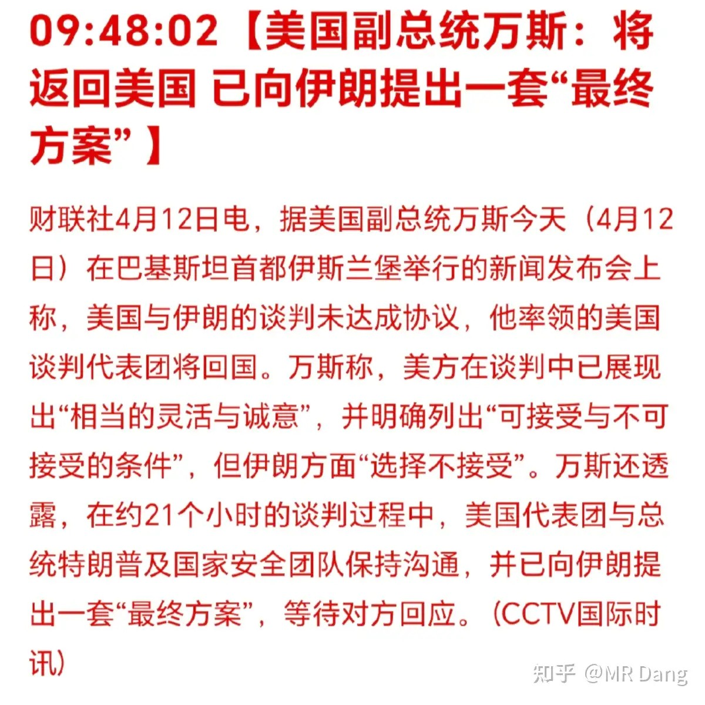

交锋从谈判前就开始，伊朗那边专机上全是遇难儿童的照片，西大这边各种舆论攻势，还有军舰在霍尔木兹海峡试探。

所以一开始两边没有直接见面，让巴铁在中间传话，有点类似媒人那样。

后来可能是确认两边不会一见面就打架，所以让两边见面谈判。

中间的过程省略，最后的结果是“没有达成协议”。

这也不算意外，因为两边的底线本来就不挨着，没有交集部分。

谈完以后两边又开始互相放话：

伊朗的表态是不着急：

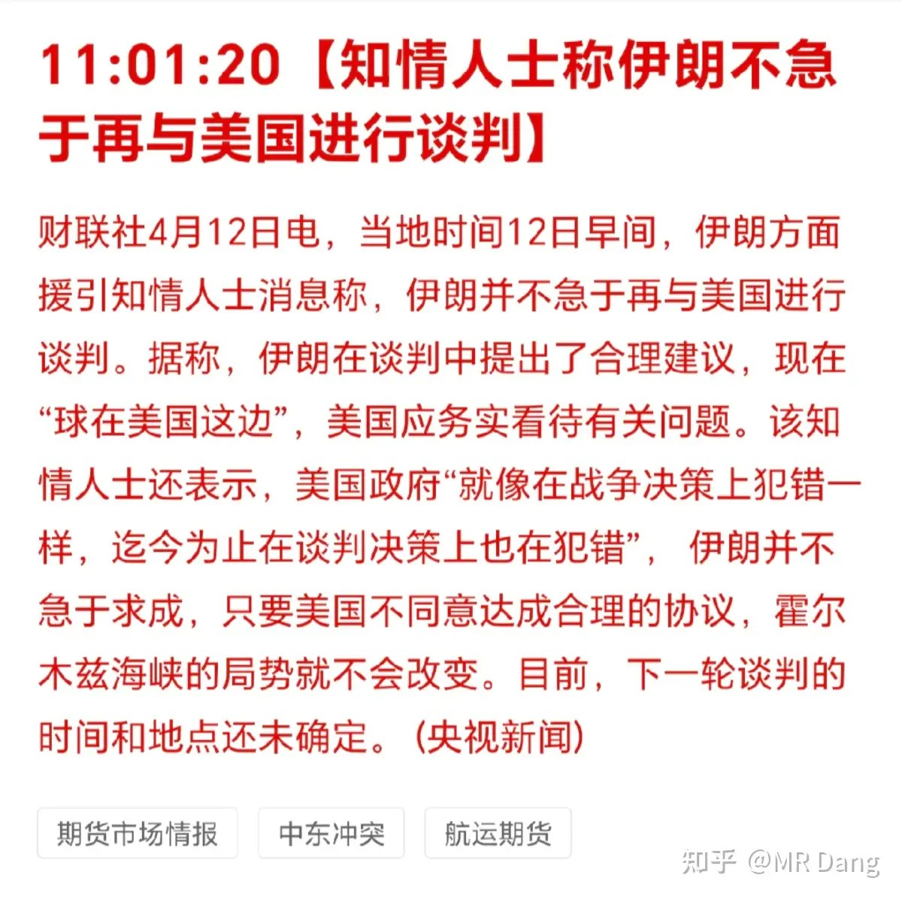

懂王还是继续威胁要进行海上封锁：

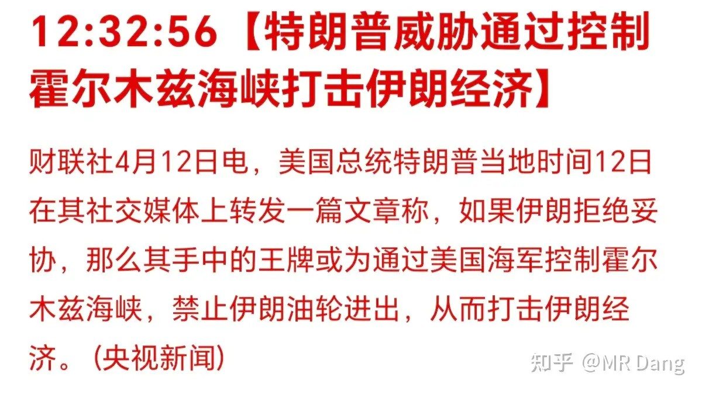

伊朗回了个封锁也不开：

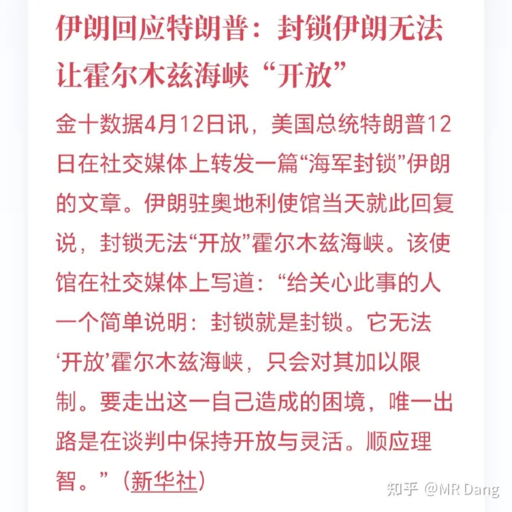

现在其实看似好像分歧点挺多，最核心的还是霍尔木兹海峡的控制权，这个是核心诉求，其他的还能玩玩文字游戏，一赢互表，但是海峡开不开是客观事实。

懂王称已经封锁海峡：

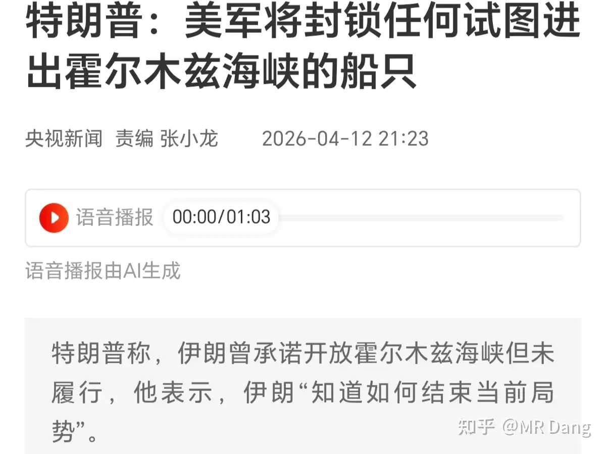

目前霍尔木兹的示意图如下：

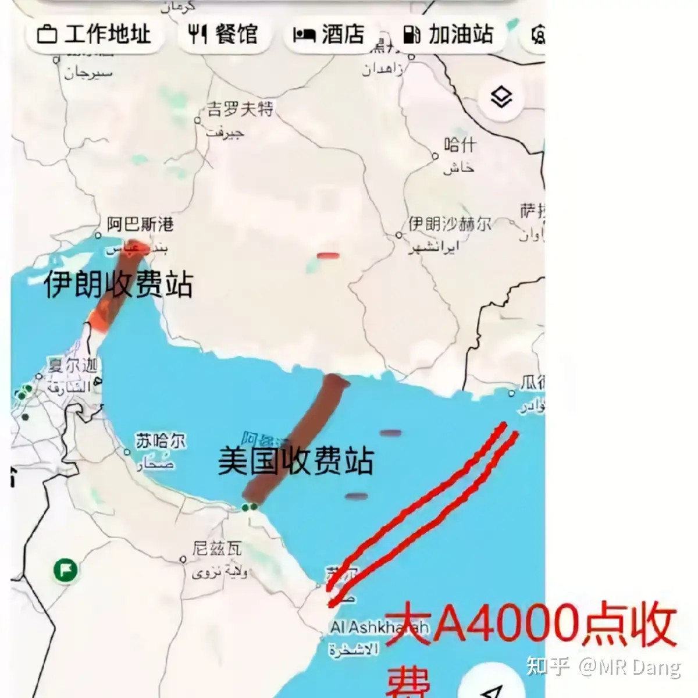

接下来可能还会有第二轮谈判：

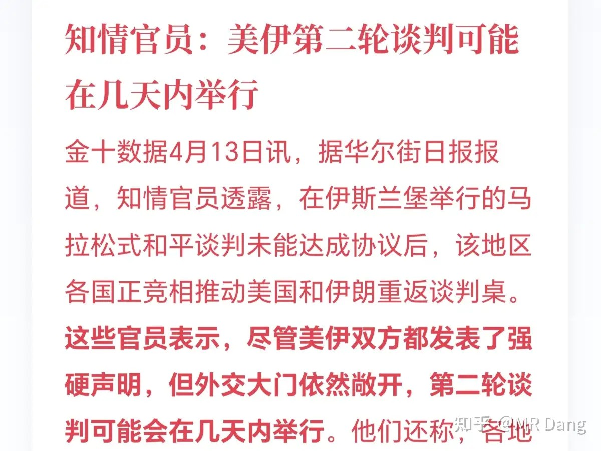

稳定币：

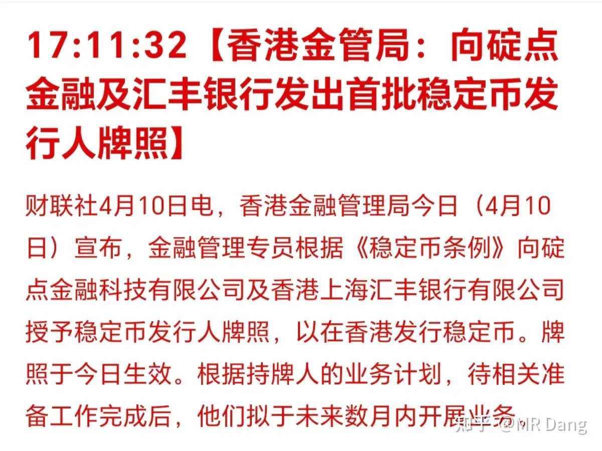

稳定币算是一个比较敏感的话题。

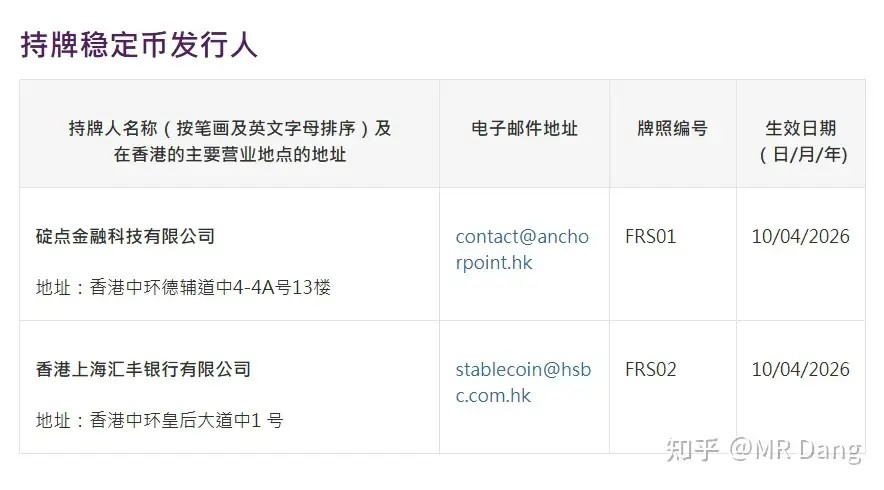

这次首批牌照只有两张，一张给汇丰了，一张给了碇点。

碇点可能大家都没听说过，是渣打联合另外两家业内公司成立的合资企业。

牌照之所以这么少，是因为香港的稳定币发行非常严格，要求100％全额储备，T+1强制赎回和穿透式监管。

港股有一个相关标的，上一轮从1块炒到7块，又从7块跌回两块，这次趁着消息又反弹到3块，在互摸口袋的标的里也是风险最大的那一档。

西大3月核心CPI发布：

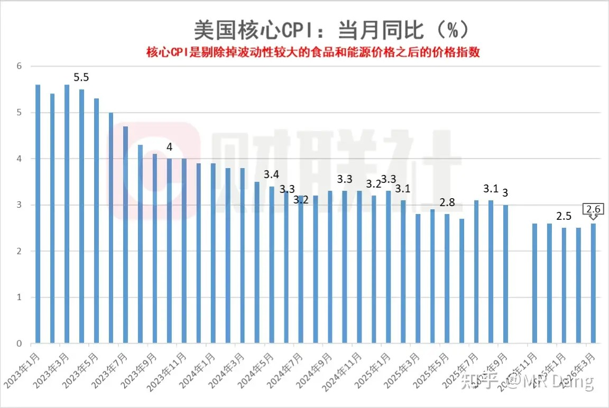

数据为2.6％，预期为2.7％，低于预期，通胀压力有所缓解，可能提高潜在的降息预期，利好相关风险资产。

同时公布的CPI为3.3％，符合预期，比前值2.4％高了一些，原因自然是原油。

有人问这两有啥区别，简单的说核心cpi剔除了食品烟酒和能源。

但如果把这些枯燥的数据落实到体感上，普通老百姓只关心加油站上那个油价的数字，管你这的那的。

周五盘后出了一揽子措施，主要有增设了创业板第四套上市标准，鼓励硬科技企业上市；复制了科创板成功经验，增加了ipo预审机制，增加对上市企业商业机密的保密力度。

有更多的企业可以上市来满足投资者日益增加的投资需求了，呵呵。

利好券商投行业务。

以上这些可能对普通投资者影响不大，了解即可，真正有影响的一个是st股票涨跌幅由5％变成10％，另外一个是主板引入盘后固定价格交易，还有一个是主板引入做市商制度。

很多没有参与过科创板的投资者可能不知道什么叫盘后固定价格交易，简单的说就是在下午三点收盘后再加25分钟（三点05到三点半），这25分钟内，只有一个价格，就是收盘价。

在这段时间内，可以按照这个收盘价来交易。

以我个人的体验来说，盘后固定价格交易的成交量有限，对现有交易体系影响不大。

至于做市商的话，可以理解成又多了一些中间商做差价。

券商不是来做慈善的，券商的盈利肯定是需要燃料的。

频繁交易的散户以后面对的游戏难度又要上调了。

硫酸动态：

有外媒报道，硫酸可能从2026年5月1日起全面暂停出口。

（此条未经官方证实，具体以官方发布为准，仅做转述推演）

霍尔木兹海峡的拥堵导致硫磺紧缺，价格处于高位，而硫磺是生产硫酸的重要原料。

保证硫酸供应对于保证国内磷肥和新能源产业链的安全具有重要意义。

东大硫酸年出口量为400万吨级，占全球硫酸贸易的三分之一。

如果硫酸出口全面暂停，对于铜具有重大影响。

为什么呢？

因为铜有两种主要生产工艺，一种叫火法炼铜，另一种叫湿法炼铜。

全球80％的铜矿采用火法炼铜，火法炼铜会生产一种副产物，就是硫酸。

很多铜企，炼铜是亏的，但是因为硫酸价格够贵，所以算下来整体可以小赚。

另外20％的铜矿采用湿法炼铜，湿法炼铜需要一种原料，这种原料巧了，还是硫酸。

咱们国内几乎都是火法炼铜，所以是硫酸的出口国。

而智利和秘鲁是湿法炼铜的大户，需要进口大量东大的硫酸。

每年400万吨级的硫酸对应的铜产量大约为300万吨级，如果出口禁令落地，会对铜的供应造成很大的影响，从而支撑铜的价格。

再次重申，以官方口径为准，以上仅为假设性推演。

东哥又有新动向：新业务“open出发”出现在京东app内

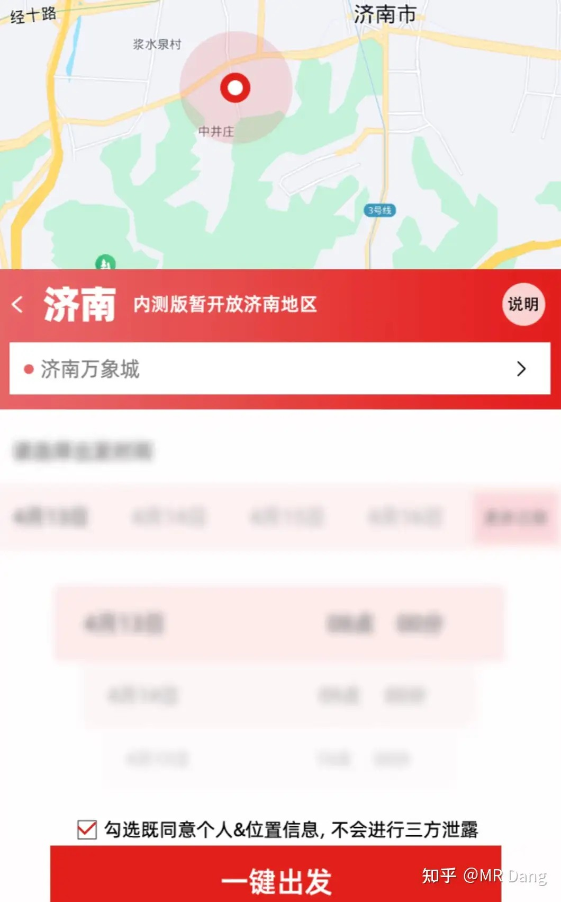

这个业务应该是剑指滴滴，但是用的是重资产的打法，联合了长安旗下的深蓝品牌。

东哥一向喜欢玩重资产的互联网思维，而且玩的还不错，外卖不让卷了，现在瞄准了滴滴。

目前处于内测版，仅有济南一个城市试点。

很多投资者可能更关心合作方汽车厂商，觉得也许是个小利好。

我也看了，不太乐观，因为恰好这家车企出年报了，年报数据不及预期，这种小利好很难抵消年报这样比较大的利空。

大宗商品：

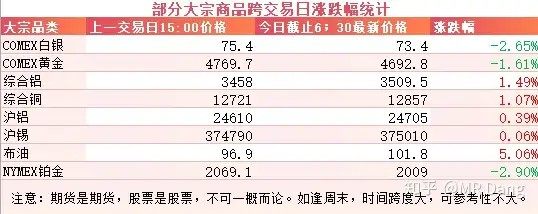

外围市场：

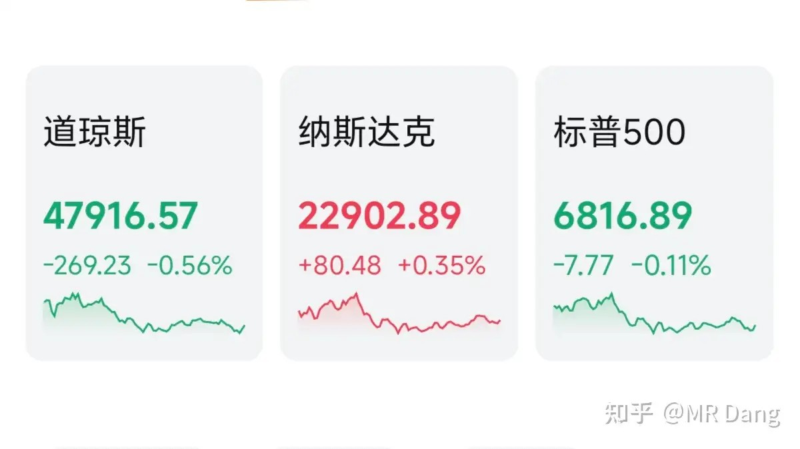

上周五的美股参考性不大了，周末发生了这么多事情，看看就行。

上个交易日个人组合净值回撤半个点，银行近一个，资源绿1个，电网红半个，消费红半个，跑输指数一个点。

整体风格上cpo之类的比较强势，传统行业里券商也在发力，都和我的持仓风格差异比较大，所以光是一点没沾到，反而被打了一棍子。

至于今天的话，本来还希望是打是和能给个痛快话，现在又要开始反复拉扯了。

目前的情绪不太乐观，所以今天少亏当赢吧，继续承压。

本来今天还应该讲讲几个统计数据的，但是碍于篇幅放到明天讲，短期内对资本市场也没啥影响，是涨是跌也都看伊朗的局势。

本周前瞻：

1，周一也就是今天公布M2数据，预期8.9％。

2，明天周二公布咱们的贸易数据。

3，周三西大公布EIA原油库存。

4，周四公布社零和工业增加值。

5，4月19日机器人马拉松开始，今年的机器人马拉松比之前热闹很多，有一小半参赛队伍选择了“自主导航”，可能会减少比赛途中人跟着机器人跑的奇观了。

现在的悬念就是今年的夺冠机器人配速能不能打破人类的记录。

对投资者来说，也看看能不能刺激在底部躺平的植物人板块。

一个喜欢保护韭菜的博主，希望大家少少踩坑，多多赚钱！！！

> [!comment]- 点击展开评论
>
> | 用户 | 时间 | 内容 |
> | :--- | :--- | :--- |
> | 钱包鼓鼓 |  | 每日打卡第32天整体偏谨慎偏空，要小心，少亏就是赚。伊朗谈判破裂，短期大盘继续承压。硫酸出口禁令传闻利好铜，但需要官方确认。ST股涨跌幅扩到10%是变相给散户挖坑。 |
> | 我是一颗桃子吖 |  | 我发出了快乐的哼唧声～～哼哼哼～～ |
> | 薪年 |  | 大哥四千点收费站 |
> | 青峰 |  | 这种行情受中东的影响，那不如不看盘了 |
> | &nbsp;&nbsp;&nbsp;&nbsp;MR Dang |  | 看了也是白搭 |
> | &nbsp;&nbsp;&nbsp;&nbsp;来自深渊 |  | 看盘不如看特朗普推特 |
> | &nbsp;&nbsp;&nbsp;&nbsp;全新演绎 | 14 小时前 | 接下来不看中东了，该看亚太了。进展太快了 |
> | 胖啦虎不咬人 |  | 偷车的人没撬开锁头，一气之下又加了一把锁。 |
> | &nbsp;&nbsp;&nbsp;&nbsp;一白先生 | 22 小时前 | 哈哈哈哈太精髓了，无非就是老特头儿无能狂怒罢了，承认失败很难 |
> | &nbsp;&nbsp;&nbsp;&nbsp;MR Dang |  | 哈哈，形象 |
> | 莫愁盛世颜 |  | dang老师，我🔥的那个抖音，我总结了三个原因：1最主要是跟你学会了尊重每一个观众，每一条评论亲自回复。2是无意间入境的美女。3是我爷爷太有反差感了 |
> | &nbsp;&nbsp;&nbsp;&nbsp;MR Dang |  | 哈哈 |
> | 鸡肉终结者 |  | 绿桥 |
> | 红领巾的红 |  | 1、稳定币是一个特殊加密货币，以特定锚定物保持价值稳定，最常见锚定物有美元，香港发行稳定币以港币作为锚定物。2、精铜矿高度集中→供小于求、对冶炼厂有长协价→冶炼厂停炉损失更大→冶炼加工费小亏，但冶炼一吨铜→产生3.2~3.5吨硫酸，这部分收益弥补亏损。硫酸暂停出口→冶炼厂减少收益→冶炼加工费增加→支撑铜价。 |
> | &nbsp;&nbsp;&nbsp;&nbsp;gungungun | 21 小时前 | 硫酸暂停出口不代表减少收入 |
> | 汽水侠3号 |  | 利好紫金了 |
> | &nbsp;&nbsp;&nbsp;&nbsp;知乎用户 |  | 但是金跌了，利空 |
> | 愚人杰AI生活 |  | 这点赞数有 bug 了，看四十个评论才一个点赞 |

---

*本文件从MR Dang知乎页面转载*

---

**作者**: MR Dang
**链接**: https://www.zhihu.com/question/2025584414826997143/answer/2026925545414303900
**来源**: 知乎

*著作权归作者所有。商业转载请联系作者获得授权，非商业转载请注明出处。*

---

## 相关阅读

**📈 每日行情评价系列：**
- [[20260410-如何评价2026年4月10日A股行情？|4月10日行情]] - 黎巴嫩局势与宏观数据共振。
- [[20260409-如何看待 2026 年 4月 9日 A 股市场行情？|4月9日行情]] - AI热点与谈判阵容。
- [[20260408-如何评价2026年4月8日A股行情？|4月8日行情]] - 央行增持黄金与情绪修复。
- [[20260407-如何评价2026年4月7日A股行情？|4月7日行情]] - 假期冲突升温与风险偏好。
- [[20260403-如何评价2026年4月3日A股行情？|4月3日行情]] - 海湾管道传闻与海峡预期。
- [[20260402-如何评价2026年4月2日A股行情？|4月2日行情]] - 电解铝产能冲击与修复。
- [[20260401-如何看待 2026 年 4月 1日 A 股市场行情？|4月1日行情]] - PMI数据与银行分化。
- [[20260331-如何评价2026年3月31日A股行情？|3月31日行情]] - 季末配置与白酒、银行观察。
- [[20260330-如何评价2026年3月30日A股行情？|3月30日行情]] - 非农预期与央企红利上缴。

**📘 财报方法：**
- [[20260404-如何分步骤快速看懂上市公司年报？|看懂年报]] - 年报阅读路径与重点抓取。
- [[20260401-读懂财报，看清基本面|读懂财报]] - 基本面识别与关键指标。
