# 如何看待2026年4月14日A股市场行情？

---

**发布时间**: 2026-04-14 07:44  |  **原文链接**: https://www.zhihu.com/question/2026622382387775260/answer/2027291226064299400  |  **点赞数**: 386 人赞同

**作者信息**: MR Dang​​​知势榜经济与管理领域影响力榜答主

---

## 正文内容

简单的跟踪下伊朗局势：

懂王称有43艘船过了海峡：

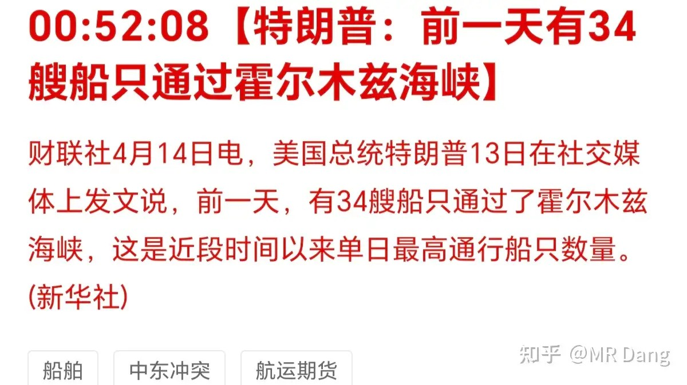

这个统计数据和主流的媒体网站报道存在较大的分歧。

两边谈崩了以后还在继续接触：

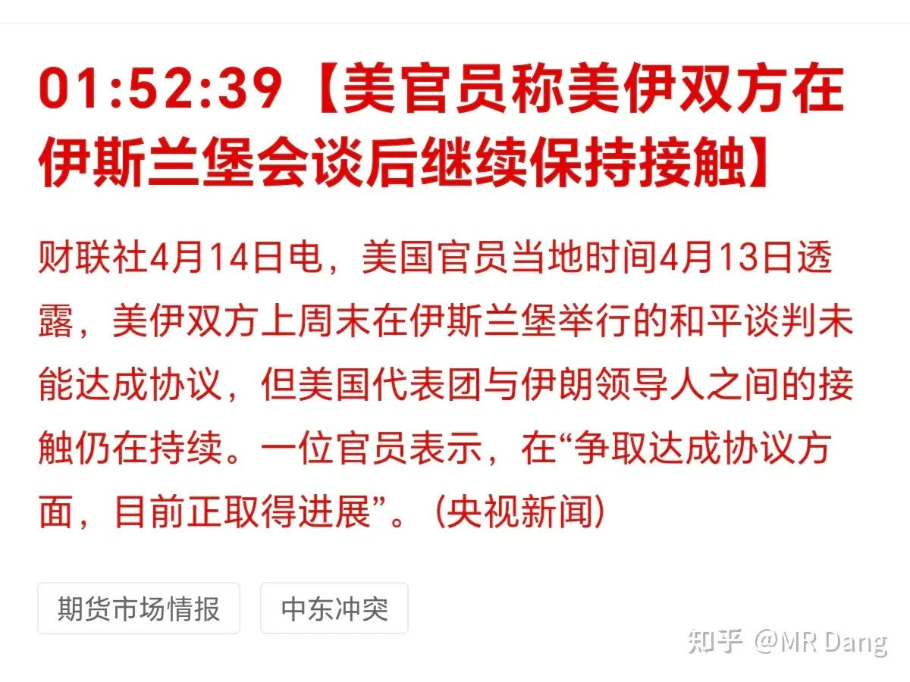

下一轮谈判时间地点：

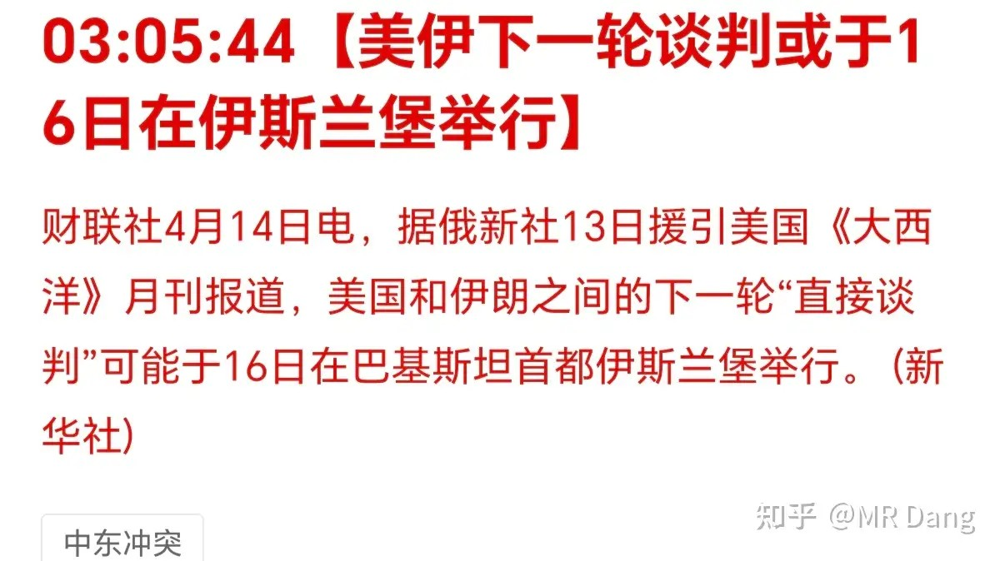

有报道称下一轮谈判可能在16日举行，也就是后天或者大后天。。。。。假设报道为真，这个时间点的话，周末又是各种消息乱飞，然后周一开大开小。

万斯：海峡开放取得进展

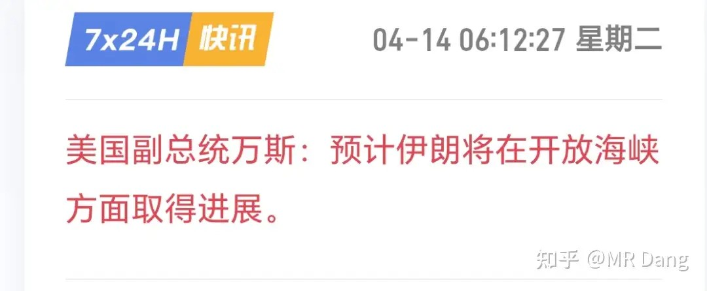

在我这里，万斯的置信度甚至高于懂王。

大概就这样了，现在外界对于这点破事的反应已经逐渐钝化脱敏了。

几组近期发布的宏观数据：

CPI：同比上涨1%

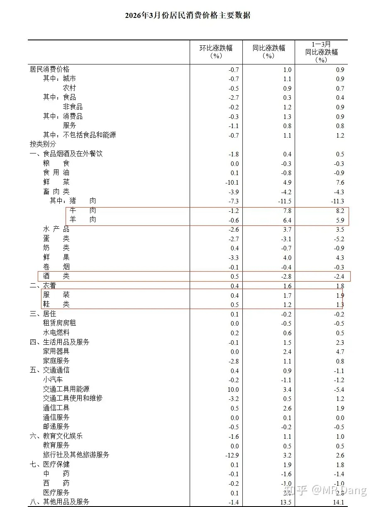

这个上周末出的，分品类看数据比较好一点的是牛羊肉，服装类也还行，然后酒类有环比改善，这个可能盯着的人多。

整体数据一般般，没有特别亮眼的大类。

消费板块整体低迷，CPI数据是一个很重要的因素。

PPI:同比从降低转为上涨，数据很不错，环比也有上涨

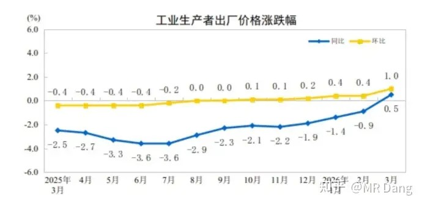

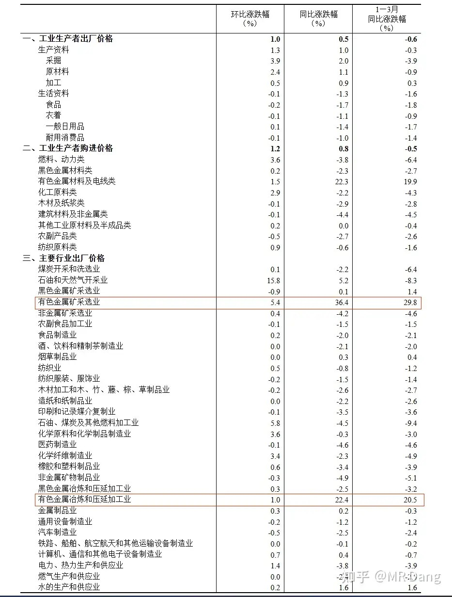

分行业看的话，数据最出色的还是有色，甚至环比也在增长。

很多投资者就好奇了，有色数据这么好，为什么股票不涨？

首先有色板块其实涨了不少的，去年和今年都在涨，拉一下年K就知道了。

其次资本市场其实现在博弈的是预期，而这些数据稍微有点滞后，反映的是前三个月的情况。

如果后面有色可以继续保持现在的态势，业绩早晚会在资本市场兑现的。

M2：同比增长8.5％，稍微低于预期的8.9％

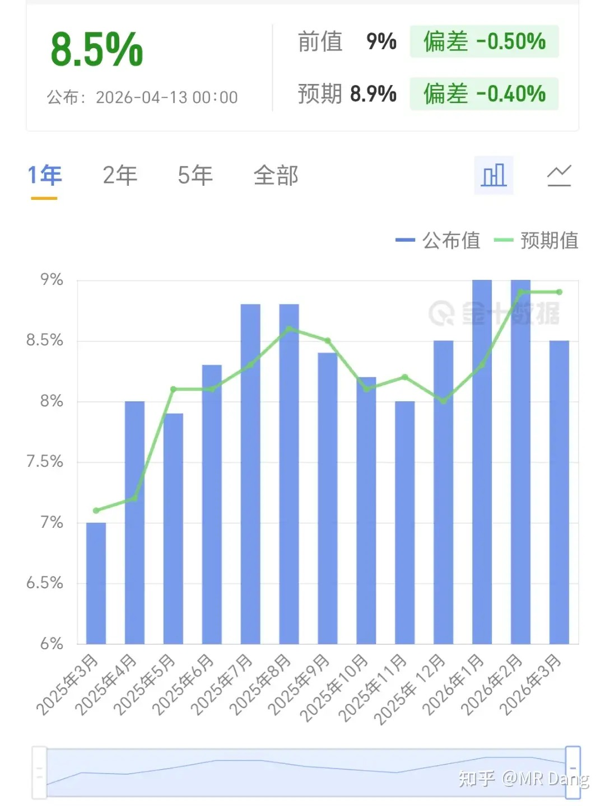

其实作为投资者隐隐约约能感觉到流动性的充裕程度，3月资本市场表现不佳，和这个多多少少有点关系。

社融：14.83万亿，比去年同期少3545亿。

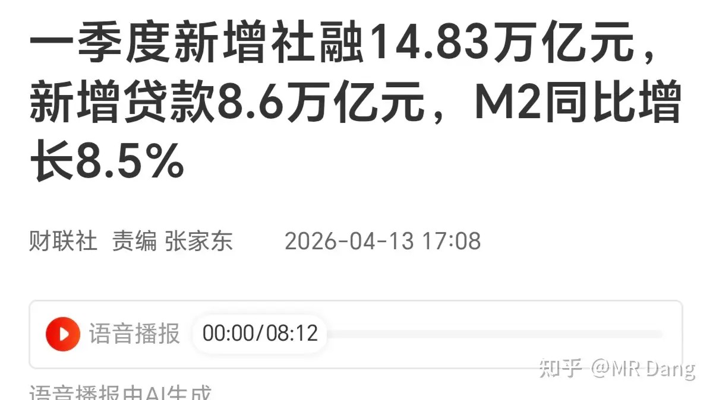

这组数字也是相当保守，反应了大家的一些偏好。

存款数据：同比增长8.6％

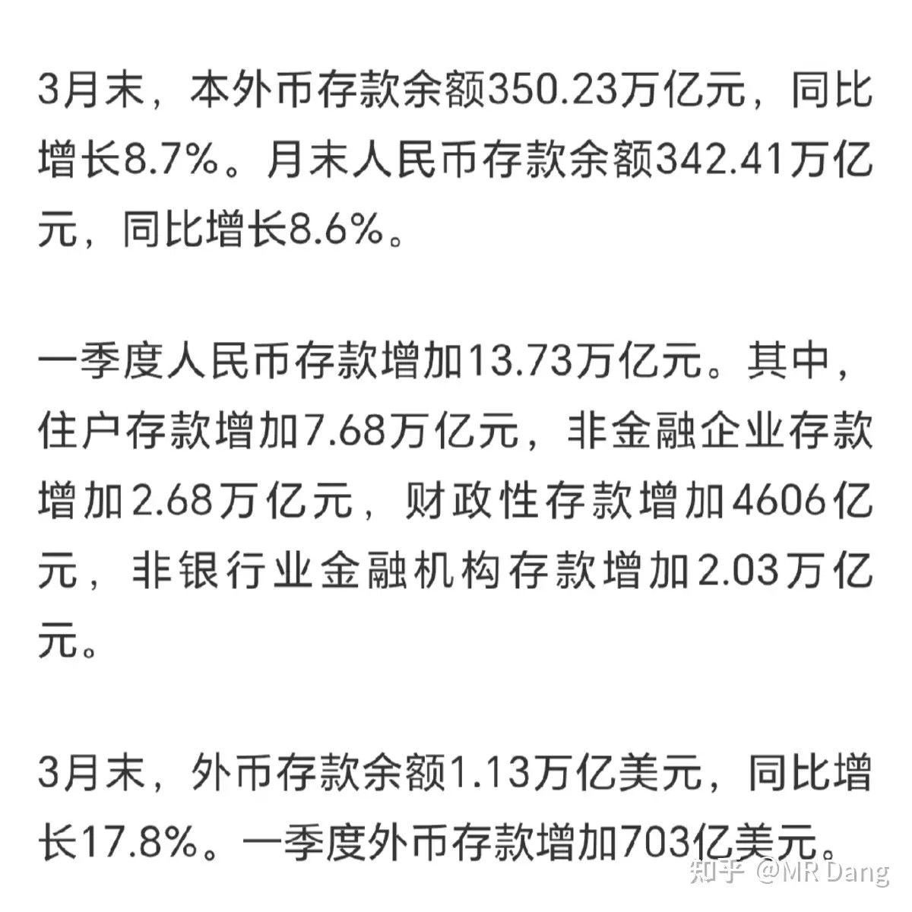

上面的所有数据串起来，说明目前的情况是央行印钱比较谨慎，大家消费相当谨慎，超前贷款更加谨慎，只要兜里有钱就拼命往银行存。

这种克制的货币数据，带来的就是汇率的持续走强：

离岸红票子一度涨破6.82的重要关口，创三年来新高。

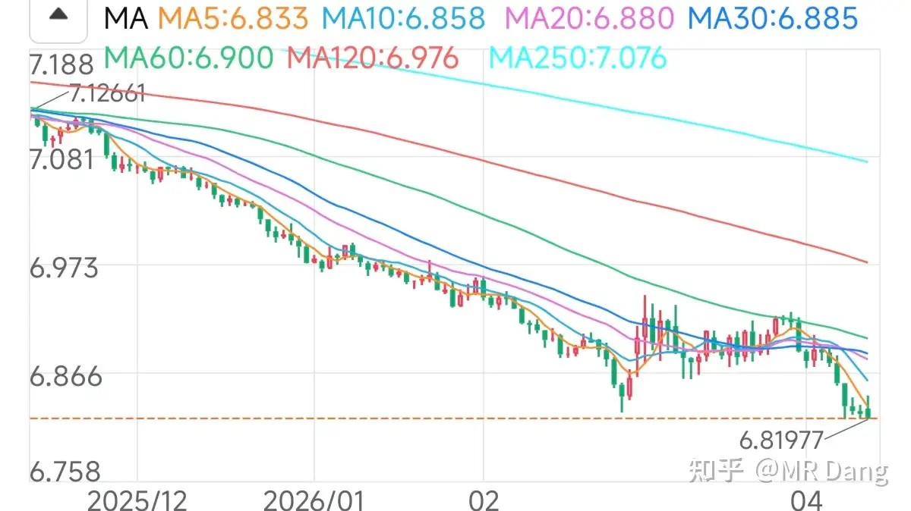

外贸企业可能会有点压力。

伦铝创四年以来新高：

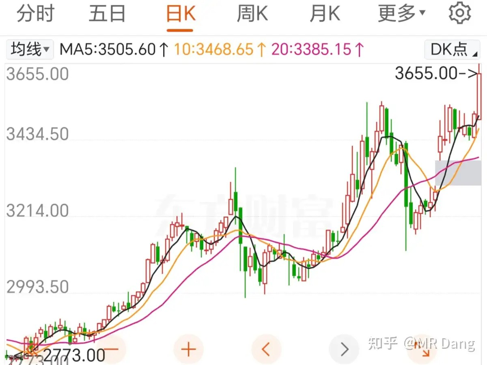

与此同时，沪铝距离历史新高还有四五个点，而大部分铝股还差了一二十个点。

这种比较割裂的情况也是资本市场的常态，所以我经常说不要看期货去炒股。

期货价格可以作为参考，但是不能按走势去做投资决策，两边不是等价的。

其实做博主最讨喜的策略就是看图说话，回调的时候尽快认错，起码还有个知错就改的好名声，涨上去了再继续吹。

回调的时候如果硬着头皮发表和趋势不符的看法，很容易被冲。

但我首先是个投资者，其次才是博主，作为投资者，就不能因为舆论压力自己给自己洗脑，然后强行去找补哪里的逻辑变了。

这不是说说而已，是要掏真金白银的。

某股神企业一季度业绩爆炸：

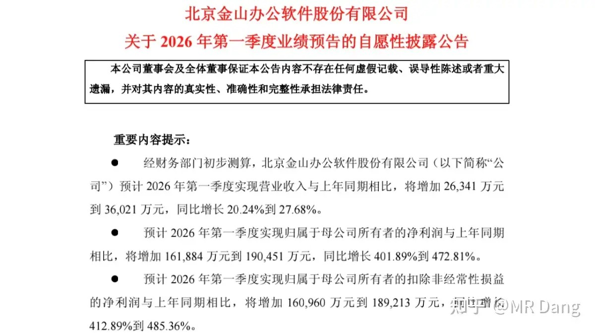

对于原因，公司解释如下：

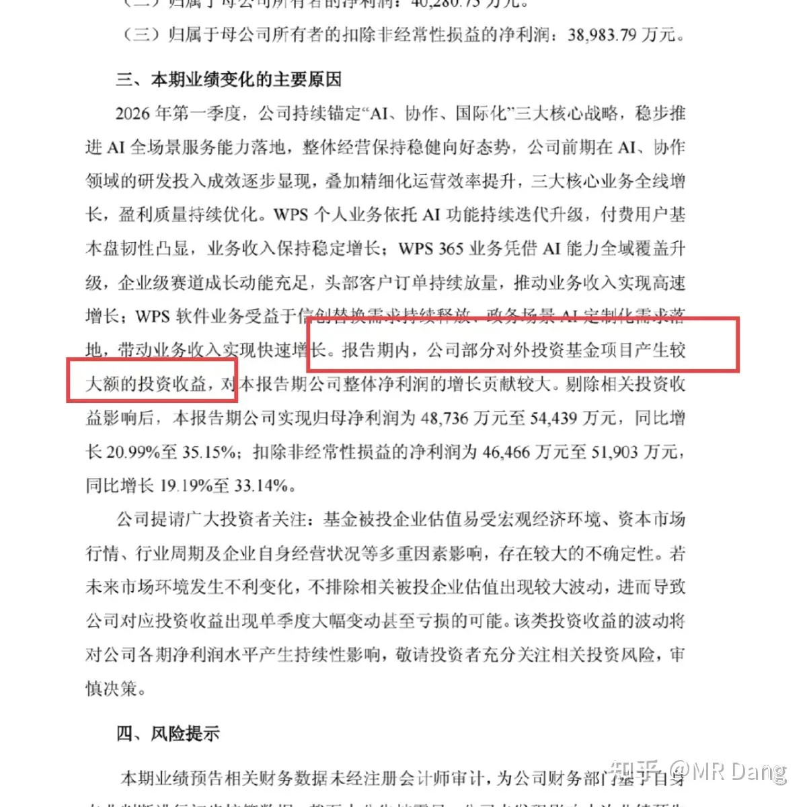

业绩增加中位数是17.5亿，里面九成以上都是投基金赚的，称一声股神不过分。

大宗商品：

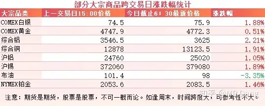

有色整体走强，工业金属领涨，铝和铜都有不错的表现，大概是两个点左右的涨幅。

铜的话，是昨天说的提前对硫酸消息进行定价。铝是供需基本面在持续发力，所以走的比金银这样的锚定降息预期的更稳一些。

油小幅回落三个点，又回到100美元下方了。

外围市场：

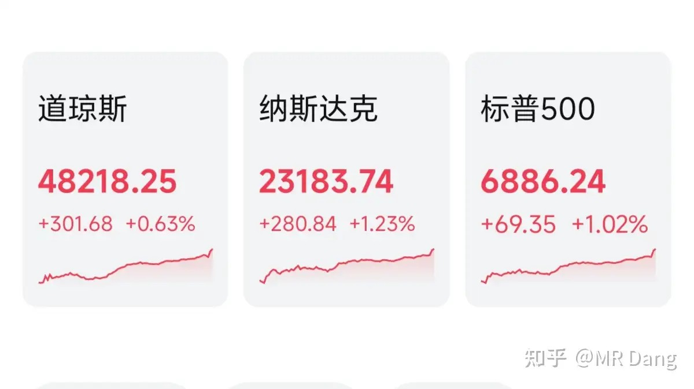

美三大股指走强，纳指领涨，行业上存储板块领涨，闪迪创新高。

昨天个人净值组合被收费近半个点，银行没动，其他的基本上平均近一个点的回撤，消费回撤的有些多，整体跑输指数半个点。

最近确实能感受到市场风格的变化了，以宁王为代表的锂电制造比较强势，这个之前在二月工业增加值的统计数据里也观察到了，当时对那个数据还挺意外。

可惜的是没下定决心布局，算是一个小遗憾。

不是所有的涨了的东西都是遗憾的，像cpo，光纤这样的我就不遗憾，因为光和铜这两边是并行的，铜进光退也好，光进铜退也罢，都是部分替代，机柜间的传输用光，机柜里面说到底还是要用大量的铜。

光崛起了，那说明需求还在，需求在就是好消息，虽然我没有光，但是我有铜，那就没遗憾。

当然这种小遗憾一般都是转瞬即逝的，投资者都是看图说话的，哪天要是看到一根大绿棒子，说不定又该庆幸了。

昨天本来做好了心理准备的，小亏当赢，最后真的是小亏，那就算赢，挺超预期的。

至于今天的话，外面情绪不错，也许能有点小期待。

一个喜欢保护韭菜的博主，希望大家少少踩坑，多多赚钱！！！

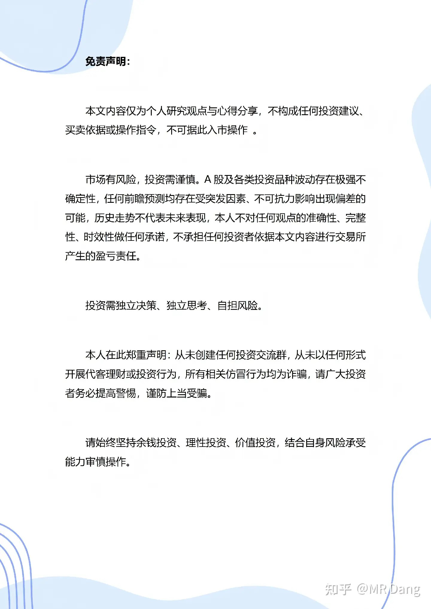

> [!comment]- 点击展开评论
>
> | 用户 | 时间 | 内容 |
> | :--- | :--- | :--- |
> | LUODONG | 4 小时前 | Dang哥，今天应该是好运加倍的吧，早上起来一看中签了 |
> | &nbsp;&nbsp;&nbsp;&nbsp;MR Dang | 4 小时前 | 恭喜啊 |
> | &nbsp;&nbsp;&nbsp;&nbsp;LUODONG | 3 小时前 | 嘿嘿谢谢Dang哥 |
> | &nbsp;&nbsp;&nbsp;&nbsp;王志嵩 | 3 小时前 | 中签是指什么？ |
> | &nbsp;&nbsp;&nbsp;&nbsp;一条壁虎 | 3 小时前 | 中了新股啊，你炒股多久了这个都不知道 |
> | 钱包鼓鼓 | 4 小时前 | 每日打卡第33天整体中性偏谨慎。中东那边打得再热闹，市场已经不买账了。CPI 物价同比涨 1%，只有牛羊肉、服装、酒类稍好。整体消费很差，消费股起不来就是这个原因。M2 增 8.5%，比预期低，市场钱不够。国外铝价创四年新高，国内铝价和铝股没跟上。短期外围情绪回暖，大A 可能小涨。长期货币偏紧、消费偏弱，别重仓梭哈。 |
> | 知了也睡了 | 3 小时前 | 为什么你绿的时候我和你一起绿 你红的时候不带我 |
> | &nbsp;&nbsp;&nbsp;&nbsp;MR Dang | 3 小时前 | 哈哈 |
> | &nbsp;&nbsp;&nbsp;&nbsp;维基 | 3 小时前 | 是这样 |
> | 宝木书 | 4 小时前 | 持有铝。t到-4.5%，今天还t不t，感觉快涨了 |
> | &nbsp;&nbsp;&nbsp;&nbsp;MR Dang | 4 小时前 | 频繁交易容易吃亏 |
> | 一米阳光 | 4 小时前 | 美股已经9连阳了～ |
> | &nbsp;&nbsp;&nbsp;&nbsp;最后的宿命 | 2 小时前 | 美股九连阳疲态尽显，已是强弩之末 |
> | &nbsp;&nbsp;&nbsp;&nbsp;最后的宿命 | 2 小时前 | 太A五连阴蓄势待发，犹如明日之星！ |
> | 平凡体 | 2 小时前 | 🍺怎么一直在跌啊，天热了，世界杯也快来了，大家看足球的时候不喝🍺吃烧烤吗，到时候准备一人嘴里叼根光纤吗 |
> | &nbsp;&nbsp;&nbsp;&nbsp;李绍唐 | 1 小时前 | 原材料涨价吧，铝罐啥的，提前布局的资金搞科技有色多香 |
> | 我爱吃草莓 | 2 小时前 | D大  啤酒还有救吗 |
> | 长工 | 4 小时前 | 钾王也出业绩了，老师怎么看 |
> | &nbsp;&nbsp;&nbsp;&nbsp;MR Dang | 4 小时前 | 个股一般发圈内 |
> | 养鹅下蛋 | 2 小时前 | 老师啤酒怎么跌成这样了 |
> | 如来熊掌 | 4 小时前 | 我连续2天跑输指数，看今天能不能追上来了 |

---

*本文件从MR Dang知乎页面转载*

---

**作者**: MR Dang
**链接**: https://www.zhihu.com/question/2026622382387775260/answer/2027291226064299400
**来源**: 知乎

*著作权归作者所有。商业转载请联系作者获得授权，非商业转载请注明出处。*

---

## 相关阅读

**📈 每日行情评价系列：**
- [[20260413-如何评价2026年4月13日A股行情？|4月13日行情]] - 谈判无果与核心分歧拆解。
- [[20260410-如何评价2026年4月10日A股行情？|4月10日行情]] - 黎巴嫩局势与宏观数据共振。
- [[20260409-如何看待 2026 年 4月 9日 A 股市场行情？|4月9日行情]] - AI热点与谈判阵容。
- [[20260408-如何评价2026年4月8日A股行情？|4月8日行情]] - 央行增持黄金与情绪修复。
- [[20260407-如何评价2026年4月7日A股行情？|4月7日行情]] - 假期冲突升温与风险偏好。
- [[20260403-如何评价2026年4月3日A股行情？|4月3日行情]] - 海湾管道传闻与海峡预期。
- [[20260402-如何评价2026年4月2日A股行情？|4月2日行情]] - 电解铝产能冲击与修复。
- [[20260401-如何看待 2026 年 4月 1日 A 股市场行情？|4月1日行情]] - PMI数据与银行分化。
- [[20260331-如何评价2026年3月31日A股行情？|3月31日行情]] - 季末配置与白酒、银行观察。
- [[20260330-如何评价2026年3月30日A股行情？|3月30日行情]] - 非农预期与央企红利上缴。

**📘 财报方法：**
- [[20260404-如何分步骤快速看懂上市公司年报？|看懂年报]] - 年报阅读路径与重点抓取。
- [[20260401-读懂财报，看清基本面|读懂财报]] - 基本面识别与关键指标。
- [[20260409-如何看待知乎 2025Q4 财报？知乎终于盈利了？|知乎财报]] - 资产负债表与估值错位案例。
