# 如何评价2026年4月15日A股行情？

---

**发布时间**: 2026-04-15 07:35  |  **原文链接**: https://www.zhihu.com/question/2025596599657612852/answer/2027651122437832986  |  **点赞数**: 283 人赞同

**作者信息**: MR Dang​​​知势榜经济与管理领域影响力榜答主

---

## 正文内容

简单的过一下伊朗局势的谈判时间罗生门：

消息人士说：本周晚些时候在巴铁

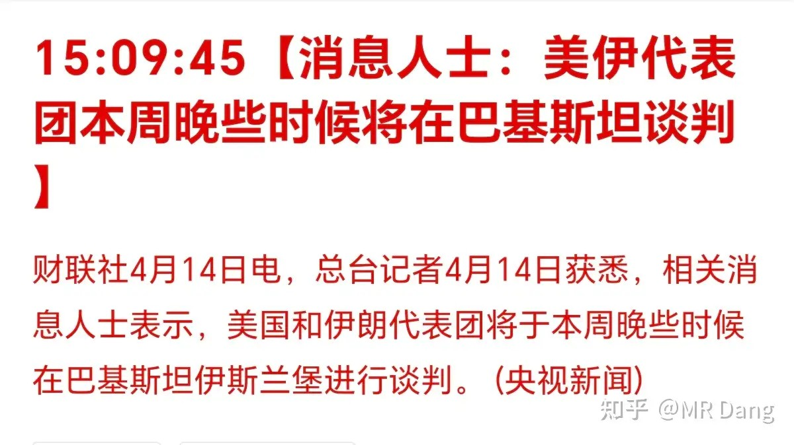

伊朗外交官说：本周或下周初在巴铁

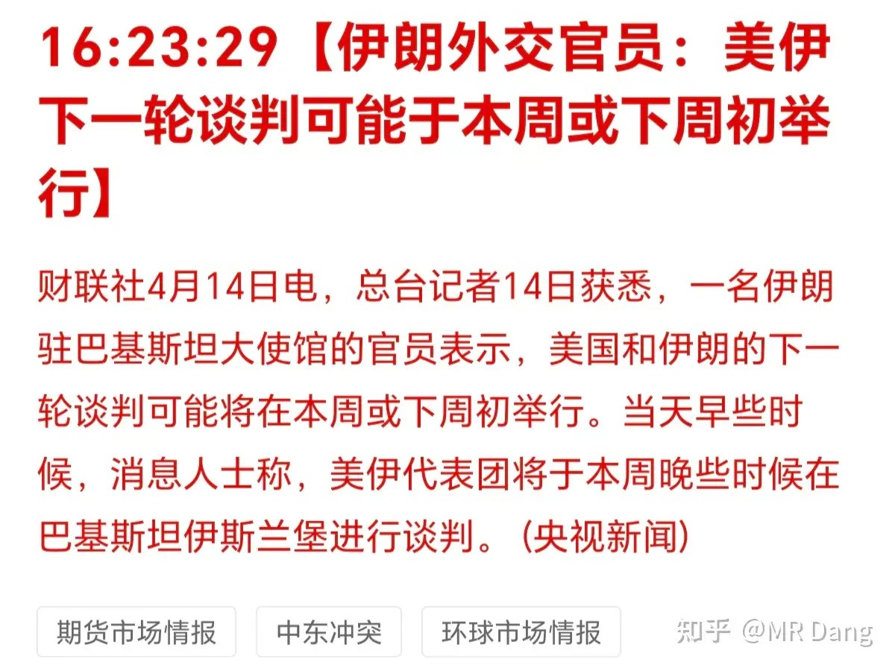

伊朗另一个新闻官说：任何时间，任何地点

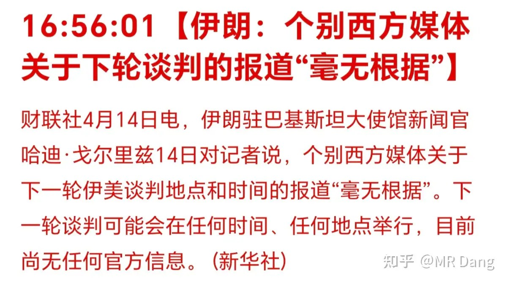

懂王说：未来两天内

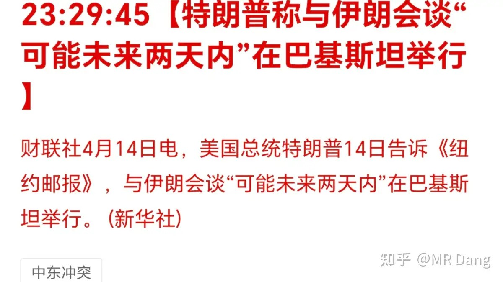

给我看笑了，要不你们打一架统一一下口径。

有小道消息称，伊美之间是因为5年还是20年现在谈不拢。

也就是美要求伊朗20年之内不能进行铀浓缩。

伊朗说的是5年内不进行。

资本市场觉得这不算什么原则性分歧，因此开始定价两边可以谈成。

以黎会谈结束，目前没有达成什么协议的消息爆出：

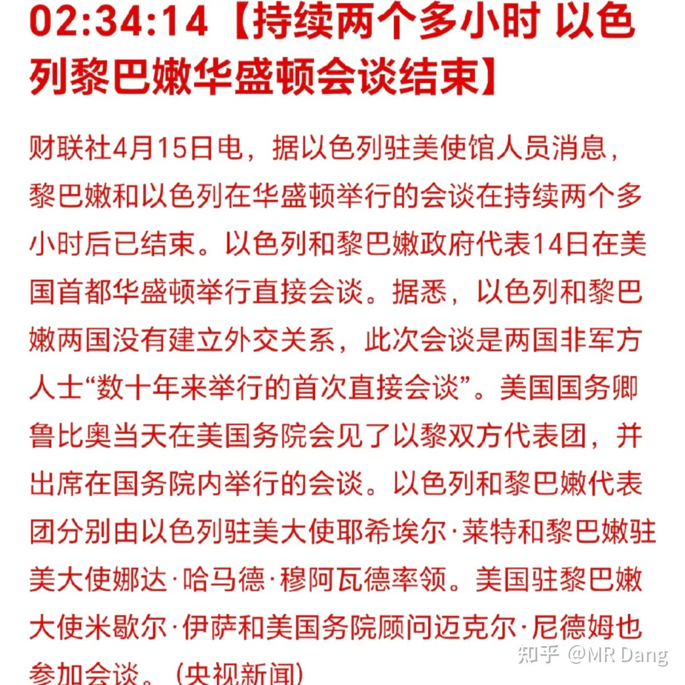

海峡近况：

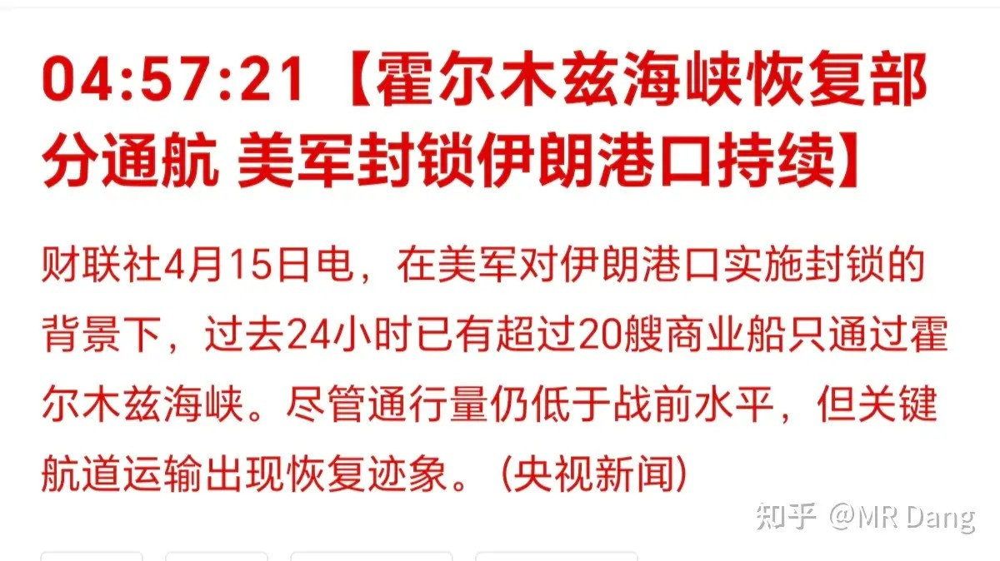

目前最大的分歧只剩下海峡由谁来收费。

进出口数据出炉：

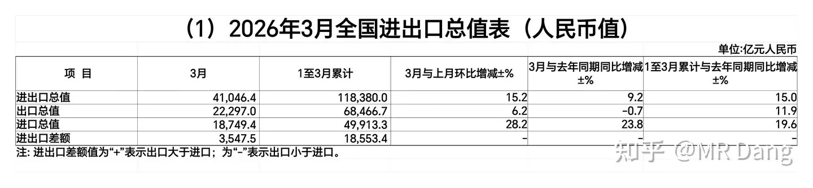

出口方面，三月份数据同比微降0.7％，但是环比增长6.2，一季度整体同比增加11.9％。

这个和昨天说汇率的时候，出口承压是一致的。

当然总体还是稳中向好，只不过是单月稍微有点压力，和对比基数也有关系，不要过度解读。

进口方面数据就很夸张了，三月同比增长23.8％，环比增长28.2％，一季度整体增长19.6％。

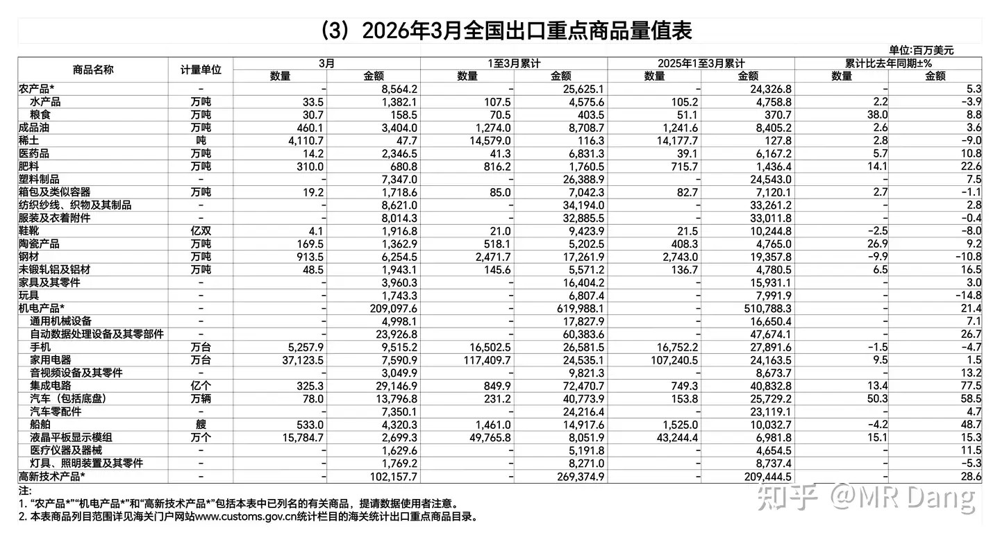

分行业的话，一季度出口金额同比增长超过15％的商品有肥料，铝材，机电产品（包含集成电路，汽车，船舶，液晶屏等），高新技术产品四大类。

同比降低超过10％的有钢材和玩具两大类。

可以看出来咱们的出口结构是越来越合理的，增加的都是高附加值的产品，减少的大都是低附加值的产品，整个产业都在升级。

当然手里有相关标的的也可以多注意下，特别是出口导向型的玩具企业这种的，塑料成本，金属成本不断提高，出口金额减少，注意相关风险。

逆回购：6000亿到期，5000亿投放，净回收1000亿流动性。

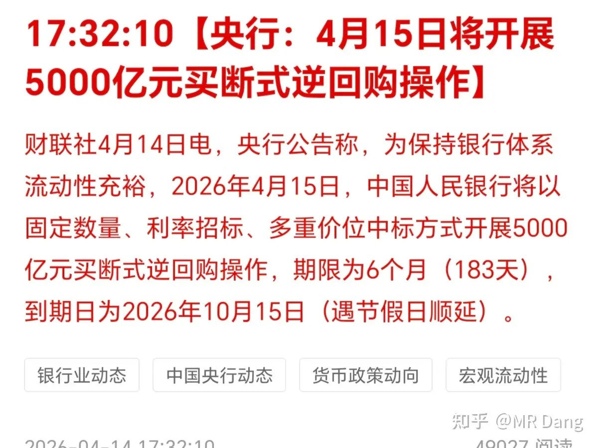

上期所：调整黄金等期货保证金比例

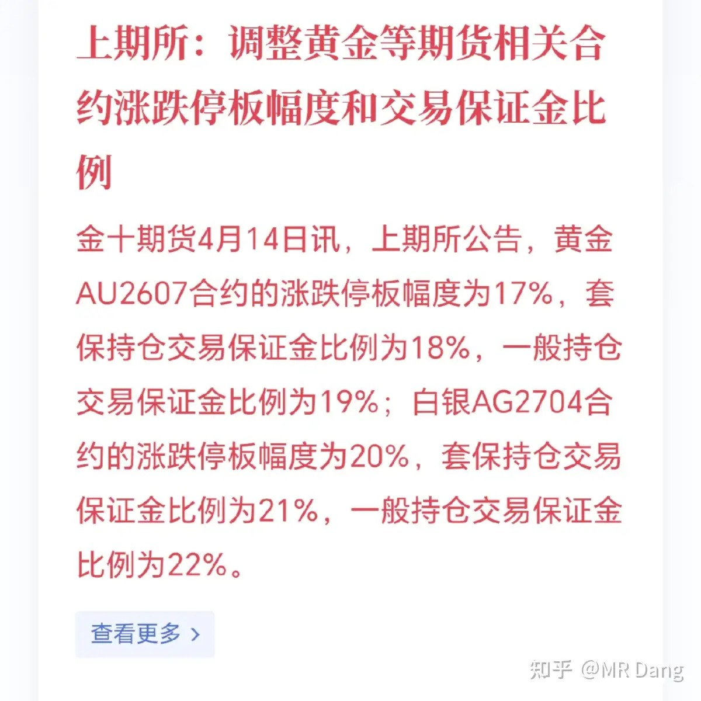

整体来看，调高了保证金比例。

调高一般就是来应对风险的，都是有比较大的波动的时候使用的应对手段。

蹊跷的是最近波动其实不算大，所以可能是上期所觉得最近波动会加大，某些仓位存在爆仓风险，所以提前防患于未然。

达子推出量子计算人工智能模型：

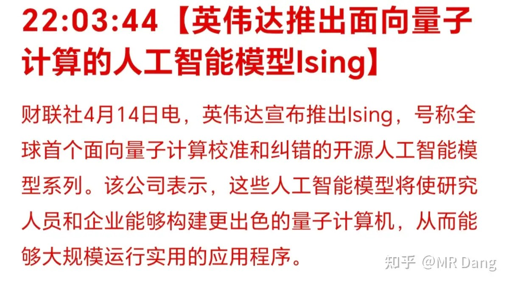

这个确实有点太超前了，模型核心包括视觉语言模型和3D卷积神经网络。

消息传出后美股量子相关概念股都有不小的涨幅。

某当红炸子鸡企业：

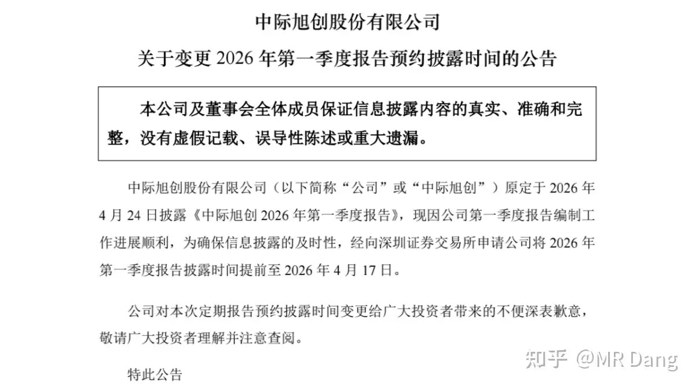

挺少见的，距离一季报预约披露时间这么近的情况下提前一星期披露一季报。

每年可能发生不到几十次，没统计过，凭印象说的。

这种属于中性偏利好，会被认为是向市场传递“学霸才会提前交卷”的信息。

但是到底如何，还要发布后再看，反正现在预期打的是挺高的，胃口吊足了，万一要是不及预期，那就不太好收场了。

还有一件事是段永平卖出了某泡泡的PUT，卖PUT相当于看多，是他常用的抄底手段。

卖PUT这种操作盈利有上限，就是权利金。亏起来就很难说了，如果跌跌不休，理论亏损上限要比盈利上限高很多。

适合艺高人胆大的投资者，普通投资者就别抄作业了，期权算是金融产品里难度最高，风险最大的那一档。

部分企业业绩预报增长情况：

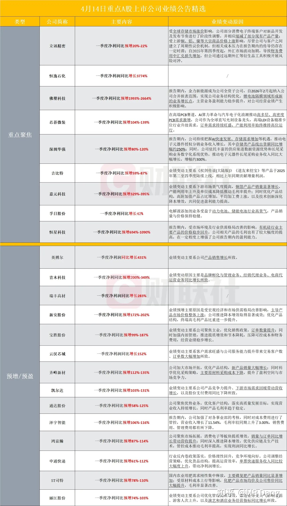

大宗商品：

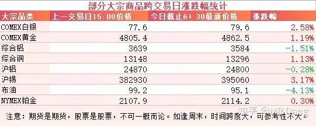

受谈判预期影响，原油价格回落，盘后回调四个点。

有色除了铝整体走强，锡领涨，盘后上涨三个点，又逼近了40万大关。

金银铜也分别有一两个点的涨幅。

外围市场：

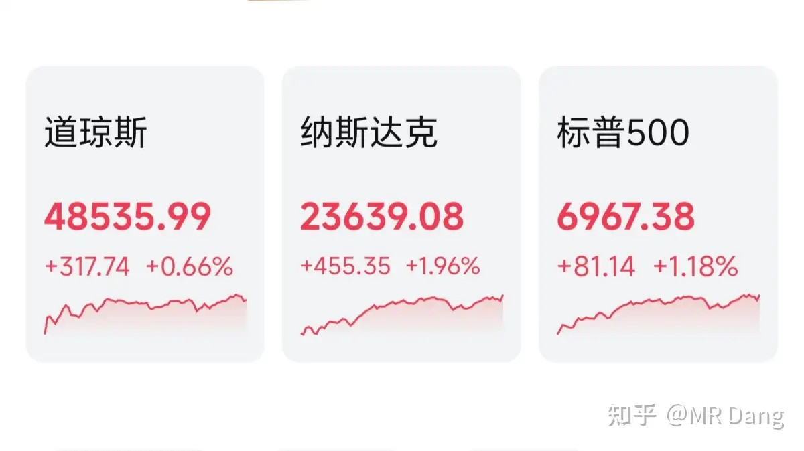

美三大股指走强，纳指领涨，个股方面，存储走强，美光接力闪迪，逼近历史新高。

不只是美股，像韩国的存储板块，海力士也走的很强。

昨天个人组合净值回血1个多点，银行大半个点，资源三个半，电网一个半，消费绿近一个。总算勉强跑赢指数一次。

消费这段时间是真的不行，消费数据不行，股票表现也不太好。

感觉各种酱油茅，医美茅，榨菜茅，牛奶茅百茅争艳的盛景好像还是不久以前刚发生的事情一样，一翻k线图，差点认不出来。

资本市场这种报团取暖的情况隔一段时间就会发生一次，最后都是一地鸡毛。

大多数投资者对这种情况也不是很反感，只不过酸的是怎么没有抱团自己的持仓。

现在ai的预期确实不错，很多公司也确实挺好。

但是落实到投资，还有一杆叫做“估值”的称。

还是那句话，判断好不好很容易，判断值不值就太难了。

至于今天的话，外面情绪挺不错，按道理来说是能回口血的。

不过还是不能上头，仓位控制牢记心间，万一有个什么黑天鹅，也不至于一下就被按在地上摩擦。

一个喜欢保护韭菜的博主，希望大家少少踩坑，多多赚钱！！！

> [!comment]- 点击展开评论
>
> | 用户 | 时间 | 内容 |
> | :--- | :--- | :--- |
> | 钱包鼓鼓 | 1 小时前 | 每日打卡第34天进出口数据中高附加值产业在升级，但低附加值产业（比如玩具、钢材）遭遇成本和需求的双杀。逆回购到期6000亿，只投放5000亿，净回笼1000亿，央行在收水。上期所调高了黄金等期货保证金，注意风险。消费继续拉胯，资金抱团AI，小心接盘。 |
> | HiAlice | 1 小时前 | 之前快4200点的时候就觉得对牛市有迷之信心很足，觉得会继续突破，一股都舍不得卖。被毒打之后眼神清澈了很多，现在才重回4000点就开始恐高了，随时想减仓 |
> | &nbsp;&nbsp;&nbsp;&nbsp;小特 | 11 分钟前 | 关键回到4000点我还没回本啊，涨起来的时候涨的不一定有我的，跌起来的时候肯定有我的 |
> | 糖指导 | 1 小时前 | 日子高开1.1％，棒子2.8％，看看今天大A要不要脸 |
> | hejzhb | 1 小时前 | 伊朗钱粮都见底，只能赐和了，现在只是半推半就 |
> | 回答里不要放广告 | 1 小时前 | 任何时间任何地点，超级侦探认真办案 |
> | &nbsp;&nbsp;&nbsp;&nbsp;MR Dang | 1 小时前 | 你也看汪汪队 |
> | 念玉 | 1 小时前 | 早文章老是被夹刷不到 |
> | &nbsp;&nbsp;&nbsp;&nbsp;MR Dang | 1 小时前 | 可能是限流了 |
> | 王志嵩 | 1 小时前 | 前排 |
> | 浪得虚名 | 1 小时前 | 好了，今天要回血 |

---

*本文件从MR Dang知乎页面转载*

---

**作者**: MR Dang
**链接**: https://www.zhihu.com/question/2025596599657612852/answer/2027651122437832986
**来源**: 知乎

*著作权归作者所有。商业转载请联系作者获得授权，非商业转载请注明出处。*

---

## 相关阅读

**📈 每日行情评价系列：**
- [[20260414-如何看待2026年4月14日A股市场行情？|4月14日行情]] - 谈判时间反复、数据预期钝化。
- [[20260413-如何评价2026年4月13日A股行情？|4月13日行情]] - 谈判无果与核心分歧拆解。
- [[20260410-如何评价2026年4月10日A股行情？|4月10日行情]] - 黎巴嫩局势与宏观数据共振。
- [[20260409-如何看待 2026 年 4月 9日 A 股市场行情？|4月9日行情]] - AI热点与谈判阵容。
- [[20260408-如何评价2026年4月8日A股行情？|4月8日行情]] - 央行增持黄金与情绪修复。
- [[20260407-如何评价2026年4月7日A股行情？|4月7日行情]] - 假期冲突升温与风险偏好。
- [[20260403-如何评价2026年4月3日A股行情？|4月3日行情]] - 海湾管道传闻与海峡预期。
- [[20260402-如何评价2026年4月2日A股行情？|4月2日行情]] - 电解铝产能冲击与修复。
- [[20260401-如何看待 2026 年 4月 1日 A 股市场行情？|4月1日行情]] - PMI数据与银行分化。
- [[20260331-如何评价2026年3月31日A股行情？|3月31日行情]] - 季末配置与白酒、银行观察。

**📘 财报方法：**
- [[20260404-如何分步骤快速看懂上市公司年报？|看懂年报]] - 年报阅读路径与重点抓取。
- [[20260401-读懂财报，看清基本面|读懂财报]] - 基本面识别与关键指标。
- [[20260409-如何看待知乎 2025Q4 财报？知乎终于盈利了？|知乎财报]] - 资产负债表与估值错位案例。
