# 如何评价2026年4月16日A股行情？

---

**发布时间**: 2026-04-16 07:32  |  **原文链接**: https://www.zhihu.com/question/2025596692037148777/answer/2028012790237996449  |  **点赞数**: 422 人赞同

**作者信息**: MR Dang​​​知势榜经济与管理领域影响力榜答主

---

## 正文内容

今天头条给到反内卷新政策：

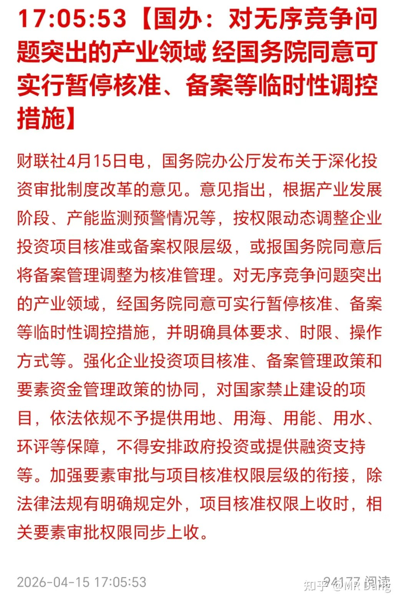

这个背景怎么说呢，就是有些内卷行业里的有些企业，股东很强大，为了当地就业，当地的经济，可以持续的输血。

而且这种企业它不是一两个，是有好几个。

这种企业要是只有一两个，那还好，用无限体力槽熬死友商，那整个行业也能好过一些。

怕的是有好几个都是这种输血模式的，最后竞争格局就变成了全行业里剩下成本控制最优秀的几个民企，还有输血能力最强的几家企业魔法对轰。

普通的政策根本动不了这些企业。

所以这个新政可以说是直指要害，调整核准和备案权限层级，意思就是你们当地说了不算，得上头点头才行。

我个人认为这是一个影响深远的政策，可以影响好几个行业未来几年竞争格局的重磅政策。

利空的就是上面说的单纯为了当地经济数据持续输血，但是没有经济效益的内卷企业。

利好的就是这个行业的其他企业。

很重磅的一个政策，如果执行到位，很多投资逻辑都需要重塑。

商业航天：轻舟飞船取得重要突破

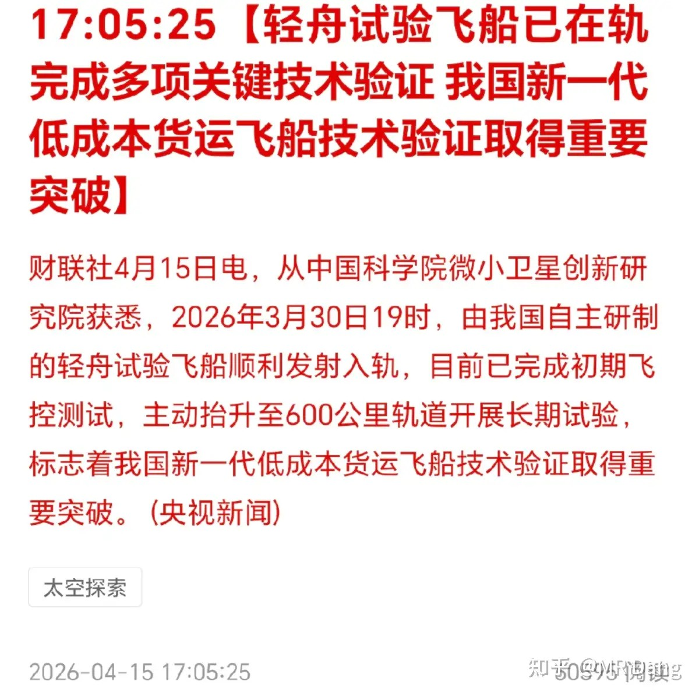

一个冷知识，轻舟飞船也叫白象号，嗯，对，就是你想的那个白象，卖泡面的那个，战略合作伙伴。

投资标的的话，没有特别直接的，大都是那种部件供应商，这种利好程度比较有限。

只能说利好商业航天板块吧，这个板块热过一阵，诞生了好多航天员，就没然后了。

简单的过一下伊朗局势：

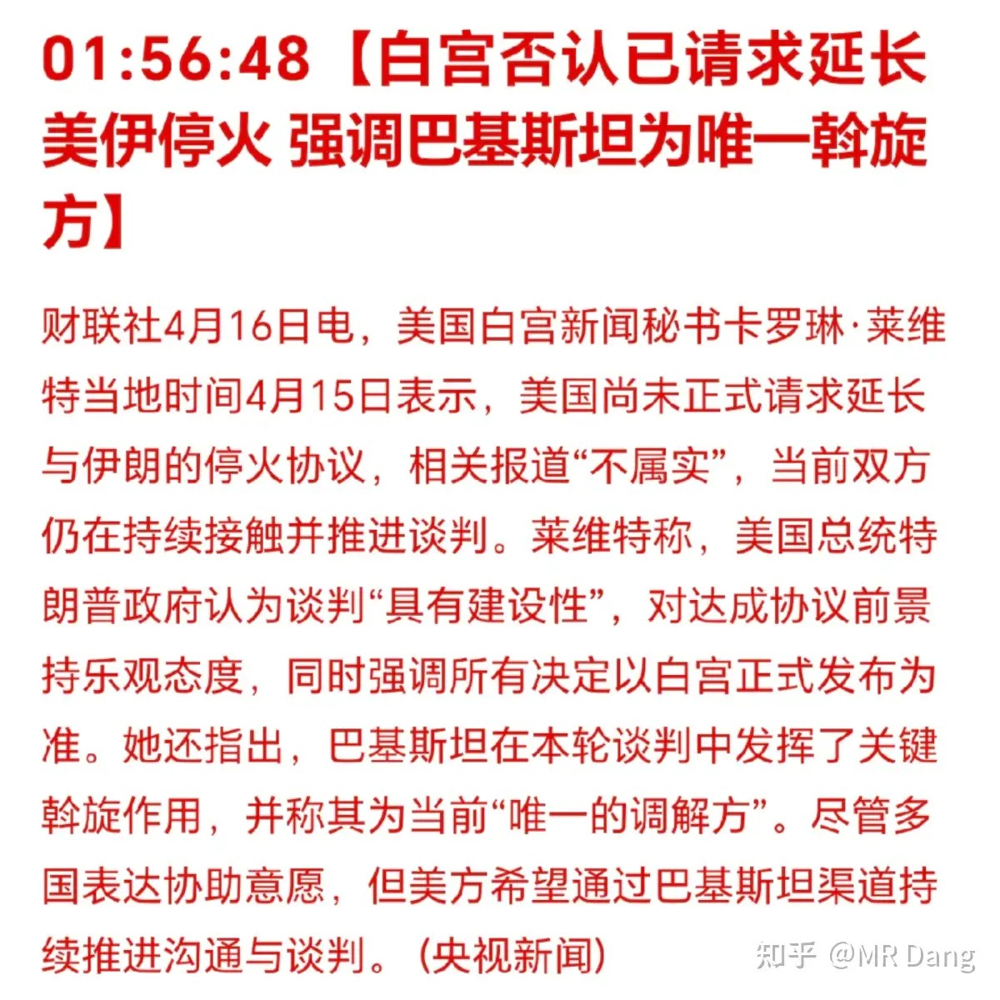

属于巴铁的高光时刻，白房子指定唯一调节方。

之前有延期停火的相关报道，在白房子这里被辟谣了，周末又要开始来回拉扯，好在资本市场越来越不敏感了。

另外伊朗这边也有一定的松口：

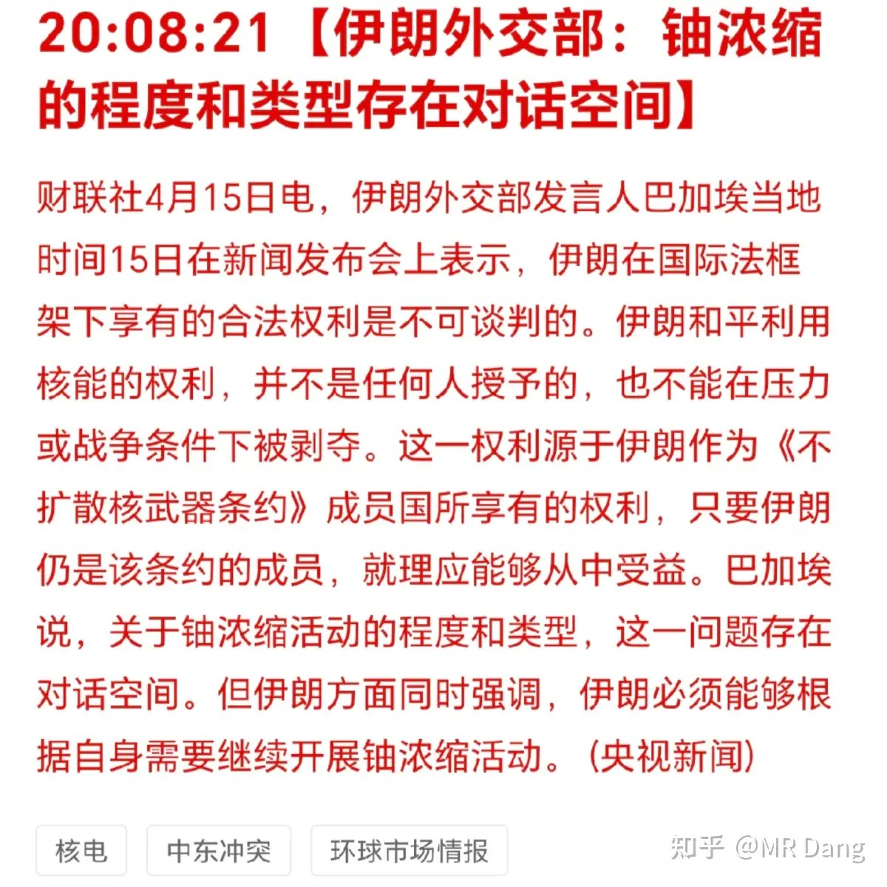

以前表态铀浓缩是不能谈的，现在扭扭捏捏放到牌桌上了。

银行业传来新消息：部分银行境外贷款杠杆率上调

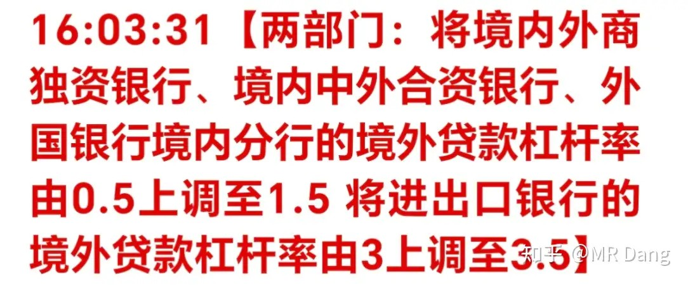

这个政策利好的对象是外商独资银行，合资银行和外国银行境内分行，还有口行。

口行是政策性银行，而其他的银行和咱们平时接触的商业银行也基本没关系，所以对于这些上市银行几乎没什么影响。

反倒是利好在境外的资本密集型中资企业，比如做建筑，工程，能源，开采类的这些。

以后可以低成本获得更多的贷款，但杠杆是把双刃剑，如果用不好也会受到反噬。

轮胎涨价：

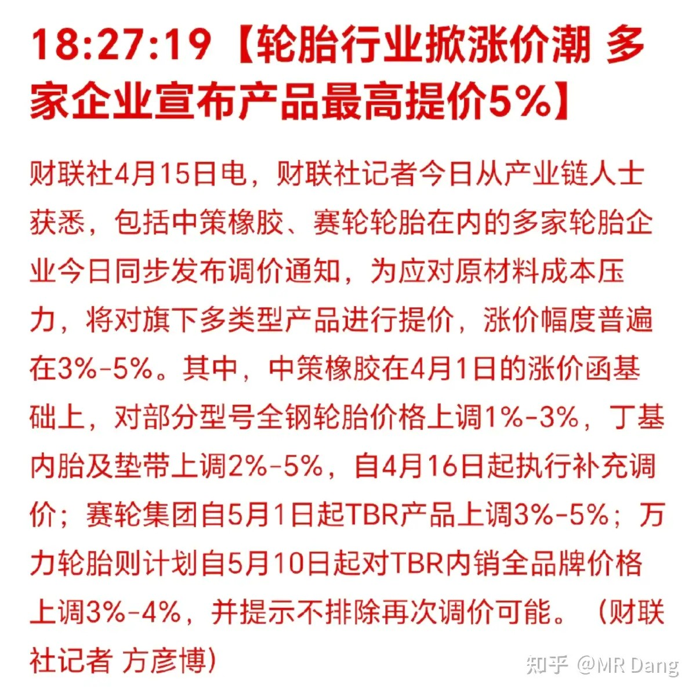

这种涨价是被动的，主要是原材料，比如合成橡胶价格上涨，比如天胶价格上涨。

正好和上周末在圈内讲的橡胶大宗分析就联动上了。

橡胶这个品种，中长期来看，确定性很强很强。

宁王发布了一季报：

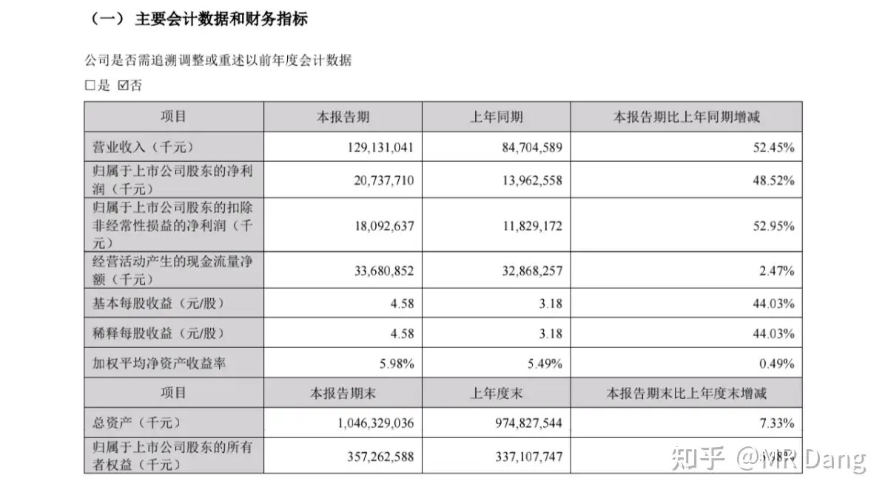

同比增长48％，牛的，淡季不淡，国内制造业的标杆。

营收增速比净利增速还高，直接拉到了52％，受益于海峡封锁，需求爆炸。

就简单的一季度乘个4，全年都有830亿净利润。

目前市值不到两万亿，估值也就是20刚过一些，相当有性价比。

从商业模式上来说，一个中游加工企业能把下游的车企都干成自己的生产资料，也是非常罕见的情况了。

其他发布业绩的企业统计：

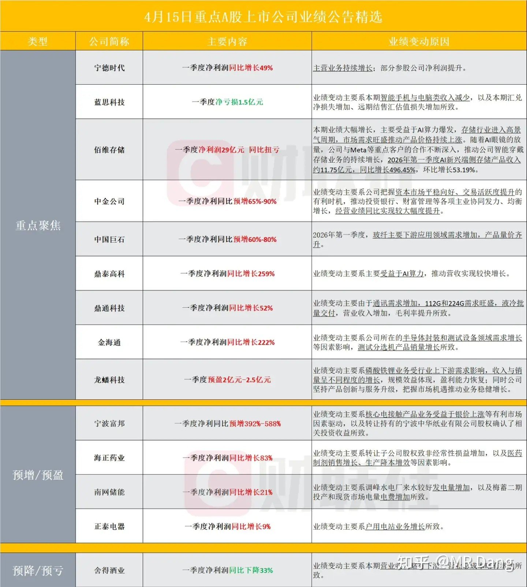

大宗商品：

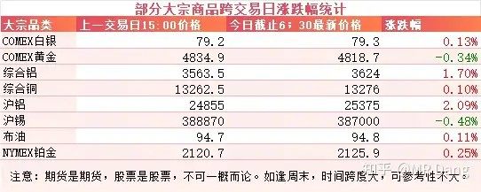

大宗商品在昨天收盘后整体表现比较平淡，除了铝表现强势以外，其他都处于随机波动的范围，涨跌有限。

外围市场：

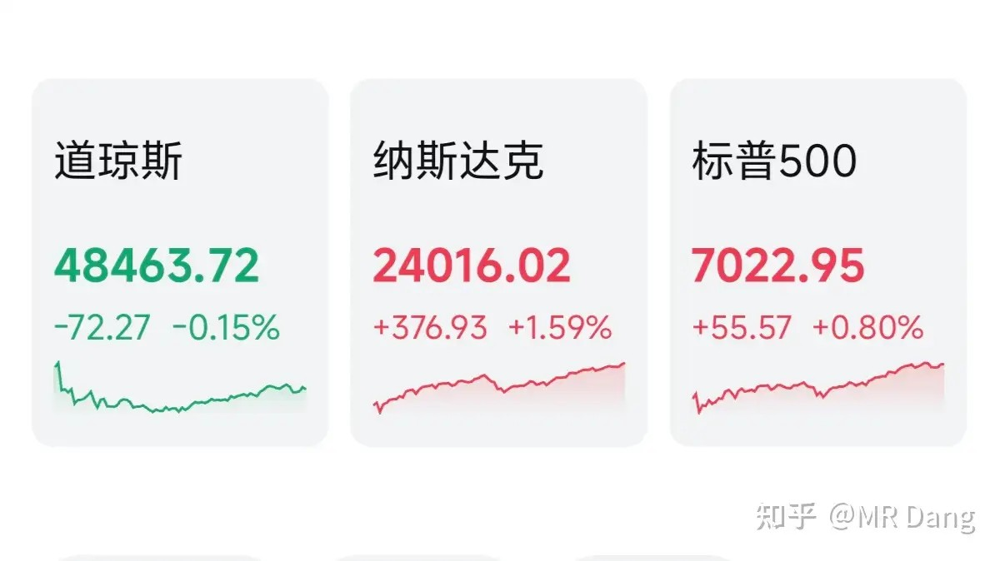

美三大股指涨跌不一，纳指领涨，科技走强。

存储回调，特斯拉接力。

特斯拉最新的AI5芯片流片，功耗是同级别达子的三分之一，成本只有十分之一，很惊人的数据。

主要打算用在特斯拉的机器人和无人出租车上，颗粒据说用的是海力士的。

昨天个人组合净值几乎没变化，微微绿了点，银行绿半个，电网红两个，资源绿1个半，消费红1个多。

和盘前的氛围还是有点反差感，咱们大A还是理性，当其他资本市场都在非理性繁荣的时候，大A已经开始为不确定性提前定价了。

盘中的时候顺手截了张图：

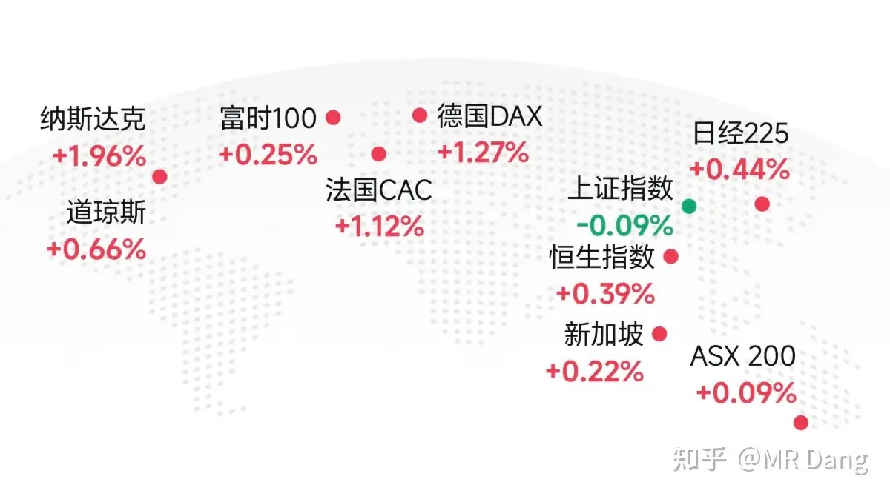

当然最后大A还是暴涨了0.01％，起码在颜色上做到了整齐划一。

本来还想啃个大草莓，结果吃了一嘴泥。

一个喜欢保护韭菜的博主，希望大家少少踩坑，多多赚钱！！！

> [!comment]- 点击展开评论
>
> | 用户 | 时间 | 内容 |
> | :--- | :--- | :--- |
> | 一个89大叔 | 6 小时前 | 10年宽指指数投资者表示，普通人最好的投资方式还是标普500。 能平均超过这个收益率的凤毛麟角。 |
> | 钱包鼓鼓 | 7 小时前 | 每日打卡第35天国家出台反内卷新政，上收项目审批权，断掉地方输血企业的续命通道，多个行业竞争格局将重塑。伊朗松口将铀浓缩放上谈判桌，巴铁被指定为唯一调解方，资本市场对此已经脱敏了。橡胶中长期确定性很强，轮胎被动涨价是原材料成本推动。宁王一季报净利润增48%，营收增52%，全年预估净利830亿，20倍出头的估值，性价比高。美股科技走强，特斯拉AI5芯片功耗仅达子三分之一、成本十分之一。 |
> | 在下狐诌子 | 5 小时前 | 绿桥太权威了冲高必回落，低开必低走，摸高点的时候就2秒，出去都来不及 |
> | &nbsp;&nbsp;&nbsp;&nbsp;带薪休假 | 4 小时前 | 这个股票真的有毒。本来不想动，这下要在里面狠狠做t了。 |
> | &nbsp;&nbsp;&nbsp;&nbsp;星河江枫入梦来 | 2 小时前 | 完全不及云铝 |
> | 爱吧啦的大圆子 | 7 小时前 | 昨天挨打，今天黑色星期四不会也要挨打吧花花送上 |
> | &nbsp;&nbsp;&nbsp;&nbsp;不狗了 | 6 小时前 | 不会吧，突破4055就稳了 |
> | 耿柚 | 7 小时前 | 出财报就赶紧跑，昨天被狠狠埋在佛塑了， 开盘拉到九个点，立马砸下来，收盘绿四个点，一来一回抵上创业板大跌的亏损了 |
> | &nbsp;&nbsp;&nbsp;&nbsp;不狗了 | 6 小时前 | 业绩大涨就是收割跟风的韭菜 |
> | 精致的桃汽 | 5 小时前 | 为啥 hq 还不出业绩预告啊 |
> | &nbsp;&nbsp;&nbsp;&nbsp;XXHJP | 4 小时前 | 证监会没有强制要求。 |
> | &nbsp;&nbsp;&nbsp;&nbsp;在下狐诌子 | 4 小时前 | 走势明显涨的不情不愿的 |
> | &nbsp;&nbsp;&nbsp;&nbsp;星河江枫入梦来 | 2 小时前 | 太恶心，早知道我去云铝 |
> | &nbsp;&nbsp;&nbsp;&nbsp;平凡体 | 1 小时前 | 这玩意爱出不出，出了感觉也没啥用，别人大涨他小涨，别人一跌他就跟，真是和缅a一个德性 |
> | &nbsp;&nbsp;&nbsp;&nbsp;精致的桃汽 | 39 分钟前 | 我还在坚持 |
> | Will Lin | 7 小时前 | 前排早安 |
> | 德拉塔 | 6 小时前 | 输血能力强的企业一大堆，这不就是光伏 |
> | &nbsp;&nbsp;&nbsp;&nbsp;元叶 | 6 小时前 | 地方化工企业也算吧 |
> | 嗯哼 | 4 小时前 | 纳指11连阳疲态尽显 |
> | Hangxi | 17 分钟前 | Dang总，请问去年12月份我在13.17价格买入国光股份，这支股还可以继续拿吗？还是等4月18出报告后卖掉？ |

---

*本文件从MR Dang知乎页面转载*

---

**作者**: MR Dang
**链接**: https://www.zhihu.com/question/2025596692037148777/answer/2028012790237996449
**来源**: 知乎

*著作权归作者所有。商业转载请联系作者获得授权，非商业转载请注明出处。*

---

## 相关阅读

**📈 每日行情评价系列：**
- [[20260415-如何评价2026年4月15日A股行情？|4月15日行情]] - 谈判时间罗生门、进出口数据与估值约束。
- [[20260414-如何看待2026年4月14日A股市场行情？|4月14日行情]] - 谈判时间反复、数据预期钝化。
- [[20260413-如何评价2026年4月13日A股行情？|4月13日行情]] - 谈判无果与核心分歧拆解。
- [[20260410-如何评价2026年4月10日A股行情？|4月10日行情]] - 黎巴嫩局势与宏观数据共振。
- [[20260409-如何看待 2026 年 4月 9日 A 股市场行情？|4月9日行情]] - AI热点与谈判阵容。
- [[20260408-如何评价2026年4月8日A股行情？|4月8日行情]] - 央行增持黄金与情绪修复。
- [[20260407-如何评价2026年4月7日A股行情？|4月7日行情]] - 假期冲突升温与风险偏好。
- [[20260403-如何评价2026年4月3日A股行情？|4月3日行情]] - 海湾管道传闻与海峡预期。
- [[20260402-如何评价2026年4月2日A股行情？|4月2日行情]] - 电解铝产能冲击与修复。
- [[20260401-如何看待 2026 年 4月 1日 A 股市场行情？|4月1日行情]] - PMI数据与银行分化。

**📘 财报方法：**
- [[20260404-如何分步骤快速看懂上市公司年报？|看懂年报]] - 年报阅读路径与重点抓取。
- [[20260401-读懂财报，看清基本面|读懂财报]] - 基本面识别与关键指标。
- [[20260409-如何看待知乎 2025Q4 财报？知乎终于盈利了？|知乎财报]] - 资产负债表与估值错位案例。
