# 如何评价2026年4月17日A股行情？

---

**发布时间**: 2026-04-17 07:24  |  **原文链接**: https://www.zhihu.com/question/2025596762170082587/answer/2028373172190290698  |  **点赞数**: 453 人赞同

**作者信息**: MR Dang​​​知势榜经济与管理领域影响力榜答主

---

## 正文内容

头条给到统计局：

GDP一季度增速5.0，大超预期的4.8，说明三月份的GDP拉冒烟了。

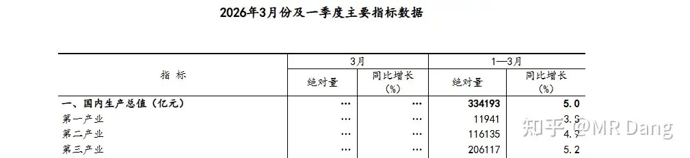

而且这还是在外部局势如此动荡的情况下取得的成绩，含金量十足。

没什么好说的，大家都给自己鼓个掌，这里面有每一个人的汗水。

同时发布的数据还有：社零增长1.7%

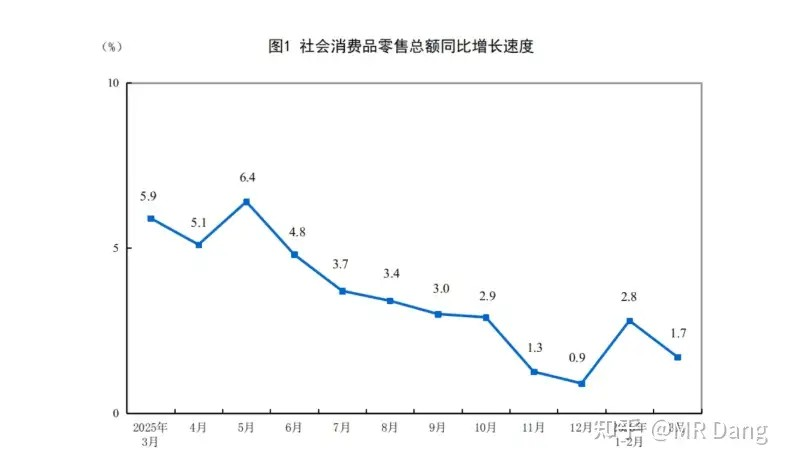

相对来说，这个数据就没有GDP那么强势了。

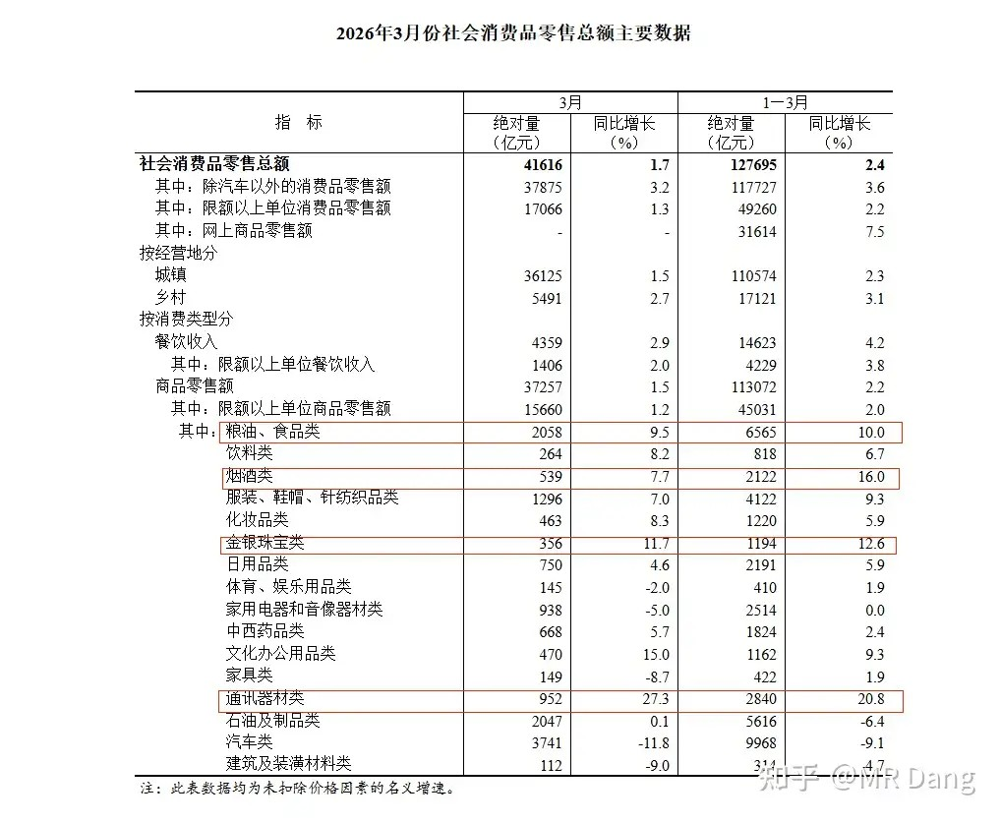

看结构的话，食品，烟酒，金银珠宝，通讯器材类的表现相对较好，只看三月份的话，办公用品也可以，这是因为春节错位的原因。

规模以上工业增加值同比5.7%，中规中矩的一个数字：

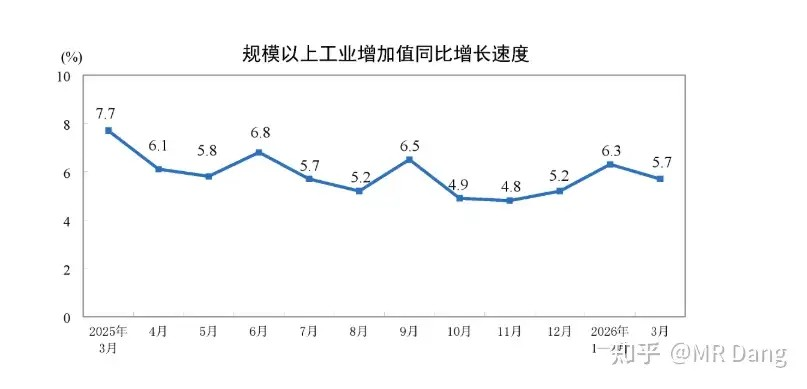

分行业看的话：

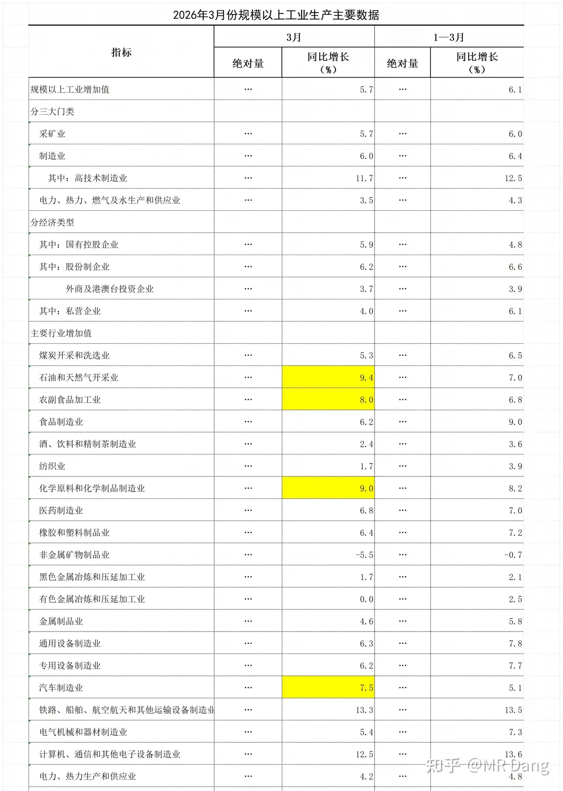

四个行业的三月数据好过前三个月平均值，说明三月环比改善明显，分别是石油，农副食品加工，化学原料制造和汽车制造。

然后就是大家比较关心的大事：

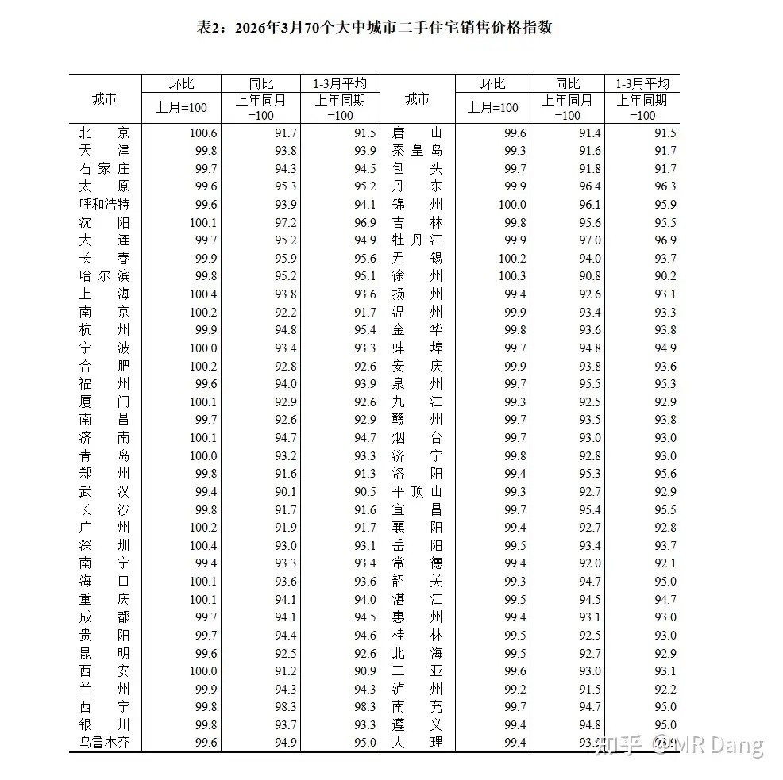

有一说一还不错，环比破百意味着止跌，现在已经有17个城市环比破百了，纳入统计的一共70个，那算来大概就是四分之一的城市止跌。

止跌的城市分两类，一类是东北那种跌无可跌的，还有一类就是经济活跃地区的。

但是止跌不意味着有很高的投资价值，想出手的最好想清楚，落子无悔，非刚需的还是冷静冷静。

这玩意儿可不是股票，交易成本极高。

另外有个更新改造的政策：

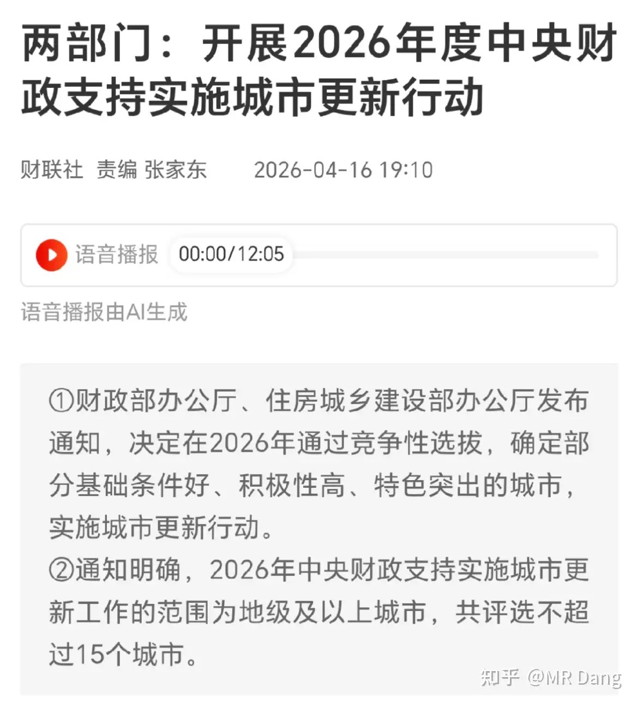

看了一下，影响比较有限，只有不超过15个城市可以享受，西部12亿，中部10亿，东部8亿，算平均10亿，总额也就是150亿左右。

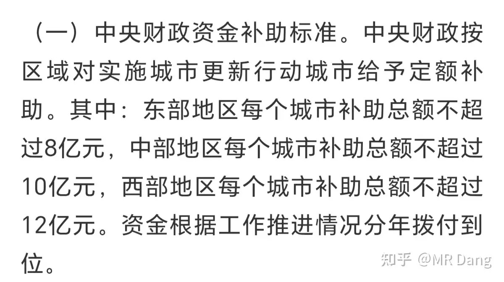

这当然不算小钱，但是相对咱们的体量来说，也不是一笔很大的钱。

伊朗局势：

西大加大对伊朗封锁范围：

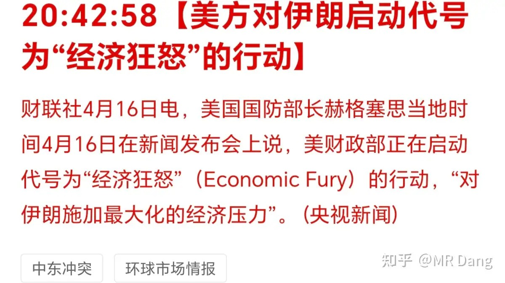

主要是增加了对钢，铝，油等战略物资的封锁。

懂王称本周末可能会谈：

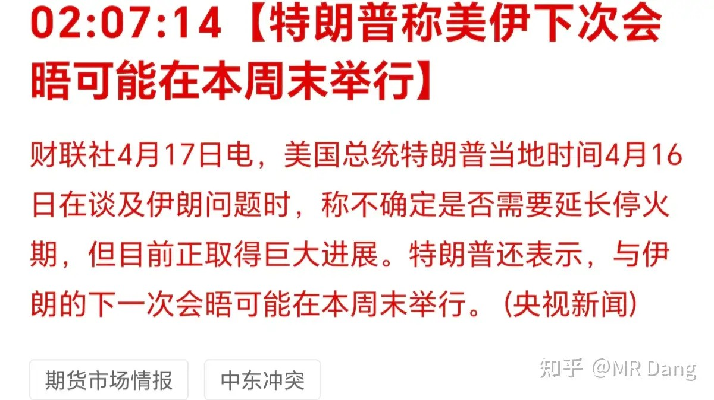

所以上面的“狂怒”更像是给自己谈判增加筹码。

有消息称伊朗出了新方案，把海峡一分为二，靠近伊朗的封锁，靠近对面的放开。相当于实质上放开了，但是保留了最后的体面。

铝价再破新高：

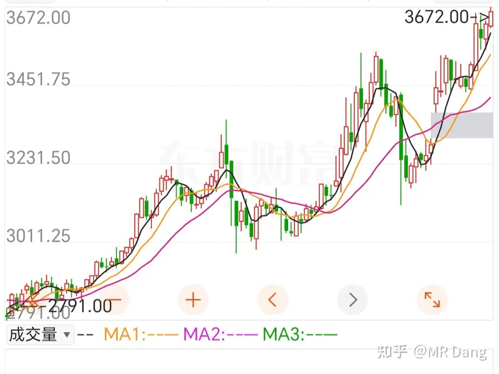

全球铝库存降低到190万吨，只够全球需求9天的用量。其中145万吨左右在中国，剩下的45万吨全球分而用之。

这种情况下很容易出现单边的逼空行情。

小摩发布了题为《Into the Void》，也就是铝价会进入“无人深空”重磅研报。

该投行认为铝的缺口进入供应黑洞，26年以来历史新高。

至于铝价，给出了4000美元的目标价。

逻辑的话，就是复产困难那一套我反复念叨的。

当然这种研报也只是参考，不能作为投资依据，但是铝的基本面明显紧张已成定局，之前提到的复产困难逻辑正在逐步兑现。

至于判断准不准的放一边，这次我说一声领先小摩一个多月做出相同的判断应该不算自吹自擂吧。

所以也不用迷信这些顶尖投行，只不过是平台加持而已，离开平台未必比普通投资者高明到哪里去。

棉花创近期新高：

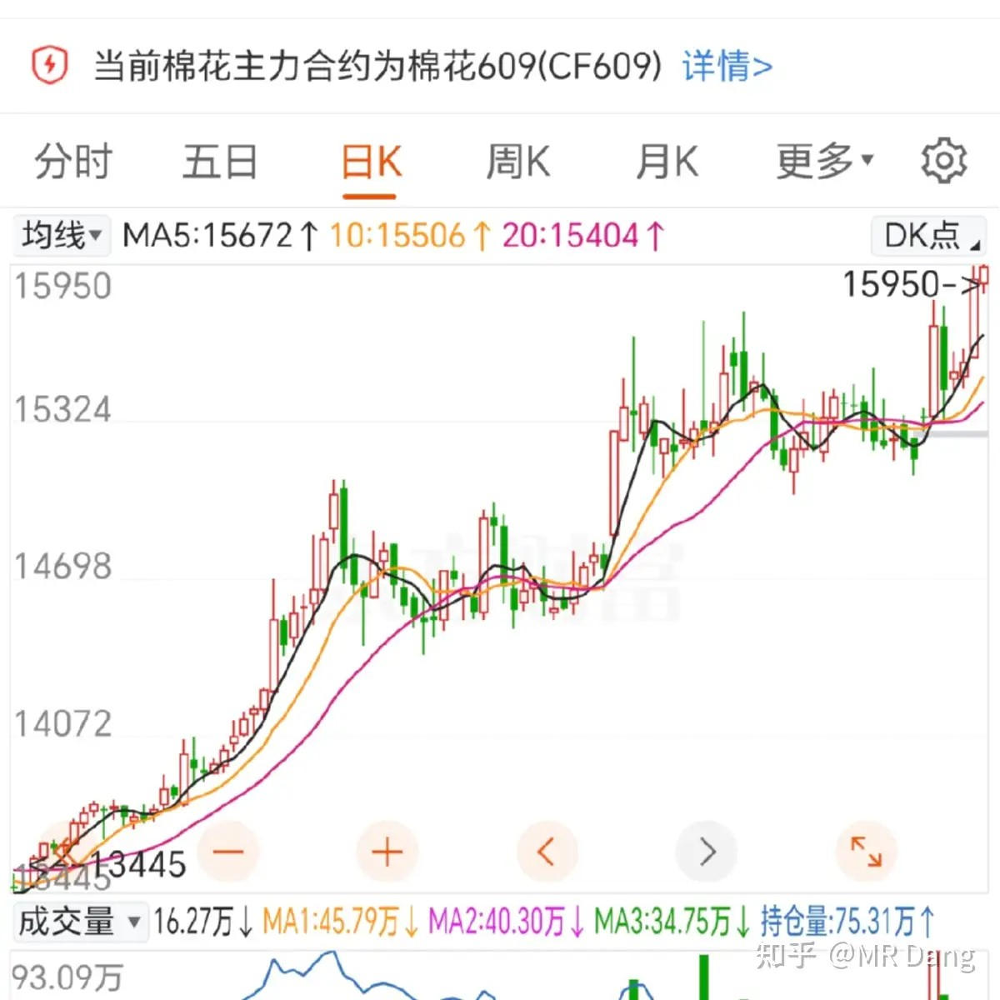

棉花主要看西大和东大，西大主产区今年干旱，东大有减产安排，作为替代品的化纤类今年也在涨价，天时地利人和都齐了，棉花的确定性挺高的。

但商品是商品，股票是股票，A股没有特别好的标的，因此这个认知想要变现挺难的。

好不容易变现了，要珍惜。

某明星CPO企业：发布了2026年一季报

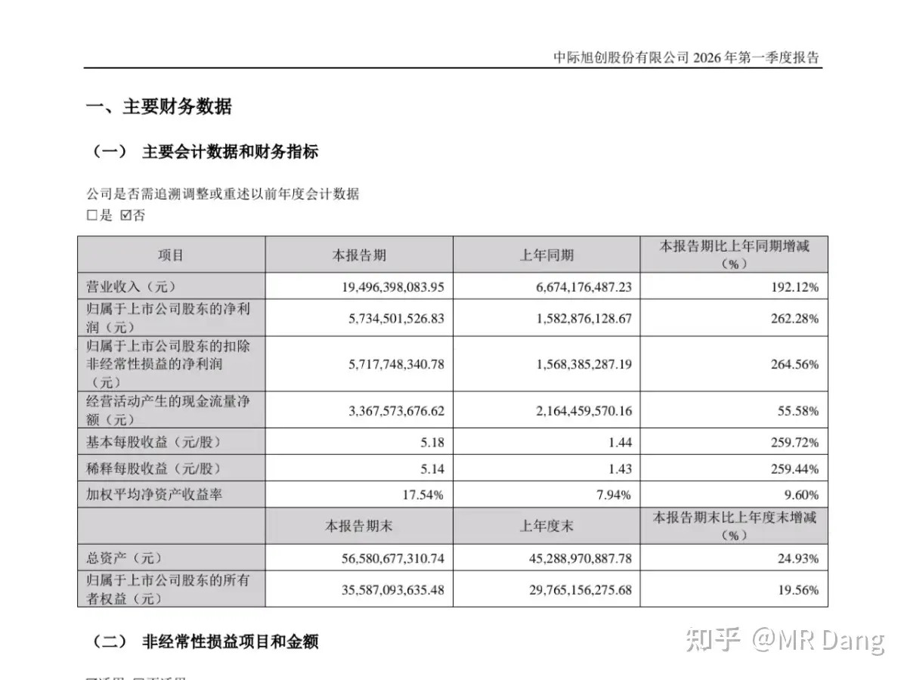

确实不错啊，难怪涨了这么多，大资金的嗅觉都挺灵敏的。

一个季度57亿净利润，目前是9000亿市值。

只看业绩的话，很爆炸，估值越涨越便宜了。

茅子：发布2025年年报

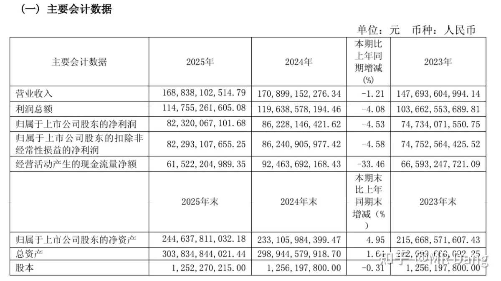

茅子出现负增长，比较出乎市场意料，主要是系列酒下滑厉害，所谓系列酒就是除了飞天茅台这类拳头产品以外的打着茅台旗号的酒。

仅有的好消息只剩下分红没变少，另外最近提价了，海外还有增长。

和上面的企业连起来看，更能深刻的体会到什么叫历史的车轮滚滚向前。

茅子上市我是有印象的，虽然那个时候还是小屁孩。

白酒里面先上市的是老窖，早了很多年，千禧年过了茅子才上的，上的时候茅子发行价就30多，同期老窖股价才十块左右。

在当时来说，茅子已经是高价股了，资本关注度就挺高。

后来一路目送茅子起飞，看着它业绩年年增长，哪怕有几年出了很大的行业黑天鹅，也一直在增长。

挺唏嘘的，在我印象里这是茅子头一回负增长。

其他发布业绩的企业：

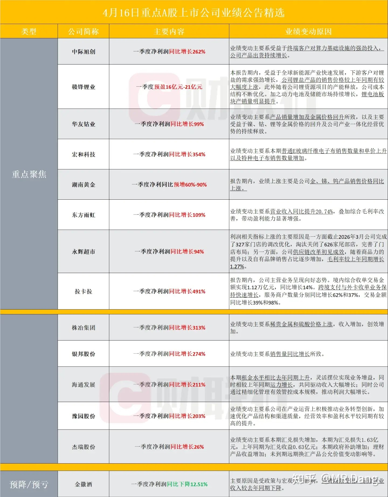

大宗商品：

受西大的那个什么“狂怒”的影响，原油走强，有色系整体走弱，但是回调的幅度比较克制。

外围市场：

美三大股指走强，疲态尽显，又再背着大A偷偷累积风险。

板块方面锂矿走强，部分反内卷的中概股也不错，比如教育板块，外卖板块。

昨天个人组合净值回血半个点，银行拖后腿，绿大半个，资源红近三个，电网一个多，消费一个，没跑赢指数。

最近市场风险偏好明显提升，像银行，红利这类防空洞板块表现就一般了，好在资源类表现还凑合，把组合整体弹性给带上来了。

一个喜欢保护韭菜的博主，希望大家少少踩坑，多多赚钱！！！

---

*本文件从MR Dang知乎页面转载*

---

**作者**: MR Dang
**链接**: https://www.zhihu.com/question/2025596762170082587/answer/2028373172190290698
**来源**: 知乎

*著作权归作者所有。商业转载请联系作者获得授权，非商业转载请注明出处。*

---

## 相关阅读

**📈 每日行情评价系列：**
- [[20260416-如何评价2026年4月16日A股行情？|4月16日行情]] - 反内卷政策、商业航天与宁王财报。
- [[20260415-如何评价2026年4月15日A股行情？|4月15日行情]] - 谈判时间罗生门、进出口数据与估值约束。
- [[20260414-如何看待2026年4月14日A股市场行情？|4月14日行情]] - 谈判时间反复、数据预期钝化。
- [[20260413-如何评价2026年4月13日A股行情？|4月13日行情]] - 谈判无果与核心分歧拆解。
- [[20260410-如何评价2026年4月10日A股行情？|4月10日行情]] - 黎巴嫩局势与宏观数据共振。
- [[20260409-如何看待 2026 年 4月 9日 A 股市场行情？|4月9日行情]] - AI热点与谈判阵容。
- [[20260408-如何评价2026年4月8日A股行情？|4月8日行情]] - 央行增持黄金与情绪修复。
- [[20260407-如何评价2026年4月7日A股行情？|4月7日行情]] - 假期冲突升温与风险偏好。
- [[20260403-如何评价2026年4月3日A股行情？|4月3日行情]] - 海湾管道传闻与海峡预期。
- [[20260402-如何评价2026年4月2日A股行情？|4月2日行情]] - 电解铝产能冲击与修复。

**📘 财报方法：**
- [[20260404-如何分步骤快速看懂上市公司年报？|看懂年报]] - 年报阅读路径与重点抓取。
- [[20260401-读懂财报，看清基本面|读懂财报]] - 基本面识别与关键指标。
- [[20260409-如何看待知乎 2025Q4 财报？知乎终于盈利了？|知乎财报]] - 资产负债表与估值错位案例。
