# 如何评价2026年4月21日A股行情？

---

**发布时间**: 2026-04-21 07:28  |  **原文链接**: https://www.zhihu.com/question/2028765363077162155/answer/2029823696030691641  |  **点赞数**: 401 人赞同

**作者信息**: MR Dang​​​知势榜经济与管理领域影响力榜答主

---

## 正文内容

最近几天有关厄尔尼诺的问题比较集中，主要是来自一则消息：

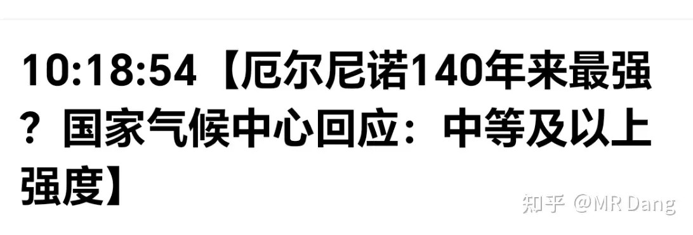

现在有些机构，比如NOAA的预测如下：

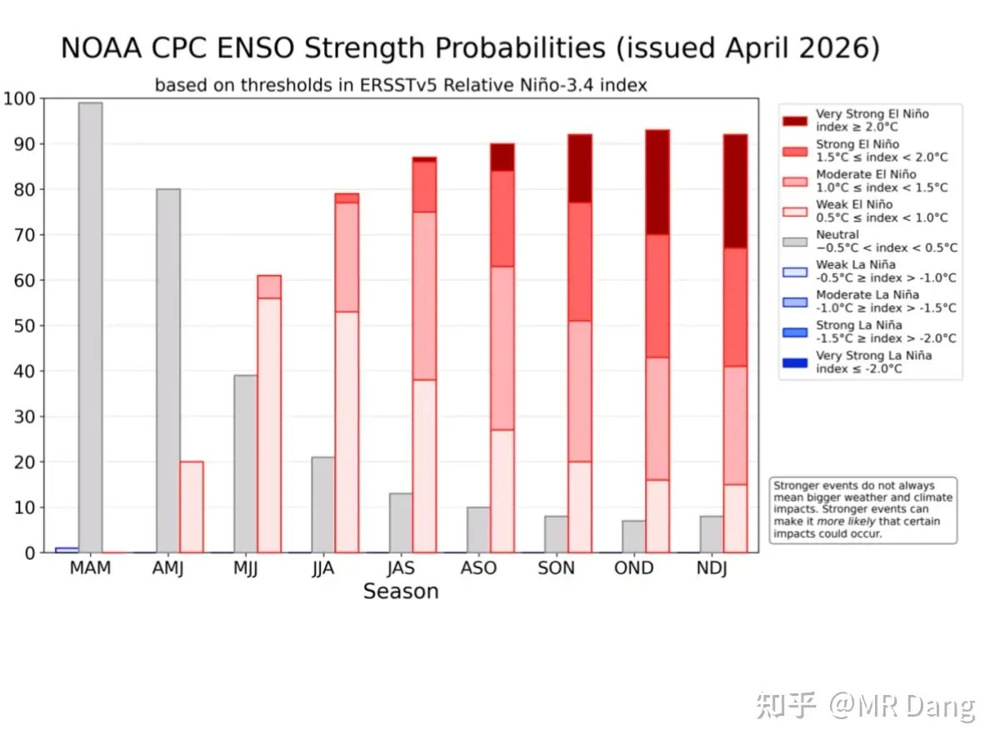

深红代表超强的概率，稍微浅一点的红代表强的概率，深一点的粉色代表中等概率，浅一点的粉色代表弱的概率，灰色代表正常概率。

下面横坐标的字母代表月份，比如NDJ里的N就代表November，D代表December，以此类推。

也就是专业机构认为年底有一半几率是强或者超强的厄尔尼诺现象，那影响主要会在2027年显现。

也有投资者基于这个假设，找了一些影响大的品种。

首先敏感度最高的是白糖和棕榈油。

其次有天然橡胶和其他农产品（棉花大豆大米小麦等）。

接着还有部分有色品种，比如铜，铝，锌。

最后就是制冷剂，氟化工里的r32。

伊朗局势简单过一下：

盘后伊朗对拒绝谈判的态度有点软化：

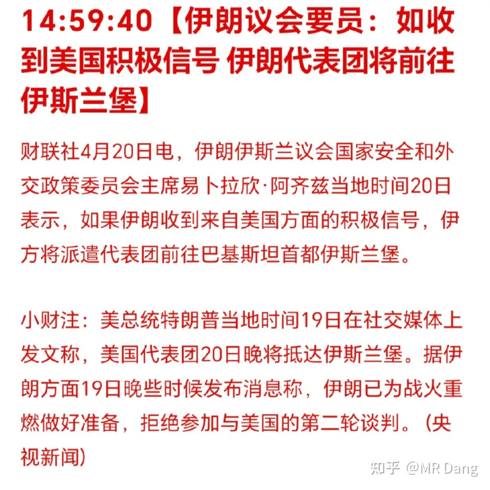

据报道万斯会在数小时内抵达：

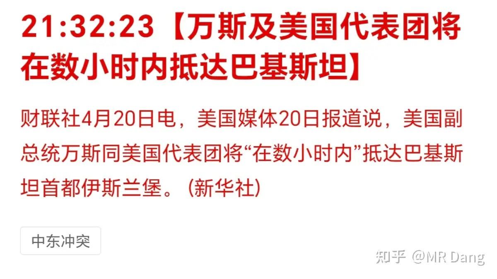

按照新闻报道的时间是“数小时内”，这会儿不知道到了没有。

懂王在美股盘前又开始发利好：

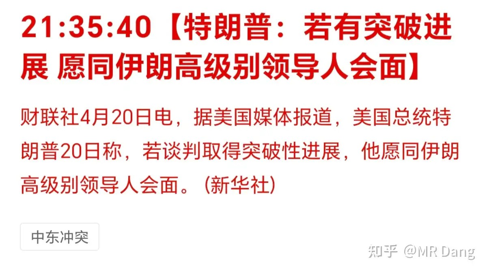

伊朗依然不给面子，不参加谈判：

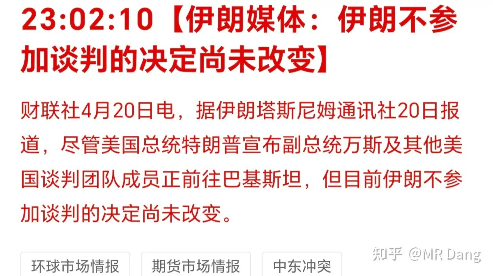

懂王对封锁伊朗没有松口：

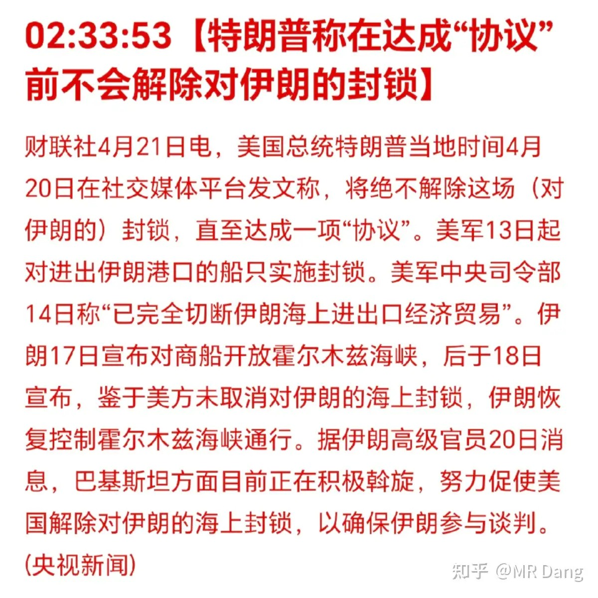

现在谈判就卡在懂王的封锁上了，本身伊朗就挺难的，现在一封锁就更难了，特别是平民。

因为主动权在懂王这边，只要松手，伊朗就会参加谈判，所以资本市场对谈判前景还算比较乐观。

相关部门发布用电统计数据：

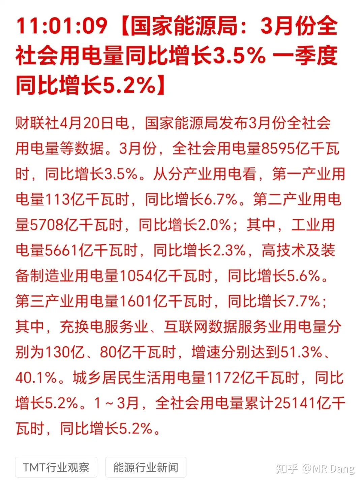

整体数据大家看图片里的权威发布就行了。

对我来说比较意外的可能是三月份的数据，因为三月gdp增速最高，我还想着三月的用电量可能也会相应的多一些，没想到用电量增速不算特别高。

那可能是咱们单位用电的附加值增加了，或者是单位产值能耗降低了。

某品牌手机涨价：

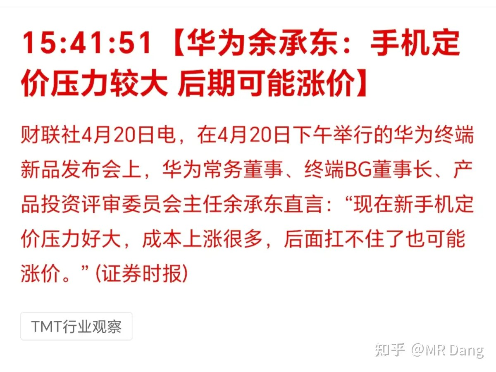

其实和哪个品牌关系不大，今年手机都会涨价，存储涨太多了，我记得好几个月前就提过这茬了。

给昨天的LPR打个补丁：

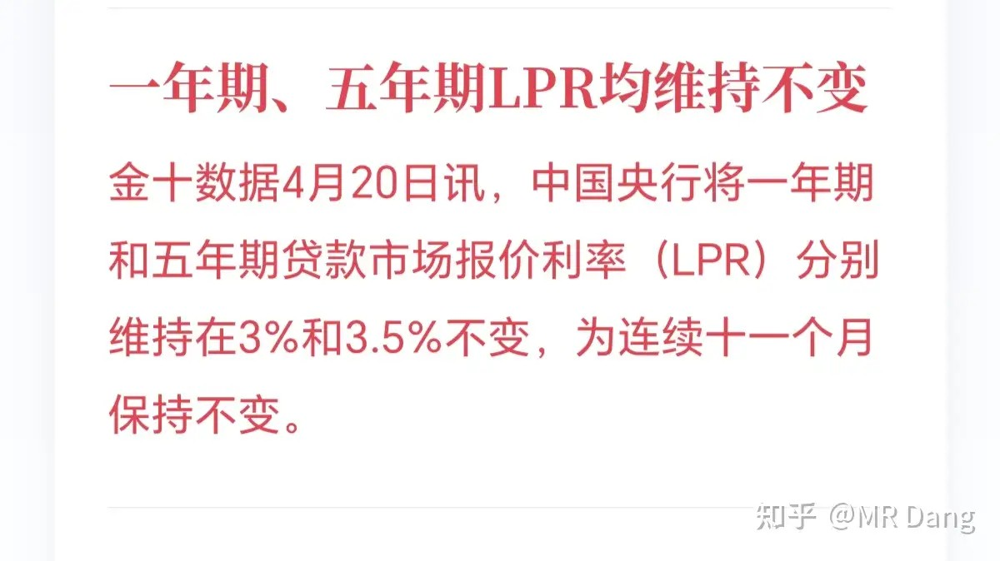

报价不变是预期内，没有特别需要关注的。

某电信运营商发布一季报：

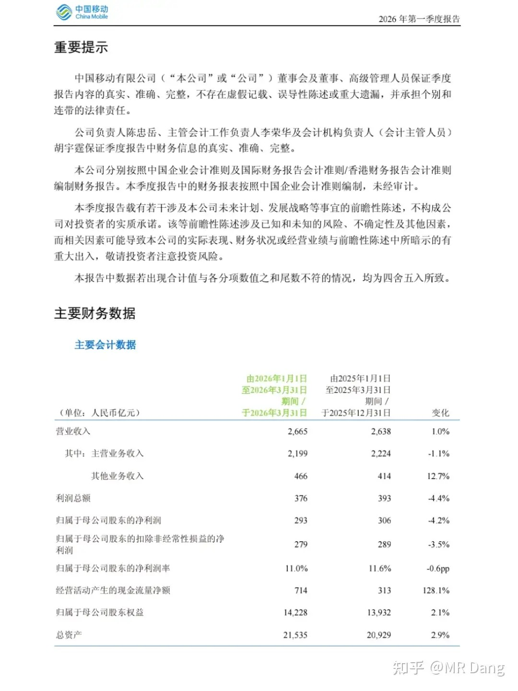

还行吧，下滑的不多，属于丧事喜办，税收有影响，影响可控。

如果2026年提高派息率，也许分红金额不会下滑，按照现价来说，可能有5％以上的股息率，有一定吸引力。

缺点就是如果失去成长性，要拼股息率的话，就得和银行坐一桌了。

它的派息率目前已经到75％左右了，提高空间有限，而银行大部分只有30％左右，同等股息率情况下，提高空间更大。

某券商一季度净利润下滑97％：

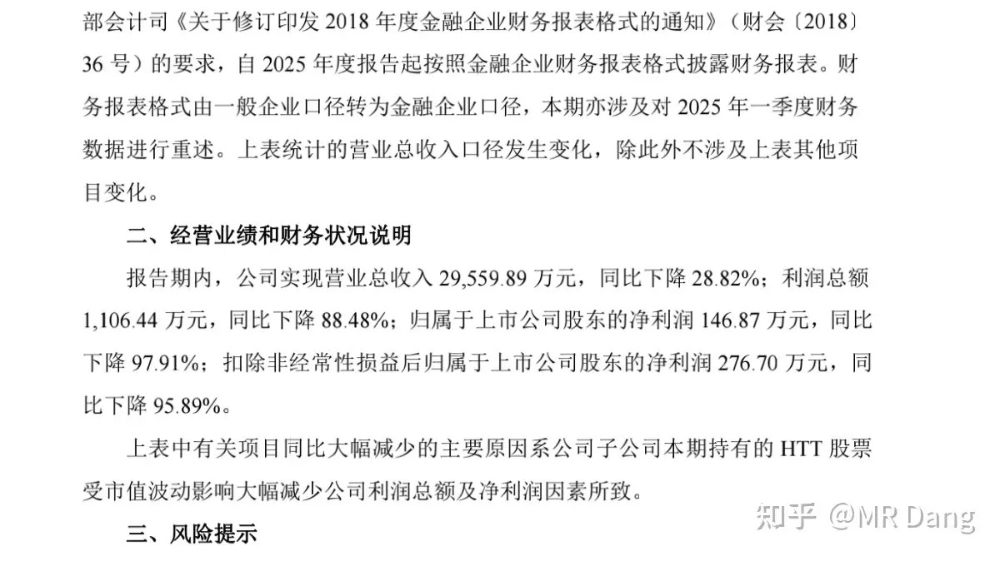

原因挺有意思的，是因为炒股给亏了。

我看了下该券商重仓持有的美股，走势长这样：

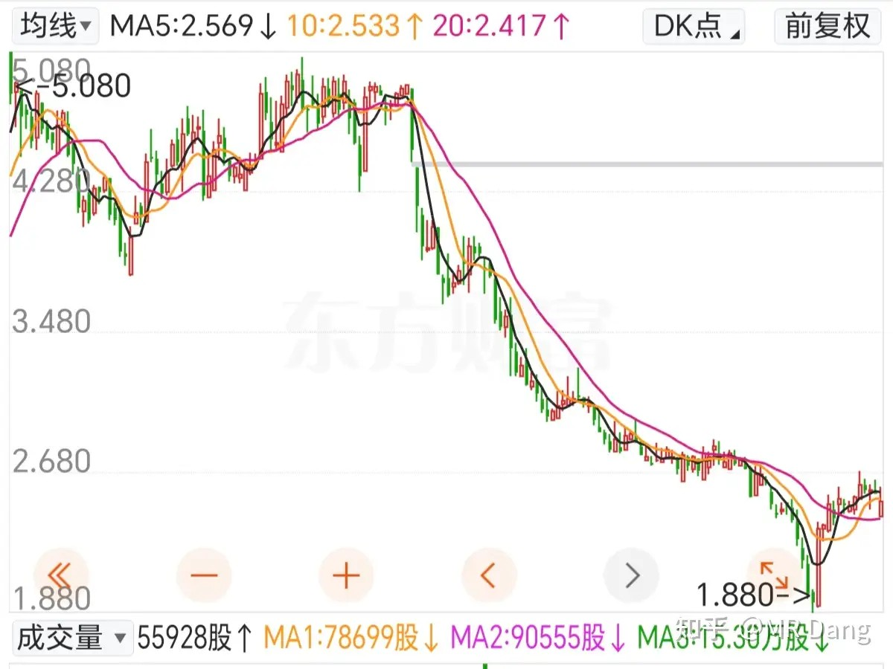

这眼光也是没谁了，在美股重仓了一个仙股，还是中概股，然后爆亏。

其他发布业绩的企业：

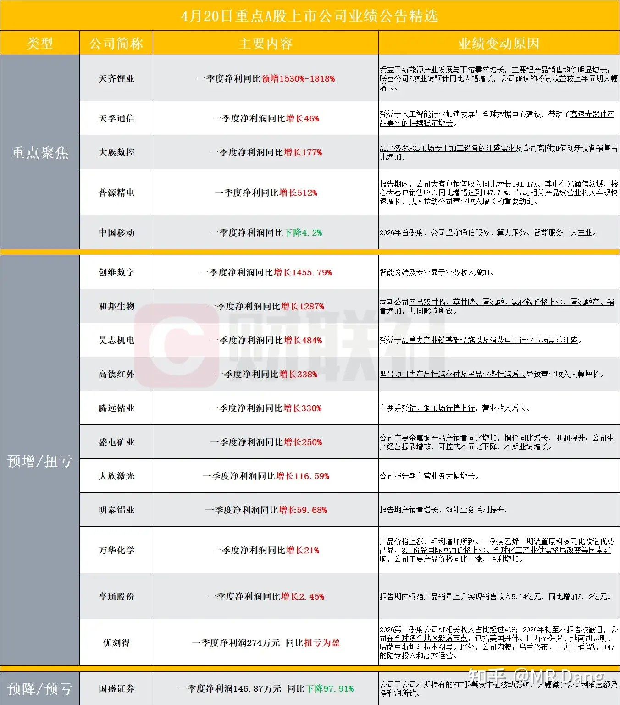

这个里面有家搞光通信的高科技企业不太及预期，另外还有家未上榜的搞液冷的明星企业也不及预期。

大宗商品：

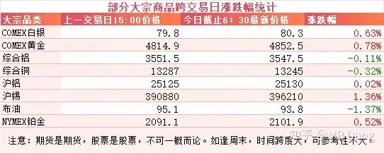

大宗商品比较平淡，原油微调，有色正常波动，锡略强。

外围市场：

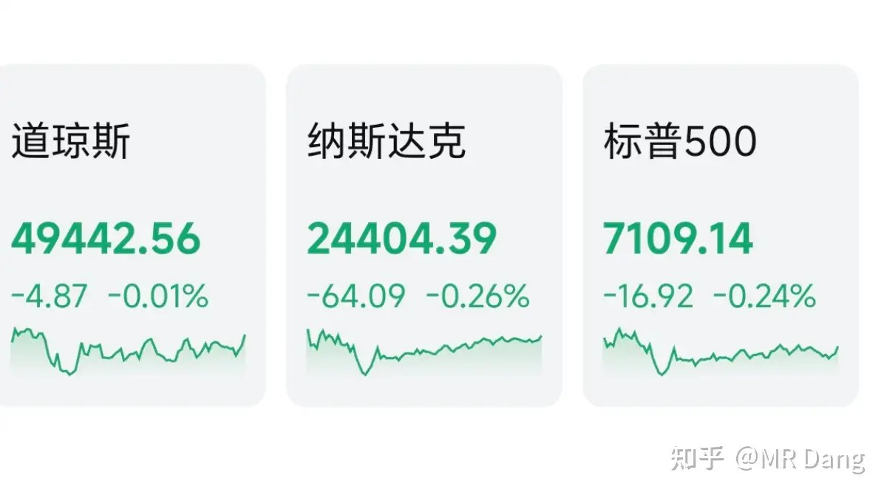

美三大股指回调，幅度不大，道指相对更强一些。

昨天个人组合净值回血1个点，银行近1个，资源分化严重，整体打平，电网四个，消费半个。

个股波动蛮大的，有涨得红红的，也有跌得绿绿的，接下来的10天是一季报密集披露期，波动会显著增加。

我个人对有色和银行的一季报比较期待。

还有就是飞机，不过不是一季报，而是半年报。

比较担心的是消费类，啤酒之类的，看着白酒那半死不活的样子，可能消费还是比较难，一季度如果同比负增长也不奇怪。

一个喜欢保护韭菜的博主，希望大家少少踩坑，多多赚钱！！！

> [!comment]- 点击展开评论
>
> | 用户 | 时间 | 内容 |
> | :--- | :--- | :--- |
> | saintluffy | 7 小时前 | 去年就发现，券商推荐的股基本是忽悠人高位接盘去的，也有可能是真的菜。。 |
> | &nbsp;&nbsp;&nbsp;&nbsp;燎原之火 | 4 小时前 | 大概率是打窝的。 |
> | 钱包鼓鼓 | 7 小时前 | 每日打卡第38天NOAA预测年底强厄尔尼诺概率一半，白糖棕榈油最敏感，天然橡胶农产品和铜铝锌其次。三月GDP最高但用电量增速不高，说明经济在转型提质而非靠耗电堆增长。💐手机因成本上升要提价，主要是存储涨太多。移不动一季报还行，下滑不多，丧事喜办。某券商一季度净利润暴跌97%，原因是重仓美股中概仙股爆亏。接下来10天一季报密集披露波动加大，期待有色和银行，担心消费可能同比负增长。 |
> | &nbsp;&nbsp;&nbsp;&nbsp;逆天唯我 | 6 小时前 | 等你总结 |
> | &nbsp;&nbsp;&nbsp;&nbsp;等待和希望 | 5 小时前 | 课代表，好像漏说了制冷 |
> | &nbsp;&nbsp;&nbsp;&nbsp;钱包鼓鼓 | 4 小时前 | 是的是的，感谢提醒 |
> | 今晚回家吃饭 | 7 小时前 | 昨天调研了铝上下游，这不能算个好行业啊，高污染高能耗 |
> | 空尼起哇 | 6 小时前 | 党老师，你认为啤酒还有行情吗，我亏7个点了 |
> | &nbsp;&nbsp;&nbsp;&nbsp;MR Dang | 6 小时前 | 行情无法预测，股息可以 |
> | 在下狐诌子 | 4 小时前 | 经典绿桥，下午就去追指数跌幅，指数涨幅是从来不跟的，指数跌幅是必须要齐平或者超过的 |
> | &nbsp;&nbsp;&nbsp;&nbsp;在下狐诌子 | 2 小时前 | 来了 经典绿桥操盘手法，每次一摸一样。。。 |
> | &nbsp;&nbsp;&nbsp;&nbsp;在下狐诌子 | 1 小时前 | 到该涨的时候又不说了绿桥，经典下跌领先上涨追不上盘口大盘红连跌三天，大盘要是调整了简直不敢想 |
> | &nbsp;&nbsp;&nbsp;&nbsp;养鹅下蛋 | 49 分钟前 | 庄家自己都在做T,自己大单砸又买回来 |
> | 冰凉 | 5 小时前 | 铝我真的力竭了 |
> | &nbsp;&nbsp;&nbsp;&nbsp;在下狐诌子 | 5 小时前 | 权威绿桥必须每日一骂了，大盘涨也跌，大盘跌也跌。盘口涨不跟，盘口跌必跟 |
> | 知乎用户齐 | 7 小时前 | 又在铝挨打 |
> | &nbsp;&nbsp;&nbsp;&nbsp;斯兮 | 6 小时前 | 铝期货新高，HQ涨不起来，真是服了 |
> | &nbsp;&nbsp;&nbsp;&nbsp;斯兮 | 6 小时前 | 还有铝期货回落，HQ跟着挨打 |
> | &nbsp;&nbsp;&nbsp;&nbsp;知乎用户齐 | 1 小时前 | 总仓位小，我就看他怎么恶心人 |
> | 一目连 | 3 小时前 | 我也披露条信息，2026一季度，我从中国移动携号转网转走了，服务真的又差又贵 |
> | Lionel-LA | 6 小时前 | 伊朗态度不是软化，人家在学特朗普，发推画K线，炒石油。 |
> | 一白先生 | 5 小时前 | 大家谨慎做T，逆子我T飞一次就再也接不回来了，下定决心接回来之后又开始跌一直拿着就回本了 |
> | &nbsp;&nbsp;&nbsp;&nbsp;小透明bingo | 4 小时前 | 别慌，我高位横盘的时候一直加仓，然后大跌的时候减仓，减仓了就开始涨 |

---

*本文件从MR Dang知乎页面转载*

---

**作者**: MR Dang
**链接**: https://www.zhihu.com/question/2028765363077162155/answer/2029823696030691641
**来源**: 知乎

*著作权归作者所有。商业转载请联系作者获得授权，非商业转载请注明出处。*

---

## 相关阅读

**📈 每日行情评价系列：**
- [[20260420-这么看待4月20日的A股行情？|4月20日行情]] - 周末局势过山车、机器人半马与 Deepseek 融资。
- [[20260417-如何评价2026年4月17日A股行情？|4月17日行情]] - GDP、地产止跌与伊朗谈判拉扯。
- [[20260416-如何评价2026年4月16日A股行情？|4月16日行情]] - 反内卷政策、商业航天与宁王财报。
- [[20260415-如何评价2026年4月15日A股行情？|4月15日行情]] - 谈判时间罗生门、进出口数据与估值约束。
- [[20260414-如何看待2026年4月14日A股市场行情？|4月14日行情]] - 谈判时间反复、数据预期钝化。
- [[20260413-如何评价2026年4月13日A股行情？|4月13日行情]] - 谈判无果与核心分歧拆解。
- [[20260410-如何评价2026年4月10日A股行情？|4月10日行情]] - 黎巴嫩局势与宏观数据共振。
- [[20260409-如何看待 2026 年 4月 9日 A 股市场行情？|4月9日行情]] - AI热点与谈判阵容。
- [[20260408-如何评价2026年4月8日A股行情？|4月8日行情]] - 央行增持黄金与情绪修复。

**📘 财报方法：**
- [[20260404-如何分步骤快速看懂上市公司年报？|看懂年报]] - 年报阅读路径与重点抓取。
- [[20260401-读懂财报，看清基本面|读懂财报]] - 基本面识别与关键指标。
- [[20260409-如何看待知乎 2025Q4 财报？知乎终于盈利了？|知乎财报]] - 资产负债表与估值错位案例。
