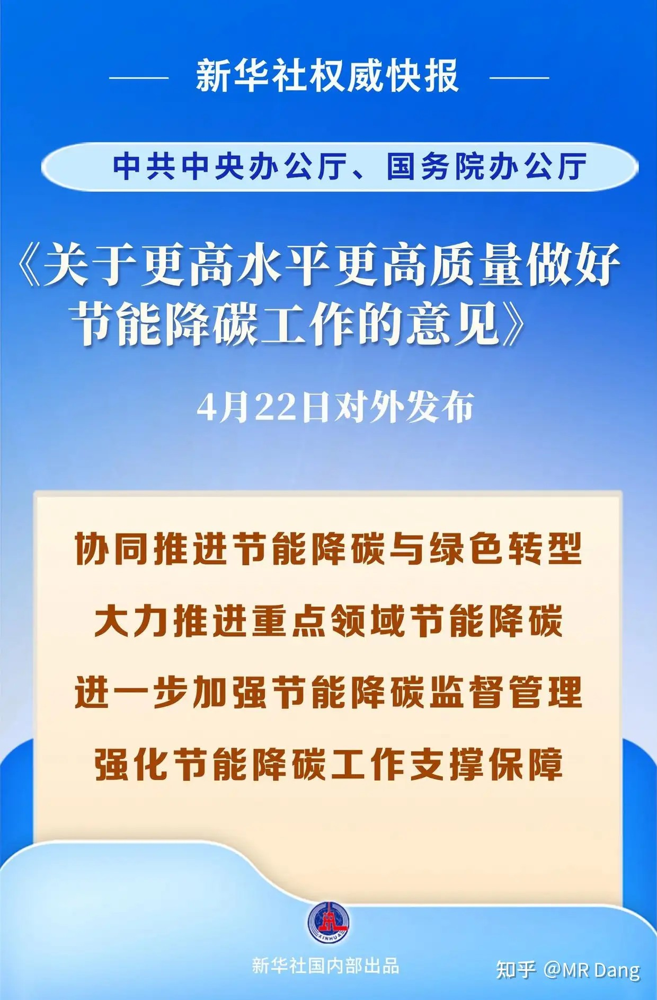
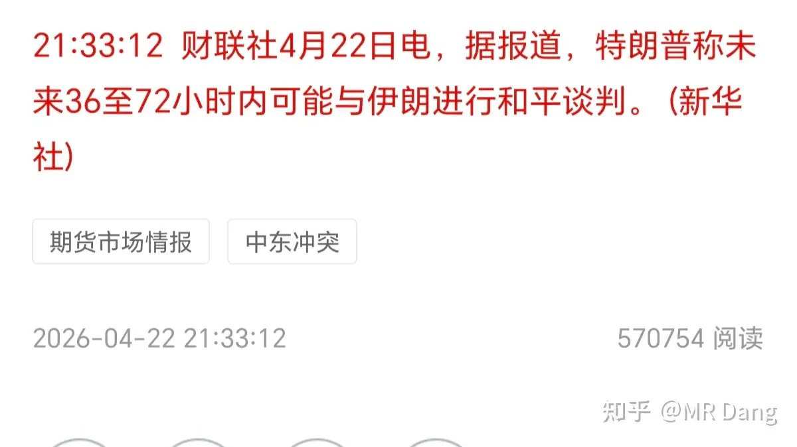
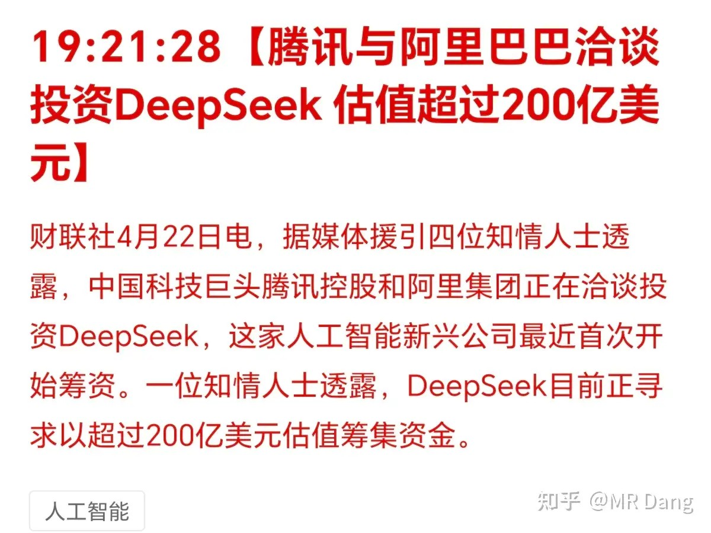
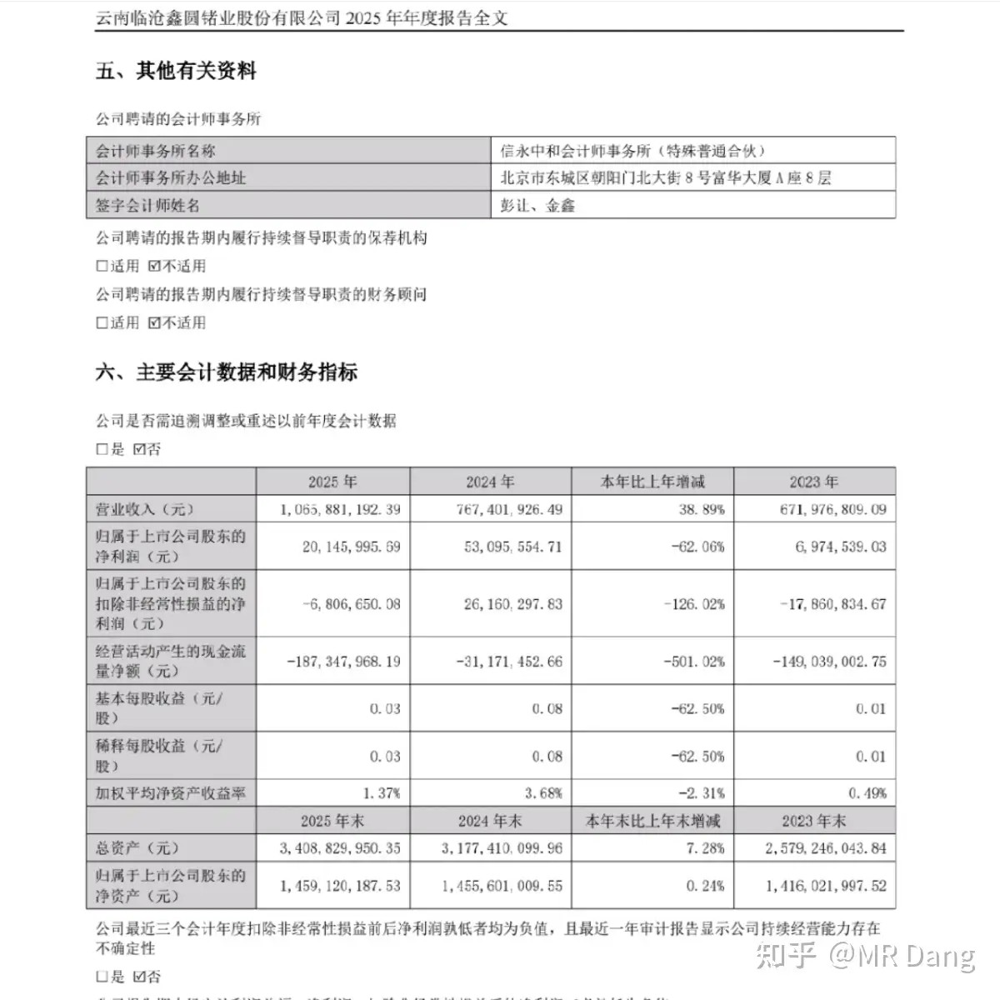
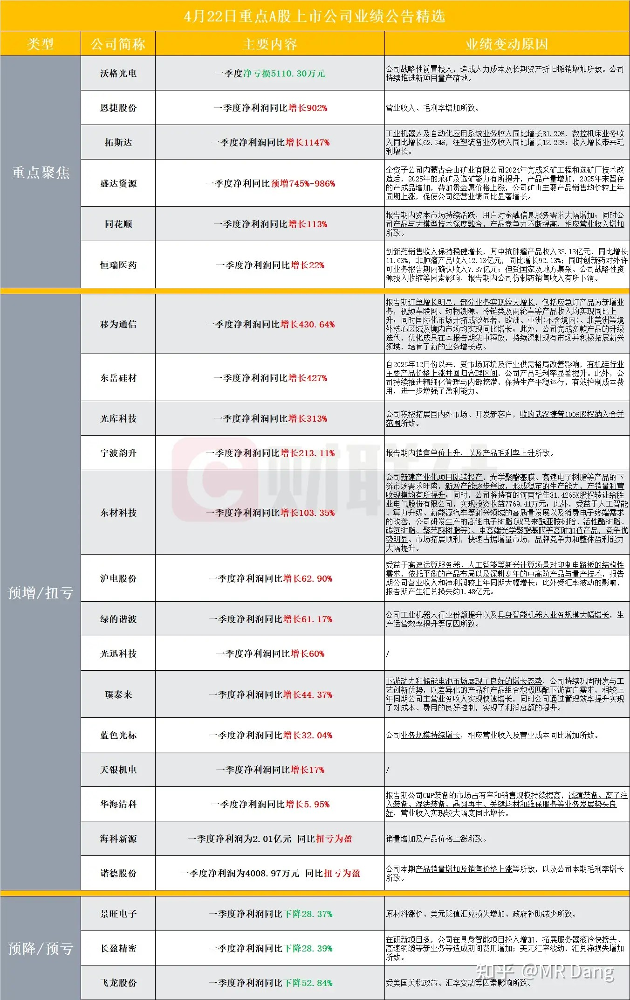
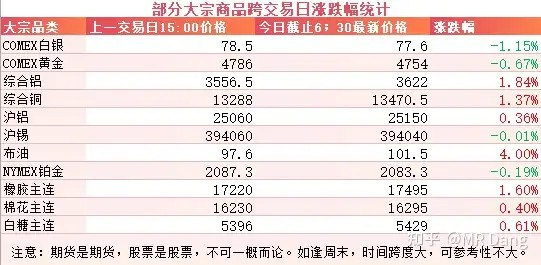
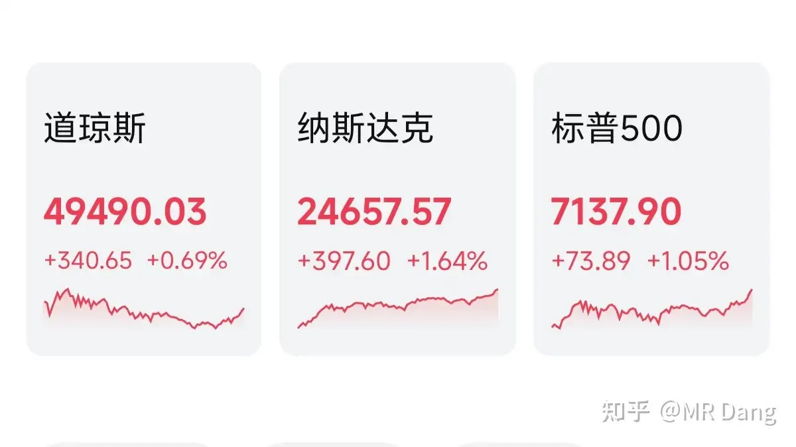

# 对于2026年4月23日A股市场行情，大家有什么预测和看法？

---

**发布时间**: 2026-04-23 07:33  |  **原文链接**: https://www.zhihu.com/question/2030241022484164963/answer/2030549738492315193  |  **点赞数**: 470 人赞同

**作者信息**: MR Dang​​​知势榜经济与管理领域影响力榜答主

---

## 正文内容

今天的头条是碳达峰，转发权威媒体的报道：

这可不是什么普通文件，看看发布文件的单位就知道含金量了。

具体细节请看原文，提了很多新说法：

比如首次把“数字基础设施”单列一章，重点关注单位算力能效。

提了绿电直连和智能微电网，这是对一些用电大户，比如电钢，电解铝之类的一些针对性措施。

还有零碳运输走廊，这是交通领域的新提法。

还有像炼化集成，钢化联产的跨行业耦合。

全文并不长，值得反复琢磨，里面有不少投资机会，看似枯燥，实则另有乾坤。

比如炼化集成，就四个字。

炼指的是炼油厂，化指的是化工厂。

炼化集成就是说炼油厂和化工厂开在一起，能量阶梯利用，炼油厂的副产物作为化工厂的原料使用，化工厂的制氢装置和炼油厂的加氢装置共同使用氢气网络。

钢化联产，也是四个字。

钢指的是钢铁厂，化指的是化工厂。

钢化联产意思就是钢铁厂和化工厂开在一起。钢铁厂产生的高炉煤气，转炉煤气等副产物，以前只能烧开水，现在可以变成化工厂的原料，生产甲醇，氢气。

所以叫跨行业耦合，可以产生1+1＞2的效果，大大降低碳排放，提高资源利用率。

如果不想看这些老登行业，那也看看单位算力能效有关的机会。

比如要提高单位算力能效，最简单的就是液冷，相关材料需要电子氟化液，液冷快接头，以及液冷管路什么的。

伊朗局势：未来三天内可能谈判

看一眼就行了，无所谓，影响越来越小了。

Deepseek新动作：

这个200亿刀的估值依然便宜，上市了估计最少还能翻倍。

说到大模型，GPT也在近期发布了ChatGPT Images 2.0，文生图能力大幅增加，达到了直接商用的水平。

免费用户每天两张的额度，支持1024×1024的输出，付费用户更是支持2K级的输出。

我个人试了一下，可用率大幅增加，比之前的各种文生图大模型好用的多。

某2500pe连续涨停的有色企业：

发布了2025年年报

炒作就炒作，别扯什么基本面了，这哪来的基本面。

涨的多是真的，基本面挺差也是真的。

不过毕竟磷化铟晶片产能15万片还是真的，资本市场如果选择“当然是原谅它了”也没什么奇怪的，现在都在炒光模块，磷化铟是当红炸子鸡。

其他发布业绩的企业：

大宗商品：

加了三个大宗品种进行跟踪，未来非主粮农产品方面预期还是可以的。

有色方面，分化严重，金银等贵金属回调，但是铜铝等工业金属比较强势。

农产品的话，白糖有从底部反转的趋势，其他两个都在近期高点附近晃悠。

原油走强，涨幅4个点。

外围市场：

三大股指走强，纳指领涨，存储板块强势。美光，闪迪，AMD等创历史新高。

昨天个人组合净值回撤半个点，银行绿1个，消费绿小半个，资源打平，电网红近4个。

资源昨天分化也很大，有表现的很好的，也有表现的一如既往拉胯的。

最近一段时间以来一直跑输指数，还记得4000点不到的时候净值创了新高，结果4100了整天抱头挨打。

究其原因还是市场风格的结构性转变，现阶段是新质生产力的估值一直在提升，在市场流动性不变的情况下，旧时代的老登资产就会持续失血。

正如一些投资者所说，股票现在就分三类，站在光里的，光站在那里的，和光着站立的。。。。。

我的消费仓位不算特别重，不过这段时间以来的持股体验已经一言难尽了，睁眼闭眼都是跌。

要不是电网还沾了点新质生产力的光，那这段时间基本相当于被定向吸血。

所以我这些天也一直在学习一些新质生产力的东西，比如英伟达的Rubin架构带来的一些投资机会，碳化硅衬底和外延的一些困境反转的情况。

圈内的同学看4月20日早报后半段就有，因为确实有些读者看的比较快，不提醒位置有时候找不到。

像这种情况其实挺磨人心态的，特别是看着别人胆子大的闭眼买都能赚，而自己的持仓哪怕有很好的财报，哪怕有不高的估值，结果居然还是绿的。

资本市场从来不是准确的计分板，而是情绪的扩音器。

最后结果就是基本面好了未必涨，基本面差了也未必跌。

说的鸡汤一点，只要自己的组合方案现金回报够高，那就静待花开，大不了就吃息呗，还能差到哪里去。

二级市场的表现并不会影响公司的股息，这是价值投资的制胜法宝。

反而会因为价格的下跌，造成预期股息率的提高，这也是我判断一笔投资是否划算的重要指标。

当然也有投资者会禁不住趋势的诱惑，心一横，脑子一热就冲进去了。

那一旦面对回调，没有信仰作为支撑，很容易就赔上一笔就出局了，哪怕后来涨到天上去，和他也没关系了。

好东西也要有好价格才算一笔好的投资。

如果真心喜欢那些高科技高估值的东西，可以加入购物车，等便宜的时候再考虑考虑，不要强行上车，风险不小的。

今天是4月23日，世界读书日，正好我的书也全渠道现货铺开了，正在飞速向大家寄过来。

已经提前预订的读者可以第一时间捧在手里了。

而没有预订的读者也不必担心，现在读也正当时：

读一本书最好的时机永远是现在。

一个喜欢保护韭菜的博主，希望大家少少踩坑，多多赚钱！！！

> [!comment]- 点击展开评论
>
> | 用户 | 时间 | 内容 |
> | :--- | :--- | :--- |
> | 在下狐诌子 | 7 小时前 | 果然经典剧情了，指数涨的时候不跟涨，指数跌的时候一起挨打绿桥真是看乐了 |
> | &nbsp;&nbsp;&nbsp;&nbsp;小陈法师 | 7 小时前 | 请问绿桥就是hqkg吗？ |
> | &nbsp;&nbsp;&nbsp;&nbsp;在下狐诌子 | 4 小时前 | 是的 |
> | &nbsp;&nbsp;&nbsp;&nbsp;Veni | 2 小时前 | 死叉了 我真服了 |
> | 我是一颗桃子吖 | 7 小时前 | 等呗，许愿我比主力命长 |
> | 钱包鼓鼓 | 9 小时前 | 每日打卡第40天碳达峰重磅文件出炉，首次单列数字基础设施，液冷材料和算力能效方向迎来中线机会，炼化集成和钢化联产等工业耦合新提法值得关注。某2500PE连续涨停的有色企业是纯炒作别碰。有色板块严重分化，铜铝工业金属强势，金银贵金属回调。白糖有底部反转趋势，原油涨4%，美股纳指领涨存储板块创新高。 |
> | &nbsp;&nbsp;&nbsp;&nbsp;8023财 | 9 小时前 | 锡业怎么样呢，最近看着挺强 |
> | feeling | 7 小时前 | 虹桥太水了吧，每次都是跌多涨少的，亏钱多就是原罪 |
> | &nbsp;&nbsp;&nbsp;&nbsp;最后的宿命 | 7 小时前 | 宏桥适合做t |
> | opt | 7 小时前 | D佬的文章啥时候才能回到以前的样子啊，那种一早就想点进去的激动感。 |
> | &nbsp;&nbsp;&nbsp;&nbsp;夏天 | 5 小时前 | 不可能了 |
> | 猫猫大魔王 | 5 小时前 | 石油lof起来的时候，又是万物落的时候大A明明说好了不看美伊二人转… |
> | k591998667 | 7 小时前 | 尽管业绩和期货市场表现都不错，金属板块就是下跌， |
> | 芝麻开花 | 9 小时前 | “硫磺硫酸又能作为钢铁厂的脱硫剂来使用。”这个说法有误吧 |
> | &nbsp;&nbsp;&nbsp;&nbsp;MR Dang | 9 小时前 | 脑子短路了，哈哈 |
> | Tree先生 | 8 小时前 | 看我的表格最近都是光和半导体的天下 |
> | joly | 8 小时前 | 书27号发货，jd有点忒慢了 |
> | &nbsp;&nbsp;&nbsp;&nbsp;MR Dang | 8 小时前 | 感谢支持 |

---

*本文件从MR Dang知乎页面转载*

---

**作者**: MR Dang
**链接**: https://www.zhihu.com/question/2030241022484164963/answer/2030549738492315193
**来源**: 知乎

*著作权归作者所有。商业转载请联系作者获得授权，非商业转载请注明出处。*

## 相关阅读

**📈 每日行情评价系列：**
- [[20260422-对于2026年4月22日A股市场行情，大家有什么预测和看法？|4月22日行情]] - 利率表态、框架预期和市场敏感点的拆解。
- [[20260421-如何评价2026年4月21日A股行情？|4月21日行情]] - 厄尔尼诺、用电数据与一季报波动。
- [[20260420-这么看待4月20日的A股行情？|4月20日行情]] - 周末局势过山车、机器人半马与 Deepseek 融资。
- [[20260417-如何评价2026年4月17日A股行情？|4月17日行情]] - GDP、地产止跌与伊朗谈判拉扯。
- [[20260416-如何评价2026年4月16日A股行情？|4月16日行情]] - 反内卷政策、商业航天与宁王财报。
- [[20260415-如何评价2026年4月15日A股行情？|4月15日行情]] - 谈判时间罗生门、进出口数据与估值约束。
- [[20260414-如何看待2026年4月14日A股市场行情？|4月14日行情]] - 谈判时间反复、数据预期钝化。
- [[20260413-如何评价2026年4月13日A股行情？|4月13日行情]] - 谈判无果与核心分歧拆解。
- [[20260410-如何评价2026年4月10日A股行情？|4月10日行情]] - 黎巴嫩局势与宏观数据共振。
- [[20260409-如何看待 2026 年 4月 9日 A 股市场行情？|4月9日行情]] - AI热点与谈判阵容。

**📘 财报与产业线索：**
- [[20260422-紫金矿业一季报实现净利润 200.79 亿元，同比大幅增长 97.50%，如何解读「矿茅」的Q1财报|紫金财报]] - 资源股里盈利质量、现金流和边际变量怎么读。
- [[20260404-如何分步骤快速看懂上市公司年报？|看懂年报]] - 年报和季报的阅读路径与重点抓取。
- [[20260401-读懂财报，看清基本面|读懂财报]] - 基本面识别与关键指标。
- [[20251009-如何看待2025年10月9日a股有色板块暴动？是否还有低估值的投资机会？|有色板块暴动]] - 从板块层面看有色行情扩散与估值切换。
