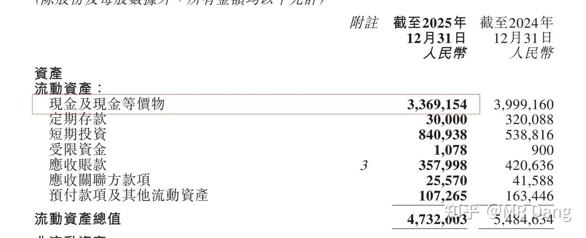
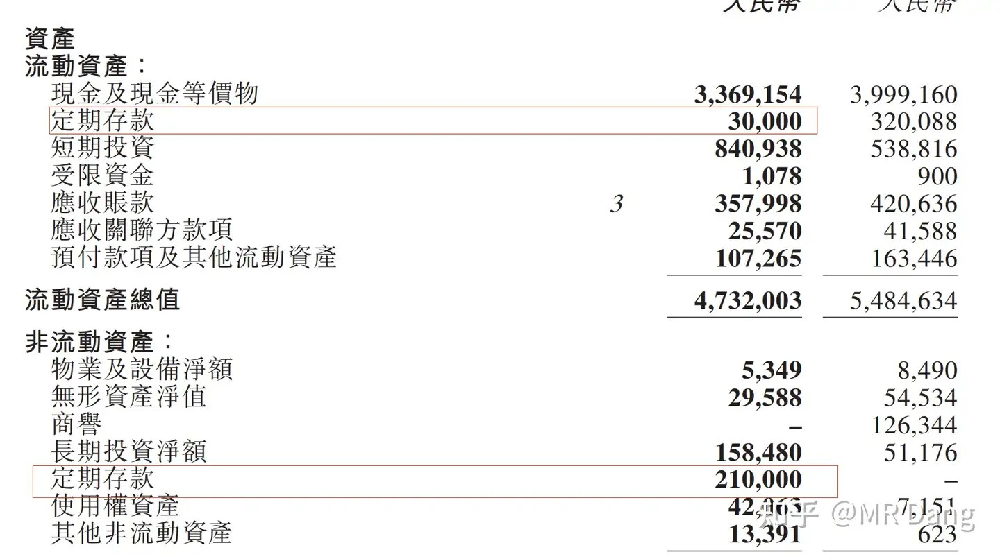
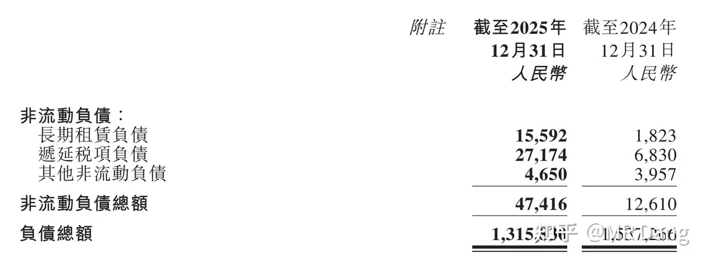
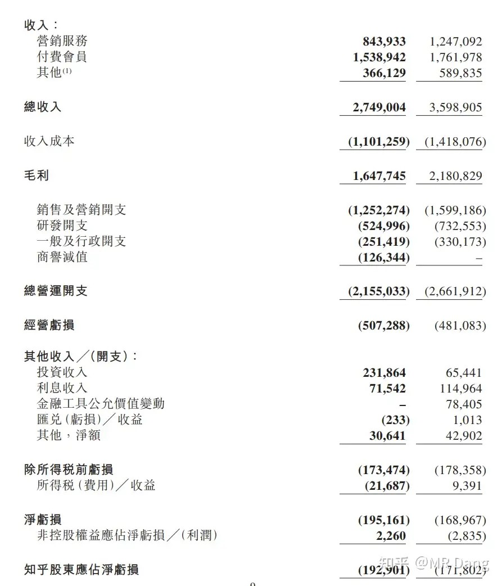
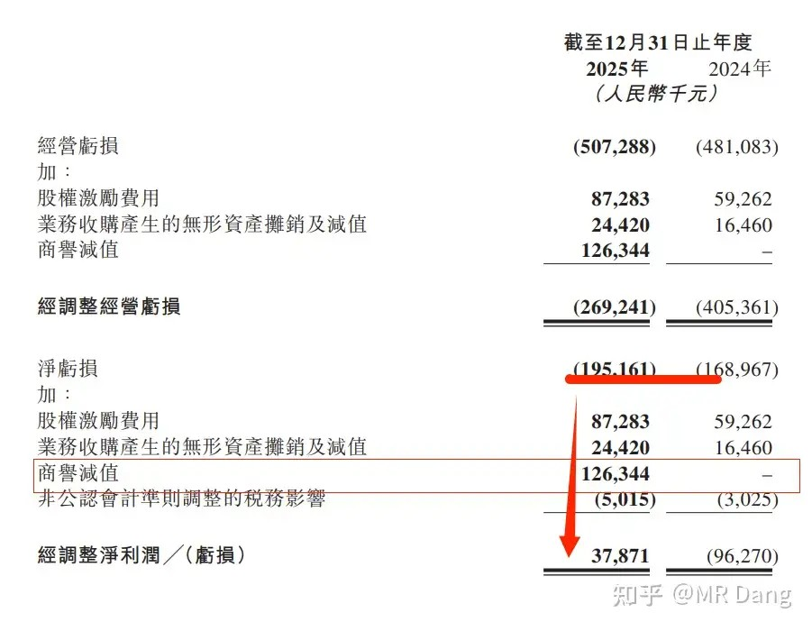
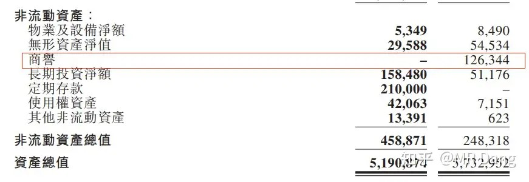
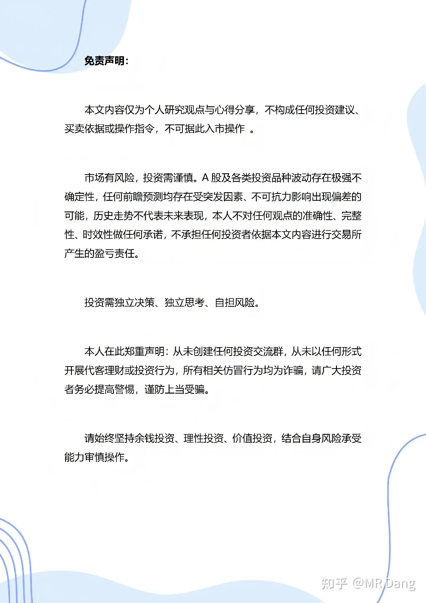

# 如何看待知乎 2025Q4 财报？知乎终于盈利了？

---

**发布时间**: 2026-04-09 19:08  |  **原文链接**: https://www.zhihu.com/question/2020223615518426113/answer/2025651312629487457  |  **点赞数**: 571 人赞同

**作者信息**: MR Dang​​​知势榜经济与管理领域影响力榜答主

---

## 正文内容

终于抽出点时间来写我乎的2025财报了。

先说一个惊人的结论，目前资本市场给我乎的估值是负3亿！

对，你没看错，就是负3亿，也就是资本市场认为我乎的业务一分都不值，白送都没人要。

结论怎么来的呢？

先看我乎的资产负债表，里面的现金有33.69亿，这个数字大家记好。

另外还有马上到期的存款3000万和长期存款2.1亿，合计2.4亿。

一共加起来就是36亿多的真金白银。

而所有负债一共是13.15亿。

换句话说，假设我现在买下知乎，然后把所有负债全部还完。

最后可以剩下36-13.15=22.85亿的真金白银。

然后这个知乎的其他所有资产都是赠品，包括知乎网站，包括所有内容的版权，所有。

而如果按照现在的估值，我需要花费多少代价呢？

答案是：

对，22.34亿，嗯，单位是港币。

换算成红票子，不到20亿，准确的说是19.43亿。

只需要花19.43亿的代价，就能拥有22.85亿真金白银+知乎的所有一切资产。

算出来知乎的估值就是负3亿多。

当然你要真动手收购了，那就不是这个价了，得加钱。

但是这也从侧面反映出资本市场对我乎嫌弃到什么地步了，白给都不行，得倒贴。

这合理么？

当然不合理了，知乎沉淀了这么多用户，这么多高质量答案，这么多内容，凭什么给负的估值？

是因为财报么？

我们看一看，2025年一共盈利了。。。嗯。。。亏损了1.9亿。

额。。。是我刚才大声了，这个不重要，我们要分析结构：

虽然营业收入少了一大截，但是营业成本也低了很多啊。

开源没做到，但是起码做到了节流。

另外这1.9亿的亏损，里面有1.26亿是商誉减值，还有0.87亿的股权激励费用，还有一些其他的减值。

如果把这些因素都去除，最后得出我乎2025年实际上是盈利的。

这个不是我硬给知乎找补，商誉这块因为肯定不会再减值了，因为：

我乎已经一次性把商誉计提的干干净净了，现在商誉是0。

今年最多也就是其他资产再计提计提，金额可能不会太多，所以2026年在通用的会计准则下扭亏为盈也不是没可能。

静态的说完了，说点动态的，为什么我乎的营业收入下滑了呢？

我乎的主要收入是付费会员，从2024年的月均1500万跌到了2025年的1350万，第四季度只有1220万。

这个其实我也订阅了，但是没怎么用过，纯粹就是支持我乎。

会员的话，大家也看了，从知识付费转向了狗血短文，我觉得这个赛道过于拥挤了，不是好的商业模式。

广告业务下滑的厉害。

这个其实说起来赖屏幕前的大家。

因为知乎的用户画像是理性居多。

而广告要的是感官刺激，是冲动消费，要的是感性。

放这些广告给乎友看，转化率很低的。

同样的广告可能投给XHS，姐妹们疯狂种草。

放给乎友的话。。。。直接一个右上角关闭。

如果投的广告多了，乎友一生气直接卸载了也说不好。

然后还有最惨的多元化业务，什么职业教育，电商，IP授权，基本上都凉了。

从商业角度出发，知乎面临最大的难题是社区的调性和变现之间的平衡。

因为本来是免费社区，要做商业化肯定阻力重重。

商业化程度轻了，公司入不敷出。

商业化程度重了，影响用户体验，就会造成流失。

其实我个人的话，建议知乎可以试水搞个内嵌的知识星球这样的模块。

我觉得很多博主是有这样的需求的，我不是搞技术的，但是凭直觉我觉得这业务的成本和门槛都不会太高。

如果知识可以在知乎直接变现，那想必会吸引来更多的优质博主加入。

最后还是希望我乎蒸蒸日上吧，不要让资本市场再给出负的估值了，这不纯纯欺负老实人嘛！

（PS:绝对不是因为今天获得了知势榜的徽章才发表这篇文章的，等会睡觉啦，评论区就回不了，大家见谅！）

> [!comment]- 点击展开评论
>
> | 用户 | 时间 | 内容 |
> | :--- | :--- | :--- |
> | 鹿佑 | 16 小时前 | 知乎为什么不组建一支法律团队，专门去告其他平台抄袭洗稿的，赢了和作者三七分账 |
> | 宁做我 | 16 小时前 | 我想，对于很多的博主以及读者而言，知乎渐渐成为了我们这类人渐渐习惯的一个家园，对于博主是收获到了志同道合且对自己无限认可和支持的粉丝，对于读者恰恰是收获了来自各类高知博主的知识与见解。如果开圈子也可以，但就害怕开了这个口子，我关注的五十个博主都要开自己的圈子，那个时候我交不起费用可能也得离开这个平台了 |
> | &nbsp;&nbsp;&nbsp;&nbsp;唯一的敌人 | 16 小时前 | 收费大概类似于日更和周报，没有日常性的引流，最后收费肯定会慢慢的枯竭 |
> | &nbsp;&nbsp;&nbsp;&nbsp;陌上愚翁 | 14 小时前 | 总比别人做好，那被吸的更狠 |
> | shawVi | 16 小时前 | 确实从产品角度，实在想不通为什么知乎不做个自己的知识星球，外跳一个h5的事情也不是很重的业务 |
> | 省略 | 16 小时前 | 搞内嵌的知识星球一个很重要的问题就是免费的资源质量会很快下降，大众化社区搞付费内容也不是没有，经典的CSDN，结果就是人家开发者没收费，官方设成收费的了，不知道怎能会发展成这样，还有就是B站充电视频，也是怨声载道的其实做好资源区分也可以，把免费资源和付费资源分类，但问题是怎么区分呢 |
> | &nbsp;&nbsp;&nbsp;&nbsp;仲夏夜梦 | 2 小时前 | b站充电还好，csdn是废了，原以为能是中国的github，后来根本没人了 |
> | 奔腾的少侠 | 16 小时前 | 懂了，叫周源把知乎送给我，还得再给我包个三亿的红包 |
> | &nbsp;&nbsp;&nbsp;&nbsp;Dang门小弟子 | 4 小时前 | 666还有连吃带拿 |
> | 在知乎当民科 | 16 小时前 | @周源把知乎送我，再给我2个亿 |
> | 黄大头 | 16 小时前 | 乎作为美国上市企业，又没啥大作为，几乎没可能拿到金融牌照，否则放贷和代售基金很适合它的。 |
> | 唯一的敌人 | 16 小时前 | onlyfans就是一个很好的模式，这个模式谁都能做，但是得有用户体量，乎乎这点恰好先解决了 |
> | &nbsp;&nbsp;&nbsp;&nbsp;省略 | 16 小时前 | onlyfans好的那是模式吗对知乎的知识付费意愿跟对那玩意的付费意愿能比吗 |
> | lion | 16 小时前 | 从现金流和负债角度，知乎没那么差。但是市场不知道他要怎么赚钱，不看好这方面前景。广告可以有，但是不要太过火。会员感觉没设什么价值，就为了看盐选刚编好的故事吗。可以研究下商业模式怎么赚钱，但是要让用户觉得物有所值，同时免费内容体验尚可，不至于大量流失用户。 |
> | 知乎老透明 | 16 小时前 | 不是 这里也发免责啊有点黑色幽默了 |

---

*本文件从MR Dang知乎页面转载*

---

**作者**: MR Dang
**链接**: https://www.zhihu.com/question/2020223615518426113/answer/2025651312629487457
**来源**: 知乎

*著作权归作者所有。商业转载请联系作者获得授权，非商业转载请注明出处。*

---

## 相关阅读

**📘 财报与估值：**
- [[20260404-如何分步骤快速看懂上市公司年报？|看懂年报]] - 年报目录、三大表和重点页码的实操路径。
- [[20260401-读懂财报，看清基本面|读懂财报]] - 先建立基本面框架，再看这篇估值错杀会更清楚。
- [[20260102-如何看待盐湖股份2025年业绩预报？以此为例，我们该如何分析上市公司公告？|公告解读范例]] - 从公告口径切入，练习抓关键数字。
- [[20251024-怎么全面的分析一支股票？|系统分析框架]] - 把财报放回行业、公司与竞争格局里理解。
- [[20251026-如何对企业进行估值？|估值入门]] - 读懂资产负债表之后，就该回到定价问题。

**📊 指标延伸：**
- [[20251124-《地阶功法卷六》每股收益知多少|每股收益]] - 利润口径、EPS 和股东回报如何对应。
- [[20251207-《地阶功法卷七》分红的可持续性与净利润的关系|分红持续性]] - 判断利润有没有真正变成可分配的现金。
- [[20251118-新手投资者避坑指南之分红和除权|分红避坑]] - 避免只看静态数字、不看真实回报。
- [[20251031-你是怎么计算股息率的？ 关注股息率的哪些点？|股息率计算]] - 进一步理解收益率指标的口径和局限。

**🧠 投资认知：**
- [[20251013-什么是投资思维？普通散户该如何培养？|投资思维]] - 避免把“会看财报”误当成“确定能赚钱”。
- [[20251103-高学历的人炒股，痛苦的根源是什么？|认知误区]] - 信息很多的时候，更要警惕认知幻觉。
